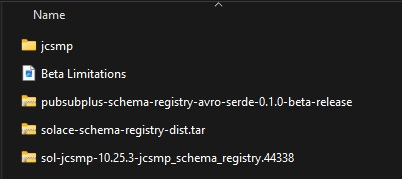
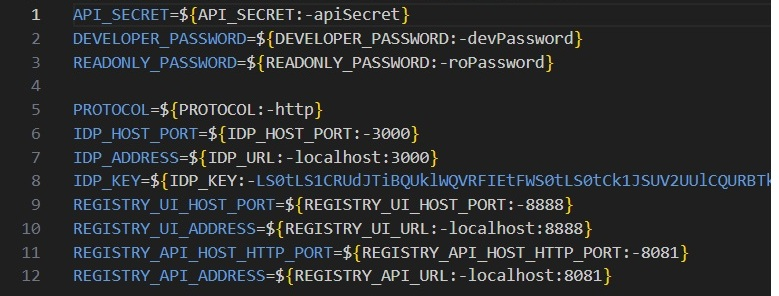
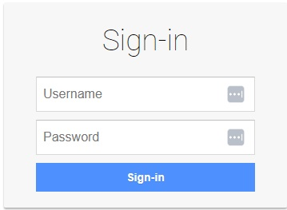
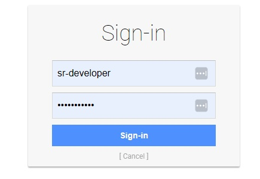
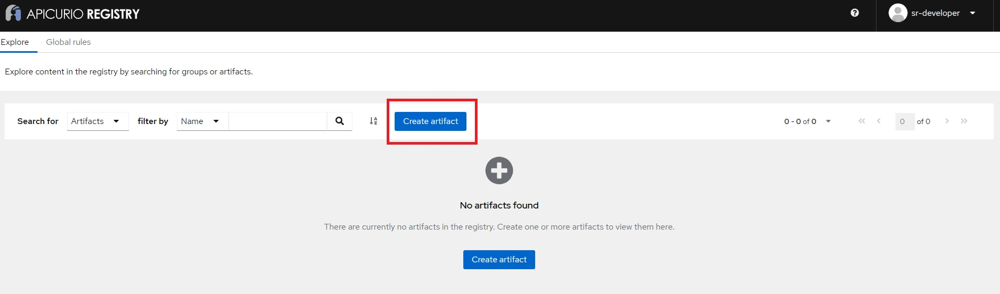
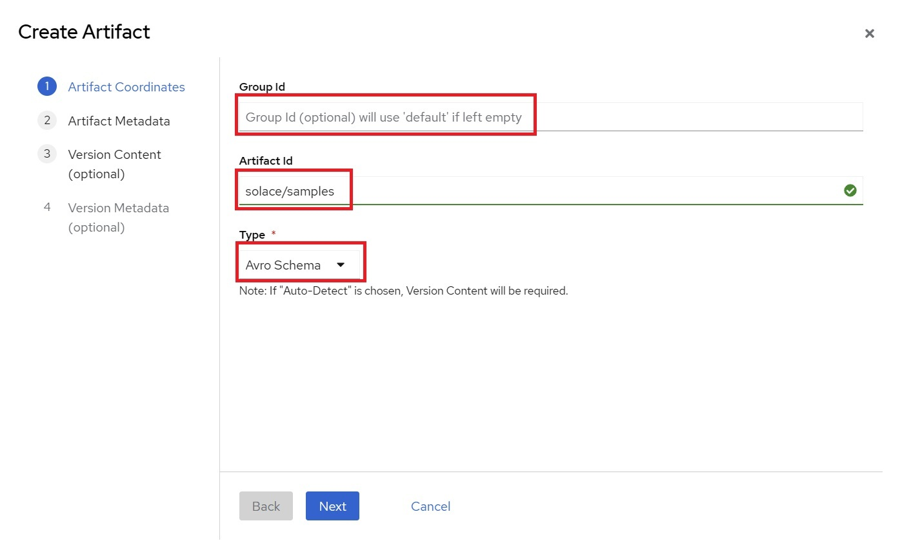
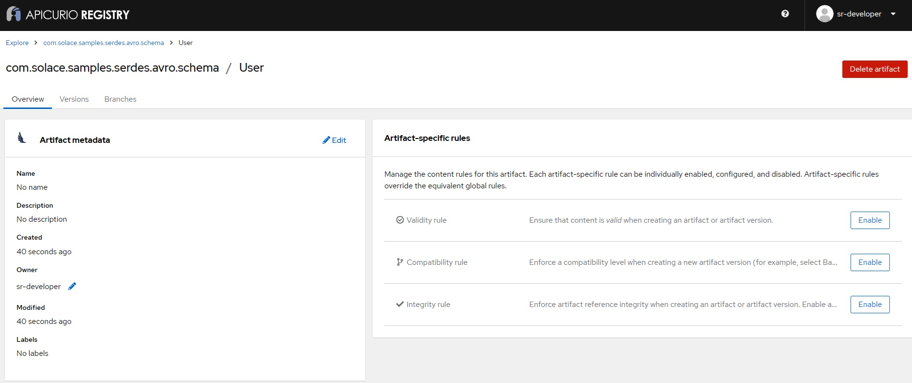

author: Murat Vuniqi
summary: This codelab will walk you through getting started with the Apicurio Registry and the Solace SERDEs components using the Solace Messaging API for Java (JCSMP).
id: schema-registry-beta
tags:
categories: Solace
environments: Web
status: Published
feedback link: https://github.com/SolaceDev/solace-dev-codelabs/blob/master/markdown/schema-registry-beta

# Introduction to Schema Registry using the Solace Messaging API for Java (JCSMP) and Apicurio Registry

## What you'll learn: Overview

Duration: 0:05:00

In today's data-driven world, ensuring data consistency and interoperability across different systems is crucial. This is where a schema registry comes into play. In this walkthrough, we'll explore how to use a schema registry (Apicurio Registry) with the Solace JCSMP API, focusing on the Apache Avro format for schema definition.

You'll learn about:

✔️ What a schema registry is and why it's important   
✔️ What a Serializer and Deserializer (SERDEs) is and the role they play   
✔️ How to set up an instance of the Apicurio Registry using Docker Compose   
✔️ How to create and register schemas   
✔️ How to use schemas in your event-driven applications with Solace's JCSMP API   
✔️ Best practices for schema evolution   

## What you need: Prerequisites

Duration: 0:07:00

1. A general understanding of [event-driven architecture (EDA) terms and concepts](https://docs.solace.com/#Messaging).
2. A locally running PubSub+ Broker or a free trial account of Solace PubSub+ Cloud. Don't have one? [Sign up here.](https://console.solace.cloud/login/new-account)
    * Along with the connection information for the broker
3. Basic knowledge of Apache [Avro schema format](https://avro.apache.org/docs/1.12.0/specification/)
4. [Docker](https://docs.docker.com/get-started/get-docker/) installed on your system
5. [Java Development Kit (JDK) version 11+](https://openjdk.org/) installed on your system
6. An IDE of your choice (e.g., IntelliJ IDEA, Eclipse, Visual Studio Code)
7. Download the provided BETA zip package named ```Schema-Registry-Beta-Package_(latest-version).zip``` that contains all the necessary pieces you will need. This is available on the [Solace Product Portal](https://products.solace.com/prods/Schema_Registry_Beta/) and unzip it to your preferred directory.

NOTE: If you cannot access the [Solace Product Portal](https://products.solace.com/prods/Schema_Registry_Beta/), please click the ```Report a mistake``` at the bottom left of the codelab and open an issue asking for access.
> aside positive
> This walkthrough uses Apicurio Registry for schema management, which we'll set up using Docker Compose.

## What Is A Schema Registry

Duration: 0:10:00

A schema registry is a central repository for managing and storing schemas. It helps ensure data consistency, enables data governance, and supports schema evolution. Here's why it's important:

1. **Data Consistency**: Ensures that producers and consumers agree on the data format.
2. **Interoperability**: Allows different systems to communicate effectively.
3. **Schema Evolution**: Supports versioning and compatibility checks as schemas change over time.
4. **Data Governance**: Centralizes schema management for better control and auditing.

> aside positive
> In this walkthrough, we'll use the Apicurio Registry as our schema registry, which provides a comprehensive solution for managing schemas in your event-driven architecture.

## What Is A SERDEs

Duration: 0:05:00

A SERDEs (Serializer/Deserializer) in the context of a schema registry is a component that handles two key functions:
1. **Serialization**: Converting data objects from their native format (like Java objects) into a binary format suitable for transmission or storage.
2. **Deserialization**: Converting the binary data back into its original format for processing.   

In a schema registry system, SERDEs work closely with schemas to:
- Ensure data consistency during serialization/deserialization
- Validate that messages conform to the registered schema

For example:
- A serializer might take a Java object and convert it to Avro binary format using a schema from the registry
- A deserializer would then use the same schema to correctly reconstruct the object from the binary data

This is a fundamental concept in message-based systems where data needs to be:
- Efficiently transmitted between different services
- Properly validated against defined schemas
- Correctly interpreted by different applications that might be written in different programming languages

> aside positive
> In this walkthrough, we'll use the PubSub+ Java Avro SERDEs along with the Solace Messaging API for Java (JCSMP) to serialize and deserialize messages in the Avro format.

## Setting up Apicurio Registry

Duration: 0:15:00

We'll use Docker Compose to set up the Apicurio Registry quickly and easily. We've prepared a Docker Compose file that will launch an instance of the Apicurio Registry and all the necessary components with a pre-defined configuration.

1. In these subsequent steps we will use the package that came from the downloaded zip from the prerequisites section. Navigate to the extracted folder called ```Schema-Registry-Beta-Package```. You should see the following files and folders:
<p align="center">
  
</p>


2. Open a terminal or command prompt window and navigate to the extracted location of the folder called ```solace-schema-registry-dist```.

3. Optionally you can make changes to the ```.env``` file to change things such as default login or ports. We will leave everything to defaults for this codelab.

<p align="center">
  
</p>

4. Run the following command: ```docker compose up -d``` and all the components will start up with the default values configured.

5. Once the script is done running, you should now be able to go to your browser and navigate to ```localhost:8888``` which should re-direct you to the Apicurio Registry login screen.

<p align="center">
  
</p>

That's it, you have now installed an instance of the Apicurio Registry with the Postgres storage option!

## Creating and Registering Schemas

Duration: 0:15:00

Let's create a simple schema for a ```User``` event:

1. Open the Apicurio Registry UI in your web browser by going to ```localhost:8888```.
2. Login with the predefined credentials for a developer. In this case the username is ```sr-developer``` and password is ```devPassword```.   

<p align="center">
  
</p>

3. Click on ```Create artifact``` button. Once the dialogue opens enter the following as shown below:
    * Group Id: Leave it empty (default)
    * Artifact Id: Set to ```solace/samples```
    * Type: Set to ```Avro Schema```   

<p align="center">
  
</p>
<p align="center">
  
</p>

4. We will skip the ```Artifact Metadata``` step as it is optional and will click ```Next```. 

5. For the "Version Content" section, copy the Avro schema from below and either paste directly or save it into a file and upload it and click ```Next``` when done. 
```json
{
  "namespace": "com.solace.samples.serdes.avro.schema",
  "type": "record",
  "name": "User",
  "fields": [
    {"name": "id", "type": "string"},
    {"name": "name", "type": "string"},
    {"name": "email", "type": "string"}
  ]
}
```  

<p align="center">
  
</p>

6. We will skip the ```Version Metadata``` step as it is optional and will simply click the ```Create``` button. 

7. Finally after you have successfully created the new schema you should see the following:   

<p align="center">
  
</p>

You've now created and registered your first schema!

## Using Schemas with the Solace Messaging API for Java (JCSMP) (Work in Progress)

Duration: 0:30:00

Now, let's see how to use this schema in Java using the Solace Messaging API for Java (JCSMP):

1. Open a command window or terminal in the ```Schema-Registry-Beta-Package/jcsmp-samples``` directory.

NOTE: For winows users, use the ```gradlew.bat``` file instead of ```gradlew``` in the below steps.

2. Run the following command to build the sample on Windows ```./gradlew.bat build``` and . You should see a ```BUILD SUCCESSFUL``` message.          

3. Run the sample application and provide the broker connection details like so ```./gradlew.bat runHelloWorldJCSMPAvroSerde --args="localhost:55555 default default"```. 

This sample talks to the locally deployed Apicurio Schema Registry and retrieves the schema along with the schema ID. It will then do the following:

Configures the Serializer and Deserializer:
```java
// Create and configure Avro serializer and deserializer
        try (Serializer<GenericRecord> serializer = new AvroSerializer<>();
             Deserializer<GenericRecord> deserializer = new AvroDeserializer<>()) {

            serializer.configure(getConfig());
            deserializer.configure(getConfig());
```
```java
   /**
     * Returns a configuration map for the Avro serializer and deserializer.
     *
     * @return A Map containing configuration properties
     */
    private static Map<String, Object> getConfig() {
        Map<String, Object> config = new HashMap<>();
        config.put(SchemaResolverProperties.REGISTRY_URL, REGISTRY_URL);
        config.put(SchemaResolverProperties.AUTH_USERNAME, REGISTRY_USERNAME);
        config.put(SchemaResolverProperties.AUTH_PASSWORD, REGISTRY_PASSWORD);
        return config;
    }
```


Serializes the message payload and publishes the message to the connected broker on ```solace/samples``` destination with the serialized payload and schema ID:
```java
   // Create and populate a GenericRecord with sample data
            GenericRecord user = initEmptyUserRecord();
            user.put("name", "John Doe");
            user.put("id", "123");
            user.put("email", "support@solace.com");

            // Serialize and send the message
            BytesMessage msg = JCSMPFactory.onlyInstance().createMessage(BytesMessage.class);
            SerdeMessage.serialize(serializer, msg, user);
            System.out.printf("Sending Message:%n%s%n", msg.dump());
            producer.send(msg, topic);
```

It will then receive the published message and deserialize it by looking up the schema ID and retrieving the schema and print it out to console:
```java
  // Set up the message consumer with a deserialization callback
            XMLMessageConsumer cons = session.getMessageConsumer(Consumed.with(deserializer, (msg, genericRecord) -> {
                System.out.printf("Got record: %s%n", genericRecord);
                latch.countDown(); // Signal the main thread that a message has been received
            }, (msg, deserializationException) -> {
                System.out.printf("Got exception: %s%n", deserializationException);
                System.out.printf("But still have access to the message: %s%n", msg.dump());
                latch.countDown();
            }, jcsmpException -> {
                System.out.printf("Got exception: %s%n", jcsmpException);
                latch.countDown();
            }));
            cons.start();
```

The sourcecode can be further looked at by opening the ```HelloWorldJCSMPAvroSerde.java``` file.

## Best Practices for Schema Evolution

Duration: 0:10:00

As your data model evolves, you'll need to update your schemas. Here are some best practices:

1. **Backward Compatibility**: Ensure new schema versions can read old data.
2. **Forward Compatibility**: Ensure old schema versions can read new data (ignoring new fields).
3. **Full Compatibility**: Aim for both backward and forward compatibility.
4. **Versioning**: Use semantic versioning for your schemas.
5. **Default Values**: Provide default values for new fields to maintain backward compatibility.
6. **Avoid Renaming**: Instead of renaming fields, add new fields and deprecate old ones.

When updating a schema in Apicurio Registry:

1. Create a new version of the existing schema.
2. Make your changes, following the best practices above.
3. Use the compatibility rule in the registry to ensure your changes don't break existing consumers.

## Takeaways

Duration: 0:02:00

✔️ Schema registries are crucial for maintaining data consistency in event-driven architectures.   
✔️ Apicurio Registry provides a powerful platform for managing schemas.   
✔️ Apache Avro is a popular choice for schema definition due to its compact binary format and schema evolution capabilities.   
✔️ Solace's JCSMP API can be used effectively with the Apicurio Registry for robust event-driven applications.   
✔️ Proper schema evolution practices ensure smooth updates without breaking existing systems.   
✔️ Using schemas in your applications helps catch data issues early and improves overall system reliability.   
✔️ More schema SERDEs will be made available in the future including JSON.


Thanks for participating in this codelab! Let us know what you thought in the [Solace Community Forum](https://solace.community/)! If you found any issues along the way we'd appreciate it if you'd raise them by clicking the Report a mistake button at the bottom left of this codelab.
