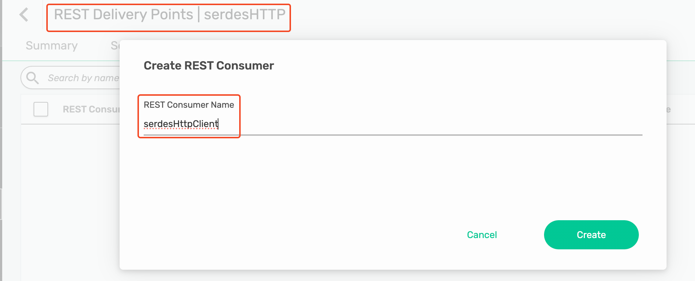
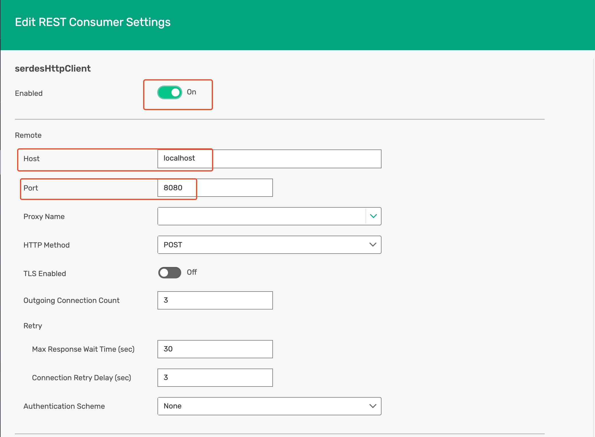
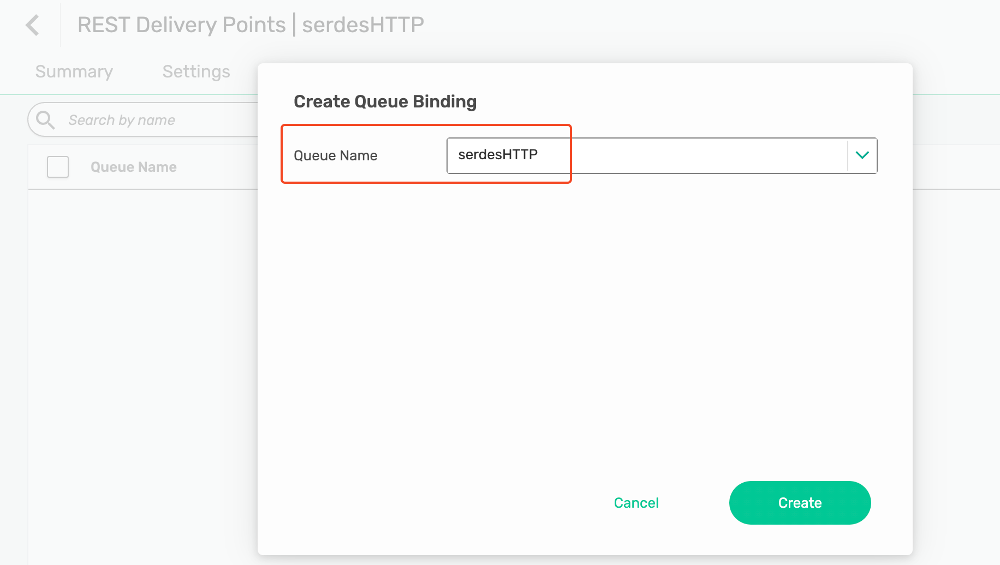
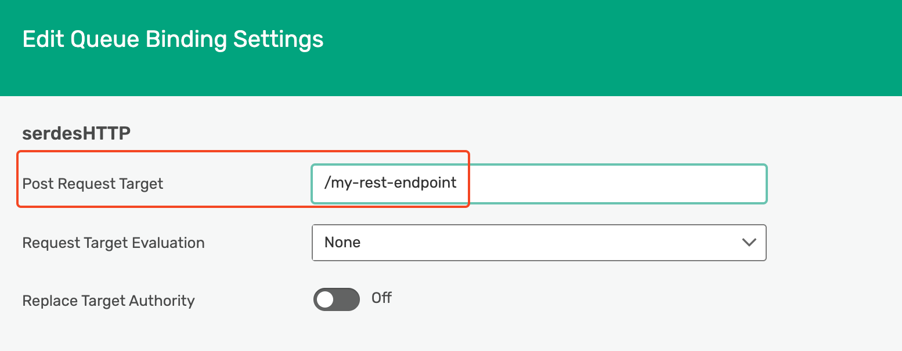

author: Supreet Mann
summary: This codelab will walk you through getting started with the Solace Schema Registry and the Solace SERDES Collection using the Solace Messaging API for Java (JCSMP) or with REST messaging.
id: schema-registry
tags:
categories: Solace
environments: Web
status: Published
feedback link: https://github.com/SolaceDev/solace-dev-codelabs/blob/master/markdown/schema-registry

# Introduction to Solace Schema Registry using the Solace Messaging API for Java (JCSMP) and REST Messaging

## What you'll learn: Overview

Duration: 0:01:00

In today's data-driven world, ensuring data consistency and interoperability across different systems is crucial. This is where a schema registry comes into play. In this walkthrough, we'll explore how to use Solace Schema Registry with the Solace JCSMP API or REST applications, focusing on the JSON format for schema definition.

You'll learn about:

✔️ What a schema registry is and why it's important   
✔️ What a Serializer and Deserializer (SERDES) is and the role they play   
✔️ How to deploy and configure Solace Schema Registry using either Docker Compose or Kubernetes   
✔️ How to create and manage schema artifacts in Solace Schema Registry web console   
✔️ How to use schemas in your event-driven applications with Solace's JCSMP API or with REST messaging   
✔️ Best practices for schema evolution   


## What you need: Prerequisites

Duration: 0:01:00

1. A general understanding of [event-driven architecture (EDA) terms and concepts](https://docs.solace.com/#Messaging).
2. A locally running Solace Broker or a free trial account of Solace Cloud. Don't have one? [Sign up here.](https://console.solace.cloud/login/new-account)
    * Along with the connection information for the broker
3. Basic knowledge of [JSON schema format](https://json-schema.org/draft-07)
4. [Docker](https://docs.docker.com/get-started/get-docker/) installed on your system (for standalone deployment)
5. [Kubernetes](https://kubernetes.io/docs/tasks/tools/) with [Helm](https://helm.sh/docs/intro/install/) (for high availability deployments)
6. [Java Development Kit (JDK) version 11+](https://openjdk.org/) installed on your system
7. An IDE of your choice (e.g., IntelliJ IDEA, Eclipse, Visual Studio Code)
8. Download the provided GA tarball package named ```schema-registry-v1.0.0.tar.gz``` that contains all the necessary pieces you will need. This is available on the Solace Product Portal.
   
NOTE: If you cannot access the [Solace Product Portal](https://products.solace.com/prods/Schema_Registry/solace-schema-registry), please click the ```Report a mistake``` at the bottom left of the codelab and open an issue asking for access.


## What Is A Schema Registry

Duration: 0:02:00

A schema registry is a central repository for managing and storing schemas. It helps ensure data consistency, enables data governance, and supports schema evolution. Here's why it's important:

1. **Data Consistency**: Ensures that producers and consumers agree on the data format.
2. **Interoperability**: Allows different systems to communicate effectively.
3. **Schema Evolution**: Supports versioning and compatibility checks as schemas change over time.
4. **Data Governance**: Centralizes schema management for better control and auditing.

## What Is A SERDES

Duration: 0:02:00

A SERDES (Serializer/Deserializer) in the context of a schema registry is a component that handles two key functions:
1. **Serialization**: Converting data objects from their native format (like Java objects) into a binary format suitable for transmission or storage.
2. **Deserialization**: Converting the binary data back into its original format for processing.   

In a schema registry system, SERDES works closely with schemas to:
- Ensure data consistency during serialization/deserialization
- Validate that messages conform to the registered schema

For example:
- A serializer might take a Java object and convert it to binary format using a schema from the registry
- A deserializer would then use the same schema to correctly reconstruct the object from the binary data

This is a fundamental concept in message-based systems where data needs to be:
- Efficiently transmitted between different services
- Properly validated against defined schemas
- Correctly interpreted by different applications that might be written in different programming languages

> aside positive
> In this walkthrough, we'll use the Solace JSON Schema SERDES for Java along with the Solace Messaging API for Java (JCSMP) to serialize and deserialize messages in the JSON format. We will also how how to leverage REST messaging to serialize and deserialize messages. 

## Setting up Solace Schema Registry with Docker

Duration: 0:06:00

We'll use Docker Compose to set up the Solace Schema Registry, for local development or standalone use cases with minimal resource and networking requirements. We've prepared a Docker Compose file that will launch an instance of the Solace Schema Registry and all the necessary components with a pre-defined configuration.

1. In these subsequent steps we will use the package that came from the downloaded tarball package from the prerequisites section. Navigate to the extracted folder called ```Schema-Registry-V1.0```. You should see the following files and folders:
<p align="center">
  
</p>


2. Open a terminal or command prompt window and navigate to the extracted location of the folder called ```solace-schema-registry-dist```.
3. Run the command ```for img in {docker-images}/*.tar.gz; do docker load -i "$img"; done``` to load docker images. For Window use this instead ```for %i in (docker-images\*.tar.gz \*.tar.gz) do docker load -i "%i"```.
4. You can make changes to the ```.env``` file to change things such as default login or ports. While using the built-in identity provider, we can leave everything to defaults for this codelab.

<p align="center">
  
</p>

5. Run the following command and all the components will start up with the specified values configured: ```docker compose -f compose.yaml -f compose.nginx.yaml -f compose.nginx.for.embedded.yaml -f compose.embedded.yaml up -d```. 

6. Once the script is done running, you should now be able to go to your browser and navigate to ```localhost:8888``` which should re-direct you to the Solace Schema Registry login screen.

<p align="center">
  
</p>

That's it, you have now installed an instance of the Solace Schema Registry!

Alternatively, for enterprise-grade security features, Solace Schema Registry supports external identity providers. For that, make the necessary configurations in your IdP and set the environment variables in your ```.env``` file:

<p align="center">
  
</p>

Run the following command ```docker compose -f compose.yaml -f compose.nginx.yaml -f compose.nginx.for.external.yaml -f compose.external.multiple.issuers.yaml up -d```.

## Setting up Solace Schema Registry with Kubernetes

Duration: 0:06:00

Alternatively, we can set up Solace Schema Registry on a Kubernetes cluster using Helm.

NOTE: You must have an existing Kubernetes cluster available (for example, Amazon EKS, Google GKE, Microsoft AKS, or an on-prem/self-managed cluster).

1. Configure ```kubectl``` to communicate with your cluster.
2. In this method of deployment also, we will use the package that came from the downloaded tarball package from the prerequisites section. Navigate to the extracted folder called ```Schema-Registry-V1.0```.
3. Open the commonad and run this command to load docker images at your preferred location:

```bash
export REGISTRY="your-registry.com/project"
for img in {docker-images}/*.tar.gz; do
  LOADED=$(docker load -i "$img" | grep "Loaded image:" | cut -d' ' -f3)
  NEW_NAME="$REGISTRY/$(basename "$img" .tar.gz)"
  docker tag "$LOADED" "$NEW_NAME"
  docker push "$NEW_NAME"
done
```

4. Install the CloudNative PostgreSQL Operator for database management:
```kubectl apply --server-side -f https://raw.githubusercontent.com/cloudnative-pg/cloudnative-pg/release-1.26/releases/cnpg-1.26.0.yaml```.
5. Update a values.yaml file with your environment-specific configuration, database, authentication, ingress and TLS configuration:
Insert image
6. Install Solace Schema Registry using Helm: ```helm upgrade --install schema-registry ./solace-schema-registry```
7. Verify the deployment: ```kubectl get pods -n solace```

8. To access the deployed services, replace <ingress.hostNameSuffix> with the actual hostname or IP address you configured for your ingress: `https://ui.ingress.hostNameSuffix`

## Creating and Registering Schemas

Duration: 0:04:00

Let's create a simple schema for a ```clock-in-out``` event:

1. Open the Solace Schema Registry UI in your web browser by going to ```localhost:8888```.
2. Login with the predefined credentials for a developer. In this case the username is ```sr-developer``` and password is ```devPassword```.   

<p align="center">
  
</p>

3. Click on ```Create artifact``` button. Once the dialogue opens enter the following as shown below:
    * Group Id: Leave it empty (default)
    * Artifact Id: Set to ```solace/samples/clock-in-out/json```
    * Type: Set to ```JSON Schema```   

<p align="center">
  
</p>
<p align="center">
  
</p>

4. We will skip the ```Artifact Metadata``` step as it is optional and will click ```Next```. 

5. For the "Version Content" section, copy the Json schema from below and either paste directly or save it into a file and upload it and click ```Next``` when done. 
```json
{
  "$schema": "http://json-schema.org/draft-07/schema#",
  "title": "clock-in-out",
  "type": "object",
  "additionalProperties": false,
  "properties": {
    "region_code": {
      "description": "region code for clock in or out",
      "type": "string"
    },
    "store_id": {
      "description": "Store identifier",
      "type": "string"
    },
    "employee_id": {
      "description": "Employee ID for who clocked in or out",
      "type": "string"
    },
    "datetime": {
      "description": "Clock time",
      "type": "string",
      "format": "date-time"
    }
  },
  "required": [
    "region_code",
    "store_id",
    "employee_id",
    "datetime"
  ]
}
```  

<p align="center">
  
</p>

6. We will skip the ```Version Metadata``` step as it is optional and will simply click the ```Create``` button. 

7. Finally after you have successfully created the new schema you should see the following:   

<p align="center">
  
</p>

You've now created and registered your first schema!

## Using Schemas with the Solace Messaging API for Java (JCSMP)

Duration: 0:10:00

Now, let's see how to use this schema in Java using the Solace Messaging API for Java (JCSMP):

1. Open a command window or terminal and clone this GitHub repository, and open the ```solace-samples-java-jcsmp``` directory. With `git clone https://github.com/SolaceSamples/solace-samples-java-jcsmp` and `cd solace-samples-java-jcsmp`

2. Run the command ```./gradlew assemble``` to build the sample.          

3. Open the ```build/staged``` directory by running ```cd build/staged``` and run the sample application with the broker connection details:
```bin/HelloWorldJCSMPJsonSchemaSerde localhost:55555 default default``` 

This sample talks to the locally deployed Solace Schema Registry and retrieves the schema along with the schema ID. It will then do the following:

Configures the Serializer and Deserializer:
```java
// Create and configure JSON Schema serializer and deserializer
        try (Serializer<JsonNode> serializer = new JsonSchemaSerializer<>();
             Deserializer<JsonNode> deserializer = new JsonSchemaDeserializer<>()) {

            serializer.configure(getConfig());
            deserializer.configure(getConfig());
```
```java
  /**
     * Returns a configuration map for the JSON Schema serializer and deserializer.
     *
     * @return A Map containing configuration properties
     */
    private static Map<String, Object> getConfig() {
        Map<String, Object> config = new HashMap<>();
        config.put(SchemaResolverProperties.REGISTRY_URL, REGISTRY_URL);
        config.put(SchemaResolverProperties.AUTH_USERNAME, REGISTRY_USERNAME);
        config.put(SchemaResolverProperties.AUTH_PASSWORD, REGISTRY_PASSWORD);
        return config;
    }

```


Serializes the message payload and publishes the message to the connected broker on ```solace/samples/clock-in-out/json``` destination with the serialized payload and schema ID:
```java
   // Create and populate a ClockInOut JsonNode with sample data
            ObjectMapper mapper = new ObjectMapper();
            ObjectNode clockInOut = mapper.createObjectNode();
            clockInOut.put("region_code", "NA-WEST");
            clockInOut.put("store_id", "STORE-001");
            clockInOut.put("employee_id", "EMP-12345");
            clockInOut.put("datetime", "2025-01-20T15:30:00Z");

            // Serialize and send the message
            BytesMessage msg = JCSMPFactory.onlyInstance().createMessage(BytesMessage.class);
            SerdeMessage.serialize(serializer, topic, msg, clockInOut);
            System.out.printf("Sending ClockInOut Message:%n%s%n", msg.dump());
             producer.send(msg, topic);
```

It will then receive the published message and deserialize it by looking up the schema ID and retrieving the schema and print it out to console:
```java
   // Set up the message consumer with a deserialization callback
            XMLMessageConsumer cons = session.getMessageConsumer(Consumed.with(deserializer, (msg, clockInOutData) -> {
                System.out.printf("Got a ClockInOut JsonNode: %s%n", clockInOutData);
                System.out.printf("Employee %s clocked in/out at store %s in region %s at %s%n",
                        clockInOutData.get("employee_id").asText(),
                        clockInOutData.get("store_id").asText(),
                        clockInOutData.get("region_code").asText(),
                        clockInOutData.get("datetime").asText());
                latch.countDown(); // Signal the main thread that a message has been received
            }, (msg, deserializationException) -> {
                System.out.printf("Got exception: %s%n", deserializationException);
                System.out.printf("But still have access to the message: %s%n", msg.dump());
                latch.countDown();
            }, jcsmpException -> {
                System.out.printf("Got exception: %s%n", jcsmpException);
                latch.countDown();
            }));
            cons.start();
```

The sourcecode can be further looked at by opening the ```HelloWorldJCSMPJsonSchemaSerde.java``` file.

## Using schemas with REST messaging 

Duration: 0:10:00

We can also use this schema with Solace Schema Registry in REST-based messaging environments.

> aside positive 
> Before running the REST samples, you need to configure the Solace broker with the appropriate queues and REST Delivery Points (RDPs).
For more detailed documentation, refer to the [Solace Documentation on REST Delivery Points](https://docs.solace.com/Services/Managing-RDPs.htm?Highlight=rest#configuring-REST-delivery-points).

With this REST messaging, we will use the following Schema example. You can upload it on Solace Schema Registry as a new artifact with an `Artifact Id` of `solace/samples/json` - Refer to Step 7 Creating and Registering Schemas if you need to review the steps.

```json
{
  "$schema": "http://json-schema.org/draft-07/schema#",
  "title": "User",
  "type": "object",
  "customJavaType": "com.solace.samples.serdes.jsonschema.User",
  "additionalProperties": false,
  "properties": {
    "name": {
      "description": "Name of the user",
      "type": "string"
    },
    "id": {
      "description": "Id of the user",
      "type": "string"
    },
    "email": {
      "description": "Email of the user",
      "type": "string",
      "format": "email"
    }
  },
  "required": 
  [  "name",
    "id",
    "email"
  ]}
```

Let's build a Publisher and Consumer sample.

1. Open a command window or terminal and clone this GitHub repository:
```git clone https://github.com/SolaceSamples/solace-samples-rest-messaging```

2. Run the command to build the sample  ```./gradlew build```. You should see a ```BUILD SUCCESSFUL``` message.
Note: For windows users, use the `gradlew.bat` file instead of `gradlew`

3. Run the sample application and provide the broker connection details like:
```./gradlew runJsonSchemaRestPublisherHttpClient --args="brokerUrl 38080"```

This sample serializes and publishes by doing the following:
Configures the Serializer:
```java
// Create and configure Json serializer
 try (Serializer<JsonNode> serializer = new JsonSchemaSerializer<>()) {
                serializer.configure(getConfig());
```
```java
 /**
     * Gets the configuration for the serializer.
     * @return A map of configuration properties.
     */
    private static Map<String, Object> getConfig() {
        Map<String, Object> config = new HashMap<>();
        config.put(SchemaResolverProperties.REGISTRY_URL, REGISTRY_URL);
        config.put(SchemaResolverProperties.AUTH_USERNAME, REGISTRY_USERNAME);
        config.put(SchemaResolverProperties.AUTH_PASSWORD, REGISTRY_PASSWORD);
        // This configuration property will populate the SERDES header with a schema ID that is of type String
        config.put(SerdeProperties.SCHEMA_HEADER_IDENTIFIERS, SchemaHeaderId.SCHEMA_ID_STRING);
        return config;
```

Serializes the HTTP message with payload and headers:
```java
 * Serializes the HTTP message with the given payload and headers.
 Map<String, Object> headers = new HashMap<>();
        byte[] payloadBytes = serializer.serialize(topic, payload, headers);

        for (String key : headers.keySet()) {
            Object value = headers.get(key);
            // No Integer/Long to String mapping is needed, as the SERDES schema ID header is already configured as a String.
            // The type parameter is optional. By default all Solace User Properties in a REST message are assumed to have a type "string"
            httpBuilder.header(String.format("%s%s", "Solace-User-Property-", key), value.toString());
        }

        if ("JSON".equals(CONTENT_TYPE)) {
            httpBuilder.header("Content-Type", "application/json");
        } else if ("BINARY".equals(CONTENT_TYPE)) {
            httpBuilder.header("Content-Type", "application/octet-stream");
        } else {
            httpBuilder.header("Content-Type", CONTENT_TYPE);
        }
        return httpBuilder.POST(HttpRequest.BodyPublishers.ofByteArray(payloadBytes));

```

Publishes the message to specific topic:
```java
//Publishes a message to a specific topic
   ObjectNode user = new ObjectMapper().createObjectNode();
        try {
            String url = String.format("http://%s:%d/TOPIC/%s", brokerHost, port, topic);
            HttpRequest.Builder httpBuilder = HttpRequest.newBuilder().uri(URI.create(url));

            user.put("name", "John Doe");
            user.put("id", id);
            user.put("email", "support@solace.com");

            HttpRequest request = serializeHttpMessage(httpBuilder, serializer, topic, user).build();

            HttpResponse<String> response = client.send(request, HttpResponse.BodyHandlers.ofString());

            System.out.println("Published message with status: " + response.statusCode());
            System.out.println("Published message with record: " + user);
```

4. For a Consumer Application, create a queue subscribed to `solace/samples/json` and configure RDP client as mentioned above. REST consumer samples start a local HTTP server that listens for incoming POST requests from a Solace broker's REST Delivery Point (RDP).
<details close>
  <summary>Configure Solace Rest Delivery Point</summary>
  1. Create Queue

  
  2. Create Rest Delivery Point
  
  3. Create REST Consumer
  
  4. Create Queue Binding
  
  5. Specify Queue Binding Endpoint
  
  Make sure all of the RDP components are enabled. 
</details>


5. Run the consumer sample like: ```./gradlew runJsonSchemaRestConsumer --args="/my-rest-endpoint 8080 X-Solace-Topic"```

Configures the Deserializer:
```java
// Create and configure Json deserializer
Deserializer<User> deserializer = new JsonSchemaDeserializer<>()) {
            deserializer.configure(getDeserializerConfig());
```
```java
Returns a map of configuration properties for the deserializer.
     *
     * @return a map of configuration properties for the deserializer
     */
    private static Map<String, Object> getDeserializerConfig() {
        HashMap<String,Object> config = new HashMap<>();
        config.put(SchemaResolverProperties.REGISTRY_URL, REGISTRY_URL);
        config.put(SchemaResolverProperties.AUTH_USERNAME, REGISTRY_USERNAME);
        config.put(SchemaResolverProperties.AUTH_PASSWORD, REGISTRY_PASSWORD);
        config.put(JsonSchemaProperties.TYPE_PROPERTY, "customJavaType");
        return config;
```

It will receive the published message from http headers and deserialize it and retrieving the schema and print it out:
```java
   // Handles a SERDES message.
            Headers httpHeaders = exchange.getRequestHeaders();

            // Read the message body
            InputStream is = exchange.getRequestBody();
            byte[] messagePayload = is.readAllBytes();

            // extract SERDES headers from http headers
            Map<String, Object> serdesHeaders = getSerdesHeaders(httpHeaders);
            // deserialize with topic, payload and SERDES headers
            T object = deserializer.deserialize(optionalTopic.orElse(""), messagePayload, serdesHeaders);

            System.out.printf("%n- - - - - - - - - - RECEIVED SERDES MESSAGE - - - - - - - - - -%n");
            printAllHeaders(httpHeaders);
            System.out.println("BodyBytesLength: " + messagePayload.length);
            System.out.println("Body: " + objectToStringFunc.apply(object));
            System.out.printf("- - - - - - - - - - - - - - - - - - - - - - - - - - - - - - - - -%n");
```


## Best Practices for Schema Evolution

Duration: 0:02:00

As your data model evolves, you'll need to update your schemas. Here are some best practices:

1. **Backward Compatibility**: Ensure new schema versions can read old data.
2. **Forward Compatibility**: Ensure old schema versions can read new data (ignoring new fields).
3. **Full Compatibility**: Aim for both backward and forward compatibility.
4. **Versioning**: Use semantic versioning for your schemas.
5. **Default Values**: Provide default values for new fields to maintain backward compatibility.
6. **Avoid Renaming**: Instead of renaming fields, add new fields and deprecate old ones.

When updating a schema in Solace Schema Registry:

1. Create a new version of the existing schema.
2. Make your changes, following the best practices above.
3. Use the compatibility rule in the registry to ensure your changes don't break existing consumers.

## Takeaways

Duration: 0:02:00

✔️ Schema registries are crucial for maintaining data consistency in event-driven architectures.   
✔️ Solace Schema Registry provides a powerful platform for managing schemas.      
✔️ Solace's JCSMP API can be used effectively with the Solace Schema Registry for robust event-driven applications.   
✔️ Proper schema evolution practices ensure smooth updates without breaking existing systems.   
✔️ Using schemas in your applications helps catch data issues early and improves overall system reliability.   
✔️ Solace Schema Registry supports built-in authentication as well as external identity providers for enterprise environments.
✔️ Solace Schema Registry currently supports Avro and JSON Schema. More schema SERDES will be made available in the future.


Thanks for participating in this codelab! Let us know what you thought in the [Solace Community Forum](https://solace.community/)! If you found any issues along the way we'd appreciate it if you'd raise them by clicking the Report a mistake button at the bottom left of this codelab.
