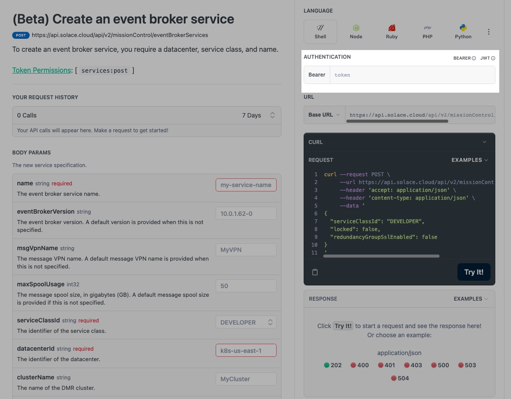
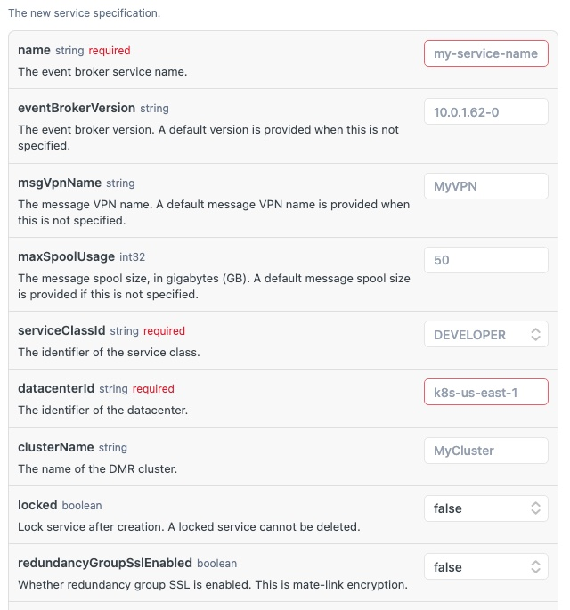
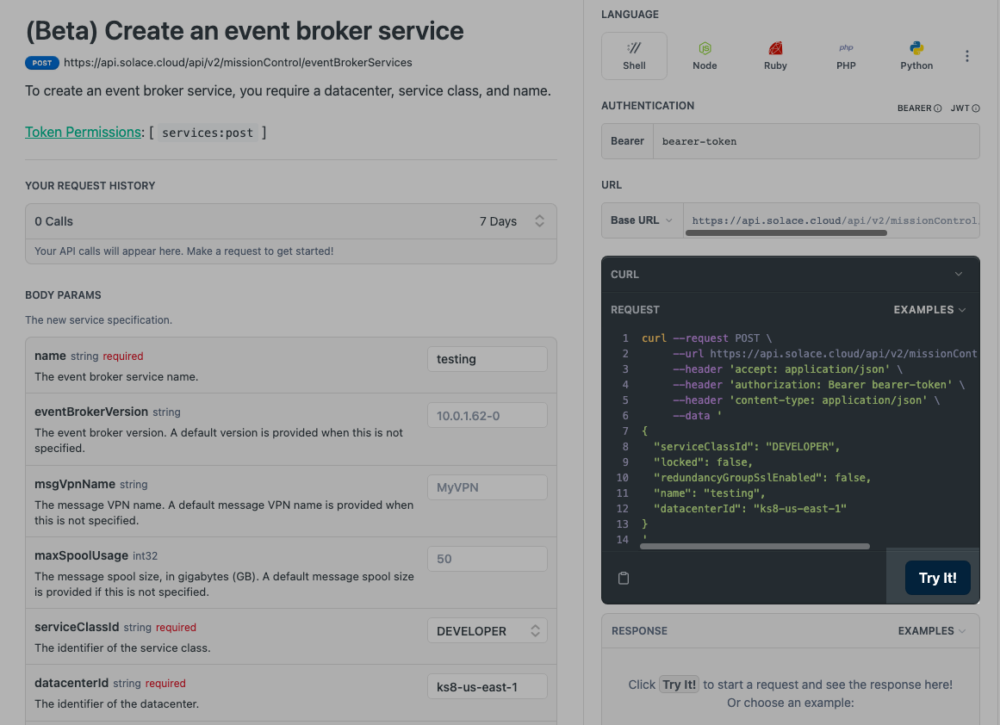
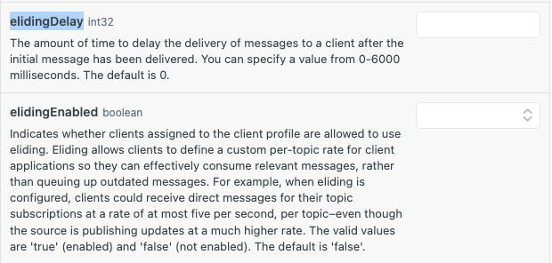

author: HariRangarajan-Solace
summary: Codelab covering the hands-on parts of the workshop for SmartTrade
id: smarttrade-workshop
tags: workshop
categories: Solace, workshop, Topics and Subscriptions, Java APIs, Cloud REST APIs, SEMP
environments: Web
status: Published
feedback link: https://github.com/SolaceDev/solace-dev-codelabs/blob/master/markdown/smarttrade-workshop

# SmartTrade workshop : Event Enabling with Solace PubSub+ for developers

## What you'll learn: Overview

Duration: 0:05:00

This codelab is specifically built for SmartTrade and follows the <b>Event Enabling with Solace PubSub+ for developers</b> workshop and contains the hands-on section of the workshop. \
In this codelab, we will be doing hands-on activities on the following topics:
- Solace basics : Getting started
- Topics and subscriptions
- Cloud REST API

## Solace Basics : Getting started
The below codelab introduces the Solace Portal and will guide thru the steps for creating a Solace PubSub+ broker service. \
Walk thru the steps **2-6** and acquaint yourself with the Solace Cloud. \
Follow the link to the codelab over here : [A Solace Primer - Getting Started with Solace PubSub+ Event Broker](https://codelabs.solace.dev/codelabs/get-started-basics/index.html?index=..%2F..index#0)

## Topics and subscription : Overview using Try-Me
The below codelab introduces the hierarchical topic structure and subscriptions using wildcards. \
Follow the step 7 and understand the power of the dynamic topic structure and its capabilities. \
Follow the link to the codelab over here : [Topic Hierarchies and Wildcards](https://codelabs.solace.dev/codelabs/get-started-basics/index.html?index=..%2F..index#6)

## Cloud REST API
The Solace Cloud REST APIs are documented over here : [PubSub+ Cloud REST APIs](https://api.solace.dev/cloud/reference/using-the-v2-rest-apis-for-pubsub-cloud)\
As explained in the workshop, the v2 Cloud REST APIs are classified into 3 categories :
- Mission Control APIs
- Event Portal - Designer APIs
- Event Portal - Runtime APIs
- Platform and billing APIs

In this section, we will see how to make a request for few common scenarios that are encountered in a real-life impelementation :
- Creating an event broker service
- Retreiving the details of an event broker service
- Configuring client profiles for eliding

To perform these actions, for simplicity sake we will use the try-me functionality included in the documentation page.

### Authentication token creation
Start off with creating an authentication bearer token as described over here : [Authentication bearer token](https://api.solace.dev/cloud/reference/authentication)\
<b>Keep this token secure as we will be using it for the rest of the steps.</b> Each API that we will be describing below requires this token to be provided. \
Insert the token as defined below :

### Creating an event broker service
The details of this resource are detailed over at [Create an event broker service](https://api.solace.dev/cloud/reference/createservice)

This resource requires 3 mandatory parameters as described in the screenshot :

Fill in these parameters and the authentication tokens as descibed earlier and click on the "Try It!" :

  

If you observe the request closely, it will contain the parameters and the bearer-token that was provided in the input boxes.
The response of the request is detailed with the HTTP code, message and other details.

### Retreiving the details of an event broker service
The details of this resource are detailed over at [Get an event broker service](https://api.solace.dev/cloud/reference/getservice) \
This resource requires one mandatory parameter which is an identifier for an existing service. We can use the serviceId of the service which we created in the previous excercise for this. \
Fill in the serviceId parameter and the authentication tokens as descibed earlier and click on the "Try It!" :
If you observe the request closely, it will contain the parameters and the bearer-token that was provided in the input boxes.
The response of the request is detailed with the HTTP code, message and other details.

### Configuring client profiles for eliding

Client profiles are objects provisioned on Message VPNs that are used to assign a common set of configuration properties to clients that have been successfully authorized. \
They control a number of client behaviors and capabilities and can be applied to multiple client usernames or LDAP authorization groups in a Message VPN.

Message Eliding
Message eliding allows client applications to receive only the most current Direct messages published to topics that they subscribe to, at a rate they can manage, rather than queue up outdated messages.\
It can be useful in situations where there are slow consumers, or where a slower message rate is required. Only Direct messages can be elided.
A receiving client application must be assigned a client profile through its client username.

In this section, we will create a client profile which support eliding with a delay for the messages.

Solace has a regular release schedule where new versions of the software broker
The details of the create client profile resource are detailed over at [Create a client profile](https://api.solace.dev/cloud/reference/createclientprofile) \
As you can see, the client profile can be configured with a variety of different parameters, but today we will be focusing on the **elidingEnabled** and **elidingDelay** parameters.\

Fill in the following parameters:
- serviceId (denoting the name of the broker service)
- name of the client profile as **eliding-default-profile**
- elidingEnabled as true
- elidingDelay as 500
The response of the request is detailed with the HTTP code, message and other details.

## Takeaways

Duration: 0:01:00

During the course of this workshop, you would have got the following : \
✅ Introduction to the Solace platform \
✅ Topics and queues \
✅ Cloud REST APIs 

## Next Steps

  \
Thanks for participating in this codelab! Let us know what you thought in the [Solace Community Forum](https://solace.community/)! If you found any issues along the way we'd appreciate it if you'd raise them by clicking the Report a mistake button at the bottom left of this codelab.

