author: Swen-Helge Huber
summary:
id: solace-agent-mesh-kong-ai
tags: iguide
categories: Kong, Solace, Agent Mesh, AI
environments: Web
status: Published
feedback link: https://github.com/SolaceDev/solace-dev-codelabs/blob/master/markdown/solace-agent-mesh-kong-ai

# Architecture for Agentic AI: Solace Agent Mesh and Kong AI Gateway

## Overview

Duration: 0:05:00

In this codelab we are going to explore how Solace Agent Mesh can easily integrate with LLM and MCP capabilities provided by Kong AI Gateway.

AI development often faces a challenge: powerful AI models are readily available, but it's complicated to connect them to the data and systems it needs. Agent Mesh is an open-source framework that tackles this challenge focusing on being an excellent orchestration layer. Built on Solace's proven event-driven architecture, Agent Mesh brings together and orchestrates specialized agents and MCP tools.

Learn more about [Solace Agent Mesh](https://solacelabs.github.io/solace-agent-mesh/docs/documentation/getting-started/introduction/)

### Solace Agent Mesh and Kong AI Gateway

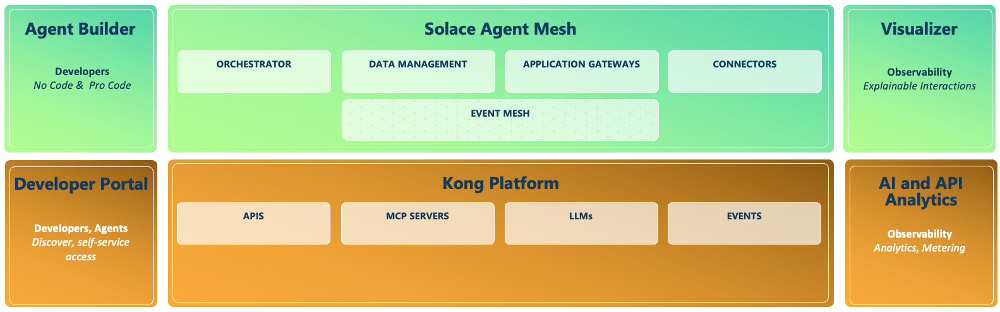

Agentic AI requires a shift from isolated models and agents to **dynamic orchestration of autonomous agents** that work together to solve complex business problems. 
Combining Solace Agent Mesh (SAM) with Kong AI Gateway creates **a resilient, governed, and scalable infrastructure for Agentic AI**.

**Solace Agent Mesh (SAM)** provides event-driven orchestration and a connective layer for AI components such as agents and tools. An **Orchestrator Agent** decomposes prompts into specific sub-tasks, ensuring that agents receive only the data they need which minimises model costs and processing latency.
An **asynchronous, broker-centric architecture** allows agents to run in parallel without blocking workflows, maintaining system responsiveness even during long-running reasoning tasks. 

**Kong AI Gateway** evolved from industry leading API management principles into **a centralised governance and security layer for LLMs, tools and agents**. Kong can automatically convert existing REST APIs into Model Context Protocol (MCP) tools, allowing AI agents to discover and invoke APIs and enterprise services without manual backend modifications.

The combination of these platforms delivers **end-to-end observability**. SAM’s Visualizer traces the lifecycle of a prompt as agents work to fulfil the prompt. Kong’s AI analytics **track token usage and costs in real-time**. Together, these capabilities provide the explainability, and economic controls necessary to transform agentic AI into a secure and scalable enterprise capability.

### What is Agent Mesh

Agent Mesh is built on ...

* Event-Driven Architecture at the Core: The heart of Agent Mesh is its event mesh — a fluid, asynchronous communication layer for your AI components. Messages flow naturally between agents, tools, gateways, and external systems. By decoupling senders from receivers, the mesh  simplifies agent interactions, ensures message delivery even during component failures, and lets you add, remove, or restart components on-the-fly without disrupting workflows.

* Unified AI Collaboration: Agent Mesh breaks down AI silos by enabling specialized agents to operate independently yet collaborate efficiently.

* Complex Workflow Orchestration: Agent Mesh creates multi-agent processes where tasks flow  between specialist agents.

* Exponential Capability Growth: Each new agent enhances all other agents through collaboration, creating exponential rather than additive capability increases.

* Developer-Friendly Design: YAML-based configuration provides control without code changes. Modular components can be reused, replaced, or enhanced independently with built-in security and authorization frameworks.

* Extensibility: Agent Mesh grows with your needs. Organizations typically start with basic agents and continuously expand capabilities by adding specialized models, integrations, tools and agents. Plug-and-play extensibility means new agents automatically publish capabilities.

### How Solace Agent Mesh orchestration works

#### How agents advertise themselves to become part of agent orchestration

* AI Agents represent various skills or access to backend systems
* Agents use Tools - such as MCP Servers accesisble via Kong AI Gateway -to access apps & data
* Workflow and task breakdown is  coordinated by an Orchestrator
* Agents “introduce themselves” to the orchestrator and explain their unique skills and who can use them
* Orchestrator keeps a recod of what skills are available
* All Agent Mesh communication is through real-time Solace events

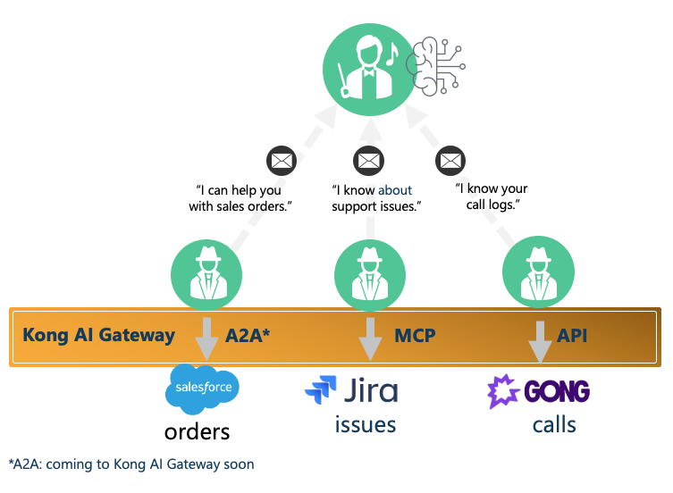

#### How agents are orchestrated

* A request comes into the Orchestrator
* The Orchestrator divides up the request, determines which skills to use and delegates to agents
* The Orchestrator ensures the answer is complete, summarizes it, then sends it back

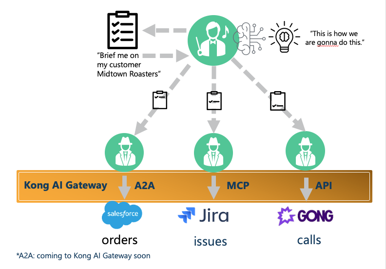

## Prerequisites

Duration: 0:10:00

### LLM Connection Parameters

Solace Agent Mesh can be configured to use different LLM providers.

For this codelab you should use a provider that is compatible with the OpenAI API.

You need:
* LLM Endpoint
* LLM Key

#### Install Python 3.11+

To install a specific version of python, we would recommend using brew
```
brew install python@3.12
```

> aside positive
> Depending on how you install your python version, the following commands will be executed as per the python version installed
> For example, you might need to run `python3.12 [command]` to run python version 3.12 or just simply `python3 [command]`


### Docker

We will run the Kong AI Gateway as a docker container. 

See [Install Docker Engine](https://docs.docker.com/engine/install/)

### Kong decK

decK is a command line tool that facilitates API Lifecycle Automation (APIOps) by offering a comprehensive toolkit of commands designed to orchestrate and automate the entire process of API delivery.

For installation instructions see [decK](https://developer.konghq.com/deck/)

### jq

Install jq, a lightweight and flexible command-line JSON processor. For exmaple using brew:
```
brew install jq
```

Or locate the appropriate instructions for your platform: [Download jq](https://jqlang.org/download/)


## Create Kong Konnect and Solace Cloud Accounts

Duration: 0:10:00

### Konnect Plus Subscription

You need a Konnect subscription. Follow the steps below to obtain a **Konnect Plus** subscription.
Initially a 30-trial Konnect Organization is provided. After the trial is expired Konnect Plus will charge based on [Konnect Plus pricing](https://konghq.com/pricing). After you finished tis codelab the Konnect Plus environment can be deleted.

Click on the [Registration](https://konghq.com/products/kong-konnect/register?utm_medium=partner&utm_source=aws&utm_campaign=aws-devops-workshop-webinar) link and present your credentials. 

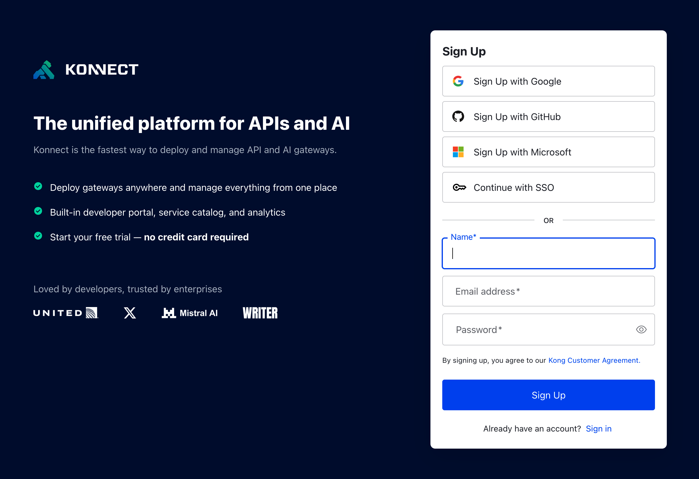

Konnect will send you an email to confirm the subscription. Click on the link in email to confirm your subscription.

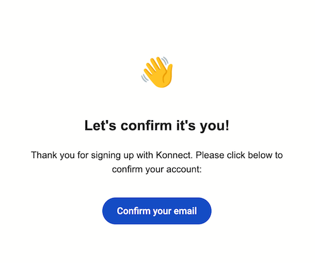

The Konnect environment can be accessed via the [Konnect log in](http://cloud.konghq.com/) page.

After logging in create an organisation name, select a region, then answer a few questions.

Credit available can be monitored though [Plan and Usage](https://cloud.konghq.com/global/plan-and-usage) page.

### Sign Up to Solace Cloud
Solace Agent Mesh relies on event based communication between the different agents in the system.  To facilitate this communication Solace Agent Mesh uses the Solace Broker.  For this workshop you will need access to a Solace Cloud broker.  If you do not already have a Solace Cloud Broker that you have user credentials for and is accessible on the public internet please sign up for a Solace Cloud Trial.  

Solace Cloud 30 Day Trial:
[https://console.solace.cloud/login/new-account](https://console.solace.cloud/login/new-account)

Complete the Sign up form and confirm your email 
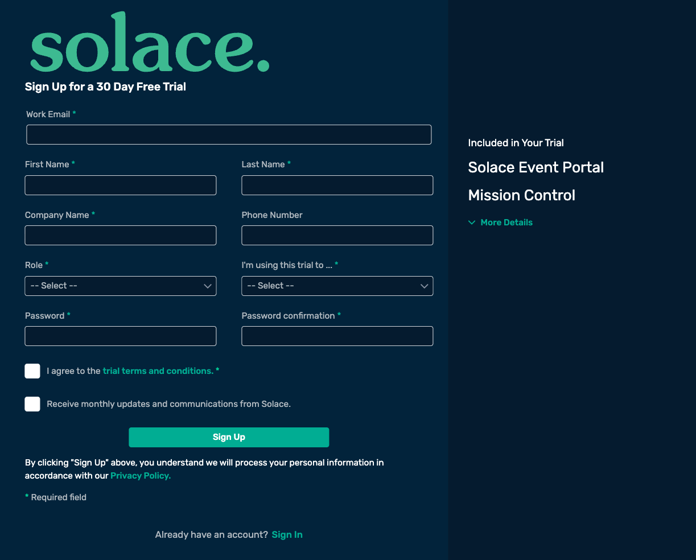


## Spin up Kong AI Gateway and Solace Broker

Duration: 0:10:00

### Kong PAT (Personal Access Token)

Kong Gateway requires a [Konnect Personal Access Token (PAT)](https://developer.konghq.com/konnect-api/#personal-access-tokens) for creating the Control Plane. To generate your PAT, click on your initials in the upper right corner of the Konnect home page, then select `Personal Access Tokens`. Click on `+ Generate Token`, name your PAT, set its expiration time, and be sure to copy and save it, as Konnect won’t display it again.

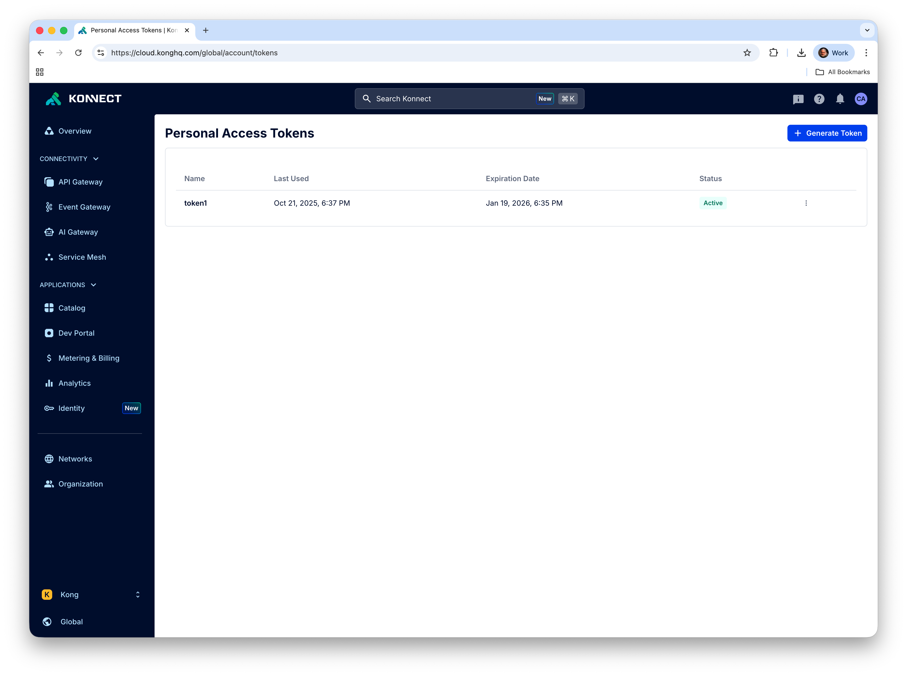

> aside negative
> Be sure to copy and save PAT, as Konnect won’t display it again.

Save the PAT in your  environment variables (and keep it safe somewhere else)

```
export KONNECT_TOKEN="PASTE_THE_CONTENTS_OF_COPIED_PAT"
```

### Setup Kong Gateway

To set up the Kong Konnect Control and Data Plane we will use the Quickstart script for which you can find more information at  [Get started with Kong Gateway](https://developer.konghq.com/gateway/get-started/).

```
curl -Ls https://get.konghq.com/quickstart | bash -s -- -k $KONNECT_TOKEN  -p 7000:8000 -p 7443:8443 --deck-output
```

The script ends by printing these export variable commands, copy them and execute thenm in your shell:
```
 export DECK_KONNECT_TOKEN=$KONNECT_TOKEN
 export DECK_KONNECT_CONTROL_PLANE_NAME=quickstart
 export KONNECT_CONTROL_PLANE_URL=https://us.api.konghq.com
 export KONNECT_PROXY_URL='http://localhost:8000'
```

### Start a Solace Cloud Broker
Log into your Solace Cloud Trial Account.  If you do not have a Solace Cloud Trial account please refer back to the pre-requisites

Inside of Solace Cloud navigate to the 'Cluster Manager'
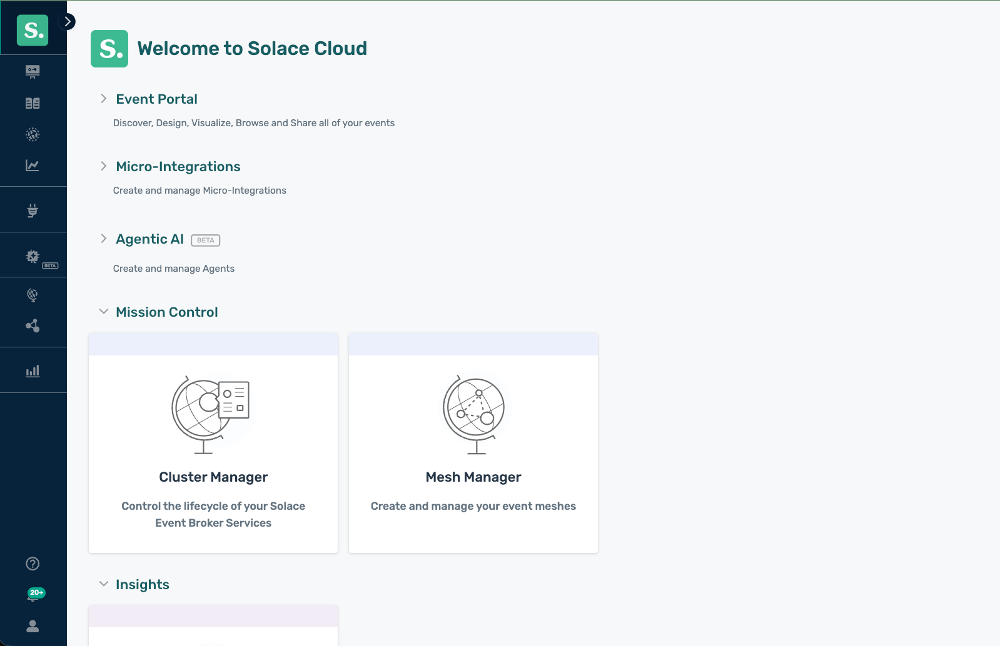

Create a new Service to handle our Solace Agent Mesh traffic
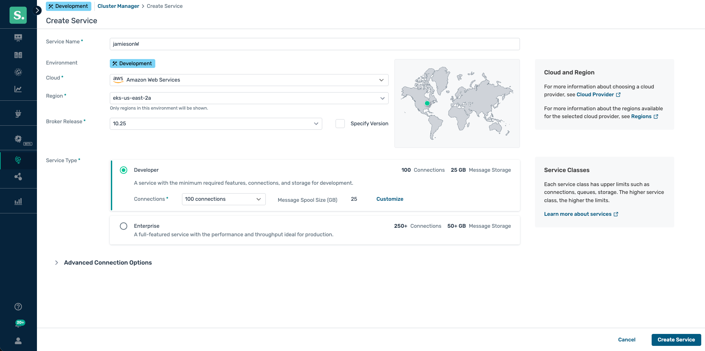

We will use the credentials from the WebSockets connect tab in Solace Cloud to connect Solace Agent Mesh (SAM) to your broker.
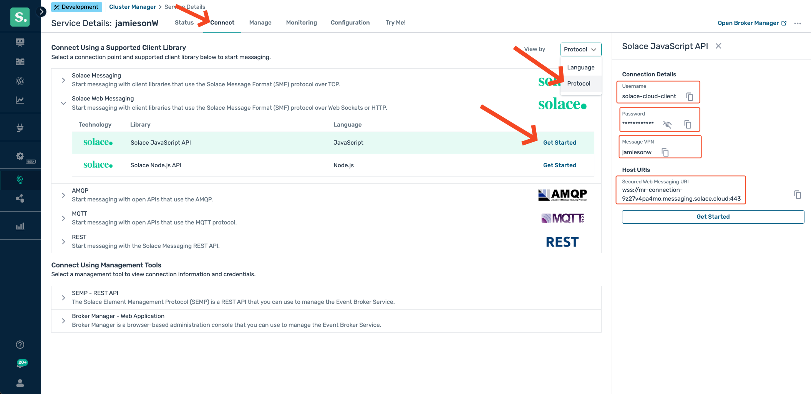


## Mediate LLM Access with Kong AI Gateway

Duration: 0:05:00

### Prerequisites 

- LLM Endpoint (openAI compliant)
- LLM Key

### Introduction

Kong AI Gateway is a powerful set of features built on top of Kong Gateway, designed to help developers and organizations effectively adopt AI capabilities quickly and securely. It can act as an LLM Gateway that provides a normalized API layer allowing clients to consume different LLMs from the same client in a standardised way, e.g. aligned with OpneAI API standards.

The AI Gateway provides many other additional capabilities suchas AI usage observability, governance, and tuning through prompt engineering.

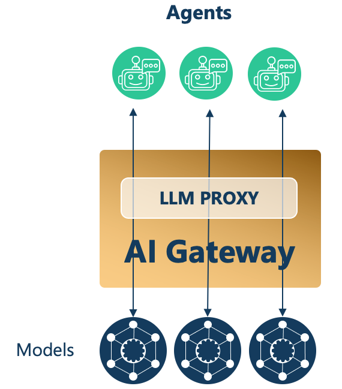

We are using the prompt engineering capabilities to add a prompt decorator that instructs the LLM to reply in the style of a pirate:
```
    - name: ai-prompt-decorator
      instance_name: ai-prompt-decorator-llm
      config:
        prompts:
          prepend:
          - role: system
            content: "You will always respond in the style of a pirate."
```
You will instantly recognize this style when you interact with Solace Agent Mesh in the following sections.


### Create an AI Proxy for LLM Calls in Kong AI Gateway

To prepare the Kong AI Gateway use the declaration in [solace-ai-proxy.yaml](http://localhost:8080/builds/static/code/sam-deck-config/solace-ai-proxy.yaml)

First set the URL of your backend LLM as an environment variable, the URL must be for an OpenAI API compatible endpoint. As an example it could look  like `https://lite-llm.example.com/v1/chat/completions`
```
export DECK_LLM_BACK_END_URL={http or https}://{YOUR HOST}:{YOUR PORT}/v1/chat/completions
```

Then make sure you have set the `DECK_KONNECT_CONTROL_PLANE_NAME`
```
echo $DECK_KONNECT_CONTROL_PLANE_NAME
```
If not set refer back to the previous section.


Apply the declaration with decK:
```
deck gateway reset --konnect-control-plane-name $DECK_KONNECT_CONTROL_PLANE_NAME --konnect-token $KONNECT_TOKEN -f
deck gateway sync --konnect-control-plane-name $DECK_KONNECT_CONTROL_PLANE_NAME --konnect-token $KONNECT_TOKEN solace-ai-proxy.yaml
```

### Verify the LLM Proxy

Make sure you have set the `KONNECT_PROXY_URL`
```
echo $KONNECT_PROXY_URL
```
If not set refer back to the previous section.

Let's verify the LLM Proxy is working by sending a prompt to the model.
Replace `[INSERT_API_KEY]` with the key for your back end LLM server. 

```
curl --variable %KONNECT_PROXY_URL --expand-url '{{KONNECT_PROXY_URL}}/llm-route/v1/chat/completions' \
--header 'Content-Type: application/json' \
--header 'Authorization: Bearer [INSERT_API_KEY]' \
--data '{
    "model": "vertex-claude-4-5-sonnet",
    
    "messages": [
        {
            "content": [

                {
                    "text": "when is xmas day",
                    "type": "text"
                }
            ],
            "role": "user"
        }
    ]
}'
```


## Install and Configure Agent Mesh 

Duration: 0:10:00

### Prerequisites 

- Python 3.11+
- LLM Proxy Endpoint: the AI Gateway address, as defined in the previous section: {{KONNECT_PROXY_URL}}/llm-route/v1/chat/completions
- LLM Key

### Installation 

#### Create and activate a Python virtual environment

MacOS/Linux
```
mkdir solace-agent-mesh-demo
cd solace-agent-mesh-demo
python3 -m venv venv
source venv/bin/activate
```
Windows
```
venv/Scripts/activate
```

> aside positive
> Note: on a Linux machine, depending on the distribution you might need to `apt-get install python3-venv` instead. Alternatively, you can use `pyenv` to manage multiple versions of python


After activating the virtual environment you can now simply  use `python` which will use whatever python version used to initialize the virtual environment. To confirm, you can execute the following after activating your virtual environment

```
python --version
```

#### Install the Solace Agent Mesh Community Edition

```
pip install solace-agent-mesh

```

### Solace Broker

We will use the broker you have started up previously. As described earlier we use a WebSocket (Solace Web Messaging Protocol) connection, you need
* Broker URL: starts with `ws://` or `wss://`
* Message VPN
* Client username: you can use the default `solace-cloud-client` if you use a cloud broker instance
* CLient password

> aside positive
> Note: If you are using a Solace Cloud instance, you can get the connection parameters from the connect tab after spinning up a Broker Service. Use the Solace Web Messaging Protocol.

### Initialize Solace Agent Mesh

> aside positive 
> To use the Solace Agent Mesh, you can activate it by typing `solace-agent-mesh` or simply `sam`

In the newly created directory, initialize a new instance of an agent mesh project

```
sam init --gui
```

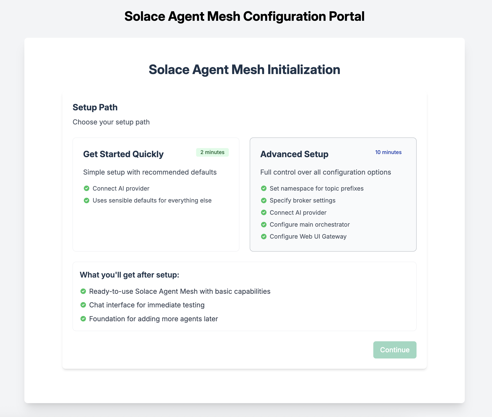

From here, choose "Advanced Setup" to spin up an instance of the Agent Mesh that uses the Solace Broker as the communication backbone. 


> aside negative
> Note that the simple setup "Getting Started Quickly" spins up Agent Mesh without the Solace Broker and uses in-memory queues instead. This is not meant for production ready development and proof of concept project that require high performance and multiple Agentic workflow interactions.

#### Choose a namespace for your project

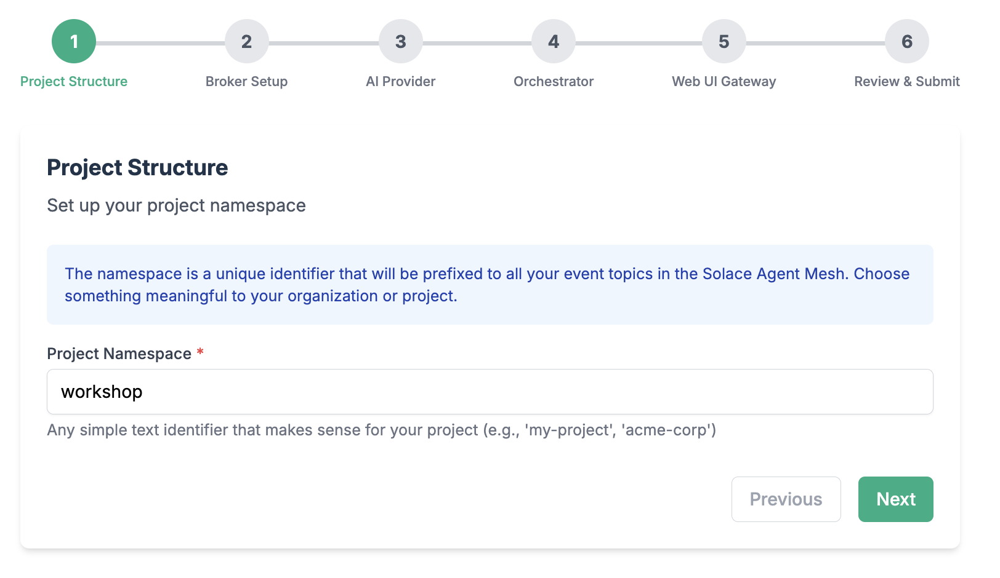

#### Configure connection to the Solace Broker

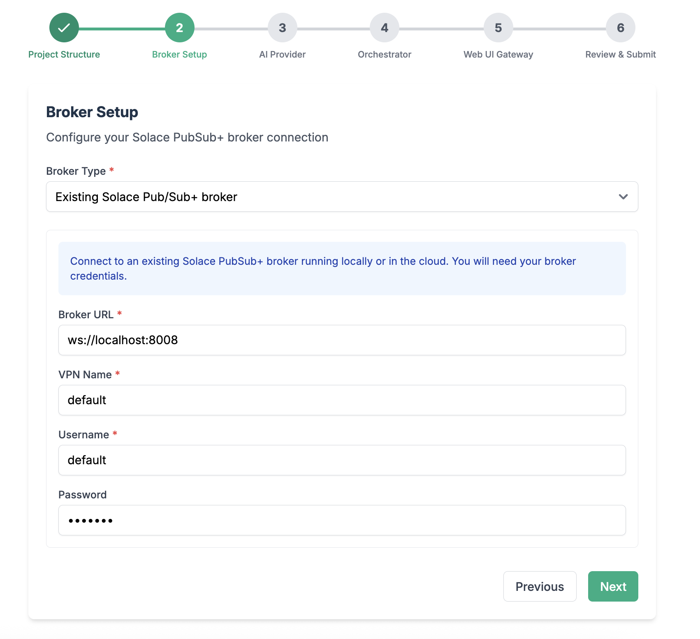


#### Configure your LLM endpoint, API Key, and Model name

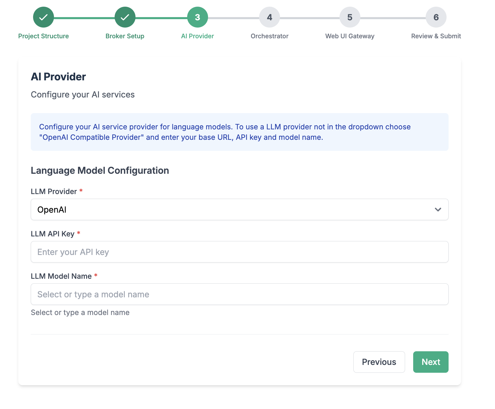

> aside positive
> The model of choice impact the performance of your results and system behaviour. A performative model is recommended for advanced use-cases


#### Configure your main orchestrator

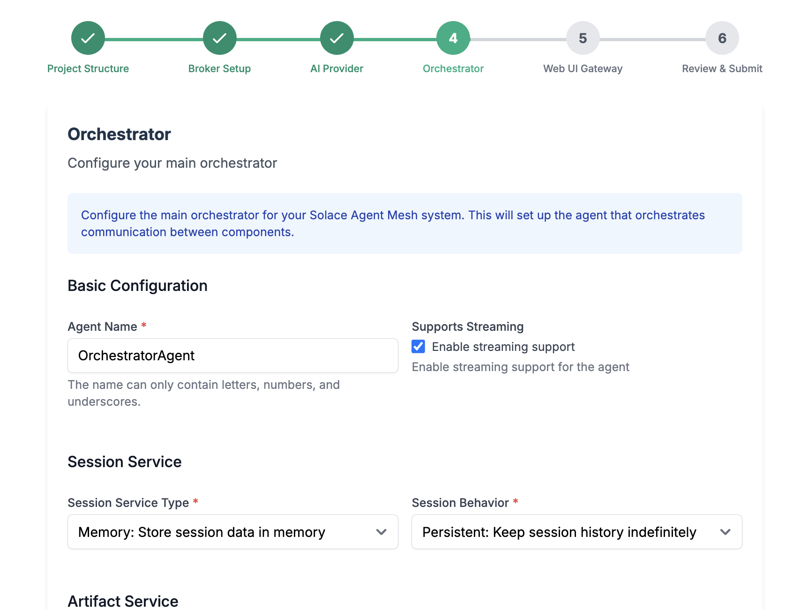

> aside positive
> Keep all the configuration parameters as default. You can explore the other options for configuring the orchestrator agent to see what you have available for fine tuning the behaviour


#### Configure the WebUI Gateway

> aside negative
> Change the `FastAPI Port` to `7000`.


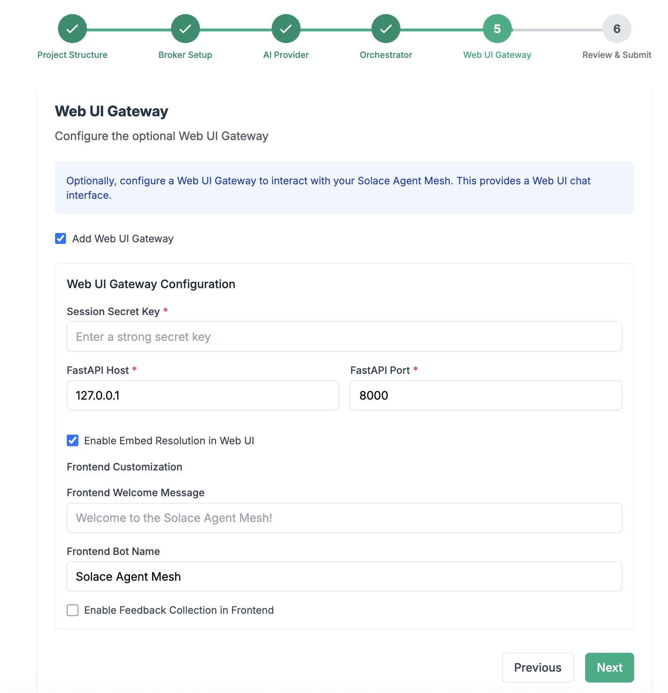


> aside positive
> Note: Choose any Session Secret Key needed for the WebUI. Keep the remaining configurations as default. 

#### Review and Initialize the final configuration

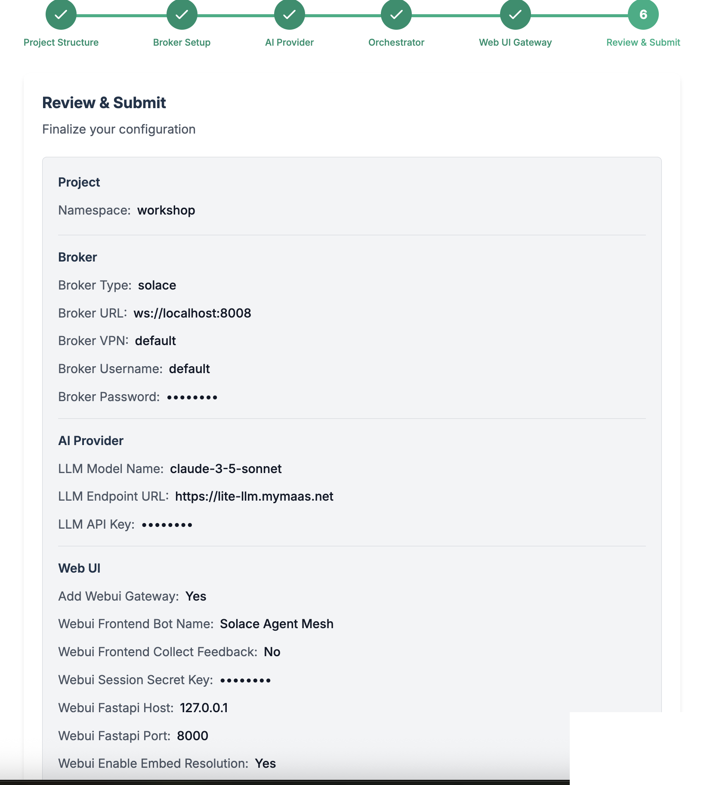

🎉 You have now successfully configured your Solace Agent Mesh environment! 


### Reviewing the Project Structure

After initializing your Solace Agent Mesh instance, you will find out the following files and directories has been created in your project folder

```bash
.
├── .env
├── .sam
├── configs
│   ├── agents
│   │   └── main_orchestrator.yaml
│   ├── gateways
│   │   └── webui.yaml
│   ├── logging_config.ini
│   └── shared_config.yaml
├── requirements.txt
└── src
    └── __init__.py
```

Here is a quick explanation on what this folder structure reflects: 

- `.env` - Contains environment variables used for configuration flexibility across different environments. Such variables include API keys, LLM endpoints, and any secret needed and accessed by the agent runtime. Note that when solace agent mesh runs, it injects the contents of this file to the agent runtime thread. 

- `.sam` - This directory contains framework-specific settings such as plugin configurations

- `config` - Houses all configuration YAML files for your SAM project, organized into several key components such as agents, gateways,logging settings, and common configuration settings shared across all agents and gateways (e.g. broker connection settings, model definitions, and service configurations)

> aside positive
> The shared configuration file employs YAML anchors (& and *) for referencing common elements throughout the configuration structure.


**Key Configuration Files**

`main_orchestrator.yaml`

This file configures the main orchestrator agent, which manages tasks and coordinates workflows between agents.

`webui.yaml`

This file configures the web user interface gateway, which provides a browser-based interface for interacting with the agent mesh.

**Configuration Management**

- Each configuration file defines one or more applications that can run independently
- The SAM framework supports agent applications, gateway applications, and plugin applications
- Configuration files are automatically generated by commands like `sam add agent`, `sam add gateway`, or `sam plugin add`
- You can run individual configuration files using sam run <config-file>


### Running the Solace Agent Mesh
Execute the following command to run Solace Agent Mesh

```
sam run
```


## Agent Mesh and Mediated LLM Access

Duration: 0:05:00

### Use SAM Webui to access Bedrock LLMs

Launch the webui in your browser by visiting `http://localhost:7000`.

Now you can enter a prompt and observe the response from the Orchestrator Agent:

You can start with things as simple as saying hello to the LLM
```
Hello
```

You can ask more advanced questions to see how the LLM responds in the WebUI. 
```
Why are there waves in the ocean? 
```


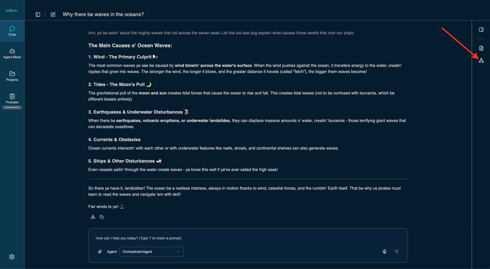

When you click the "Visualizer" icon (see the red arrow in the screenshot above) you can inspect what happened under the covers - the interactions between webui, agents and LLMs.

Please note: SAM provides more [gateways](https://solacelabs.github.io/solace-agent-mesh/docs/documentation/components/gateways) than the webui such as REST or Event Gateways. For example, these allow you to trigger agentic workflows by listening to new order events on a topic or queue in the Solace Broker.

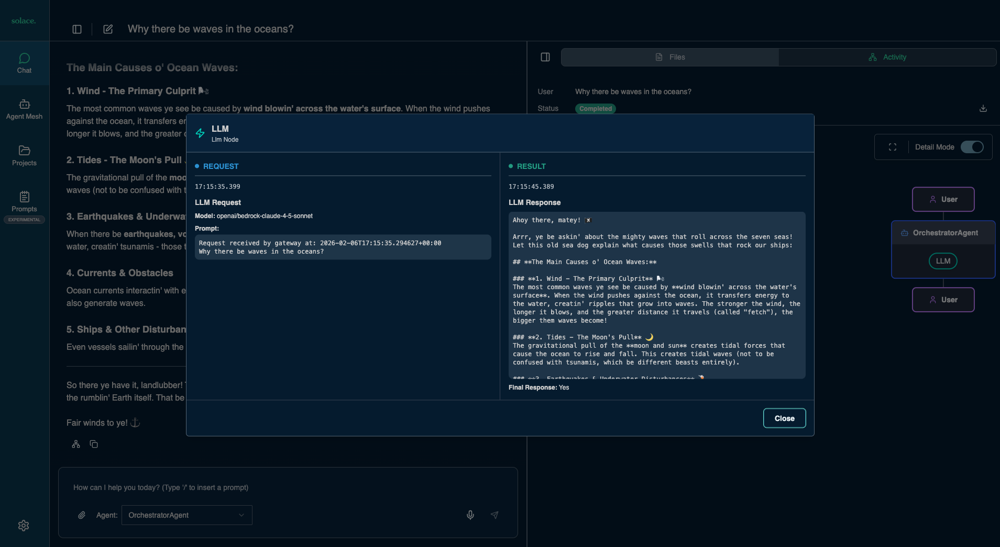


### Observe LLM Usage in Kong AI Gateway

As you have likely noticed from the responses in SAM chat (arr!) - the LLM calls from SAM were routed thorugh the Kong AI Gateway. To review and keep track of LLM usage review the [AI Gateway](https://cloud.konghq.com/us/ai-manager) analytics in Kong Konnect 

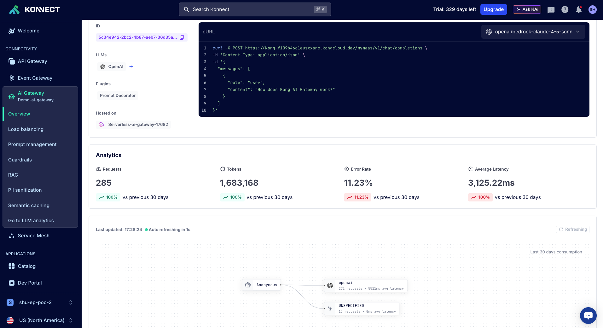

## Agent Mesh and MCP Servers

Duration: 0:10:00

The SAM Orchestrator agent, which we setup in the previously can coordinate workflows between agents. So agents can be instructed to solve specific tasks with the help of MCP tools and resources available to them.

In this module we are going to configure an agent to use an MCP server hosted in Kong MCP Gateway.

### Prepare Kong MCP Gateway

To prepare the Kong MCP Gateway use the declaration in [solace_marketplace_mcp](assets/solace_marketplace_mcp) - download it and then apply the settings:

```
deck gateway reset --konnect-control-plane-name $DECK_KONNECT_CONTROL_PLANE_NAME --konnect-token $KONNECT_TOKEN -f
deck gateway sync --konnect-control-plane-name $DECK_KONNECT_CONTROL_PLANE_NAME --konnect-token $KONNECT_TOKEN solace_marketplace_mcp.yaml
```

This created two Kong Gateway Services, one of which is the marketplace MCP server, which provides tools to access users and orders:
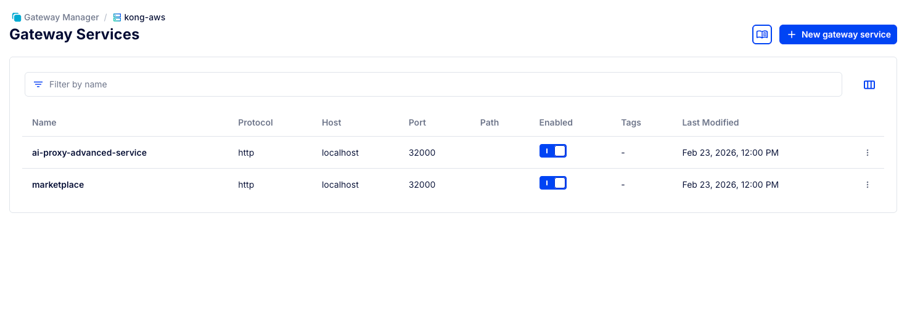

Read up on how to expose tools on the MCP Gateway at [AI/MCP Gateway and Kong MCP Server technical breakdown](https://medium.com/@claudioacquaviva/kong-ai-mcp-gateway-and-kong-mcp-server-technical-breakdown-13420f610ee6).

### Adding the Marketplace MCP Server to SAM as an Agent

#### Stop Solace Agent Mesh

Stop your solace agent mesh project if its already running, e.g. by pressing `Control+C` in your shell.

#### Obtain the marketplace_agent.yaml
[marketplace_agent.yaml](assets/marketplace_agent.yaml), and save it to the directory `solace-agent-mesh-demo/configs/agents`.


#### Set Variables for the Agent 

The agent configuration you just downloaded requires an environment variable indicating the Marketplace MCP server's location.

```
export MCP_MARKETPLACE_URL=$KONNECT_PROXY_URL/mcp-listener
```

Then start up Agent Mesh again:
```
sam run

```

### Review the Agent Definition

The agent is declared in a YAML configuration file - located in `solace-agent-mesh-demo/configs/agents/marketplace_agent.yaml`

This file declares the agent's capabilities and defines the tools it has access to, note that we set the tool URL via the environment variables:
```
apps:
  - name: "MarketplaceAgent_app"
    app_base_path: .
    app_module: solace_agent_mesh.agent.sac.app
    app_config:
      namespace: "${NAMESPACE}"
      supports_streaming: true
      agent_name: "MarketplaceAgent"
      display_name: "Marketplace Agent"
      model: general_model 
      instruction: |
        You are a helpful AI assistant named Marketplace Agent.
        Using the users and orders tools you help shop administrators to find orders and customer data that matches their prompts. To find a users orders you can either attempt to get orders by userid or get a list of orders and filter the matching orders.
      tools: 
        - tool_type: mcp
          connection_params:
            type: streamable-http
            url: "${MCP_MARKETPLACE_URL, http://localhost:8080/mcp-listener}"
```

### Use SAM Webui to test the Agent and MCP Server

Launch the webui in your browser by visiting `http://localhost:7000`.

First check that your new agent is available.

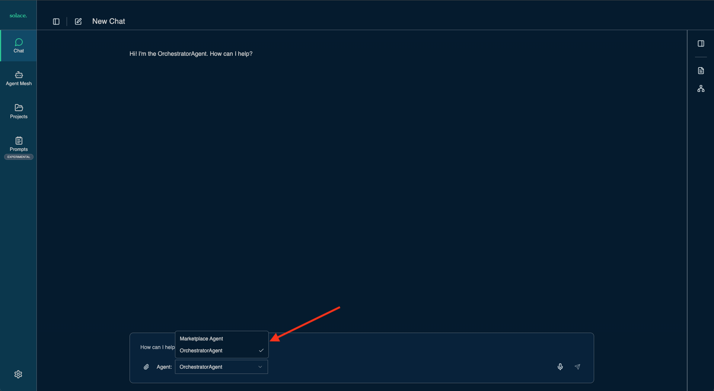


You can also see its Agent Card (An A2A agent card is an identity file that allows AI agents to automatically discover, authenticate, and understand the capabilities, skills, and communication methods of other agents.) 

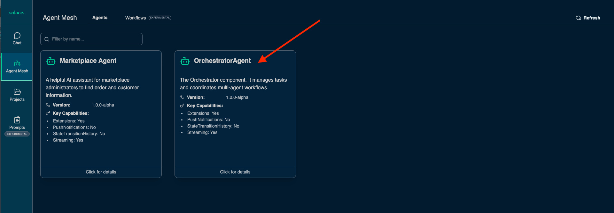

Now you can enable the Visualizer and enter a prompt to search for users.
```
What users are in the marketplace?
```
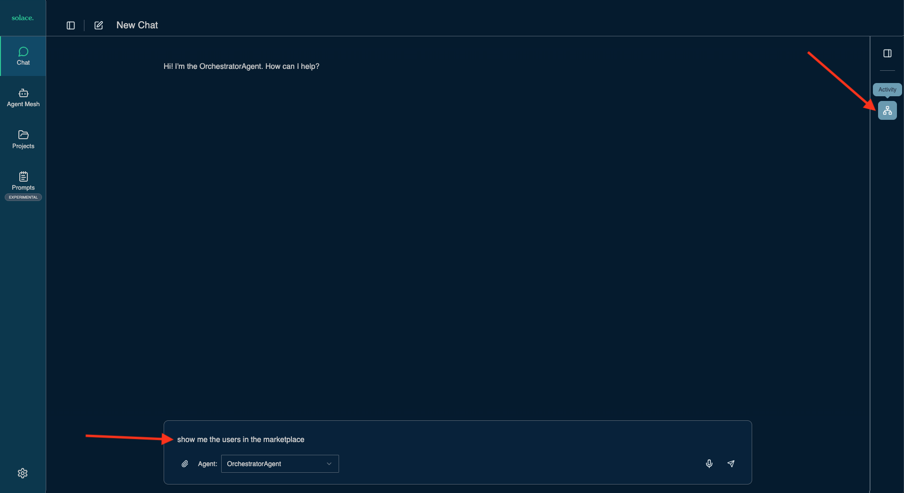

Once results are returned you can see the Orchestrator triggered our new Marketplace Agent to obtain user information from the MCP server.
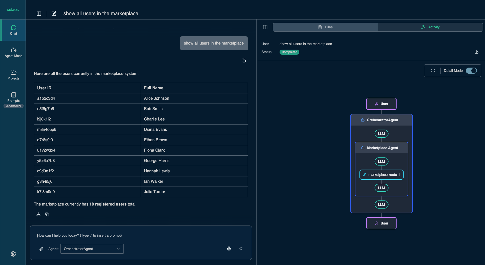

Now ask for Alice's orders and once again observe the interactions of agents and tools in the Visualizer pane
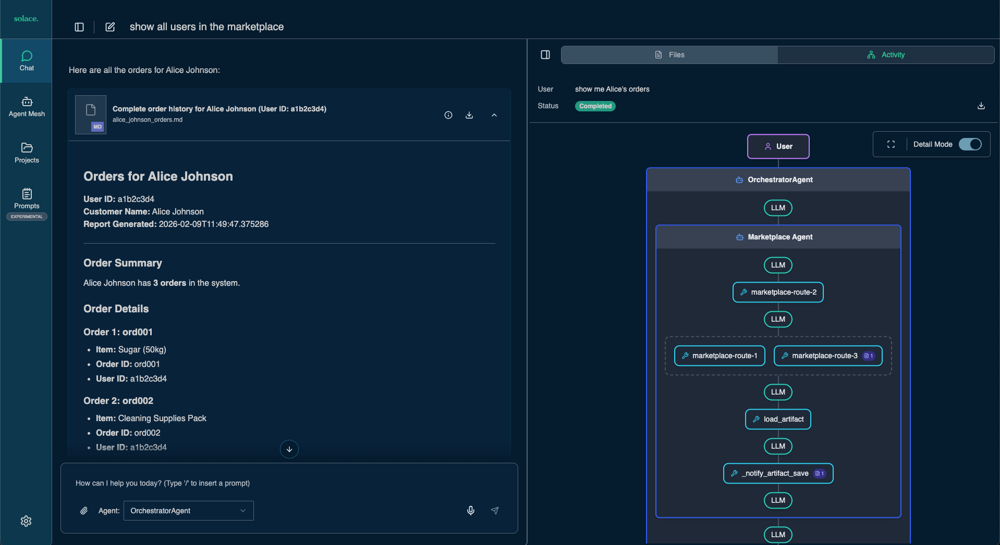

Agent Mesh comes with powerful capabilities for context and artifact management as well as agents and tools that can create diagrams and other artifacts.

Try a few more queries to explore some of these features:
* `Show me the user who created the most orders in the marketplace`
* `Find the three users with the most orders and create a bar chart`
* `Give me a breakdown of users in the marketplace by gender. Generate a pie chart.`


### Observe MCP and API Usage in Kong Konnect

You can review the MCP tool calls and underlying API access in Kong Konnect, in the "Observability" section.
Here's an example of the requests to the control plane that is hosting the MCP server:

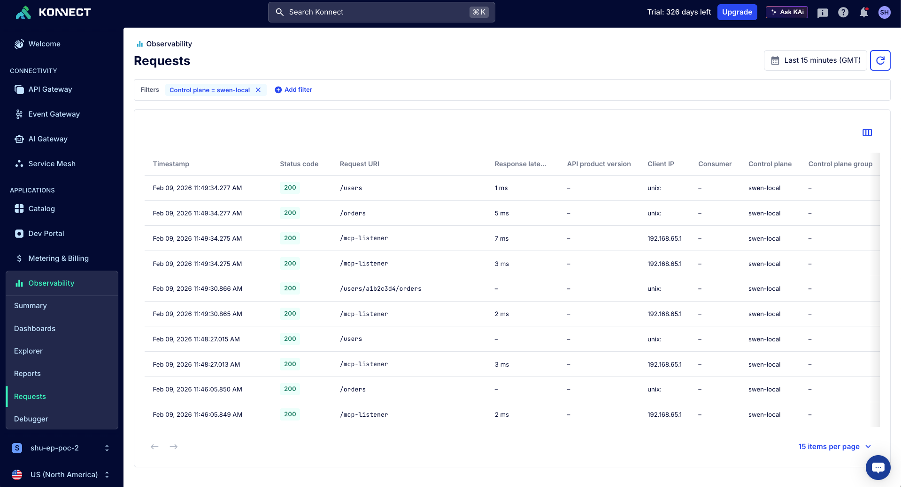


## Agent Mesh and Secured MCP Servers

Duration: 0:15:00

The MCP Tools we used in the previous use case returns sensitive information. We need to make sure user and order data can only be retrieved by trusted parties.

In this module we are going to configure an agent to use a secure MCP server hosted in Kong MCP Gateway.

### Stop Solace Agent Mesh

Stop your solace agent mesh project if its already running, e.g. by pressing `Control+C` in your shell.

### Setup an Authorization Server (Kong Identity)

[**Kong Identity**](https://developer.konghq.com/kong-identity/) enables you to use Konnect to generate, authenticate, and authorize API access. Specifically, Kong Identity can be used for machine-to-machine authentication. You can use Kong Identity to:

* Create authorization servers per region
* Issue and validate access tokens
* Integrate secure authentication into your Kong Gateway APIs


#### Introspection Flow

This section describes the [**OAuth Token Introspection**](https://oauth.net/2/token-introspection/) implemented by **Kong MCP Gateway** and **Kong Identity** as the Identity Provider.


#### Create the Authorization Server in Kong Identity

Before you can configure the **OAuth2** for an MCP server, you must first create an **Authorization Server** in **Kong Identity**. The AuthZ Server name is unique per each organization and each Konnect region. You can use the **Kong Identity** UI to create your AuthZ Server. However, we are going to exercise the [Kong Identity REST Admin APIs](https://developer.konghq.com/api/konnect/kong-identity) to do it. Make sure you still have the ``KONNECT_TOKEN`` environment variable set.

Create an auth server using the [``/v1/auth-servers``](https://developer.konghq.com/api/konnect/kong-identity/v1/#/operations/createAuthServer) endpoint. Note each AuthN Server has an audience specified.

```
curl -sX POST "https://us.api.konghq.com/v1/auth-servers" \
  -H "Authorization: Bearer $KONNECT_TOKEN"\
  -H "Content-Type: application/json" \
  --json '{
    "name": "AuthZ_Server_1",
    "audience": "http://mcp_tools.dev",
    "description": "AuthZ Server 1"
  }' | jq
```

You should get a response like this:

```code{showCopyAction=true showLineNumbers=false language=json}
{
  "audience": "http://mcp_tools.dev",
  "created_at": "2026-02-17T17:42:23.194606Z",
  "description": "AuthZ Server 1",
  "id": "f5db888d-14d7-4f63-bcc8-ecf186e04f8f",
  "issuer": "https://lpjwyco0nr07jrva.us.identity.konghq.com/auth",
  "labels": {},
  "metadata_uri": "https://lpjwyco0nr07jrva.us.identity.konghq.com/auth/.well-known/openid-configuration",
  "name": "AuthZ_Server_1",
  "signing_algorithm": "RS256",
  "trusted_origins": [],
  "updated_at": "2026-02-17T17:42:23.194606Z"
}
```

##### Check your AuthZ Server

```
curl -sX GET "https://us.api.konghq.com/v1/auth-servers" \
  -H "Authorization: Bearer $KONNECT_TOKEN" | jq
```

Get the AuthZ Server Id:


```
export AUTHZ_SERVER_ID=$(curl -sX GET "https://us.api.konghq.com/v1/auth-servers" -H "Authorization: Bearer $KONNECT_TOKEN" | jq -r '.data[0].id')
```

Get the Issuer URL:

```
export ISSUER_URL=$(curl -sX GET "https://us.api.konghq.com/v1/auth-servers" -H "Authorization: Bearer $KONNECT_TOKEN" | jq -r '.data[0].issuer')
```


#### Configure the AuthZ server with scopes

Configure a scope in your auth server using the [``/v1/auth-servers/$AUTHZ_SERVER_ID/scopes``](https://developer.konghq.com/api/konnect/kong-identity/v1/#/operations/createAuthServerScope) endpoint:

:::code{showCopyAction=true showLineNumbers=false language=shell}
curl -sX POST "https://us.api.konghq.com/v1/auth-servers/$AUTHZ_SERVER_ID/scopes" \
  -H "Authorization: Bearer $KONNECT_TOKEN"\
  -H "Content-Type: application/json" \
  --json '{
    "name": "scope1",
    "description": "scope1",
    "default": false,
    "include_in_metadata": false,
    "enabled": true
  }' | jq
:::

Expected response

```
{
  "created_at": "2026-02-17T17:44:20.009421Z",
  "default": false,
  "description": "scope1",
  "enabled": true,
  "id": "316b6d43-55db-4083-aec2-f975c15fcbd1",
  "include_in_metadata": false,
  "name": "scope1",
  "updated_at": "2026-02-17T17:44:20.009421Z"
}
```

Export your scope ID:

```
export SCOPE_ID=$(curl -sX GET "https://us.api.konghq.com/v1/auth-servers/$AUTHZ_SERVER_ID/scopes" -H "Authorization: Bearer $KONNECT_TOKEN" | jq -r '.data[0].id')
```


#### Configure the AuthZ server with custom claims

Configure a custom claim using the [``/v1/auth-servers/$AUTHZ_SERVER_ID/claims``](https://developer.konghq.com/api/konnect/kong-identity/v1/#/operations/createAuthServerClaim) endpoint. A custom claim can be include in the tokens or inside a scope.


```
curl -sX POST "https://us.api.konghq.com/v1/auth-servers/$AUTHZ_SERVER_ID/claims" \
  -H "Authorization: Bearer $KONNECT_TOKEN" \
  -H "Content-Type: application/json" \
  --json '{
    "name": "claim1",
    "value": "claim1",
    "include_in_token": true,
    "include_in_all_scopes": false,
    "include_in_scopes": [
      "'$SCOPE_ID'"
    ],
    "enabled": true
  }' | jq
```

Expected output:

```
{
  "created_at": "2026-02-17T17:45:27.788763Z",
  "enabled": true,
  "id": "c74de2c0-7dcd-448f-8491-5eec965f4b6c",
  "include_in_all_scopes": false,
  "include_in_scopes": [
    "316b6d43-55db-4083-aec2-f975c15fcbd1"
  ],
  "include_in_token": true,
  "name": "claim1",
  "updated_at": "2026-02-17T17:45:27.788763Z",
  "value": "claim1"
}
```

#### Create a client in the AuthZ Server

The client is the machine-to-machine credential. In this tutorial, Konnect will autogenerate the **Client ID** and **Client Secret**, but you can alternatively specify one yourself.

Configure the client using the [``/v1/auth-servers/$AUTHZ_SERVER_ID/clients``](https://developer.konghq.com/api/konnect/kong-identity/v1/#/operations/createAuthServerClient) endpoint. Note the the Access Token duration has a timeout of 7200 seconds:

```
curl -sX POST "https://us.api.konghq.com/v1/auth-servers/$AUTHZ_SERVER_ID/clients" \
  -H "Authorization: Bearer $KONNECT_TOKEN"\
  -H "Content-Type: application/json" \
  --json '{
    "name": "client1",
    "grant_types": [
      "client_credentials"
    ],
    "allow_all_scopes": false,
    "allow_scopes": [
      "'$SCOPE_ID'"
    ],
    "access_token_duration": 7200,
    "id_token_duration": 7200,
    "response_types": [
      "id_token",
      "token"
    ]
  }' | jq
```

Expected output:

```
{
  "access_token_duration": 7200,
  "allow_all_scopes": false,
  "allow_scopes": [
    "316b6d43-55db-4083-aec2-f975c15fcbd1"
  ],
  "client_secret": "7o85r56b48aiba4hrxc60i6n",
  "created_at": "2026-02-17T17:47:21.073803Z",
  "grant_types": [
    "client_credentials"
  ],
  "id": "p4aih3vylfgl3d8a",
  "id_token_duration": 7200,
  "labels": {},
  "login_uri": null,
  "name": "client1",
  "redirect_uris": [],
  "response_types": [
    "id_token",
    "token"
  ],
  "token_endpoint_auth_method": "client_secret_post",
  "updated_at": "2026-02-17T17:47:21.073803Z"
}
```

The Client Secret will not be shown again, so copy both ID and Secret:

```
export CLIENT_ID=<YOUR_CLIENT_ID>
export CLIENT_SECRET=<YOUR_CLIENT_SECRET>

For example:
export CLIENT_ID=p4aih3vylfgl3d8a
export CLIENT_SECRET=7o85r56b48aiba4hrxc60i6n
```


#### Checking your Kong Identity Authorization Server

Kong Identity provides the standard endpoint ```$ISSUER_URL/.well-known/openid-configuration``` where you can get these and several other Kong Identity configuration parameters.


```
curl -s $ISSUER_URL/.well-known/openid-configuration | jq
```

Typical response:

```
{
  "issuer": "https://lpjwyco0nr07jrva.us.identity.konghq.com/auth",
  "authorization_endpoint": "https://lpjwyco0nr07jrva.us.identity.konghq.com/auth/authorize",
  "token_endpoint": "https://lpjwyco0nr07jrva.us.identity.konghq.com/auth/oauth/token",
  "introspection_endpoint": "https://lpjwyco0nr07jrva.us.identity.konghq.com/auth/introspect",
  "userinfo_endpoint": "https://lpjwyco0nr07jrva.us.identity.konghq.com/auth/userinfo",
  "revocation_endpoint": "https://lpjwyco0nr07jrva.us.identity.konghq.com/auth/revoke",
  "end_session_endpoint": "https://lpjwyco0nr07jrva.us.identity.konghq.com/auth/end_session",
  "device_authorization_endpoint": "https://lpjwyco0nr07jrva.us.identity.konghq.com/auth/device_authorization",
  "jwks_uri": "https://lpjwyco0nr07jrva.us.identity.konghq.com/auth/.well-known/jwks",
  "scopes_supported": [
    "openid",
    "offline_access"
  ],
  "response_types_supported": [
    "code",
    "id_token",
    "id_token token"
  ],
  "grant_types_supported": [
    "authorization_code",
    "implicit",
    "refresh_token",
    "client_credentials",
    "urn:ietf:params:oauth:grant-type:jwt-bearer"
  ],
  "subject_types_supported": [
    "public"
  ],
  "id_token_signing_alg_values_supported": [
    "RS256"
  ],
  "token_endpoint_auth_methods_supported": [
    "none",
    "client_secret_basic",
    "client_secret_post"
  ],
  "revocation_endpoint_auth_methods_supported": [
    "none",
    "client_secret_basic",
    "client_secret_post"
  ],
  "revocation_endpoint_auth_signing_alg_values_supported": [
    "RS256"
  ],
  "introspection_endpoint_auth_methods_supported": [
    "client_secret_basic"
  ],
  "introspection_endpoint_auth_signing_alg_values_supported": [
    "RS256"
  ],
  "code_challenge_methods_supported": [
    "S256"
  ],
  "ui_locales_supported": [
    "en"
  ],
  "request_uri_parameter_supported": false
}
```

#### Kong Identity User Interface

You can also check the Konnect UI with your Authorization Server and its Clients, Scopes and Claims defined:


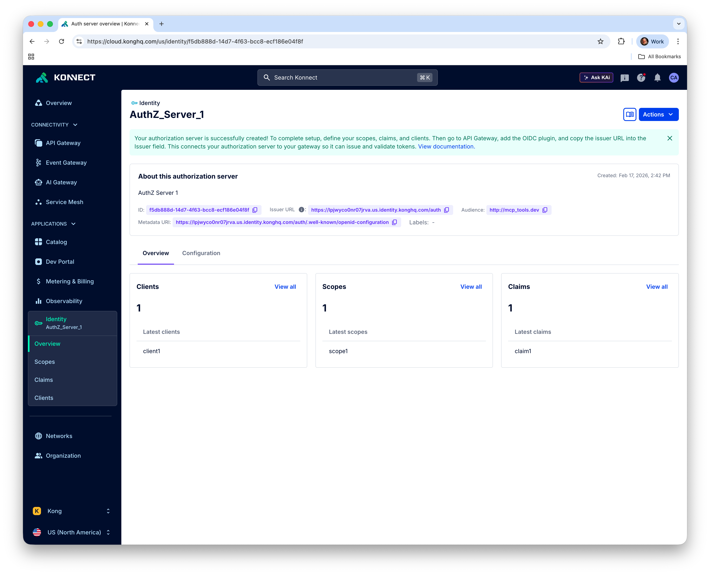

Kong Identity provides the standard endpoint ```$ISSUER_URL/.well-known/openid-configuration``` where you can get Kong Identity configuration parameters.


### Prepare Kong MCP Gateway

To prepare the Kong MCP Gateway use the declaration in [solace_marketplace_mcp_secure.yaml](http://localhost:8080/builds/static/code/sam-deck-config/solace_marketplace_mcp_secure.yaml)


It refers to some **Kong Identity** endpoints and secrets, besides the actual Authorization URL, the standard endpoint ```$ISSUER_URL/.well-known/openid-configuration``` provides the required configuration parameters.

Let's go through them:

* **resource (`DECK_MCP_AUTH_URL`)**: that's the **MCP Tool URL**, exposed by the Kong Data Plane. Considering our declaration should be like this: `http://$KONNECT_PROXY_URL/mcp-listener`.

* **authorization_servers (`DECK_KONG_IDENTITY_AUTHZ_URL`)**: that's the Kong Identity Authorization endpoint. Although it's required, for Client Credentials Grant, it's ignored. It should be something like: `https://4bim7lj9i47ef25x.us.identity.konghq.com/auth/authorize`

* **introspection_endpoint (`DECK_KONG_IDENTITY_INTROSPECTION_URL`)**: that's the Kong Identity Introspection endpoint. In our case, `https://4bim7lj9i47ef25x.us.identity.konghq.com/auth/introspect`

* **client_id (`DECK_CLIENT_ID`)** and **client_secret (`DECK_CLIENT_SECRET`)**: these are the secrets of an existing Kong Identity Client.

Before submiting the new declaration we have to set the decK environment variables:

```
export DECK_MCP_AUTH_URL=http://$KONNECT_PROXY_URL/mcp-listener
export DECK_KONG_IDENTITY_AUTHZ_URL=$ISSUER_URL/authorize
export DECK_KONG_IDENTITY_INTROSPECTION_URL=$ISSUER_URL/introspect
export DECK_CLIENT_ID=$CLIENT_ID
export DECK_CLIENT_SECRET=$CLIENT_SECRET
```

Now that all environment variables are set 
```
deck gateway reset --konnect-control-plane-name $DECK_KONNECT_CONTROL_PLANE_NAME --konnect-token $KONNECT_TOKEN -f
deck gateway sync --konnect-control-plane-name $DECK_KONNECT_CONTROL_PLANE_NAME --konnect-token $KONNECT_TOKEN solace_marketplace_mcp_secure.yaml
```

This configuration adds a `ai-mcp-oauth2` plugin to the MCP Proxy that evaluates and verifies the OAuth2 access token that a client such as our Marketplace Agent supplies.

Let's create an agent in SAM that uses the MCP tools we just exposed. As the MCP server is secured the agent needs to know the URL of the tool and an OAuth2 token for authorized access.

### Adding the Marketplace MCP Server to SAM as an Agent

#### Obtain the marketplace_agent.yaml
[marketplace_agent.yaml](assets/marketplace_agent.yaml), and save it to the directory `solace-agent-mesh-demo/configs/agents`.

#### Obtain an Access Token for the MCP Server

We need to obtain a token from Kong Identity that our agent uses to connect to the MCP server.

Get the Issuer URL:
```
export ISSUER_URL=$(curl -sX GET "https://us.api.konghq.com/v1/auth-servers" -H "Authorization: Bearer $KONNECT_TOKEN" | jq -r '.data[0].issuer')
```

And get a token:
```
export TOKEN=$(curl -s -X POST "$ISSUER_URL/oauth/token" \
  -H "Content-Type: application/x-www-form-urlencoded" \
  -d "grant_type=client_credentials" \
  -d "client_id=$CLIENT_ID" \
  -d "client_secret=$CLIENT_SECRET" \
  -d "scope=scope1" | jq -r '.access_token')
```

Let's add the token as an environment variable to the SAM environment:
``` 
export MCP_MARKETPLACE_TOKEN=${TOKEN}
``` 
Also check you have set the MCP server URL:
```
export MCP_MARKETPLACE_URL=$KONNECT_PROXY_URL/mcp-listener
```

Then start up Agent Mesh again:
```
sam run

```

### Review the Agent Definition

The agent is declared in a YAML configuration file [marketplace_agent.yaml](assets/marketplace_agent.yaml)

This file declares the agent's capabilitities and defines the tools it has access to, note that we set the tool URL (`MCP_MARKETPLACE_URL`) and the token `MCP_MARKETPLACE_TOKEN` via the SAM environment:
```code{showCopyAction=false showLineNumbers=false language=yaml}
apps:
  - name: "MarketplaceAgent__app"
    app_base_path: .
    app_module: solace_agent_mesh.agent.sac.app
    app_config:
      namespace: "${NAMESPACE}"
      supports_streaming: true
      agent_name: "MarketplaceAgent"
      display_name: "Marketplace Agent"
      model: general_model 
      instruction: |
        You are a helpful AI assistant named Marketplace Agent.
        Using the users and orders tools you help shop administrators to find orders and customer data that matches their prompts. To find a users orders you can either attempt to get orders by userid or get a list of orders and filter the matching orders.
      tools: 
        - tool_type: mcp
          connection_params:
            type: streamable-http
            url: "${MCP_MARKETPLACE_URL, http://localhost:8080/mcp-listener}"
            headers:
              Authorization: "Bearer ${MCP_MARKETPLACE_TOKEN}"     
```

### Use SAM Webui to test we can securely access the MCP Server

Launch the webui in your browser by visiting `http://localhost:7000`.


Enable the Visualizer and enter a prompt to search for users.


Once results are returned you can see the Orchestrator triggered the Marketplace Agent to obtain user information.


### Troubleshooting

Once you apply the OAuth2 policy to the MCP server, the Marketplace Agent can no longer connect successfully. You may observe that the agent disappears from the Webui's agent directory at `http://localhost:7000/#/agents`.

If the agent does not appear again it is likely that the access token was not passed successfully to the agent.

Check the log files of the agent:
```
more ~/solace-agent-mesh-demo/sam.log
```

Make sure you have set the right environment variables for the token:
```
 echo $MCP_MARKETPLACE_TOKEN
```

## Takeaways

Duration: 0:03:00

In this codelab we are going to explore how Solace Agent Mesh can easily integrate with LLM and MCP capabilities provided by Kong AI Gateway.

You ...

✅ spun up Kong AI Gateway and configured an LLM proxy to mediate and observe all LLM calls.  
✅ installed and initialized  Agent Mesh, connecting it to a broker and routing LLM traffic through Kong.  
✅ used the SAM WebUI to interact with the orchestrator agent and visualize multi‑agent workflows end‑to‑end.  
✅ added Marketplace Agent that uses Kong-hosted MCP Server to call  tools for users and orders in the marketplace.  
✅ secured MCP server adding OAuth2, generating tokens, and verifying that SAM agents access protected MCP tools.  

And while doing so we demonstrated:
* Solace Agent Mesh provides powerful event‑driven orchestration, enabling autonomous agents and LLMs to collaborate asynchronously, scale independently, and execute complex workflows efficiently.
* Kong AI Gateway unifies and governs LLM access, offering standardized OpenAI‑compatible endpoints, real‑time observability, prompt engineering, and secure mediation of all model interactions.
* MCP Gateway seamlessly exposes enterprise APIs as MCP tools, allowing agents in Solace Agent Mesh to dynamically discover and use backend capabilities without manual service integration.
* Combining Agent Mesh with Kong creates end‑to‑end visibility and cost control, with SAM’s Visualizer showing agent interactions and Kong providing analytics on token usage, governance, and security.

The joint architecture enables secure, production‑ready Agentic AI, supporting OAuth‑secured MCP servers, machine‑to‑machine authorization, and scalable multi-agent workflows suited for real enterprise environments. 


Thanks for participating in this codelab! Let us know what you thought in the [Solace Community Forum](https://solace.community/)! If you found any issues along the way we'd appreciate it if you'd raise them by clicking the Report a mistake button at the bottom left of this codelab.


