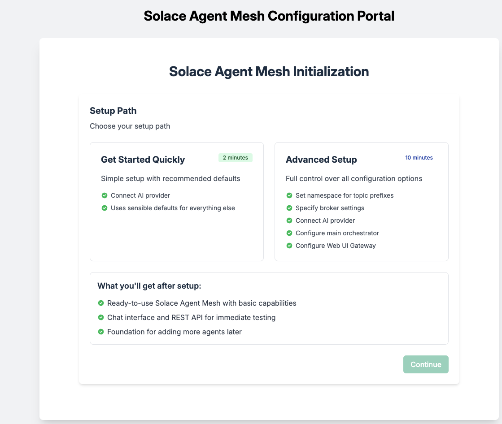
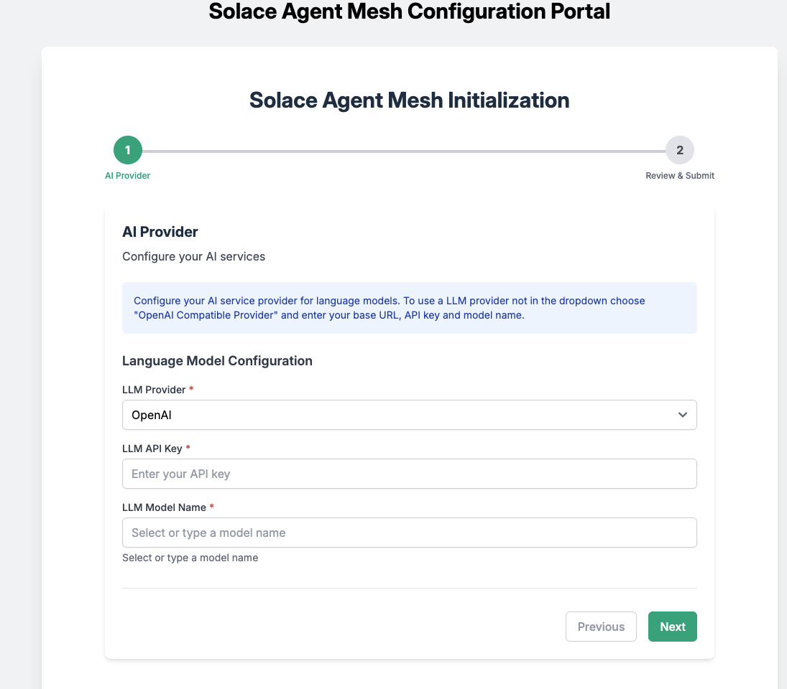
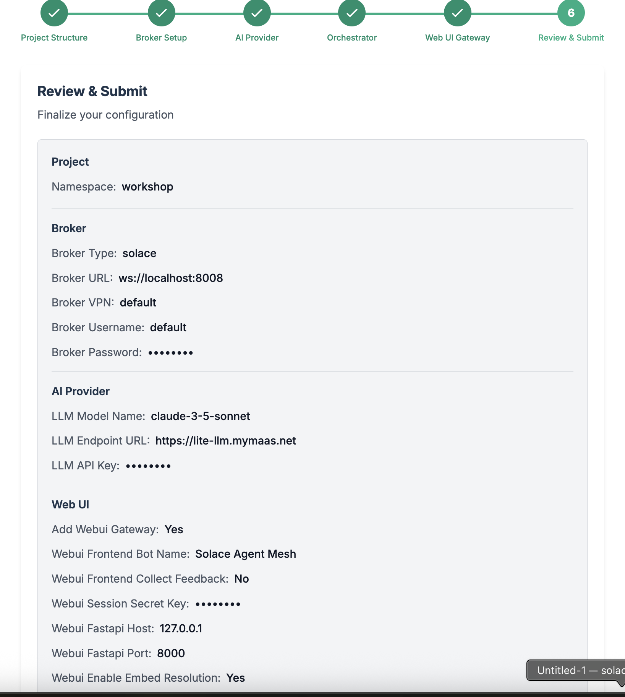
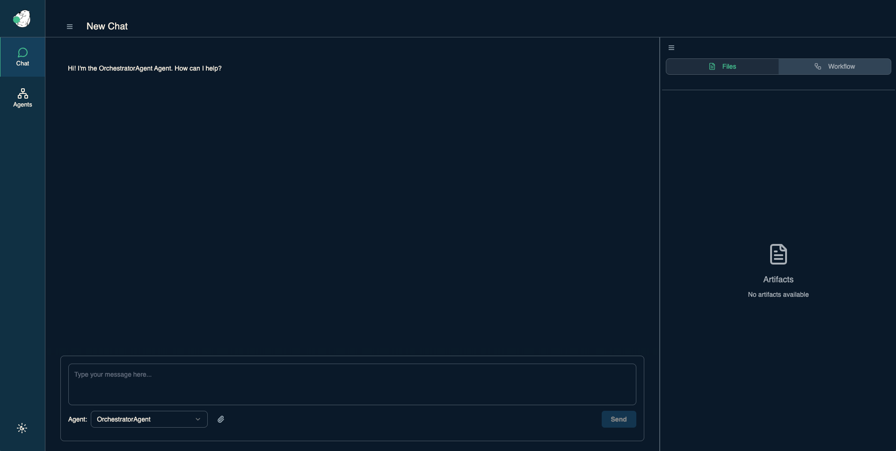
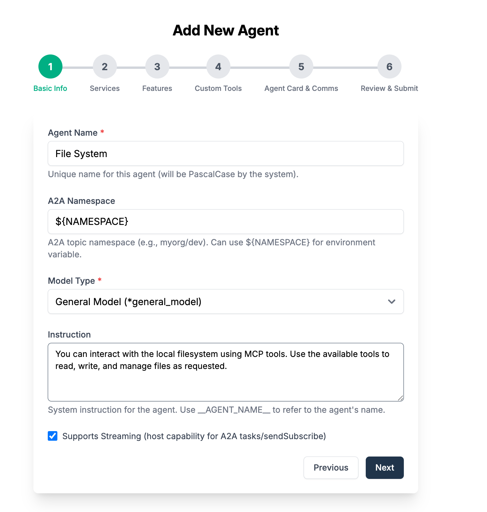

author: Tamimi A
summary:
id: solace-agent-mesh
tags: 
categories: Solace, Agent Mesh, AI
environments: Web
status: Hidden
feedback link: https://github.com/SolaceDev/solace-dev-codelabs/blob/master/markdown/solace-agent-mesh

# Getting started with Solace Agent Mesh over A2A

## What you'll learn: Overview

In this codelab, you'll gain a foundational understanding of the Solace Agent Mesh and its integration with Google's Agent-to-Agent (A2A) Protocol. You'll explore the architecture, key components, and benefits of the Solace Agent Mesh, learning how it enables scalable, event-driven communication between AI agents and services. The introduction covers the evolution of event-driven architectures and highlights real-world use cases where agent mesh technology can be applied.

You'll dive into the details of the A2A Protocol, discovering its design principles, core concepts, and how it standardizes agent communication for interoperability and extensibility. The codelab explains essential constructs such as Agent Cards, Tasks, Events, and Artifacts, providing insight into how agents discover each other, delegate tasks, and collaborate asynchronously. You'll also learn about the Agent Development Kit (ADK) and how it works with A2A to build and deploy advanced AI agents.

By the end of this codelab, you'll be equipped to get started with Solace Agent Mesh, including installation prerequisites, running built-in agents, and connecting external services like Google Maps and Search. You'll understand how to develop custom agents, leverage plugins and tools, and build multi-agent systems that harness the power of event mesh and standardized protocols for robust, collaborative AI solutions.

Duration: 0:05:00

## Introduction to the Solace Agent Mesh
Duration: 0:15:00

Welcome to this workshop on Solace Agent Mesh! In this session, you'll learn about a powerful framework that addresses one of modern AI development's biggest challenges: connecting AI models to real-world data and systems. Let's dive in!

> aside negative
> Without a framework like Solace Agent Mesh, connecting AI systems to disparate data sources can be extremely complex, requiring custom integration code and creating maintenance challenges.

### What is Solace Agent Mesh?

Solace Agent Mesh is an open-source framework that integrates Google's Agent Development Kit (ADK) with the Solace AI Connector to create a "Universal A2A Agent Host." This enables scalable, distributed AI agent communication through the Solace Event Broker. 

At its core, Solace Agent Mesh addresses a fundamental challenge in modern AI development: while powerful AI models are readily available, the real complexity lies in connecting them to the data and systems where they can provide value. Data exists in isolated silos - spread across databases, SaaS platforms, APIs, and legacy systems - making it difficult to build AI applications that work across these boundaries.

Solace Agent Mesh provides developers with:
- A standardized A2A (Agent-to-Agent) protocol for AI communication
- Tools to connect AI agents to real-world data sources
- The ability to orchestrate complex workflows across multiple specialized agents
- Built-in extensibility through a modular plugin architecture

> aside positive
> Solace Agent Mesh follows an event-driven architecture that decouples components, allowing them to be developed, deployed, and scaled independently.

### Key Components and Architecture

Solace Agent Mesh consists of several interconnected components that work together through the standardized A2A protocol:

1. **Solace Event Broker/Event Mesh**:
   - Acts as the central nervous system of the framework
   - Provides the messaging fabric for all asynchronous communication
   - Utilizes topic-based routing for the Agent-to-Agent (A2A) protocol
   - Ensures message delivery even during component failures

2. **Agents**:
   - Specialized processing units built around Google's ADK
   - Provide domain-specific knowledge and capabilities
   - Features include ADK integration, dynamic discovery, access to tools
   - Can operate independently and be deployed separately

3. **Gateways**:
   - Act as bridges between external systems and the agent mesh
   - Handle protocol translation, authentication, and session management
   - Support various interfaces (REST, HTTP SSE, webhooks, event mesh)

4. **Orchestrator**:
   - A specialized agent that breaks down complex requests into manageable tasks
   - Manages workflow across multiple agents
   - Coordinates task delegation and response aggregation

> aside negative
> Without proper planning and understanding of the component roles, you might create overly complex architectures or miss opportunities to leverage the full power of the distributed agent ecosystem.

### Evolution of Event-Driven Architecture

Solace Agent Mesh represents the next step in the evolution of event-driven architecture:

1. **Traditional EDA**: Focused on decoupling services and enabling asynchronous communication through events.

2. **Event Mesh**: Extended EDA with dynamic routing across cloud boundaries and geographic regions.

3. **Event-Driven Microservices**: Applied EDA principles to microservice architectures for greater resilience and scalability.

4. **Event-Driven AI/ML**: Integrated AI capabilities with event streams for real-time intelligence.

5. **Solace Agent Mesh**: Combines EDA with agent-based AI to create collaborative, distributed intelligence systems connected through an event mesh.

The architecture of Solace Agent Mesh builds on these foundations with several key principles:
- **Event-Driven Architecture**: All interactions between major components are asynchronous and mediated by the event broker
- **Component Decoupling**: Components communicate through standardized A2A protocol messages over the event mesh
- **Scalability and Resilience**: The architecture supports horizontal scaling and provides fault tolerance

> aside positive
> This evolution makes Solace Agent Mesh particularly well-suited for complex, distributed systems that need to process information from multiple sources in real-time.

### Key Benefits of Solace Agent Mesh

1. **Simplified Integration**: Connect AI agents to disparate data sources through a standardized protocol.

2. **Decoupled Architecture**: Components communicate asynchronously, allowing independent development, deployment, and scaling.

3. **Scalability**: Horizontal scaling of Agent Hosts and Gateways to handle increasing workloads.

4. **Resilience**: Fault tolerance and guaranteed message delivery even if individual components fail.

5. **Extensibility**: Modular design with plugins for customizing and extending functionality.

6. **Multi-Modal Intelligence**: Support for various AI models and capabilities through specialized agents.

7. **Real-Time Processing**: Event-driven architecture enables immediate processing of information as it becomes available.

> aside negative
> Keep in mind that implementing a distributed agent system requires careful consideration of data governance, security, and monitoring to ensure reliable and trustworthy operation.

This workshop will help you understand how to leverage Solace Agent Mesh for your own AI applications, whether you're an AI enthusiast experimenting with new models or an enterprise developer building production systems.

### Resources

For more information and a deep dive on the Solace Agent Mesh, you can check out this video series 
<video id="_4IdRPBM2y8"></video>

## Use Cases and Applications
Duration: 0:05:00

Solace Agent Mesh is versatile and can be applied to various domains:

1. **Customer Service Augmentation**:
   - Intelligent chatbots that can access multiple backend systems
   - Real-time response generation based on customer data and history
   - Seamless handoff between AI agents and human agents

2. **Supply Chain Optimization**:
   - Monitoring and analyzing events across the supply chain
   - Predictive maintenance and inventory management
   - Automated decision-making based on real-time data

3. **Financial Services**:
   - Fraud detection through pattern analysis across multiple data streams
   - Personalized financial advice based on customer portfolio and market events
   - Regulatory compliance monitoring and reporting

4. **Healthcare**:
   - Patient monitoring and alert generation
   - Clinical decision support by accessing medical records and research data
   - Healthcare workflow optimization

5. **Smart Cities**:
   - Traffic management through real-time data analysis
   - Utility optimization based on usage patterns
   - Emergency response coordination

> aside positive
> By building on Solace Agent Mesh, you can focus on creating domain-specific agent intelligence rather than spending time on integration and communication infrastructure.


## Google Agent-to-Agent Protocol (A2A)
Duration: 0:07:00

The Agent-to-Agent (A2A) Protocol is Google's standardized communication protocol designed to enable seamless interaction between AI agents, regardless of their underlying implementation or hosting environment. It provides a common language for agents to discover each other, exchange information, delegate tasks, and collaborate on complex problems. This document explores the A2A protocol in detail, including its design principles, components, and implementation approaches.

> aside positive
> A2A is an open-source protocol, available for any developer or organization to implement. This open nature fosters a rich ecosystem of interoperable agents across different platforms and frameworks.

### Core Concepts

The A2A Protocol is built around several foundational concepts that define its structure and behavior:

#### Protocol Design Principles

A2A was designed with the following principles in mind:

1. **Standardization**: Provide a common interface for agent communication
2. **Interoperability**: Enable agents from different systems to work together
3. **Extensibility**: Support evolving agent capabilities
4. **Asynchronicity**: Handle long-running tasks and parallel operations
5. **Discoverability**: Allow agents to find and understand each other's capabilities
6. **Security**: Implement robust authentication and authorization

These principles ensure that A2A serves as a reliable foundation for building multi-agent systems.

#### Agent Cards

Agent Cards are metadata structures that describe an agent's capabilities, allowing other agents and systems to discover and understand how to interact with them. Key components include:

1. **Name**: A unique identifier for the agent
2. **Description**: A human-readable explanation of the agent's purpose
3. **Capabilities**: The specific tasks the agent can perform
4. **Input/Output Formats**: The data structures the agent expects and produces
5. **Authentication Requirements**: Security information for accessing the agent

Agent Cards are published to discovery endpoints, making them available to other agents in the ecosystem.

> aside negative
> Always validate Agent Cards from external sources, as malicious actors could potentially publish misleading Agent Cards to trick systems into inappropriate delegations.

#### Tasks

Tasks represent the work that agents perform. They include:

1. **Task ID**: A unique identifier for tracking
2. **Input**: The information provided to the agent
3. **Context**: Additional information about the task environment
4. **Artifacts**: Files or binary data associated with the task
5. **Delegation Path**: Information about how the task was routed

Tasks follow a lifecycle from creation through processing to completion or failure.

#### Events

Events represent the state changes and progress updates that occur during task execution:

1. **Status Updates**: Progress information about ongoing tasks
2. **Artifact Updates**: Notifications about new or modified files
3. **Error Events**: Information about failures or issues
4. **Completion Events**: Signals that a task has finished

Events enable asynchronous monitoring of task progress, which is essential for long-running operations.

#### Artifacts

Artifacts are files or binary data that agents can exchange:

1. **Content**: The actual data (text, image, audio, etc.)
2. **Metadata**: Information about the artifact (type, creation time, etc.)
3. **Versioning**: Tracking changes to artifacts over time
4. **References**: Ways to refer to artifacts across the system

Artifacts enable agents to share rich, structured data beyond simple text messages.

> aside positive
> The A2A Protocol continues to evolve with the needs of the agent ecosystem. 

### Where to learn more 

The Agent-to-Agent (A2A) Protocol provides a standardized foundation for building interconnected AI agent systems. By enabling discovery, task delegation, and asynchronous communication, A2A facilitates the creation of sophisticated multi-agent workflows that can tackle complex problems through collaboration.

As the ecosystem of AI agents continues to grow, A2A offers a common language that allows these agents to work together seamlessly, regardless of their underlying implementation or hosting environment. This interoperability is key to unlocking the full potential of agent-based AI systems.

To learn more about A2A, navigate to the [A2A Documentation](https://a2aproject.github.io/A2A/latest/)

## Agent Development Kit (ADK)
Duration: 0:05:00

Google's Agent Development Kit (ADK) offers developers a comprehensive framework to build, evaluate, and deploy sophisticated AI agents with minimal friction. ADK provides the essential building blocks—from LLM integration and tool execution to session management and artifact handling—that enable both conversational and non-conversational agents capable of complex reasoning, planning, and task execution. 

The A2A Protocol works seamlessly with Google's Agent Development Kit (ADK):

1. **ADK A2A Tools**: Built-in tools for A2A communication
2. **Protocol Translation**: Converting between ADK events and A2A messages
3. **Agent Deployment**: Exposing ADK agents through A2A endpoints
4. **Multi-Agent Systems**: Building networks of ADK agents communicating via A2A

For more information on ADK integration, see the [ADK documentation](https://google.github.io/adk-docs/).

## Getting Started with Solace Agent Mesh
Duration: 0:05:00

### Prerequisites 

- [Optional] [Solace Event Broker](https://solace.com/products/event-broker/software/getting-started/)
- Python 3.11+
- LLM Key

### Installation 

#### Create and activate a Python virtual environment

MacOS/Linux
```
mkdir solace-agent-mesh-demo
cd solace-agent-mesh-demo
python3 -m venv venv
source venv/bin/activate
```
Windows
```
venv/Scripts/activate
```

> aside positive
> Note: on a Linux machine, depending on the distribution you might need to `apt-get install python3-venvinstead`. Alternatively, you can use `pyenv` to manage multiple versions of python

#### Install the Solace Agent Mesh Community Edition

```
pip install https://github.com/SolaceDev/solace-dev-codelabs/raw/master/markdown/solace-agent-mesh/solace_agent_mesh-1.0.0-py3-none-any.whl

```

### Initialize Solace Agent Mesh

> aside positive 
> To use the solace agent mesh, you can activate it by typing `solace-agent-mesh` or simply `sam`

In the newly created directory, initialize a new instance of an agent mesh project

```
sam init
```
You will then be presented with the following output 
```
Initializing Solace Application Project...
Would you like to configure your project through a web interface in your browser? [Y/n]:

```
Press `Y` and proceed with the frontend initialize interface



From here, choose option 1: "Get started quick" to spin up an instance of the Agent Mesh without the Solace Broker   

In this tutorial, we will choose to configure the agent mesh without the Solace Broker which will use in-memory queues. 

> aside negative
> Note that The simple setup with the recommended setup is not meant for production ready development and proof of concept project that require high performance and multiple Agentic workflow interactions



Select the following:

- LLM Provider: Google Gemini
- LLM API Key: `Insert Key Here`
- LLM Model Name: `Choose model name`

Review and Initialize



### Run Solace Agent Mesh

Now back to your terminal and execute the following command

```
sam run
```


Viola! You are up and running with the Solace Agent Mesh!

## Built-in Agents
Duration: 0:05:00

As mentioned earlier, Agents are specialized processing units built around Google's ADK. They provide domain-specific knowledge and capabilities and can operate independently and be deployed separately.

In Solace Agent Mesh, there are multiple ways to write an agent:
1. Using built-in templates,
1. via MCP, or 
1. custom built

Adding new agent could be done in one of the following ways
1. Using cli command `sam add agent` 
1. Using the GUI


Lets go ahead and add a general purpose agent

In this tutorial we will be using the GUI. To spin up the agent building interface, execute this command from your terminal

```
sam add agent --gui
```



Fill in the required fields as per the screenshot below. 

Use the following prompt in the `Instructions` section

```


```


## Connecting Google Maps via MCP
Duration: 0:05:00

## Connecting Google Search via MCP
Duration: 0:05:00

## A2A Agents
Duration: 0:05:00

## Custom Agents
Duration: 0:05:00

## Next Steps
Duration: 0:05:00

## Takeaways

Duration: 0:07:00

✅ < Fill IN TAKEAWAY 1>   
✅ < Fill IN TAKEAWAY 2>   
✅ < Fill IN TAKEAWAY 3>   


Thanks for participating in this codelab! Let us know what you thought in the [Solace Community Forum](https://solace.community/)! If you found any issues along the way we'd appreciate it if you'd raise them by clicking the Report a mistake button at the bottom left of this codelab.


