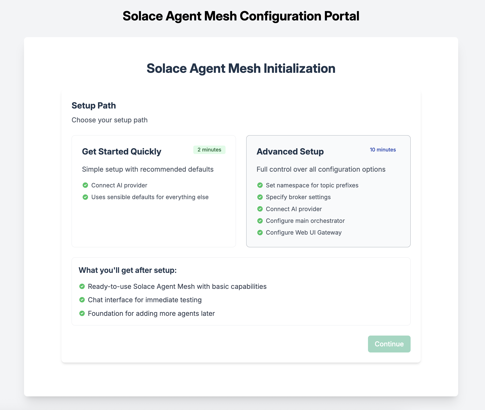
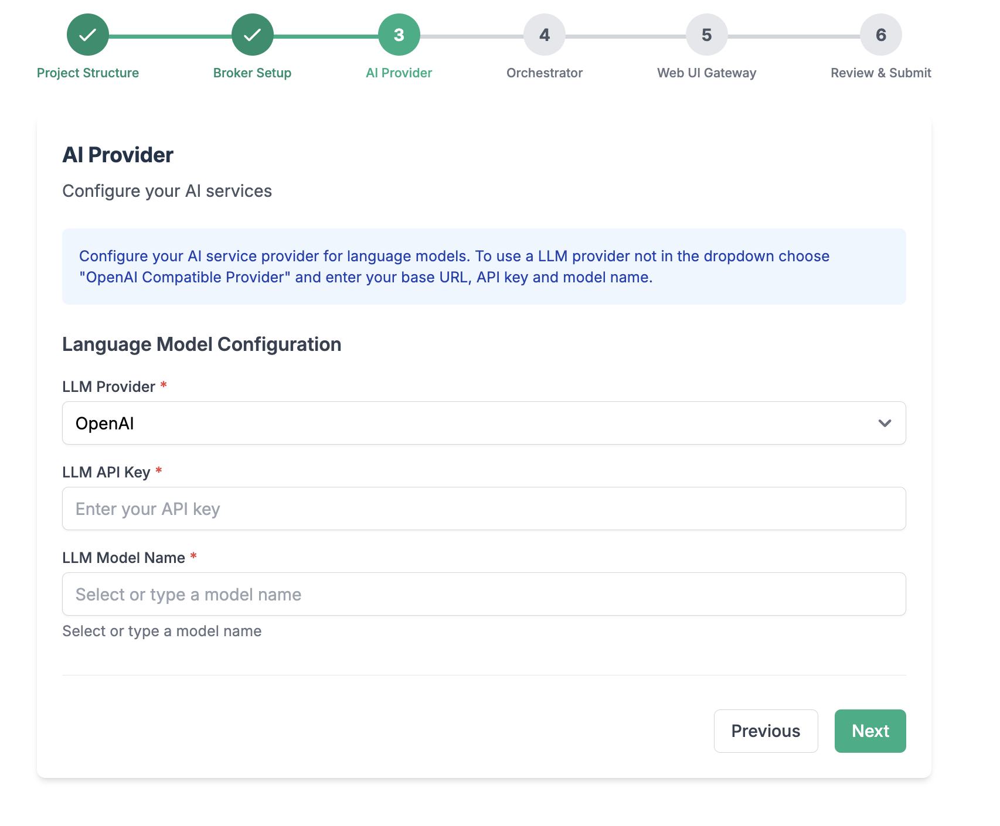

author: Tamimi A
summary:
id: solace-agent-mesh
tags: 
categories: Solace, Agent Mesh, AI
environments: Web
status: Published 
feedback link: https://github.com/SolaceDev/solace-dev-codelabs/blob/master/markdown/solace-agent-mesh

# Getting started with Solace Agent Mesh

## What you'll learn: Overview

In this codelab, you'll gain a foundational understanding of the [Solace Agent Mesh](https://solacelabs.github.io/solace-agent-mesh/docs/documentation/getting-started/introduction/). You'll explore the architecture, key components, and benefits of the Solace Agent Mesh, learning how it enables scalable, event-driven communication between AI agents and services. The introduction covers the evolution of event-driven architectures and highlights real-world use cases where agent mesh technology can be applied.

You'll dive into the details of the [A2A Protocol](https://a2a-protocol.org/latest/), discovering its design principles, core concepts, and how it standardizes agent communication for interoperability and extensibility. You'll also learn about the [Agent Development Kit (ADK)](https://google.github.io/adk-docs/) and how it works with A2A to build and deploy advanced AI agents.

You'll then dive into the [Solace AI Connector](https://github.com/SolaceLabs/solace-ai-connector), a powerful tool designed to seamlessly integrate AI capabilities into your event-driven architecture, enabling you to create efficient pipelines that process events from your event mesh using AI and other components.

By the end of this codelab, you'll be equipped to get started with Solace Agent Mesh, including installation prerequisites, running built-in agents, and connecting external services through MCP. You'll understand how to develop custom agents, leverage plugins and tools, and build multi-agent systems that harness the power of event mesh and standardized protocols for robust, collaborative AI solutions.


Duration: 0:05:00

## Introduction to the Solace Agent Mesh
Duration: 0:15:00

### Problem statement
Building effective agentic systems presents a complex challenge that extends far beyond simply deploying AI models. AI Agents are siloed that operate in isolation, and are unable to effectively communicate or share capabilities across organizational boundaries. By definition and design, Agents are inherently domain-specific, designed to excel in narrow use cases but struggling to collaborate or leverage expertise from other specialized agents, creating fragmented AI ecosystems that fail to realize their collective potential.

To make intelligent decisions and respond to dynamic conditions, agentic systems must rely on event-driven actions that flow into the organization. While solving the core AI challenge represents only 20% of the effort, the remaining 80% involves the much more complex task of connecting AI models to the disparate data sources, legacy systems, APIs, and organizational knowledge that exist across isolated silos—making data accessibility and integration the true bottleneck in delivering practical AI value

> aside negative
> Without a framework like Solace Agent Mesh, connecting AI systems to siloed data sources can be extremely complex, requiring custom integration code and creating maintenance challenges.

### What is Solace Agent Mesh?

Solace Agent Mesh is a comprehensive open-source framework that empowers developers to build sophisticated, distributed AI systems. On a high level, Agent mesh provides developers with the following:

**Core Communication & Protocol**

- **Standardized A2A (Agent-to-Agent) Protocol**: A unified communication standard that enables seamless interaction between AI agents, regardless of their underlying implementation or deployment location
- **Event-Driven Architecture**: Built on the Solace Event Broker for asynchronous, scalable, and resilient agent communication
- **Topic-Based Routing**: Intelligent message routing that enables agents to discover and communicate with each other dynamically
- **Session Management**: Persistent conversation context across multi-turn interactions and complex workflows

**Data Integration & Connectivity**

- **Real-World Data Source Integration**: Pre-built connectors and tools to seamlessly connect AI agents to databases, APIs, file systems, and enterprise applications
- **Universal Gateway Support**: Multiple interface types including REST APIs, WebSockets, webhooks, and direct event mesh integration
- **Enterprise System Compatibility**: Native integration with HR systems (BambooHR, Workday), CRMs (Salesforce), collaboration tools (Confluence, Jira), and identity providers
- **Streaming Data Processing**: Real-time event processing capabilities for handling live data streams and IoT sensor feeds
- **Multi-Protocol Support**: Connect to systems using HTTP, MQTT, AMQP, WebSocket, and custom protocols

**Workflow Orchestration & Management**

- **Complex Workflow Orchestration**: Coordinate sophisticated multi-agent workflows with dependency management and parallel execution
- **Task Decomposition**: Automatically break down complex requests into manageable subtasks for specialized agents
- **Result Aggregation**: Intelligent collection and synthesis of results from multiple agents into cohesive responses
- **Error Handling & Recovery**: Built-in retry logic, circuit breakers, and graceful degradation for robust production deployments
- **Workflow Templates**: Pre-configured workflow patterns for common use cases like data analysis, document processing, and customer service

**Extensibility & Plugin Architecture**

- **Modular Plugin System**: Easily extend functionality through a rich ecosystem of community and commercial plugins
- **Custom Agent Development**: Comprehensive tools and templates for building domain-specific agents with specialized capabilities
- **Gateway Plugins**: Create custom external interfaces for unique integration requirements
- **Service Provider Plugins**: Standardized abstractions for integrating with backend systems and data sources
- **Tool Framework**: Extensible tool system that allows agents to perform actions and interact with external services

**AI Model & Provider Support**

- **Multi-Model Compatibility**: Support for all major AI providers including OpenAI, Anthropic, Google, Azure OpenAI, and local models
- **Model Abstraction**: Switch between different AI models without changing agent logic
- **Provider Failover**: Automatic failover between AI providers for high availability
- **Cost Optimization**: Intelligent model selection based on task complexity and cost considerations
- **Custom Model Integration**: Support for proprietary and fine-tuned models through flexible provider interfaces

**Development Tools & Framework**

- **Comprehensive CLI**: Full-featured command-line interface for project creation, management, and deployment
- **Configuration Management**: YAML-based configuration system with environment variable support and validation
- **Development Environment**: Hot-reload capabilities, debugging tools, and comprehensive logging for efficient development
- **Testing Framework**: Built-in testing utilities for unit testing, integration testing, and end-to-end workflow validation
- **Documentation Generation**: Automatic API documentation and configuration reference generation

**Security & Enterprise Features**

- **Multi-Authentication Support**: JWT, OAuth, API keys, and custom authentication mechanisms
- **Role-Based Access Control**: Fine-grained permissions and authorization for agents and resources
- **Identity Service Integration**: Seamless integration with enterprise identity providers and HR systems
- **Audit Trail**: Comprehensive logging and monitoring for compliance and security auditing
- **Data Encryption**: End-to-end encryption for data in transit and at rest

**Monitoring & Observability**

- **Real-Time Metrics**: Comprehensive performance monitoring with custom dashboards and alerting
- **Distributed Tracing**: End-to-end request tracing across the entire agent mesh
- **Health Monitoring**: Automatic health checks and status reporting for all components
- **Performance Analytics**: Detailed insights into agent performance, resource utilization, and workflow efficiency
- **Log Aggregation**: Centralized logging with correlation IDs for easy debugging and troubleshooting

**Scalability & Performance**

- **Horizontal Scaling**: Easily scale individual agents or entire agent meshes based on demand
- **Load Balancing**: Automatic distribution of tasks across multiple agent instances
- **Resource Management**: Intelligent resource allocation and optimization for optimal performance
- **Caching Strategies**: Built-in caching mechanisms for frequently accessed data and computations
- **Async Processing**: Non-blocking, asynchronous operations for maximum throughput

**Deployment & Operations**

- **Multi-Environment Support**: Seamless deployment across development, staging, and production environments
- **Container-Ready**: Docker and Kubernetes support for modern containerized deployments
- **Cloud-Native**: Native support for AWS, Azure, GCP, and hybrid cloud deployments
- **Infrastructure as Code**: Terraform and CloudFormation templates for automated infrastructure provisioning
- **CI/CD Integration**: Built-in support for continuous integration and deployment pipelines

**Use Case Enablement**

- **Conversational AI**: Build sophisticated chatbots and virtual assistants with multi-turn conversation support
- **Document Processing**: Automated document analysis, extraction, and processing workflows
- **Data Analytics**: Complex data analysis and reporting across multiple data sources
- **Customer Service**: Intelligent customer support systems with escalation and knowledge management
- **Business Process Automation**: End-to-end automation of complex business workflows
- **IoT & Real-Time Processing**: Real-time processing and analysis of IoT sensor data and events

**Developer Experience**

- **Rich Documentation**: Comprehensive guides, tutorials, and API references
- **Community Support**: Active community forums, Discord channels, and regular office hours
- **Example Projects**: Ready-to-run examples and templates for common use cases
- **Migration Tools**: Utilities for migrating existing AI applications to the SAM framework
- **IDE Integration**: Extensions and plugins for popular development environments

This comprehensive feature set makes Solace Agent Mesh the ideal choice for developers looking to build production-ready, scalable AI applications that can seamlessly integrate with existing enterprise infrastructure while providing the flexibility to grow and evolve with changing requirements.
> aside positive
> Solace Agent Mesh follows an event-driven architecture that decouples components, allowing them to be developed, deployed, and scaled independently.

### Key Components and Architecture

Solace Agent Mesh consists of several interconnected components that work together to create a distributed, event-driven ecosystem of collaborative AI agents.

1. **Solace Event Broker**
The central messaging backbone that provides intelligent topic-based routing, fault-tolerant delivery, and horizontal scaling for all Agent-to-Agent (A2A) protocol communications across the entire system.

2. **Gateways**
External interface bridges that translate diverse protocols (HTTP, WebSockets, Slack) into standardized A2A messages while handling authentication, authorization, and session management for outside systems.

3. **Agents**
Specialized AI processing units built on Agent Development Kit that provide domain-specific intelligence, self-register for dynamic discovery, and access comprehensive tool ecosystems for complex task execution.

4. **Solace AI Connector**
The universal runtime environment that hosts and manages the complete lifecycle of all system components while bridging Google ADK capabilities with Solace event infrastructure through YAML-driven configuration.

5. **Agent Development Kit (ADK)**
The core AI framework that powers individual agents with LLM interactions, conversation memory management, artifact processing capabilities, and an extensible tool integration system.

6. **A2A Protocol & Agent Registry**
The standardized communication protocol and service discovery mechanism that enables seamless interaction, dynamic routing, and lifecycle management across all mesh components.

7. **Backend Services & Tools**
The foundational infrastructure layer providing multi-provider LLM access, extensible integrations for custom tools and APIs, persistent data storage, and cloud-native artifact management services.

> aside negative
> Without proper planning and understanding of the component roles, you might create overly complex architectures or miss opportunities to leverage the full power of the distributed agent ecosystem.


This workshop will help you understand how to leverage Solace Agent Mesh for your own AI applications, whether you're an AI enthusiast experimenting with new models or an enterprise developer building production systems.

### Resources

For more information and a deep dive on the Solace Agent Mesh, you can check out this video series 
<video id="_4IdRPBM2y8"></video>

## Use Cases and Applications
Duration: 0:05:00

Solace Agent Mesh is versatile and can be applied to various domains:

1. **Customer Service Augmentation**:
   - Intelligent chatbots that can access multiple backend systems
   - Real-time response generation based on customer data and history
   - Seamless handoff between AI agents and human agents

2. **Supply Chain Optimization**:
   - Monitoring and analyzing events across the supply chain
   - Predictive maintenance and inventory management
   - Automated decision-making based on real-time data

3. **Financial Services**:
   - Fraud detection through pattern analysis across multiple data streams
   - Personalized financial advice based on customer portfolio and market events
   - Regulatory compliance monitoring and reporting

4. **Healthcare**:
   - Patient monitoring and alert generation
   - Clinical decision support by accessing medical records and research data
   - Healthcare workflow optimization

5. **Smart Cities**:
   - Traffic management through real-time data analysis
   - Utility optimization based on usage patterns
   - Emergency response coordination

> aside positive
> By building on Solace Agent Mesh, you can focus on creating domain-specific agent intelligence rather than spending time on integration and communication infrastructure.


## Agent-to-Agent Protocol (A2A)
Duration: 0:07:00

The Agent-to-Agent (A2A) Protocol is a standardized communication protocol designed to enable seamless interaction between AI agents, regardless of their underlying implementation or hosting environment. It provides a common language for agents to discover each other, exchange information, delegate tasks, and collaborate on complex problems. This document explores the A2A protocol in detail, including its design principles, components, and implementation approaches.

> aside positive
> A2A is an open-source protocol, available for any developer or organization to implement. This open nature fosters a rich ecosystem of interoperable agents across different platforms and frameworks.

### Core Concepts

The A2A Protocol is built around several foundational concepts that define its structure and behavior:

#### Protocol Design Principles

A2A was designed with the following principles in mind:

1. **Standardization**: Provide a common interface for agent communication
2. **Interoperability**: Enable agents from different systems to work together
3. **Extensibility**: Support evolving agent capabilities
4. **Asynchronicity**: Handle long-running tasks and parallel operations
5. **Discoverability**: Allow agents to find and understand each other's capabilities
6. **Security**: Implement robust authentication and authorization

These principles ensure that A2A serves as a reliable foundation for building multi-agent systems.

#### Agent Cards

Agent Cards are metadata structures that describe an agent's capabilities, allowing other agents and systems to discover and understand how to interact with them. Key components include:

1. **Name**: A unique identifier for the agent
2. **Description**: A human-readable explanation of the agent's purpose
3. **Capabilities**: The specific tasks the agent can perform
4. **Input/Output Formats**: The data structures the agent expects and produces
5. **Authentication Requirements**: Security information for accessing the agent

Agent Cards are published to discovery endpoints, making them available to other agents in the ecosystem.

> aside negative
> Always validate Agent Cards from external sources, as malicious actors could potentially publish misleading Agent Cards to trick systems into inappropriate delegations.

#### Tasks

Tasks represent the work that agents perform. They include:

1. **Task ID**: A unique identifier for tracking
2. **Input**: The information provided to the agent
3. **Context**: Additional information about the task environment
4. **Artifacts**: Files or binary data associated with the task
5. **Delegation Path**: Information about how the task was routed

Tasks follow a lifecycle from creation through processing to completion or failure.

#### Events

Events represent the state changes and progress updates that occur during task execution:

1. **Status Updates**: Progress information about ongoing tasks
2. **Artifact Updates**: Notifications about new or modified files
3. **Error Events**: Information about failures or issues
4. **Completion Events**: Signals that a task has finished

Events enable asynchronous monitoring of task progress, which is essential for long-running operations.

#### Artifacts

Artifacts are files or binary data that agents can exchange:

1. **Content**: The actual data (text, image, audio, etc.)
2. **Metadata**: Information about the artifact (type, creation time, etc.)
3. **Versioning**: Tracking changes to artifacts over time
4. **References**: Ways to refer to artifacts across the system

Artifacts enable agents to share rich, structured data beyond simple text messages.

> aside positive
> The A2A Protocol continues to evolve with the needs of the agent ecosystem. 

### Where to learn more 

The Agent-to-Agent (A2A) Protocol provides a standardized foundation for building interconnected AI agent systems. By enabling discovery, task delegation, and asynchronous communication, A2A facilitates the creation of sophisticated multi-agent workflows that can tackle complex problems through collaboration.

As the ecosystem of AI agents continues to grow, A2A offers a common language that allows these agents to work together seamlessly, regardless of their underlying implementation or hosting environment. This interoperability is key to unlocking the full potential of agent-based AI systems.

To learn more about A2A, navigate to the [A2A Documentation](https://a2aproject.github.io/A2A/latest/)

## Agent Development Kit (ADK)
Duration: 0:05:00

The Agent Development Kit (ADK) offers developers a comprehensive framework to build, evaluate, and deploy sophisticated AI agents with minimal friction. ADK provides the essential building blocks—from LLM integration and tool execution to session management and artifact handling—that enable both conversational and non-conversational agents capable of complex reasoning, planning, and task execution. 

The A2A Protocol works seamlessly with Agent Development Kit (ADK):

1. **ADK A2A Tools**: Built-in tools for A2A communication
2. **Protocol Translation**: Converting between ADK events and A2A messages
3. **Agent Deployment**: Exposing ADK agents through A2A endpoints
4. **Multi-Agent Systems**: Building networks of ADK agents communicating via A2A

For more information on ADK integration, see the [ADK documentation](https://google.github.io/adk-docs/).

## Getting Started with Solace Agent Mesh
Duration: 0:15:00

### Prerequisites 

- [Optional] [Solace Event Broker](https://solace.com/products/event-broker/software/getting-started/)
- Python 3.11+
- LLM Key

### Installation 

#### Install Python 3.11+

To install a specific version of python, we would recommend using brew
```
brew install python@3.12
```

> aside positive
> Depending on how you install your python version, the following commands will be executed as per the python version installed
> For example, you might need to run `python3.12 [command]` to run python version 3.12 or just simply `python3 [command]`

#### Create and activate a Python virtual environment

MacOS/Linux
```
mkdir solace-agent-mesh-demo
cd solace-agent-mesh-demo
python3 -m venv venv
source venv/bin/activate
```
Windows
```
venv/Scripts/activate
```

> aside positive
> Note: on a Linux machine, depending on the distribution you might need to `apt-get install python3-venvinstead`. Alternatively, you can use `pyenv` to manage multiple versions of python


After activating the virtual environment you can now simply just use `python` which will use whatever python version used to initialize the virtual environment.

#### Install the Solace Agent Mesh Community Edition

```
pip install solace-agent-mesh

```


### [Optional] Solace Broker

You have two options to run and connect to a Solace Broker
1. Software: using a docker image to run it locally
2. Cloud: using self served cloud instance

Follow the steps defined in the [getting started with Solace](https://solace.com/products/event-broker/software/getting-started/) page 

### Initialize Solace Agent Mesh

> aside positive 
> To use the solace agent mesh, you can activate it by typing `solace-agent-mesh` or simply `sam`

In the newly created directory, initialize a new instance of an agent mesh project

```
sam init --gui
```



From here, choose "Advanced Setup" to spin up an instance of the Agent Mesh that uses the Solace Broker as the communication backbone. 


> aside negative
> Note that the simple setup "Getting Started Quickly" spins up Agent Mesh without the Solace Broker and uses in-memory queues instead. This is not meant for production ready development and proof of concept project that require high performance and multiple Agentic workflow interactions

Choose a namespace for your project


Configure connection to the Solace Broker


Configure your LLM



Configure your main orchestrator


> aside positive
> You can keep all the configuration parameters as default

Note: You can explore the other options for configuring the orchestrator agent to see what you have available for fine tuning the behaviour

Configure the WebUI Gateway


Note: Choose any Session Secret Key needed for the WebUI. Keep the remaining configurations as default. 

Review and Initialize the final configuration


### Run Solace Agent Mesh

Now back to your terminal, you will realize the following has been created

```bash
.
├── .env
├── .sam
├── configs
│   ├── agents
│   │   └── main_orchestrator.yaml
│   ├── gateways
│   │   └── webui.yaml
│   ├── logging_config.ini
│   └── shared_config.yaml
├── requirements.txt
└── src
    └── __init__.py
```


Execute the following command to run Solace Agent Mesh

```
sam run
```

Access the WebUI Gateway through `http://127.0.0.1:8000/`


Viola! You are up and running with the Solace Agent Mesh!

Now run the following prompt in the chat window

```
What are your capabilities?
```
and click the "Agent Workflow" icon


Explore the command flow


For the remaining of any prompts you execute to Solace Agent Mesh, you can always click this Agent Workflow icon to get a better understanding on what is happening

## Solace Agent Mesh Components

Duration: 00:25:00

Solace Agent Mesh represents a sophisticated enterprise-grade platform that orchestrates AI agents. At its core, the **Orchestrator** serves as the intelligent brain that decomposes complex tasks and routes them to specialized **Agents** built using the Agent Development Kit (ADK), while **Gateways** created with the Gateway Development Kit (GDK) provide secure multi-protocol entry points. The platform's foundation rests on the **Solace Broker** for enterprise messaging, complemented by essential Services including **LLM integration**, **embeddings management**, **artifact storage**, and **conversation history tracking**. This unified architecture creates a robust, enterprise-ready platform for deploying and managing AI agent ecosystems at scale.

### 1. Orchestrator: The planner

The Orchestrator serves as the central intelligence hub of the Solace Agent Mesh, responsible for task analysis, agent coordination, and workflow management across the entire ecosystem.

> aside positive
> Provides intelligent task decomposition and dynamic agent routing, ensuring optimal resource utilization and enabling complex multi-agent workflows without manual intervention.

**Key Capabilities:**
- **Task Analysis & Decomposition**: Breaks down complex user requests into manageable sub-tasks
- **Agent Discovery & Selection**: Dynamically identifies and selects the most appropriate agents based on capabilities and current availability
- **Workflow Orchestration**: Manages both simple single-agent delegations and complex multi-agent coordination patterns
- **Load Balancing**: Distributes workload across available agent instances to prevent overload
- **Progress Tracking**: Monitors task execution across multiple agents and provides status updates
- **Error Handling**: Implements retry logic, fallback strategies, and graceful failure recovery
- **Authorization Management**: Enforces security policies and access controls for agent interactions
- **Performance Optimization**: Continuously optimizes routing decisions based on historical performance data

### 2. Agents: The Goal Setters

Agents are specialized AI components built using the Agent Development Kit (ADK) that perform specific tasks within the mesh, each designed with focused capabilities and clear operational boundaries.

> aside positive
> The ADK provides standardized development patterns and tools, enabling rapid creation of specialized agents with consistent interfaces and built-in best practices for enterprise deployment.

**Agent Development Kit (ADK) Features:**
- **Standardized Framework**: Consistent development patterns for agent creation and deployment
- **Built-in Integrations**: Pre-configured connections to mesh services and infrastructure
- **Tool Integration**: Seamless integration with external APIs, databases, and enterprise systems
- **State Management**: Built-in session and context management capabilities
- **Error Handling**: Standardized error reporting and recovery mechanisms
- **Testing Framework**: Comprehensive testing tools for agent validation and quality assurance
- **Documentation Tools**: Automatic generation of agent capability descriptions and usage documentation

**Agent Types:**
- **Functional Agents**: Task-specific agents (e.g., WebAgent, MarkitdownAgent, MermaidAgent)
- **Domain Agents**: Knowledge-area specialists (e.g., CustomerDocuments, Employee, JIRA)
- **Integration Agents**: System connectors and data processors
- **Utility Agents**: Support functions like image editing and multi-modal processing

### 3. Gateways: Entry and Exit points

Gateways serve as controlled entry points into the Agent Mesh, built using the Gateway Development Kit (GDK) to provide secure, protocol-aware interfaces for external systems and users.

> aside positive
> The GDK enables rapid development of custom gateways with built-in security, protocol handling, and integration patterns, supporting diverse client requirements and enterprise standards.

**Gateway Development Kit (GDK) Capabilities:**
- **Protocol Abstraction**: Simplified development for multiple communication protocols
- **Security Integration**: Built-in authentication, authorization, and encryption handling
- **Request Transformation**: Automatic conversion between different message formats and protocols
- **Rate Limiting**: Configurable throttling and traffic management capabilities
- **Monitoring Integration**: Built-in observability and performance tracking
- **Configuration Management**: Dynamic configuration updates without service restart
- **Error Handling**: Standardized error responses and fault tolerance mechanisms

**Example Gateways:**
- **REST API Gateway**: HTTP/HTTPS endpoints for web and mobile applications
- **MQTT Gateway**: Lightweight messaging for IoT devices and embedded systems
- **WebSocket Gateway**: Real-time bidirectional communication for interactive applications
- **Teams Gateway**: Microsoft Teams integration for enterprise collaboration
- **Slack Gateway**: Slack integration for developer-focused workflows
- **Custom Protocol Gateways**: Extensible framework for proprietary or specialized protocols

### 4. Services: Modular Components

The Services layer provides essential infrastructure capabilities that support agent operations, data management, and AI model integration across the mesh.

> aside positive
> Centralized services reduce redundancy and ensure consistent behavior across all agents while providing enterprise-grade scalability and reliability for core functions.

#### 5. LLM Service

Provides centralized access to Large Language Model capabilities with intelligent routing and cost optimization.

**Features:**
- **Multi-Provider Support**: Integration with OpenAI, Anthropic, Google, and other LLM providers
- **Intelligent Routing**: Automatic selection of optimal models based on task requirements and cost considerations
- **Cost Management**: Usage tracking, budget controls, and cost optimization strategies
- **Rate Limiting**: Protection against quota exhaustion and cost overruns
- **Model Versioning**: Support for multiple model versions with A/B testing capabilities
- **Caching**: Intelligent response caching to reduce API calls and improve performance

#### 6. Embeddings Service

Manages vector embeddings for semantic search, similarity matching, and knowledge retrieval operations.

**Features:**
- **Vector Database Integration**: Support for Pinecone, Weaviate, ChromaDB, and other vector stores
- **Multi-Model Support**: Integration with various embedding models (OpenAI, Sentence Transformers, etc.)
- **Semantic Search**: High-performance similarity search and retrieval capabilities
- **Index Management**: Automatic index creation, optimization, and maintenance
- **Batch Processing**: Efficient bulk embedding generation and updates
- **Metadata Filtering**: Advanced filtering capabilities for targeted search operations

#### 7. Artifact Management Service

Handles storage, versioning, and lifecycle management of files, documents, and data artifacts across agent interactions.

**Features:**
- **Version Control**: Complete versioning history with diff capabilities and rollback support
- **Metadata Management**: Automatic extraction and indexing of file metadata
- **Cross-Agent Sharing**: Secure artifact sharing between agents with access controls
- **Format Conversion**: Automatic conversion between different file formats
- **Storage Optimization**: Intelligent storage tiering and compression
- **Backup & Recovery**: Automated backup with point-in-time recovery capabilities
- **Integration APIs**: RESTful APIs for external system integration

#### 8. History Management Service

Maintains conversation history, session context, and interaction logs for continuity and analysis.

**Features:**
- **Session Persistence**: Long-term storage of conversation context and user preferences
- **Cross-Session Continuity**: Ability to resume conversations across different sessions and channels
- **Searchable History**: Full-text search across conversation history with contextual relevance
- **Analytics Integration**: Data pipeline for conversation analysis and insights
- **Privacy Controls**: Configurable retention policies and data anonymization
- **Export Capabilities**: Data export for compliance and external analysis
- **Real-time Sync**: Live synchronization across multiple client sessions

### 9. Solace Broker: Central Nervous System

The Solace Broker serves as the foundational messaging infrastructure, providing enterprise-grade event streaming and messaging capabilities that power all communication within the Agent Mesh.

> aside positive
> Enterprise-grade reliability with 99.999% uptime SLA, supporting millions of concurrent connections and guaranteed message delivery with advanced routing and transformation capabilities.


**Core Messaging Capabilities:**
- **Multi-Protocol Support**: Native support for MQTT, AMQP, JMS, REST, WebSocket, and proprietary protocols
- **Message Persistence**: Guaranteed message delivery with configurable persistence levels
- **Dynamic Routing**: Content-based routing with complex topic hierarchies and wildcards
- **Message Transformation**: Real-time message transformation and enrichment capabilities
- **Quality of Service**: Multiple QoS levels from fire-and-forget to exactly-once delivery
- **Message Ordering**: Guaranteed message ordering within defined contexts

**Enterprise Features:**
- **High Availability**: Active-passive and active-active clustering with automatic failover
- **Disaster Recovery**: Cross-datacenter replication with RPO/RTO guarantees
- **Security**: End-to-end encryption, OAuth 2.0, LDAP integration, and fine-grained ACLs
- **Monitoring**: Comprehensive metrics, alerting, and distributed tracing capabilities
- **Scalability**: Horizontal scaling with automatic load balancing and partition management
- **Compliance**: SOC 2, HIPAA, and other regulatory compliance certifications

**Deployment Options:**
- **Software Broker**: Containerized deployment for cloud-native environments with Kubernetes orchestration
- **Appliance Broker**: High-performance hardware appliances for mission-critical workloads
- **Cloud Broker**: Fully managed service with automatic scaling, patching, and maintenance
- **Hybrid Deployment**: Seamless connectivity between on-premises and cloud deployments

**Advanced Capabilities:**
- **Event Mesh**: Global event distribution across multiple brokers and geographic regions
- **Stream Processing**: Built-in stream processing capabilities for real-time analytics
- **Message Replay**: Ability to replay historical messages for recovery and testing
- **Dead Letter Queues**: Sophisticated error handling with configurable retry policies
- **Rate Limiting**: Advanced throttling and flow control mechanisms
- **Message Compression**: Automatic message compression to optimize bandwidth usage

## Built-in Agents
Duration: 0:05:00

As mentioned earlier, Agents are specialized processing units built around ADK. They provide domain-specific knowledge and capabilities and can operate independently and be deployed separately.

In Solace Agent Mesh, Agents are configuration driven vial YAML files and there are multiple ways to develop an agent:
1. Using built-in templates,
1. via MCP, or 
1. custom 

Adding new agent could be done in one of the following ways
1. Using cli command `sam add agent` 
1. Using the GUI


Lets go ahead and add a general purpose agent

In this tutorial we will be using the GUI. To spin up the agent building interface, execute this command from your terminal

```
sam add agent --gui
```


Fill in the required fields as per the screenshot below. 

Use the following prompt in the `Instructions` section

```


```
## A2A Agents
Duration: 0:05:00

## Custom Agents
Duration: 0:05:00

## Next Steps
Duration: 0:05:00

## Takeaways

Duration: 0:07:00

✅ < Fill IN TAKEAWAY 1>   
✅ < Fill IN TAKEAWAY 2>   
✅ < Fill IN TAKEAWAY 3>   


Thanks for participating in this codelab! Let us know what you thought in the [Solace Community Forum](https://solace.community/)! If you found any issues along the way we'd appreciate it if you'd raise them by clicking the Report a mistake button at the bottom left of this codelab.


