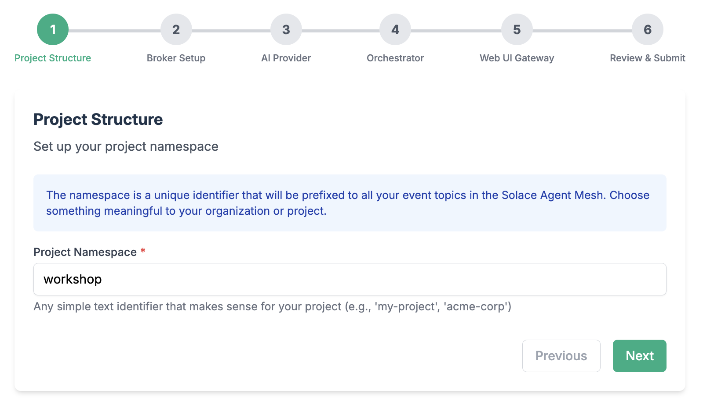

author: Tamimi A
summary:
id: solace-agent-mesh
tags: 
categories: Solace, Agent Mesh, AI
environments: Web
status: Published 
feedback link: https://github.com/SolaceDev/solace-dev-codelabs/blob/master/markdown/solace-agent-mesh

# Getting started with Solace Agent Mesh

## What you'll learn: Overview
Duration: 0:02:00

In this codelab, you'll gain a foundational understanding of the [Solace Agent Mesh](https://solacelabs.github.io/solace-agent-mesh/docs/documentation/getting-started/introduction/). You'll explore the architecture, key components, and benefits of the Solace Agent Mesh, learning how it enables scalable, event-driven communication between AI agents and services. The introduction covers the evolution of event-driven architectures and highlights real-world use cases where agent mesh technology can be applied.

By the end of this codelab, you'll be equipped to get started with Solace Agent Mesh, including learning the building blocks, installation prerequisites, running built-in agents, and connecting different types of agents. You'll understand how to develop custom agents, leverage plugins and tools, and build multi-agent systems that harness the power of event mesh and standardized protocols for robust, collaborative AI solutions.


## Introduction to the Solace Agent Mesh
Duration: 0:07:00

### Problem statement
Building effective agentic systems presents a complex challenge that extends far beyond simply deploying AI models. AI Agents are siloed that operate in isolation, and are unable to effectively communicate or share capabilities across organizational boundaries. **By definition and design, Agents are inherently domain-specific, designed to excel in narrow use cases but struggling to collaborate or leverage expertise from other specialized agents, creating fragmented AI ecosystems that fail to realize their collective potential.**


To make intelligent decisions and respond to dynamic conditions, agentic systems must rely on event-driven actions that flow into the organization. While solving the core AI challenge represents only 20% of the effort, the remaining 80% involves the much more complex task of connecting AI models to the disparate data sources, legacy systems, APIs, and organizational knowledge that exist across isolated silos—making data accessibility and integration the true bottleneck in delivering practical AI value

> aside negative
> Without a framework like Solace Agent Mesh, connecting AI systems to siloed data sources can be extremely complex, requiring custom integration code and pointing to point connections resulting in maintenance challenges.

### What is Solace Agent Mesh?

Solace Agent Mesh is a comprehensive open-source framework that empowers developers to build sophisticated, distributed AI systems. On a high level, Agent mesh provides developers with the following:

1. **Core Communication & Protocol**

   - **Standardized [A2A](https://a2a-protocol.org/dev/specification/) (Agent-to-Agent) Protocol**: A unified communication standard that enables seamless interaction between AI agents, regardless of their underlying implementation or deployment location
   - **Event-Driven Architecture**: Built on the Solace Event Broker for asynchronous, scalable, and resilient agent communication
   - **Topic-Based Routing**: Intelligent message routing that enables agents to discover and communicate with each other dynamically

1. **Data Integration & Connectivity**

   - **Real-World Data Source Integration**: Access to real-time data and integrations from the event mesh allows AI agents access to different business events
   - **Universal Gateway Support**: Multiple interface types including REST APIs, WebSockets, webhooks, and direct event mesh integration
   - **Streaming Data Processing**: Real-time event processing capabilities for handling live data streams and IoT sensor feeds
   - **Multi-Protocol Support**: Connect to systems using HTTP, MQTT, AMQP, WebSocket, and custom protocols

1. **Workflow Orchestration & Management**

   - **Complex Workflow Orchestration**: Coordinate sophisticated multi-agent workflows with dependency management and parallel execution
   - **Task Decomposition**: Automatically break down complex requests into manageable subtasks for specialized agents
   - **Result Aggregation**: Intelligent collection and synthesis of results from multiple agents into cohesive responses

1. **Extensibility & Plugin Architecture**

   - **Modular Plugin System**: Easily extend functionality through a rich ecosystem of [community](https://github.com/solacecommunity/solace-agent-mesh-plugins) and [commercial plugins](https://github.com/SolaceLabs/solace-agent-mesh-core-plugins)
   - **Custom Agent Development**: Comprehensive tools and templates for building domain-specific agents with specialized capabilities
   - **Gateway Plugins**: Create custom external interfaces for unique integration requirements with the Gateway Development Kit (GDK)
   - **Service Provider Plugins**: Standardized abstractions for integrating with backend systems and data sources
   - **Tool Framework**: Extensible tool system that allows agents to perform actions and interact with external services

1. **AI Model & Provider Support**

   - **Multi-Model Compatibility**: Support for all major AI providers including OpenAI, Anthropic, Google, Azure OpenAI, and local models
   - **Model Abstraction**: Switch between different AI models without changing agent logic
   - **Custom Model Integration**: Support for proprietary and fine-tuned models through flexible provider interfaces

1. **Development Tools & Framework**

   - **Comprehensive CLI**: Full-featured command-line interface for project creation, management, and deployment
   - **Configuration Management**: YAML-based configuration system with environment variable support and validation

1. **Security & Enterprise Features**

   - **Multi-Authentication Support**: JWT, OAuth, API keys, and custom authentication mechanisms
   - **Role-Based Access Control**: Fine-grained permissions and authorization for agents and resources
   - **Identity Service Integration**: Integration with enterprise identity providers and HR systems


1. **Scalability & Performance**

   - **Horizontal Scaling**: Easily scale individual agents or entire agent meshes based on demand
   - **Resource Management**: Intelligent resource allocation and optimization for optimal performance
   - **Async Processing**: Non-blocking, asynchronous operations for maximum throughput
   - **Shock Absorbing**: Built on top of an advanced message broker, Solace Event Broker, that leverages queues for guaranteed messaging

1. **Deployment & Operations**

   - **Multi-Environment Support**: Seamless deployment across development, staging, and production environments
   - **Container-Ready**: Docker and Kubernetes support for modern containerized deployments
   - **Cloud-Native**: Native support for AWS, Azure, GCP, and hybrid cloud deployments


> aside positive
> Solace Agent Mesh follows an event-driven architecture that decouples components, allowing them to be developed, deployed, and scaled independently.

This codelab will help you understand how to leverage Solace Agent Mesh for your own AI applications, whether you're an AI enthusiast experimenting with new models or an enterprise developer building production systems.

### Resources

For more information and a deep dive on the Solace Agent Mesh, you can check out this video series 
<video id="_4IdRPBM2y8"></video>

## Key Components and Architecture
Duration: 0:15:00

Solace Agent Mesh represents a sophisticated enterprise-grade platform that orchestrates AI agents. At its core, the **Orchestrator** serves as the intelligent brain that decomposes complex tasks and routes them to specialized **Agents** built using the Agent Development Kit (ADK), while **Gateways** created with the Gateway Development Kit (GDK) provide secure multi-protocol entry points. The platform's foundation rests on the **Solace Broker** for enterprise messaging, complemented by essential Services including **LLM integration**, **embeddings management**, **artifact storage**, and **conversation history tracking**. This unified architecture creates a robust, enterprise-ready platform for deploying and managing AI agent ecosystems at scale.


### Solace Event Broker / Event Mesh
The central messaging backbone that provides intelligent topic-based routing, fault-tolerant delivery, and horizontal scaling for all Agent-to-Agent (A2A) protocol communications across the entire system.

The [Solace Event Broker](https://solace.com/products/event-broker/) serves as the central nervous system of the entire Solace Agent Mesh framework, providing:

- **Intelligent Topic-Based Routing**: Directs messages between components using hierarchical topic structures, enabling sophisticated messaging patterns like request/reply and publish/subscribe
- **Fault-Tolerant Delivery**: Ensures guaranteed message delivery even during component failures or network instability
- **Asynchronous Communication Layer**: Creates a fluid communication foundation where messages flow naturally between all mesh components
- **Horizontal Scaling**: Supports seamless expansion as the mesh grows through distributed broker architecture
- **Real-Time Message Delivery**: Processes messages with ultra-low latency to maintain responsive agent interactions

### Gateways: Entry and Exit Points
External interface bridges that translate diverse protocols (HTTP, WebSocket, Slack RTM, Solace Event Mesh...etc) into standardized A2A messages while handling authentication, authorization, and session management for outside systems.

Important functionalities of gateways include:
- **Protocol Translation**: Convert external protocols (HTTP, WebSockets, Slack RTM) into standardized A2A protocol messages
- **Authentication & Authorization**: Authenticate incoming requests and enforce permission scopes
- **Session Management**: Map external user sessions to A2A task lifecycles
- **Response Handling**: Deliver agent responses back to external clients
- **Interface Variety**: Include REST API gateways, WebUI gateways, Slack gateways, CLI gateways, and custom interface adapters
- **Gateway Development Kit (GDK)**: Provides base classes that abstract common gateway logic

### Orchestrator - The Planner
A specialized agent that coordinates complex workflows. The main functionality of the orchestrator boils down to:
- **Request Decomposition**: Breaks down complex requests into manageable tasks
- **Task Distribution**: Assigns tasks to appropriate specialized agents
- **Workflow Management**: Tracks progress and handles dependencies between tasks
- **Result Aggregation**: Combines outputs from multiple agents into coherent responses
- **Error Handling**: Manages failures and retries or alternative approaches

### Agents - Goal Setters
Specialized AI processing units built on Agent Development Kit that provide domain-specific intelligence, self-register for dynamic discovery, and access comprehensive tool ecosystems for complex task execution.

- **Self-Registration Capabilities**: Agents automatically discover and connect to the mesh network upon initialization, eliminating the need for manual configuration and setup processes. They broadcast their available services, capabilities, and resource requirements to the network, creating a dynamic marketplace of agent functions. The agents maintain real-time service catalogs that update automatically as their capabilities evolve or change through learning and adaptation. They handle all necessary authentication and authorization protocols to ensure secure integration with the mesh infrastructure. The system supports hot-swapping and seamless updates, allowing agents to be modified or replaced without disrupting ongoing network operations.
- **Specialized Domain Functions**: Each agent is designed with narrow AI expertise tailored to specific industries, use cases, or functional domains, ensuring deep competency in their areas of specialization. They implement comprehensive domain-specific knowledge bases and reasoning patterns that reflect expert-level understanding of their target fields. The agents maintain specialized vocabularies, ontologies, and semantic understanding that enable precise communication and task execution within their domains. They provide expert-level performance in targeted functional areas, often exceeding human capabilities in speed and consistency. The specialization framework supports customizable configuration through training and fine-tuning processes.
- **Comprehensive Tool Access**: Agents interface seamlessly with extensive APIs, databases, and external service ecosystems, providing them with broad operational capabilities beyond their core AI functions. They utilize both proprietary and open-source tool libraries for task execution, ensuring flexibility and adaptability across different technological environments. The system supports dynamic tool discovery and integration during runtime, allowing agents to adapt their capabilities based on emerging requirements. Secure tool authentication and access control mechanisms protect sensitive resources while enabling authorized functionality. The agents enable sophisticated tool chaining and workflow orchestration for executing complex, multi-step operations.
- **Stateful Operation Management**: Agents maintain persistent memory and context across extended interaction sessions, enabling them to build upon previous conversations and maintain continuity in complex, long-term engagements. They implement sophisticated conversation history tracking and relationship building capabilities that allow for personalized and contextually appropriate interactions. The system supports continuous learning and adaptation based on interaction patterns, enabling agents to improve their performance and better serve user needs over time. Agents manage state synchronization across distributed instances, ensuring consistency when multiple copies of an agent are operating simultaneously. They provide robust checkpoint and recovery mechanisms that maintain operation continuity even in the face of system failures or interruptions.

### Solace AI Connector
The universal runtime environment that hosts and manages the complete lifecycle of all system components while bridging Google ADK capabilities with Solace event infrastructure through YAML-driven configuration. Main capabilities include:

- **Component Lifecycle Management**: Handles startup, monitoring, and graceful shutdown of all components
- **Configuration Management**: Processes YAML-driven configuration for flexible deployment
- **Bridge Between Technologies**: Connects Google ADK capabilities with Solace event infrastructure
- **Host Environment**: Provides the execution environment for agents and gateways
- **Resource Management**: Controls allocation of computing resources for optimal performance

### Backend Services & Tools
The foundational infrastructure layer providing multi-provider LLM access, extensible integrations for custom tools and APIs, persistent data storage, and cloud-native artifact management services. Solace Agent Mesh is built on a modular foundation with the following tools:

- **Large Language Models**: Multiple LLM providers for varied AI capabilities
- **Databases & Vector Stores**: Persistent data storage and efficient vector search
- **Custom Tool Integration**: Framework for adding specialized functionality
- **API Connectors**: Bridges to external services and systems
- **Artifact Service**: File management through filesystem or cloud storage systems
- **Observability Framework**: Monitoring, logging, and debugging infrastructure


> aside negative
> Without proper planning and understanding of the component roles, you might create overly complex architectures or miss opportunities to leverage the full power of the distributed agent ecosystem.


## Use Cases and Applications
Duration: 0:05:00

Solace Agent Mesh is versatile and can be applied to various domains. Here are some examples on where Agent Mesh could be very helpful

### Intelligent Enterprise Automation
Agent orchestration through Solace Agent mesh excels in customer service systems that intelligently route inquiries to specialized agents based on intent and context, dramatically improving response times and customer satisfaction. The event-driven architecture allows service representatives to handle complex queries by delegating specialized aspects to purpose-built AI agents while maintaining conversation continuity. Organizations deploy these systems to provide consistent, 24/7 customer support that combines human expertise with AI capabilities, reducing resolution times and improving service quality while scaling efficiently to handle peak demand periods without degradation in performance.

### Event-Triggered Analysis
The event-driven foundation of Solace Agent Mesh makes it particularly effective for systems that automatically respond to system events with appropriate data analysis and reporting. These implementations listen for significant events across enterprise systems and trigger specialized analysis workflows based on event type, context, and criticality. Organizations deploy these capabilities for automated incident response, where security events trigger investigation workflows involving multiple specialized agents, or for business operations monitoring, where unusual patterns in operational metrics automatically initiate root cause analysis across multiple connected systems without requiring manual intervention.

### Data Processing Pipelines
The mesh architecture is effective for implementing sophisticated data processing pipelines where specialized agents transform, analyze, and enrich information from multiple sources. In these implementations, data flows seamlessly between agents that each contribute their unique processing capabilities—one agent might extract structured data from documents, another might classify content, while others translate or summarize findings. The event-driven backbone ensures resilient processing even when individual components experience delays or failures, making it ideal for enterprise environments processing mission-critical data that requires multiple specialized AI capabilities applied in sequence or parallel.

### Document Intelligence Systems
Document processing systems that extract text, summarize content, translate materials, and categorize information—with each specialized function handled by purpose-built agents working in orchestration is a big use-case for Solace Agent Mesh. These systems tackle complex document workflows where multiple AI capabilities must be coordinated, such as legal contract analysis, regulatory compliance review, or technical documentation management. The modular design allows organizations to easily enhance specific capabilities (like adding specialized extraction for particular document types) without disrupting the overall workflow, creating increasingly sophisticated document intelligence that evolves with organizational needs.


### Human-AI Collaboration
Solace Agent Mesh provides a robust foundation for implementing approval workflows where agents perform complex tasks while keeping humans in the loop for approvals, clarifications, or expert guidance via web interfaces, Slack, or other communication channels. These implementations balance automation efficiency with human oversight, ideal for scenarios requiring judgment calls or regulatory compliance. Organizations deploy these systems for contract approval workflows, content moderation processes, and complex decision support systems where AI provides recommendations but humans make final determinations, ensuring responsible AI deployment while still gaining significant efficiency improvements.

### Decision Support Systems
Organizations leverage the mesh to provide AI-powered decision support while maintaining human oversight for critical business determinations. These systems aggregate information from multiple sources, analyze options using specialized agents with different expertise domains, and present synthesized recommendations to human decision-makers. The event-driven design facilitates asynchronous information gathering and analysis that mirrors how human teams collaborate on complex decisions. Businesses implement these systems for investment analysis, strategic planning, risk assessment, and other scenarios where multiple factors must be considered from different perspectives to reach optimal conclusions.

### Multi-Agent Research Platform
Researchers and AI development teams utilize Solace Agent Mesh as a production-ready platform for exploring agent collaboration patterns, delegation strategies, and distributed AI problem-solving approaches. The system's comprehensive observability allows teams to analyze interaction patterns between agents, measure performance of different collaboration strategies, and identify bottlenecks or failure modes in complex multi-agent systems. Academic and commercial research groups implement these environments to develop new frameworks for agent cooperation, test emergent behaviors in multi-agent systems, and evaluate different approaches to task decomposition and delegation between specialized AI capabilities.

### Natural Language Data Intelligence
Data analysis teams implement agents that query databases, transform results, and generate visualizations based on natural language requests, making complex data accessible to non-technical users throughout organizations. These implementations translate ambiguous human queries into precise database operations, apply appropriate transformations to the retrieved data, and automatically select visualization approaches that best communicate the insights. Organizations deploy these systems to democratize data access, allowing business users to interact with complex data warehouses through conversational interfaces while maintaining governance controls through the mesh's robust permission system and generating consistent, properly formatted outputs regardless of query complexity.


### Enterprise Integration
Solace Agent Mesh demonstrates significant value in providing AI-powered integration between enterprise systems like Jira, Confluence, and other corporate knowledge bases and workflow tools. These implementations connect previously siloed information systems through intelligent agents that understand cross-system relationships, can translate between different data models, and maintain context across system boundaries. Organizations implement these integrations to reduce manual data transfer between systems, ensure consistency of information across platforms, and provide unified natural language interfaces to multiple backend systems, significantly improving knowledge worker productivity and information accuracy across the enterprise.

> aside positive
> By building on Solace Agent Mesh, you can focus on creating domain-specific agent intelligence rather than spending time on integration and communication infrastructure.

## Getting Started with Solace Agent Mesh
Duration: 0:10:00

### Prerequisites 

- [Optional] [Solace Event Broker](https://solace.com/products/event-broker/software/getting-started/)
- Python 3.11+
- LLM Endpoint
- LLM Key

### Installation 

#### Install Python 3.11+

To install a specific version of python, we would recommend using brew
```
brew install python@3.12
```

> aside positive
> Depending on how you install your python version, the following commands will be executed as per the python version installed
> For example, you might need to run `python3.12 [command]` to run python version 3.12 or just simply `python3 [command]`

#### Create and activate a Python virtual environment

MacOS/Linux
```
mkdir solace-agent-mesh-demo
cd solace-agent-mesh-demo
python3 -m venv venv
source venv/bin/activate
```
Windows
```
venv/Scripts/activate
```

> aside positive
> Note: on a Linux machine, depending on the distribution you might need to `apt-get install python3-venvinstead`. Alternatively, you can use `pyenv` to manage multiple versions of python


After activating the virtual environment you can now simply just use `python` which will use whatever python version used to initialize the virtual environment. To confirm, you can execute the following after activating your virtual environment

```
python --version
```

#### Install the Solace Agent Mesh Community Edition

```
pip install solace-agent-mesh

```

### [Optional] Solace Broker

You have two options to run and connect to a Solace Broker
1. Software: using a docker image to run it locally
2. Cloud: using self served cloud instance

Follow the steps defined in the [getting started with Solace](https://solace.com/products/event-broker/software/getting-started/) page 

### Initialize Solace Agent Mesh

> aside positive 
> To use the solace agent mesh, you can activate it by typing `solace-agent-mesh` or simply `sam`

In the newly created directory, initialize a new instance of an agent mesh project

```
sam init --gui
```


From here, choose "Advanced Setup" to spin up an instance of the Agent Mesh that uses the Solace Broker as the communication backbone. 


> aside negative
> Note that the simple setup "Getting Started Quickly" spins up Agent Mesh without the Solace Broker and uses in-memory queues instead. This is not meant for production ready development and proof of concept project that require high performance and multiple Agentic workflow interactions

Choose a namespace for your project



Configure connection to the Solace Broker


> aside positive
> Note: if you are using a Solace Cloud instance, you can get the connection parameters from the connect tab after spinning up a Broker Service. Use the Solace Web Messaging Protocol

Configure your LLM endpoint, API Key, and Model name


> aside positive
> The model of choice impact the performance of your results and system behaviour. A performative model is recommended for advanced use-cases


Configure your main orchestrator


> aside positive
> Keep all the configuration parameters as default. ou can explore the other options for configuring the orchestrator agent to see what you have available for fine tuning the behaviour


Configure the WebUI Gateway


> aside positive
> Note: Choose any Session Secret Key needed for the WebUI. Keep the remaining configurations as default. 

Review and Initialize the final configuration


🎉 You now have successfully configured your Solace Agent Mesh environment! Now go back to terminal and continue with the next steps to run the Agent Mesh

## Running Solace Solace Agent Mesh
Duration: 0:05:00

After initializing your Solace Agent Mesh instance, you will find out the following files and directories has been created in your project folder

```bash
.
├── .env
├── .sam
├── configs
│   ├── agents
│   │   └── main_orchestrator.yaml
│   ├── gateways
│   │   └── webui.yaml
│   ├── logging_config.ini
│   └── shared_config.yaml
├── requirements.txt
└── src
    └── __init__.py
```


Execute the following command to run Solace Agent Mesh

```
sam run
```

Access the WebUI Gateway through `http://127.0.0.1:8000/`


🚀 Viola! You are up and running with the Solace Agent Mesh!

Now run the following prompt in the chat window

```
What are your capabilities?
```
and click the "Agent Workflow" icon


Explore the command flow


For the remaining of any prompts you execute to Solace Agent Mesh, you can always click this Agent Workflow icon to get a better understanding on what is happening

## Built-in tools
Duration: 0:05:00

As mentioned earlier, Agents are specialized processing units built around ADK. They provide domain-specific knowledge and capabilities and can operate independently and be deployed separately.

In Solace Agent Mesh, Agents are configuration driven vial YAML files and there are multiple ways to develop an agent:
1. Using built-in templates,
1. via MCP, or 
1. custom 

Adding new agent could be done in one of the following ways
1. Using cli command `sam add agent` 
1. Using the GUI


Lets go ahead and add a general purpose agent

In this tutorial we will be using the GUI. To spin up the agent building interface, execute this command from your terminal

```
sam add agent --gui
```


Fill in the required fields as per the screenshot below. 

Use the following prompt in the `Instructions` section

```


```
## Plugins Ecosystem

## Adding Agents
Duration: 0:05:00

### Custom Agents 

### MCP Agents

## Next Steps
Duration: 0:05:00

## Takeaways

Duration: 0:07:00

✅ < Fill IN TAKEAWAY 1>   
✅ < Fill IN TAKEAWAY 2>   
✅ < Fill IN TAKEAWAY 3>   


Thanks for participating in this codelab! Let us know what you thought in the [Solace Community Forum](https://solace.community/)! If you found any issues along the way we'd appreciate it if you'd raise them by clicking the Report a mistake button at the bottom left of this codelab.


