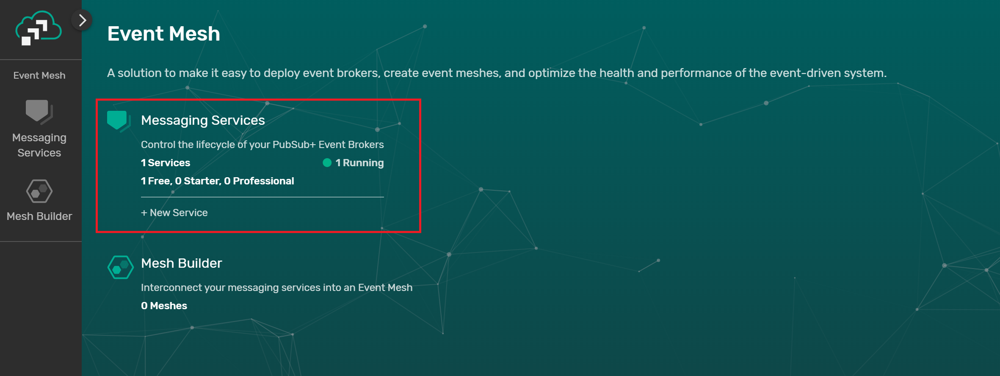
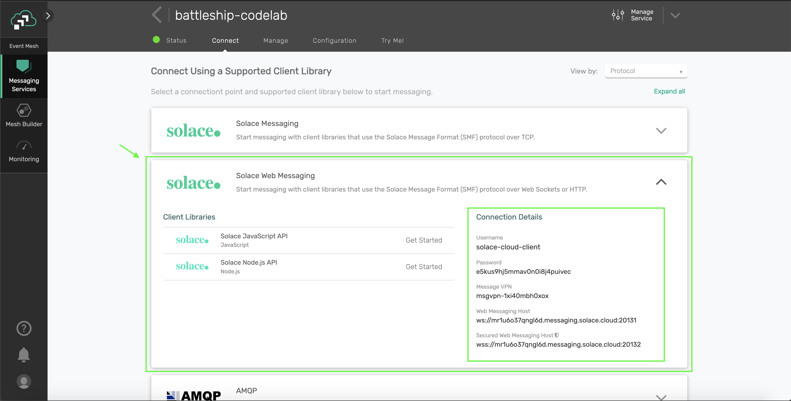
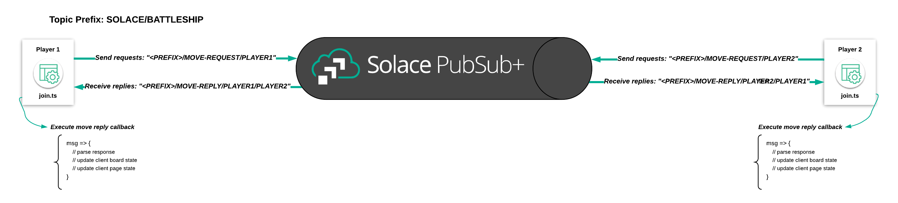
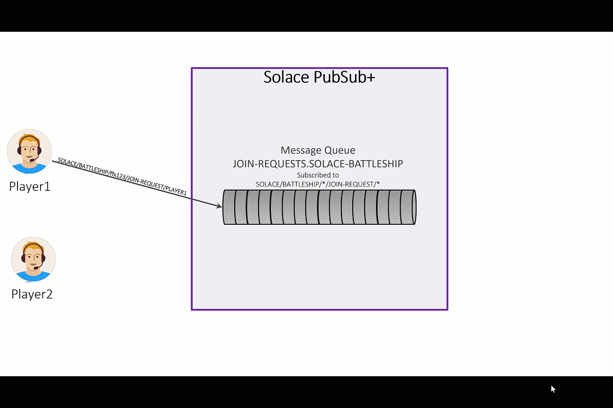
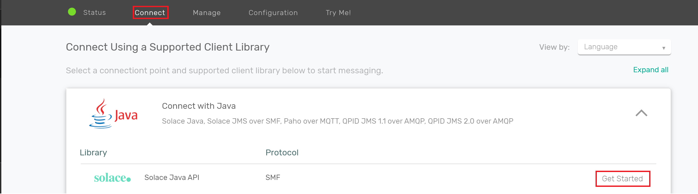
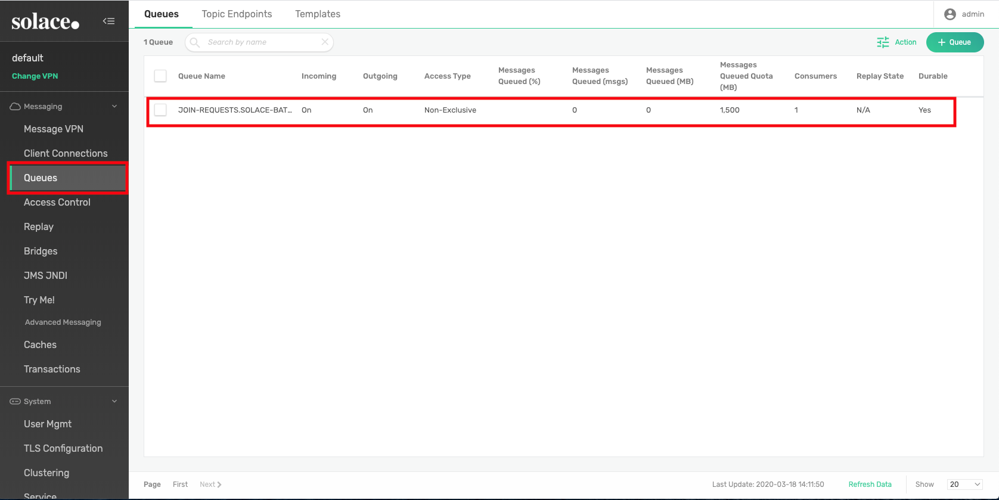
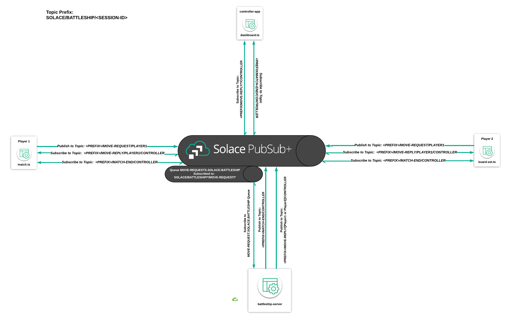

author: Thomas Kunnumpurath, Andrew Roberts
summary: Build Battleship, a popular board game, and learn advanced messaging techniques
id: solace-battleship
tags: workshop,udemy,microservices,
categories: Solace,Java,Spring,Javascript,Aurelia,TypeScript
environments: Web
status: Published
feedback link: http://github.com/solacetraining/solace-battleship/issues
analytics account: UA-3921398-10

#Building Battleship with TypeScript, Java and Solace PubSub+

## Welcome!

Duration: 0:15:00

In this course, you will learn how you can use the Solace PubSub+ platform to create event driven distributed applications. This course will walk you through implementing a multiplayer game of Battleship using modern frameworks and languages so you will walk away with a good idea of how Solace can be used to connect modern applications. Specifically, this course will run you through the creation of a frontend application using TypeScript (with the Aurelia framework) and a backend using Java (with the Spring Cloud Stream framework) - and using Solace PubSub+ to seamlessly communicate between these two components.


By the end of the course, you will have an understanding of different message exchange patterns that can be implemented over Solace PubSub+, the rich polyglot support of the Solace PubSub+ APIs, and the fundamentals of how to architect distributed systems with event driven microservices.

### Course Structure

This course is broken into two components: **Udemy videos** and this **Codelab**.

- **Udemy videos**: focuses on the theory and fundamentals being covered,
- **Codelab**: applies the covered theory and fundamentals to an example application

There will definitely be some overlap between the Udemy videos and this Codelab. The best way to consume this course is to watch the Udemy videos first and then get your hands dirty by typing out the code snippets found in this Codelab in the applicable sections of the example application. If videos aren't your thing, that's okay — you'll be able to complete this Codelab without watching the Udemy video.

Each lesson progressively builds in more functionality to the application.

All the code used in this Codelab can be found in [this GitHub repository](https://github.com/solacetraining/solace-battleship).

The repository is split up into branches that correspond to the lessons. Each lesson has two corresponding branches: one branch that accompanies the copy and paste sections of the Codelab, and one solutions branch. E.g. battleship-lesson-1-connect-and-publish, and battleship-lesson-1-connect-and-publish-solution-solution. If you want to build a version of the game before completing its corresponding lesson, `git checkout` the `battleship-lesson-*-solution` branch of your choosing.

### Udemy

Accessing the Udemy Video links in the codelab requires a few things:

  1. An account on [Udemy](https://www.udemy.com)
  2. Enroll in the [Battleship With PubSub+ Udemy Course](https://www.udemy.com/course/battleship-over-pubsub/?referralCode=BF575AB68D88AEF7289C)
  3. Remain logged into [Udemy](https://www.udemy.com)

### Udemy Videos

- [Welcome](https://www.udemy.com/course/battleship-over-pubsub/learn/lecture/17710366#overview)

- [Event Driven Architecture](https://www.udemy.com/course/battleship-over-pubsub/learn/lecture/17741832#overview)

- [Who is Solace](https://www.udemy.com/course/battleship-over-pubsub/learn/lecture/17741846#overview)

### What We'll Be Building

Our goal is to build a working version of Battleship.

- We'll start by building battleship implemented entirely on the client side
- And then, we'll separate our game logic into a Spring Cloud Stream powered backend application

By the end of this Codelab, you should have a high level understanding of how to build a secure application that handles session based interactions between multiple stateless clients. You'll see how you can quickly build single-purpose microservices to handle events, and how you can manage distributed applications that share a common state.

#### Battleship 101


"Battleship (also Battleships or Sea Battle) is a strategy type guessing game for two players. It is played on ruled grids (paper or board) on which each player's fleet of ships (including battleships) are marked. The locations of the fleets are concealed from the other player. Players alternate turns calling "shots" at the other player's ships, and the objective of the game is to destroy the opposing player's fleet." - [Wiki Page](https://en.wikipedia.org/wiki/Battleship_game)

## Environment Setup

### IDE

This course will cover both front-end development (via Typescript) and back-end development (via Java). While you are free to use any IDE for this, we recommend using [Visual Studio Code](https://code.visualstudio.com/) as it provides strong support for both Java and Typescript with the following plugins installed:

- [aurelia](https://marketplace.visualstudio.com/items?itemName=AureliaEffect.aurelia) - Provides IDE support for Aurelia
- [auto-import](https://marketplace.visualstudio.com/items?itemName=steoates.autoimport) - Provides IDE support for auto-importing typescript libraries
- [Language Support for Java](https://marketplace.visualstudio.com/items?itemName=redhat.java) - Provides IDE support for Java
- [Prettier](https://marketplace.visualstudio.com/items?itemName=esbenp.prettier-vscode) - Code formatter for Javascript

This project is built using Aurelia, Node.js and Java via Spring Cloud Streams. Lessons 1 and 2 can be optionally deployed using ZEIT. This project will connect to a free tier Solace Cloud Messaging Service. Here's how you can get started using each of these technologies:

### Solace Cloud Messaging Service

**(1) Sign up for a free Solace Cloud account**

Navigate to [this link](https://console.solace.cloud/login/new-account) and fill out the required information. No credit card required! If you already have an account, skip right to #2.


**(2) Create a messaging service**

After you create your Solace Cloud account and sign in to the Solace Cloud Console, you'll be routed to the event mesh page.




Click on 'Messaging Services' and all the messaging services associated with your account will show up if you have any already created. To create a new service, click either button as depicted in the image below:


Fill out all the details for your messaging service, and then click "Create" at the bottom of the page.


Your service should be ready to use in a couple seconds!!!

**(3) Take note of the connection details**

If your messaging service was created successfully, you'll be routed to the summary page of your new messaging service. From the service summary page, click on the "Connect" tab so we can take note of the connection details we'll need later.


After you click the "Connect" tab, click the "Solace Web Messaging" box, and then take note of the "Connection Details" section. We'll be using the "Secured Web Messaging Host" URL.



### Node.js

If you're using a Mac, it is recommended to install Node.js using Homebrew with the following command:  
`brew install node`

Otherwise, you can install Node.js in the environment of your choosing following the instructions found [here](https://nodejs.org/en/download/).

### Aurelia

[Aurelia](https://www.aurelia.io) is a JavaScript framework that allows you to build Single Page Applications with relative ease using powerful constructs such as dependency injection, components, a built-in router and a powerful binding engine to name a few.

Once you have Node.js installed, you'll be able to install the Aurelia CLI using the following command:  
`npm install -g aurelia-cli` which you will use throughout the course.

### ZEIT (Optional if you want to deploy the application to the web)

In order to use ZEIT to deploy and host this application, you'll need to register an account for ZEIT by navigating [here](https://zeit.co/login). You'll be able to login using an email or a GitHub or GitLab account. ZEIT's login flow includes instructions for getting the CLI set up.

### Clone the Repo

Assuming you have [git](https://git-scm.com) installed, clone the [solace-battleship](https://github.com/solacetraining/solace-battleship) repo by running :

```
git clone https://github.com/solacetraining/solace-battleship
```

Your working directory for the course will then be

```
cd solace-battleship
```

## Lesson 1 - Connect and Publish

Duration: 0:20:00

### Udemy Videos

- [Battleship - Section 1 Overview](https://www.udemy.com/course/battleship-over-pubsub/learn/lecture/17741870#overview)

- [Battleship Client Side Flow](https://www.udemy.com/course/battleship-over-pubsub/learn/lecture/17742486#overview)

- [Solace Topics](https://www.udemy.com/course/battleship-over-pubsub/learn/lecture/17741892#overview)

### Objectives

- Overview of the `battleship_frontend` code structure
- Connect to a Solace PubSub+ Event Broker provisioned in the Cloud from the Landing Page
- Setup a Topic Convention for messages in the Battleship Application
- Setup a connection to a Solace PubSub+ Event Broker from the Player 1 and Player 2 screens
- Publish a message when a player joins a game

### GitHub Branch

Sync the following branch [battleship-lesson-1-connect-and-publish](https://github.com/solacetraining/solace-battleship/tree/battleship-lesson-1-connect-and-publish) using the following command:

`git checkout battleship-lesson-1-connect-and-publish`

### Code structure

The code for the project is located in the `battleship_frontend` directory. There are two `*-app` folders under `src` within `battleship_frontend`:

1. **contoller-app**: Hosts all code as it relates to controlling the game
2. **player-app**: Hosts all code as it relates to the screens for the player

For the sake of simplicity, you can imagine that these two subfolders contain different components of the application and they will communicate with each other over Solace PubSub+ as shown below:


### Creating a configuration file

You will create a configuration file that holds your Solace Connection details by copying `battleship_frontend/src/common/game-config-template.ts` to `battleship_frontend/src/common/game-config.ts` and fill in the solace\_\* properties in the gameConfig object with the values retrieved from the Solace Cloud console.

Positive
: REMINDER: Before moving on, take a second to double check that your config file is named `game-config.ts`, is properly populated with your connection details, and is located at `battleship_frontend/src/common/game-config.ts`. This is step #1 to establishing connecting to our Solace PubSub+ Event Broker.

Navigate to [Environment Setup](#environment-setup) to get these details from the connect details in your Solace Cloud tab:


```ts
export const gameConfig = {
  solace_hostUrl: "", // Secured Web Messaging host
  solace_vpn: "", // Message VPN
  solace_userName: "", // Username
  solace_password: "", // Password
  allowed_ships: 5,
  gameboard_dimensions: 5
};
```

If you do not have access to Solace Cloud, follow the [instructions](https://solace.com/products/event-broker/software/getting-started/) to get a docker instance of Solace PubSub+ running in a local environment.

In this case, your connectivity details will be as follows:

```ts
export const gameConfig = {
  solace_hostUrl: "ws://localhost:8080",
  solace_vpn: "default", // Message VPN
  solace_userName: "default", // Username
  solace_password: "", // Password
  allowed_ships: 5,
  gameboard_dimensions: 5
};
```

### Connecting to Solace


Navigate to `battleship_frontend/src/contoller-app/landing-page.ts` and add the following below the `// Connect to Solace` comment in the `activate(params, routeConfig){}` function.

```ts
// Connect to Solace
this.solaceClient
  .connect()
  .then(() => {
    this.connectStatus = "Connected to Solace!";
  })
  .catch(error => {
    this.connectStatus = `${error}!`;
  });
```

The code connects to Solace and then changes a message to confirm connectivity to Solace.

### Running the application

From the `solace-battleship` directory, type the following commands:

```
cd battleship_frontend
npm install
au run watch
```

(Note that the `au run watch` command will setup a filewatcher in the current directory and will automatically reload your web-app when you make changes)

Once the commands have succesfully run, navigate to [http://localhost:12345](http://localhost:12345)

You should be greeted with a "Connected to Solace" message on the Landing Page. You'll also see two clickable qr-codes, one for each Player:


Clicking on the two qr-codes will take you to the Join Pages, which players will use to join the page. You will now make changes to the Landing Page to publish a message once a Player has entered his name.

### Setting up a Topic Naming Convention for the Application

An important part of developing an event driven application is to choose and settle on a well defined topic naming convention. Our topic convention will be as follows:

```
<ORG>/<DOMAIN>/<VERB>/<COMPONENT>
```

In the case of a reply message, the topic would be:

```
<ORG>/<DOMAIN>/<VERB>/<TARGET>/<COMPONENT>
```

Examples:

```
SOLACE/BATTLESHIP/MOVE-REQUEST/PLAYER1
SOLACE/BATTLESHIP/GAME-START/CONTROLLER
```

### Setup a Global Topic Prefix

To make it easier to manage our topic namespace in our application, we will be setting up a Topic Prefix that will persist through all components of our application.

Navigate to `battleship_frontend/src/app.ts` and add the following code snippet below the comment in the `constructor(...)` function:

```ts
//The Global Prefix for the Solace Battleship Game
topicHelper.prefix = "SOLACE/BATTLESHIP";
```

### Connect to Solace from the Player Join Page

Navigate to `battleship_frontend/src/player-app/join.ts` and add the following below the `// Connect to Solace` comment in the `active(params, routeConfig){}` function.

```ts
// Connect to Solace
this.solaceClient
  .connect()
  .then(() => {
    this.connectStatus = "Connected to Solace!";
  })
  .catch(error => {
    this.connectStatus = `Failed to connect to Solace because of ${error}!`;
  });
```

### Publishing the Player Join Request


Navigate to `battleship_frontend/src/player-app/join.ts` and enter the following code below the comment `//Publish a join request and change the pageState to waiting if the join request succeeded`:

```ts
//Publish a join request and change the pageState to waiting if the join request succeeded
let topicName: string = `${this.topicHelper.prefix}/JOIN-REQUEST/${this.player.getPlayerNameForTopic()}`;
let replyTopic: string = `${this.topicHelper.prefix}/JOIN-REPLY/${this.player.getPlayerNameForTopic()}/CONTROLLER}`;
this.solaceClient
  .sendRequest(topicName, JSON.stringify(playerJoined), replyTopic)
  .then((msg: any) => {
    let joinResult: JoinResult = JSON.parse(msg.getBinaryAttachment());
    if (joinResult.success) this.pageState = "WAITING";
    else this.pageStatus = "Join Request Failed - Player Already Joined!";
  })
  .catch(error => {
    this.pageStatus = "Join Request Failed!";
  });
```

This will setup a topic string with `SOLACE/BATTLESHIP/JOIN-REQUEST/PLAYER1` or `SOLACE/BATTLESHIP/JOIN-REQUEST/PLAYER2` depending on which player is trying to join. The `solaceClient.sendRequest(...)` method will then send a request with the following payload as an illustration:

```js
 {
   'playerName':'Player1',
   'playerNickname':'TK'
 }
```

As you might have guessed, the request will fail because you have not setup a replier yet.

### Verifying message publication

In order to verify whether the message will actually be published, you can navigate to the 'Try Me' tab in Solace Cloud.


1. Press the 'Connect' Button
2. Enter `SOLACE/BATTLESHIP/JOIN-REQUEST/*` into the 'Subscribe' TextBox and click on Subscribe

Navigate to [http://localhost:12345](http://localhost:12345) after you have made the above changes. Click on a PlayerQR code which will bring you to a screen to enter your name. Once your name is entered, press next and then you should see a message show up in your Solace Cloud console.


### Summary

In this section, you established connectivity to a Solace PubSub+ Event Broker you provisioned in the cloud and you were able to publish a message to it. In the next section, you will now add subscriptions and set up event handler callbacks that transition between pages/states in the game.

Be sure to commit the changes you made to this branch by running `git commit -m "lesson1"`

To see the solutions to this excercise, sync the following branch [battleship-lesson-1-connect-and-publish-solution](https://github.com/solacetraining/solace-battleship/tree/battleship-lesson-1-connect-and-publish-solution) using the following command:

`git checkout battleship-lesson-1-connect-and-publish-solution`

---

## Lesson 2 - Setting Up Subscriptions and Transitioning Page States

Duration: 0:20:00

### Udemy Videos

- [Topic Dispatch](https://www.udemy.com/course/battleship-over-pubsub/learn/lecture/17741902#overview)
- [Request Reply](https://www.udemy.com/course/battleship-over-pubsub/learn/lecture/17741912#overview)

### Objectives

- Setting up a replier to the join request
- Transition between page states
- Unsubscribing to events when leaving pages
- Disconnecting from the Solace broker

### GitHub Branch

Sync the following branch [battleship-lesson-2-subscribe-and-page-transitions](https://github.com/solacetraining/solace-battleship/tree/battleship-lesson-2-subscribe-and-page-transitions/) using the command:

`git checkout battleship-lesson-2-subscribe-and-page-transitions`

Positive
: REMINDER: Make sure the "au run watch" script you setup in the previous section is still running. If not goto battleship_frontend/ and type the following command: `au run watch` .This will auto watch any changes to your files and automatically reload the page at http://localhost:12345 to pick up any changes

### Subscribing the Landing Page to JOIN request events and publishing a GAME START event


Navigate to `battleship_frontend/src/controller-app/landing-page.ts` and add the following code snippet below the `//Listener for join requests` comment in the `activate(params, routeConfig)` function:

```ts
//Listener for join request
this.solaceClient.subscribe(
  `${this.topicHelper.prefix}/JOIN-REQUEST/*`,
  // join event handler callback
  msg => {
    if (msg.getBinaryAttachment()) {
      // parse received event
      let playerJoined: PlayerJoined = JSON.parse(msg.getBinaryAttachment());
      let result = new JoinResult();

      if (!this.gameStart[playerJoined.playerName]) {
        // update client statuses
        this.gameStart[playerJoined.playerName] = playerJoined;
        if (playerJoined.playerName == "Player1") {
          this.player1Status = "Player1 Joined!";
        } else {
          this.player2Status = "Player2 Joined!";
        }

        result.playerName = playerJoined.playerName;
        result.success = true;
        result.message = "Successfully joined the game!";

        this.solaceClient.sendReply(msg, JSON.stringify(result));

        if (this.gameStart.Player1 && this.gameStart.Player2) {
          this.solaceClient.publish(`${this.topicHelper.prefix}/GAME-START/CONTROLLER`, JSON.stringify(this.gameStart));
          this.player1Status = "Waiting for Player1 to set board..";
          this.player2Status = "Waiting for Player2 to set board..";
        }
      }
    }
  }
);
```

The code above will listen for join requests and check if a player has joined already. It will then send a result back to the requestor (Player1 or Player2). After both players join, a message is published on the a `SOLACE/BATTLESHIP/GAME-START/CONTROLLER` topic to start a game.

### Subscribing the Join Pages to GAME START events


Navigate to `battleship_frontend/src/player-app/join.ts`.

We need to add the code that will handle GAME START events that are published from the Landing Page. When a GAME START event is published, the player screens should transition to the Board Set Page. Add the following to the comment below `//Subscribe to the GAME-START event` in the `activate(...)` function:

```ts
//Subscribe to the GAME-START event
this.solaceClient.subscribe(
  `${this.topicHelper.prefix}/GAME-START/CONTROLLER`,
  // game start event handler callback
  msg => {
    let gsObj: GameStart = JSON.parse(msg.getBinaryAttachment());
    this.gameStart.Player1 = gsObj.Player1;
    this.gameStart.Player2 = gsObj.Player2;
    console.log("Game starting...");
    console.log(this.gameStart);
    this.router.navigateToRoute("board-set");
  }
);
```

The code above establishes a subscription to the `SOLACE/BATTLESHIP/GAME-START/CONTROLLER` topic and navigates to the Board Set Page once the event was received.

Once the page has transitioned to the Board Set Page, you also want to unsubscribe from the `SOLACE/BATTLESHIP/GAME-START/CONTROLLER` event so that the page doesn't trigger further callbacks. In the `detached()` function, add the following code:

```ts
//Unsubscribe from the <PREFIX>/GAME-START and <PREFIX>>/JOIN-REPLY/[PLAYER1 or PLAYER2]/[PLAYER1 or PLAYER2]
this.solaceClient.unsubscribe(`${this.topicHelper.prefix}/GAME-START/CONTROLLER`);
this.solaceClient.unsubscribe(`${this.topicHelper.prefix}/JOIN-REPLY/${this.player.getOtherPlayerNameForTopic()}/${this.player.getPlayerNameForTopic()}`);
```

### Publishing BOARD SET events from the Board Set Page


Navigate to `battleship_frontend/src/player-app/board-set.ts`

Once a player has finished setting up their board, it will publish a BOARD SET request. Replace the `beginMatch{}` function with the code below:

```ts
  /**
   * Function to begin a match - it publishes a board-set request message and then sets the done placing variable to true
   */
  beginMatch() {
    if (this.placedShips == 5) {
      let boardsetEvent: BoardSetEvent = new BoardSetEvent();
      boardsetEvent.playerName = this.player.name;
      boardsetEvent.shipsSet = this.placedShips;
      //Send the request to set the board
      this.solaceClient
        .sendRequest(`${this.topicHelper.prefix}/BOARD-SET-REQUEST/${this.player.getPlayerNameForTopic()}`, JSON.stringify(boardsetEvent), `${this.topicHelper.prefix}/BOARD-SET-REPLY/${this.player.getPlayerNameForTopic()}/CONTROLLER`)
        .then((msg: any) => {
          let boardsetResult: BoardSetResult = JSON.parse(msg.getBinaryAttachment());
          if (boardsetResult.success) {
            this.donePlacing = true;
          } else {
            this.error = "Board Set Action Failed! Please try again!";
          }
        })
        .catch(err => {
          this.error = err;
        });
    }
  }
```

In the example above, the publisher publishes a request on the topic `SOLACE/BATTLESHIP/BOARD-SET-REQUEST/PLAYER1` or `SOLACE/BATTLESHIP/BOARD-SET-REQUEST/PLAYER2` depending on who has set the board. It will expect the controller to reply to the topic, `SOLACE/BATTLESHIP/BOARD-SET-REPLY/PLAYER1/CONTROLLER` or `SOLACE/BATTLESHIP/BOARD-SET-REPLY/PLAYER2/CONTROLLER`.

### Subscribing the Landing Page to BOARD SET requests


Navigate to `battleship_frontend/src/controller-app/landing-page.ts` and add the following code to the `activate(params, routeConfig)` function:

```ts
//Listener for board set requests
this.solaceClient.subscribe(
  `${this.topicHelper.prefix}/BOARD-SET-REQUEST/*`,
  // board set event handler
  msg => {
    let boardSetResult: BoardSetResult = new BoardSetResult();
    // parse received message
    let boardSetEvent: BoardSetEvent = JSON.parse(msg.getBinaryAttachment());
    boardSetResult.playerName = boardSetEvent.playerName;
    //Set the response object appropriately
    if (boardSetEvent.playerName == "Player1") {
      if (this.player1Status === "Player1 Board Set!") {
        boardSetResult.message = "Board already set by Player1";
        boardSetResult.success = false;
      } else {
        this.player1Status = "Player1 Board Set!";
        boardSetResult.message = "Board set!";
        boardSetResult.success = true;
        this.matchStartResult.player1Board = boardSetResult;

        this.boardsSet++;
      }
    } else {
      if (this.player2Status === "Player2 Board Set!") {
        boardSetResult.message = "Board already set by Player2";
        boardSetResult.success = false;
      } else {
        this.player2Status = "Player2 Board Set!";
        boardSetResult.message = "Board set!";
        boardSetResult.success = true;
        this.matchStartResult.player2Board = boardSetResult;
        this.boardsSet++;
      }
    }

    //Send the reply
    this.solaceClient.sendReply(msg, JSON.stringify(boardSetResult));

    //If both boards have been set, publish a matchstart event and disconnect the landing page
    if (this.boardsSet == 2) {
      this.solaceClient.publish(`${this.topicHelper.prefix}/MATCH-START/CONTROLLER`, JSON.stringify(this.matchStartResult));
      this.solaceClient.disconnect();
    }
  }
);
```

With the code above, the Landing Page subscribes to the `SOLACE/BATTLESHIP/BOARD-SET-REQUEST/*` topic, send a reply to the player and will change the status state of the Landing Page to indicate each player that joined. In addition, once both players have joined the Landing Page will disconnect from the Solace PubSub+ Broker since it no longer has to process messages.

### Summary


In this lesson you learned how to subscribe to events via topics in the PubSub+ event broker. The callback function for each topic subscription handled game logic and also transitioned between pages. Once a page transitioned, you also unsubscribed from the events.
In addition, you also learned how to disconnect a page from the Solace Broker.

Be sure to commit the changes you made to this branch by running `git commit -m "lesson2"`

To see the completed code for this section, sync the following branch [battleship-lesson-2-subscribe-and-page-transitions-solution](https://github.com/solacetraining/solace-battleship/tree/battleship-lesson-2-subscribe-and-page-transitions-solution/) using the command:

`git checkout battleship-lesson-2-subscribe-and-page-transitions-solution`

## Lesson 3 - Match and Game Over Pages

Duration: 0:15:00

### Objectives

- Subscribe to MOVE-REQUEST and MATCH-START events
- Publish a MOVE-REQUEST event using sendRequest
- Route players to the Game Over Page
- (Optional) Deploy it!

### GitHub Branch

Sync the following branch [battleship-lesson-3-match-and-game-over](https://github.com/solacetraining/solace-battleship/tree/battleship-lesson-3-match-and-game-over/) using the command:

`git checkout battleship-lesson-3-match-and-game-over`

Positive
: REMINDER: Make sure the "au run watch" script you setup in the previous section is still running. If not goto battleship_frontend/ and type the following command: `au run watch` .This will auto watch any changes to your files and automatically reload the page at http://localhost:12345 to pick up any changes
localhost:12345 to pick up any changes

### Subscribe the Board Set Page to Match start events


We need to include a mechanism to start the match once both players have finished setting their boards. This is done by listening to the match start events from the controller page.

Insert the following code snippet under the `//subscribe to the match start event` comment in the `constructor(...)` function under `player_app/board-set.ts`

```ts
//Set the subscription for the match start
this.solaceClient.subscribe(`${this.topicHelper.prefix}/MATCH-START/CONTROLLER`, msg => {
  console.log(msg);
  this.router.navigateToRoute("match");
});
```

### Subscribe the Match Page to MOVE Events

Navigate to [http://locahost:12345](http://localhost:12345), click on both of the two qr-codes, fill out a name for each player, and kick off the match.

Each player will have to select 5 positions of their ships on a 5x5 grid.


After each player has pressed the continue button, each player will transition to a match screen which should look like this:


If you try to make a move, nothing will happen. That's because there is no subscription being registered for the other player's move events. The following code makes a subscription to either `Player1/MOVE` or `Player2/MOVE`, performs some game logic when it receives a message on either of these topics, and then sends a reply telling the other player whether their move resulted in a hit or miss.


Insert this code snippet in the `constructor` method of `src/player-app/match.ts` as instructed by the comments in that file:

```ts
// subscribe to the other player's moves here
this.solaceClient.subscribe(`${this.topicHelper.prefix}/MOVE-REQUEST/${this.player.getOtherPlayerNameForTopic()}`, msg => {
  //De-serialize the received message into a move object
  let move: Move = JSON.parse(msg.getBinaryAttachment());
  //Create a Response object
  let moveResponseEvent: MoveResponseEvent = new MoveResponseEvent();
  //Set the move of the response object to the Move that was requested
  moveResponseEvent.move = move;
  //Set the board of the moveResponse to the current player's public board state
  moveResponseEvent.playerBoard = this.player.publicBoardState;
  //Set the Player of the move response event the name of the player
  moveResponseEvent.player = this.player.name;
  //Check the player's internal board state to find the corresponding
  moveResponseEvent.moveResult = this.player.internalBoardState[move.x][move.y];
  //Send the reply for the move request
  this.solaceClient.sendReply(msg, JSON.stringify(moveResponseEvent));
  //Check the move result and make changes to the score if appropriate and the corresponding icons
  if (this.player.internalBoardState[move.x][move.y] == "ship") {
    this.shipHit(this.player.name);
    this.player.publicBoardState[move.x][move.y] = "hit";
  } else {
    this.player.publicBoardState[move.x][move.y] = "miss";
  }

  this.pageState = this.player.name;
  this.rotateTurnMessage();
});
```

### Publish a Move Request Event

Even after you add in the subscription logic, if you try to make a move nothing will happen. What gives?
Well, we need to **publish** a MOVE event when a player selects a cell from their board.



The following code forms a move object, makes a request, and then processes the response received back from the opposing player. The reply-to topic is specified in the request so that the opposing player's Solace client will know what topic to send the reply on. The `solace-client`'s `sendRequest()` method returns a promise, which resolves if the opposing player sends back a response. So, we define a callback that will be triggered if the promise resolves. This callback is where we'll handle updating the requesting player's board state to reflect whether their move resulted in a "hit" or "miss" in the context of the battleship match.

Insert this code snippet in the `boardSelectEvent(...)` method of `src/player-app/match.ts` as instructed by the comments in that file:

```ts
//Send the Move Request
this.solaceClient
  .sendRequest(
    `${this.topicHelper.prefix}/MOVE-REQUEST/${this.player.getPlayerNameForTopic()}`,
    JSON.stringify(move),
    `${this.topicHelper.prefix}/MOVE-REPLY/${this.player.getPlayerNameForTopic()}/${this.player.getOtherPlayerNameForTopic()}`
  )
  .then((msg: any) => {
    //De-serialize the move response into a moveResponseEvent object
    let moveResponseEvent: MoveResponseEvent = JSON.parse(msg.getBinaryAttachment());
    //Update the current player's enemy board's state
    this.enemyBoard = moveResponseEvent.playerBoard;
    //Update the approrpaite score/icons based on the move response
    if (moveResponseEvent.moveResult == "ship") {
      this.enemyBoard[move.x][move.y] = "hit";
      this.shipHit(this.player.name == "Player1" ? "Player2" : "Player1");
    } else {
      this.enemyBoard[move.x][move.y] = "miss";
    }
    //Change the page state
    this.pageState = this.player.name == "Player1" ? "Player2" : "Player1";
    //Rotate the turn message
    this.rotateTurnMessage();
  })
  .catch(failedMessage => {
    console.log(failedMessage);
    this.turnMessage += " ...TRY AGAIN!";
  });
```

### Game Over!

Now that we've wired up our battleship application's game logic, we need to handle ship hit events in each player's local application. The following code decrements the score for whichever player's ship was hit, and then checks if either player's score has reached zero. If a player's score has reached zero, route to the GAME OVER page!

Insert this code snippet in the `shipHit(...)` method of `src/player-app/match.ts` as instructed by the comments in that file:

```ts
//Ship hit logic
this.scoreMap[shipHitOwner]--;
if (this.scoreMap[shipHitOwner] == 0) {
  if (shipHitOwner == this.player.name) {
    this.router.navigateToRoute("game-over", { msg: "YOU LOSE!" });
  } else {
    this.router.navigateToRoute("game-over", { msg: "YOU WON!" });
  }
}
```

### Deploy the Application

At this point, we have a working version of our Battleship Application! If you'd like to deploy your application so that you can access it on your phone and test out the qr-code functionality, follow these instructions on ZEIT.

#### ZEIT (Optional)

If you would like to see the app deployed on the internet, you can use ZEIT. As noted in the Environment Setup section, you'll need to register an account for ZEIT by navigating [here](https://zeit.co/login). You'll be able to login using an email or a GitHub or GitLab account. ZEIT's login flow includes instructions for getting the CLI set up.

Once you have the CLI set up, it's as simple as calling `now` from the `battleship_frontend` directory.

### Summary


In this lesson you learned how two applications can communicate using a request/reply message exchange pattern. We covered the code required to subscribe to request topics, send requests, send replies, and handle replies. Game logic was handled in the various event handler callback functions.

Be sure to commit the changes you made to this branch by running `git commit -m "lesson3"`

To see the completed code for this section, sync the following branch [battleship-lesson-3-match-and-game-over-solution](https://github.com/solacetraining/solace-battleship/tree/battleship-lesson-3-match-and-game-over-solution/) using the command:

`git checkout battleship-lesson-3-match-and-game-over-solution`

## Lesson 4 - Enabling Multiple Sessions

Duration: 0:10:00

### Objectives

- Append a session id (a random hex-string) to the Global Topic Prefix
- Add this session-id to all event objects in the game

### Github Branch

Sync the following branch [battleship-lesson-4-enabling-multiple-sessions](https://github.com/solacetraining/solace-battleship/tree/battleship-lesson-4-enabling-multiple-sessions) using the following command:

`git checkout battleship-lesson-4-enabling-multiple-sessions`

Positive
: REMINDER: Make sure the "au run watch" script you setup in the previous section is still running. If not goto battleship_frontend/ and type the following command: `au run watch` .This will auto watch any changes to your files and automatically reload the page at http://localhost:12345 to pick up any changes

### Allow for multiple games to happen at once

As you may have noticed, one of the issues with the game in its current form is that only one instance of the game can run at a time.

Using the power of topic-routing, you will see how easy and quick it is to allow for more than one game to go on at a time.

In Lesson-1, you established a global topic prefix in `app.ts` with the following lines of code:

```ts
//The Global Prefix for the Solace Battleship Game
topicHelper.prefix = "SOLACE/BATTLESHIP";
```

As such, every time you published or subscribed - your topic would start with `SOLACE/BATTLESHIP`.

Here is a recap of the flow you built in the previous lesson -


All we have to do to enable the app to handle multiple sessions is to generate a session-id at the start of the game, append a session-id to the end of the topic prefix, and also send the session id to the player-app.

### Enabling multiple sessions in the LandingPage

Since the starting point for each game is the LandingPage, you will generate your session-id there.

Navigate to the `battleship_frontend/src/controller-app/landing-page.ts` and add the following line in the LandingPage class below the comment `//Generate a session-id for the game (a random hex string)`

```ts
//Generate a session-id for the game (a random hex string)
sessionId: string = Math.floor(Math.random() * 16777215).toString(16);
```

Next, you will modify the global topic prefix to include the generated session-id by adding code below the comment `//Append a session-id for the global topic prefix` in the `constructor(...)` function:

```ts
this.topicHelper.prefix = this.topicHelper.prefix + "/" + this.sessionId;
```

### Modifying the Join Page to handle session-ids

Once a session-id has been generated at the LandingPage, it will need to be passed along to the PlayerJoin screens.

Navigate to the `battleship_frontend/src/player-app/join.ts` and add the following line in the `activate(params,routeConfig)` function below the comments as indicated below:

```ts
//set the sessionid for the player
this.player.sessionId = params.sessionId;
//update the topicHelperPrefix with the sessionId
this.topicHelper.prefix = this.topicHelper.prefix + "/" + params.sessionId;
```

Now everytime you navigate to [http://localhost:12345](http://localhost:12345) a new game session will be generated and you can have the application serve multiple sessions at once!


Here is an example of the same flow you built in the previous lesson with a generated session-id :


Note that because of the randomly generated session-id appended to the topic prefix, game sessions will not overlap.

You can optionally also run the `now` command again in the battleship_frontend directory to update your deployment to ZEIT.

### Summary

In this lesson you learned about the flexibility of topic routing. By simply adding a random string to the prefix of your topic and persisting that prefix through the lifecycle of your application, you can now have more than one game going on at once. No major changes were needed for your game logic to deal with this.

Be sure to commit the changes you made to this branch by running `git commit -m "lesson4"`

To see the completed code for this section, sync the following branch [battleship-lesson-4-enabling-multiple-sessions-solution](https://github.com/solacetraining/solace-battleship/tree/battleship-lesson-4-enabling-multiple-sessions-solution) using the command:

`git checkout battleship-lesson-4-enabling-multiple-sessions-solution`

## Lesson 5 - Creating a Battleship Dashboard

Duration: 0:05:00

### Udemy Videos

  * [Adding New Microservices](https://www.udemy.com/course/battleship-over-pubsub/learn/lecture/17742532#overview)

### Objectives

- The benefits of doing request/reply over an event broker
- Create a dashboard widget that listens to replies from both player1 and player2

### Github Branch

Sync the following branch [battleship-lesson-5-building-a-dashboard](https://github.com/solacetraining/solace-battleship/tree/battleship-lesson-5-building-a-dashboard) using the following command:

`git checkout battleship-lesson-5-building-a-dashboard`

Positive
: REMINDER: Make sure the "au run watch" script you setup in the previous section is still running. If not goto battleship_frontend/ and type the following command: `au run watch` .This will auto watch any changes to your files and automatically reload the page at http://localhost:12345 to pick up any changes

### Recap of the Message Exchange Patterns implemented so far

1. Publish-Subscribe: You pushed both the GAME-START and MATCH-START events to the players. The Player screens were subscribed to these events and transitioned states once they received them

2. Request-Reply: The rest of the interactions - PLAYER-JOIN, BOARD-SET, and PLAYER-MOVE - were all implemented using request reply where the Player screens sent a request and waited for the controller-app to respond.

### Why do Request-Reply over an event broker?

Request-Reply is typically associated with HTTP whereby a REST request is made and you wait for a response. You may be wondering about the benefits of pushing a request out over an event broker.

Since both the requests and the replies are published over a well defined topic, it gives you the ability to 'wire-tap' the flows in order to build micro-services. For example, say you wanted to do real-time analytics on the hit rate of moves across all games.

You would simply build a microservice that is allowed to subscribe to the following topics:

```
SOLACE/BATTLESHIP/*/MOVE-REQUEST/*
SOLACE/BATTLESHIP/*/MOVE-REPLY/*/*
```

This additional microservice doesn't interfere with the critical path for the request-reply. It simply acts as a passive listener for all requests and replies.

In the next section, we will quickly see the advantages of building out all our request-replies over Solace but for now you will add an additional dashboard component to the controller-app that wiretaps the replies and creates an animated dashboard of the game action as it happends.

### Subscribing to the MOVE-REPLIES event from the dashboard


Navigate to the `battleship_frontend\controller-app\dashboard.ts` and add the following subscription to the `constructor(...)` function:

```ts
//Subscribe to all MOVE-REPLYs from Player1 and Player2 to propogate in the dashboard
this.solaceClient.subscribe(`${this.topicHelper.prefix}/MOVE-REPLY/*/*`, msg => {
  let moveResponseEvent: MoveResponseEvent = JSON.parse(msg.getBinaryAttachment());
  this.moveResultMap[moveResponseEvent.player] = moveResponseEvent;
});
```

The code above will listen to the move reply messages for both players and kick off an animation based on the player activity. Once you begin the match, your dashboard will transition into the following screen:


And your game activity will be reflected in real time!

You can optionally also run the `now` command again in the battleship_frontend directory to update your deployment to ZEIT.

### Summary

[Udemy Summary Video](https://www.udemy.com/course/battleship-over-pubsub/learn/lecture/17741924#overview)

In this lesson you learned about the benefits of doing a request-reply interaction over Solace. You were able to add an additional widget that listend to all player reply events without interrupting your critical path. You essentially are able to spin up additional microservices that tap events in realtime 'for free'.

Be sure to commit the changes you made to this branch by running `git commit -m "lesson5"`

To see the completed code for this section, sync the following branch [battleship-lesson-5-building-a-dashboard-solution](https://github.com/solacetraining/solace-battleship/tree/battleship-lesson-5-building-a-dashboard-solution) using the command:

`git checkout battleship-lesson-5-building-a-dashboard-solution`

## Lesson 6 - Creating a Spring Cloud Stream server skeleton for the battleship backend

Duration: 0:20:00

### Udemy Videos

- [Battleship: Adding Serverside](https://www.udemy.com/course/battleship-over-pubsub/learn/lecture/17741942#overview)
- [Topic to Queue Mappings](https://www.udemy.com/course/battleship-over-pubsub/learn/lecture/17741950#overview)
- [Overview of Spring Cloud Stream](https://www.udemy.com/course/battleship-over-pubsub/learn/lecture/17741960#overview)

### Objectives

- Understand why it is important to move state management to serverside
- Understand topic-to-queue mappings in Solace PubSub+
- Understand how Spring Cloud Stream provides you with a powerful and simple abstractions to easily implement event driven applications over Solace PubSub+
- Setup a basic Spring Cloud Stream skeleton for the Battleship

### Github Branch

Sync the following branch [battleship-lesson-6-create-a-spring-cloud-stream-skeleton](https://github.com/solacetraining/solace-battleship/tree/battleship-lesson-6-create-a-spring-cloud-stream-skeleton) using the following command:

`git checkout battleship-lesson-6-create-a-spring-cloud-stream-skeleton`

### Why you should always manage state on the server-side

In the battleship application you've built so far, the player's choose the position of their ships on the board and the positions (or the user's "state") are then stored on the client (essentially within the user's browser). A major issue when storing application state on the client side is that it is subject to change.

In this application, the reprecussions of a user allowing to change his state would mean that a user can potentially switch around the positions of his ships mid-match.. just as a player in the real life battleship game can reseat his ships in the middle of a match.

In a more serious application, just imagine if your bank's website allowed the client-side to control the amount of your checking account from your browser. You could edit the state variable of your account value and you could become a billionaire overnight (atleast until the bank realizes their error).

The obvious solution for state management is to have a server-side process store the state and validate every change made to state before allowing it to propogate through.

In this section, you will begin to implement a Java Serverside process that is able to seamlessly and securely communicate with your web-application through Solace PubSub+ without significantly changing the code you've already built. The battleship-server will store state for every game and the requests will be made against the server as opposed to the clients.

At a high-level, the end state of your application flow will be as follows:


### Topic-to-Queue Mappings in Solace PubSub+

Up until now, you implemented the publish-subscribe model where you published a message to a well defined topic and had the subscribe subscribe to the same topic.

An additional pattern that Solace PubSub+ supports is the ability to publish and subscribe to Message Queues. In addition, Solace PubSub+ allows you to set Topic Subscriptions on message queues themselves.

The animation below shows how topic-to-queue mappings provides the Battleship Server with a mechanism to preserve all Join Requests in order and process the messages once at a time from Solace PubSub+ :



The following steps are described with the animation above:

1. A Queue is setup in Solace PubSub+ with the subscription `SOLACE/BATTLESHIP/*/JOIN-REQUEST/*`. This will attract all JOIN-REQUEST messages from all sessions and both Players to the Queue
2. Player1 publishes a JOIN-REQUEST message on the topic `SOLACE/BATTLESHIP/ffx123/JOIN-REQUEST/PLAYER1`. It is sent to Solace PubSub+ and stored in a message queue
3. Player2 similarly publishes another JOIN-REQUEST message to the topic `SOLACE/BATTLESHIP/ffx123/JOIN-REQUEST/PLAYER2` and is stored the same way
4. The Battleship-Server process makes itself available for processing messages from the queue and consumes the join request from Player1 and sends a response to the join request to a topic which is listened to by Player1
5. After the reply, has succesfully been sent - the server picks up the next message from the queue which is the join request from Player2 and responds the same way

### How Spring Cloud Stream simplifies development with Solace PubSub+

"[Spring Cloud Stream](https://spring.io/projects/spring-cloud-stream) is a framework for building highly scalable event-driven microservices connected with shared messaging systems.

The framework provides a flexible programming model built on already established and familiar Spring idioms and best practices, including support for persistent pub/sub semantics, consumer groups, and stateful partitions."

With the Solace PubSub+ Binder for Spring Cloud Stream - Queues and Topic-To-Queue mappings - are automatically setup for you.

This is primarily accomplished through an `application.yml` file which holds connectivity and configuration information.

The sample extract below shows you how the entries in the `application.yml` file ultimately maps to queues and queue subscriptions in Solace PubSub+:


### Adding connectivity details to the application.properties file

Since you are working with a java application, you will have to enter in the connectivity details into a property file. This can be retrieved by navigating to the `Connect` tab in Solace Cloud and clicking on the `Get Started` button in the Java SMF API.



From there, retrieve the credentials from the `Connection Details`:


Next copy, `battleship_backend/src/main/resources/application-template.properties` to `battleship_backend/src/main/resources/application.properties` and fill in the details in application.properties file as follows:

```
spring.cloud.stream.binders.solace_cloud.environment.solace.java.host= //SMF Uri
spring.cloud.stream.binders.solace_cloud.environment.solace.java.msgVpn= //Message VPN
spring.cloud.stream.binders.solace_cloud.environment.solace.java.clientUsername= //Username
spring.cloud.stream.binders.solace_cloud.environment.solace.java.clientPassword= //Password

```

If you do not have access to Solace Cloud, follow the [instructions](https://solace.com/products/event-broker/software/getting-started/) to get a docker instance of Solace PubSub+ running in a local environment.

In this case, your connectivity details will be as follows:

```
spring.cloud.stream.binders.solace_cloud.environment.solace.java.host=localhost:55555
spring.cloud.stream.binders.solace_cloud.environment.solace.java.msgVpn=default //Message VPN
spring.cloud.stream.binders.solace_cloud.environment.solace.java.clientUsername=default //Username
spring.cloud.stream.binders.solace_cloud.environment.solace.java.clientPassword= //Password
```

Once you entered in the credentials, navigate to `battleship_backend` and type the following command:
`.\mvnw.cmd spring-boot:run` if under windows, otherwise run `chmod +x mvnw && ./mvnw spring-boot:run`.

This will kickoff a process to download all dependent libraries, run unit tests, launch a Spring Boot Server, and create associated Queues, and also create a filewatcher to detect any changes upon succesful compilation.

The console outputted log should contain the following snippet if the properties were created succesfully:

```
INFO 8296 --- [  restartedMain] c.s.j.protocol.impl.TcpClientChannel     : Connecting to host 'orig=tcp://<HOST>:<PORT>, scheme=tcp://, host=<HOST>, port=<PORT>' (host 1 of 1, smfclient 6, attempt 1 of 3, this_host_attempt: 1 of 1)
INFO 8296 --- [  restartedMain] c.s.j.protocol.impl.TcpClientChannel     : Connected to host 'orig=tcp://<HOST>:<PORT>, scheme=tcp://, host=localhost, port=<PORT>' (smfclient 6)
INFO 8296 --- [  restartedMain] c.s.s.c.s.b.p.SolaceQueueProvisioner     : Creating durable queue JOIN-REQUESTS.SOLACE-BATTLESHIP for consumer group SOLACE-BATTLESHIP
```

Note that you can also see the newly added queue under the `Queues` section in your PubSub+ Manager




### Summary

In this lesson you learned about considerations to be made when building distributed systems, how topic-to-queue mappings are a fundamental construct that aids with distributed systems development, how Spring Cloud Stream enables developers to rapidly create server side applications, and finally you started a local instance of a Spring Cloud Stream server.

Be sure to commit the changes you made to this branch by running `git commit -m "lesson6"`

## Lesson 7 - Implementing a Join Request Handler in the Spring Cloud Stream server

Duration: 0:10:00

### Objectives

- Add a topic subscription to the Join-Request Queue via Spring Cloud Stream
- Implement the join request logic in the Spring Cloud Stream server
- Make changes to the front-end controller-app to subscribe to the replies to the join request in order to display game state

### Github Branch

Sync the following branch [battleship-lesson-7-implement-a-join-request-handler-in-scs](https://github.com/solacetraining/solace-battleship/tree/battleship-lesson-7-implement-a-join-request-handler-in-scs) using the following command:

`git checkout battleship-lesson-7-implement-a-join-request-handler-in-scs`

Positive
: REMINDER: Make sure the "au run watch" script you setup in the previous sections is still running. If not goto battleship_frontend/ and type the following command: `au run watch` .This will auto watch any changes to your files and automatically reload the page at http://localhost:12345 to pick up any changes

### Add the join request topic subscription to the JOIN-REQUEST queue

In the previous section, you established connectivity to your local Solace PubSub+ broker and saw a queue was automatically created. You now will enable a subscription to your queue so that it attracts join requests from Player1 and Player2.

This is accomplished by navigating to `battleship_backend\src\main\resources\application.yml` and remove the # from the `queueAdditonalSubscriptions` property so that the section below the comment looks like the following:

```yml
#Subscription for the join request queue
queueAdditionalSubscriptions: SOLACE/BATTLESHIP/*/JOIN-REQUEST/*
```

Negative
: Ensure that you just remove the # and not affect the tabs/whitespace precluding the # as the YML file depends on whitespacing in order for it to be parsed properly.

Now all join requests for all sessions (indicated by the first '_') and Player 1 or Player 2 (indicated by the second '_') will end up in the JOIN-REQUEST queue.

### Add the join request handling logic

Navigate to `battleship_backend\src\main\java\com\solace\battleship\flows\JoinProcessor.java` and add a function to handle JoinRequests in the JoinProcessor class:

```java
// We define an INPUT to receive data from and dynamically specify the reply to destination depending on the header and state of the game engine
@StreamListener(JoinRequestBinding.INPUT)
public void handle(PlayerJoined joinRequest, @Header("reply-to") String replyTo) {
    // Pass the request to the game engine to join the game
    JoinResult result = gameEngine.requestToJoinGame(joinRequest);
    // Send the result of the JoinRequest to the replyTo destination retrieved from
    // the message header
    resolver.resolveDestination(replyTo).send(message(result));

    // If the result was a succesful join and if both player's have joined, then
    // publish a game start message
    if (result.isSuccess() && gameEngine.canGameStart(joinRequest.getSessionId())) {
        resolver.resolveDestination("SOLACE/BATTLESHIP/" + joinRequest.getSessionId() + "/GAME-START/CONTROLLER")
                .send(message(gameEngine.getGameStartAndStartGame(joinRequest.getSessionId())));
    }

}
```

### Modify the landing page to subscribe to the JoinReplies and Game Start events

In the previous iteration of the application, the landing page would keep state of which player has joined the game and respond accordingly. Since the landing page no longer keeps state, in addition to the player screens, the landing page will need to subscribe to the join reply topic and also the game start topic so status could be reflected appropriately.

This can be accomplished by navigating to `battleship_frontend/src/controller_app/landing-page.ts` and adding the following in the `activate(...)` function:

```typescript
//Listener for join replies from the battleship-server
this.solaceClient.subscribe(
  `${this.topicHelper.prefix}/JOIN-REPLY/*/CONTROLLER`,
  // join event handler callback
  msg => {
    if (msg.getBinaryAttachment()) {
      // parse received event
      let joinResult: JoinResult = JSON.parse(msg.getBinaryAttachment());
      if (joinResult.success) {
        // update client statuses
        if (joinResult.playerName == "player1") {
          this.player1Status = "Player1 Joined!";
        } else {
          this.player2Status = "Player2 Joined!";
        }
      }
    }
  }
);

//Listening for a GAME-START event from the battleship-server
this.solaceClient.subscribe(
  `${this.topicHelper.prefix}/GAME-START/CONTROLLER`,
  // Game-Start event
  msg => {
    if (msg.getBinaryAttachment()) {
      let gsObj: GameStart = JSON.parse(msg.getBinaryAttachment());
      this.gameStart.player1 = gsObj.player1;
      this.gameStart.player2 = gsObj.player2;
      this.player1Status = "Waiting for Player1 to set the board";
      this.player2Status = "Waiting for Player2 to set the board";
    }
  }
);
```

### Running the application

Run either `mvnw.cmd spring-boot:run` if on Windows or `chmod +x mvnw && ./mvnw spring-boot:run` from the battleship_backend folder.

Now navigate to [http://localhost:12345](http://localhost:12345), the game should operate exactly as before but now the Join Requests are being handled by the Battleship Spring Cloud Stream server.

### Summary


In this lesson you learned about adding a topic subscription to a queue in Spring Cloud Stream, how easy it was to create a join request message handler using the framework, and finally you made changes to the front end in order to subscribe to the join replys.

Now, the client-side controller app is no longer responsible for responding to join requests but simply listens to join-replys originating from the battleship-server.

Be sure to commit the changes you made to this branch by running `git commit -m "lesson7"`

To see the completed code for this section, sync the following branch [battleship-lesson-7-implement-a-join-request-handler-in-scs-solution](https://github.com/solacetraining/solace-battleship/tree/battleship-lesson-7-implement-a-join-request-handler-in-scs-solution) using the command:

`git checkout battleship-lesson-7-implement-a-join-request-handler-in-scs-solution`

## Lesson 8 - Implementing a Board Set Handler in the Spring Cloud Stream server

### Objectives

- Add a topic subscription to the Board Set Request Queue via Spring Cloud Stream
- Implement the Board Set Request logic in the Spring Cloud Stream server
- Make changes to the frontend controller-app to subscribe to the replies to the Board Set Requests in order to display game state

### Github Branch

Sync the following branch [battleship-lesson-8-implement-a-board-set-request-handler-in-scs](https://github.com/solacetraining/solace-battleship/tree/battleship-lesson-8-implement-a-board-set-request-handler-in-scs) using the following command:

`git checkout battleship-lesson-8-implement-a-board-set-request-handler-in-scs`

Positive
: REMINDER: Make sure the "au run watch" script you setup in the previous sections is still running. If not goto battleship_frontend/ and type the following command: `au run watch` .This will auto watch any changes to your files and automatically reload the page at http://localhost:12345 to pick up any changes

### Add the Board Set Request topic subscription to the BOARD-SET-REQUEST queue

In the previous section, you established connectivity to your local Solace PubSub+ broker and saw a queue was automatically created. You now will enable a subscription to your queue so that it attracts Board Set Requests from Player1 and Player2.

This is accomplished by navigating to `battleship_backend\src\main\resources\application.yml` and uncommenting the following comment:

```yml
#Subscription for the board set request queue
queueAdditionalSubscriptions: SOLACE/BATTLESHIP/*/BOARD-SET-REQUEST/*
```

Negative
: Ensure that you just remove the # and not affect the tabs/whitespace precluding the # as the YML file depends on whitespacing in order for it to be parsed properly.

Now all Board Set Requests will end up in the BOARD-SET-REQUEST queue.

### Implement the Board Set Request logic in the Spring Cloud Stream server

Navigate to `battleship_backend\src\main\java\com\solace\battleship\flows\BoardSetRequestProcessor.java` and add a function to handle BoardSetRequests in the BoardSetRequestProcessor class:

```java
  // We define an INPUT to receive data from and dynamically specify the reply to
  // destination depending on the header and state of the game enginer
  @StreamListener(BoardSetRequestBinding.INPUT)
  public void handle(BoardSetRequest boardSetRequest, @Header("reply-to") String replyTo) {
    // Pass the request to the game engine set the board
    BoardSetResult result = gameEngine.requestToSetBoard(boardSetRequest);
    // Send the result of the BoardSetRequest to the replyTo destination retrieved from the message header
    resolver.resolveDestination(replyTo).send(message(result));
    // If the result was a succesful board set and if both player's have joined, then publish a Match Start Message
    if (result.isSuccess() && gameEngine.canMatchStart(boardSetRequest.getSessionId())) {
      resolver.resolveDestination("SOLACE/BATTLESHIP/" + boardSetRequest.getSessionId() + "/MATCH-START/CONTROLLER")
          .send(message(gameEngine.getMatchStartAndStartMatch(boardSetRequest.getSessionId())));
    }

  }
```

### Modify the landing page to subscribe to the BoardSetReplies and MatchStart Events

In the previous iteration of the application, the landing page would keep state of which player has set their board and respond with board set replies. The landing page would also broadcast a match start event when both players set their boards. Now that we have committed to lifting our game state to a backend server, for good reason, the landing page and board set pages will need to subscribe to the board set reply and match start topics so that game status can be reflected appropriately.

This can be accomplished by navigating to `battleship_frontend/src/controller_app/landing-page.ts` and adding the following in the `activate(...)` function:

```typescript
//Listening for a BOARD-SET-REPLY events from the battleship-server
this.solaceClient.subscribe(
  `${this.topicHelper.prefix}/BOARD-SET-REPLY/*/CONTROLLER`,
  // Game-Start event
  msg => {
    if (msg.getBinaryAttachment()) {
      let boardSetResult: BoardSetResult = JSON.parse(msg.getBinaryAttachment());
      if (boardSetResult.playerName == "player1") {
        this.player1Status = "Player1 Board Set!";
      }
    } else {
      this.player2Status = "Player2 Board Set!";
    }
  }
);

//Listening for a MATCH-START event from the battleship-server
this.solaceClient.subscribe(`${this.topicHelper.prefix}/MATCH-START/CONTROLLER`, msg => {
  this.router.navigateToRoute("dashboard");
});
```

### Running the application

Run either `mvnw.cmd spring-boot:run` if on Windows or `chmod +x mvnw && ./mvnw spring-boot:run` from the battleship_backend folder.

Now navigate to [http://localhost:12345](http://localhost:12345), the game should operate exactly as before but now the Join Requests are being handled by the Battleship Spring Cloud Stream server.

### Summary


In this lesson, you implemented another message handler in our Spring Cloud Stream application using the same pattern we used in lesson 7. Spring Cloud Stream does a lot of the heavy lifting in terms of session management, connect logic, etc. when it comes to Solace. As you saw, all you had to do was implement your business logic and modify the `application.yml` configuration file to make sure the correct messages are being attracted and queued.

Additionally, we modified the client-side controller app further so that it is no longer responsible for responding to board set requests. Instead of responding to the board set requests, all the client-side controller app has to do is listen for board set reponses.

Now, the only state left on the client side application is the match flow. In the next lesson we'll finish up lifting this state into our SCS application.

Be sure to commit the changes you made to this branch by running `git commit -m "lesson8"`

To see the completed code for this section, sync the following branch [battleship-lesson-8-implement-a-board-set-request-handler-in-scs-solution](https://github.com/solacetraining/solace-battleship/tree/battleship-lesson-8-implement-a-board-set-request-handler-in-scs-solution) using the command:

`git checkout battleship-lesson-8-implement-a-board-set-request-handler-in-scs-solution`

## Lesson 9 - Implementing a Move Request Handler in the Spring Cloud Stream server

### Objectives

- Add a topic subscription to the Move Request Queue via Spring Cloud Stream
- Implement the Move Request logic in the Spring Cloud Stream server
- Make changes to the frontend controller-app to subscribe to the replies to the Move Requests in order to display game state

### Github Branch

Sync the following branch [battleship-lesson-9-implement-match-logic-in-scs](https://github.com/solacetraining/solace-battleship/tree/battleship-lesson-9-implement-match-logic-in-scs) using the following command:

`git checkout battleship-lesson-9-implement-match-logic-in-scs`

Positive
: REMINDER: Make sure the "au run watch" script you setup in the previous sections is still running. If not goto battleship_frontend/ and type the following command: `au run watch` .This will auto watch any changes to your files and automatically reload the page at http://localhost:12345 to pick up any changes

### Add the Move Request topic subscription to the MOVE-REQUEST queue

In the previous section, you established connectivity to your local Solace PubSub+ broker and saw a queue was automatically created. You now will enable a subscription to your queue so that it attracts Move Requests from Player1 and Player2.

This is accomplished by navigating to `battleship_backend\src\main\resources\application.yml` and uncommenting the following comment:

```yml
#Subscription for the move request queue
queueAdditionalSubscriptions: SOLACE/BATTLESHIP/*/MOVE-REQUEST/*
```

Negative
: Ensure that you just remove the # and not affect the tabs/whitespace precluding the # as the YML file depends on whitespacing in order for it to be parsed properly.

Now all Move Requests will end up in the MOVE-REQUEST queue.

### Implement the Move Request logic in the Spring Cloud Stream server

Navigate to `battleship_backend\src\main\java\com\solace\battleship\flows\MoveRequestProcessor.java` and add a function to handle MoveRequests in the MoveRequestProcessor class:

```java
  // We define an INPUT to receive data from and dynamically specify the reply to
  // destination depending on the header and state of the game engine
  @StreamListener(MoveRequestBinding.INPUT)
  public void handle(Move moveRequest, @Header("reply-to") String replyTo) {
      // Pass the request to make a move
    MoveResponseEvent result = gameEngine.requestToMakeMove(moveRequest);
    // Send the result of the MoveRequest to the replyTo destination retrieved from
    // the message header
    resolver.resolveDestination(replyTo).send(message(result));
    //Update the board once the move has been made
    gameEngine.updateBoard(result);
    // If the match should be ended due to a score being 0, publish a match end
    // message
    if (gameEngine.shouldMatchEnd(moveRequest.getSessionId())) {
      resolver.resolveDestination("SOLACE/BATTLESHIP/" + moveRequest.getSessionId() + "/MATCH-END/CONTROLLER")
          .send(message(gameEngine.endMatch(moveRequest.getSessionId())));
    }
  }
```

### Modify the match page to subscribe to MatchEnd events

Our application's state is almost completely managed by our backend server component. All that is left is to modify the match page to expect move requests to be handled by the Spring Cloud Stream server. What this means is that the match page will no longer handle Move Requests, and instead of using guards (if statements) to check whether the game should end, the match page should subscribe to the MATCH-END topic that the backend server will use to publish MatchEnd events.

This can be accomplished by navigating to `battleship_frontend/src/player-app/match.ts` and adding the following in the `activate(...)` function:

```typescript
//Subscribe to the MATCH-END event
this.solaceClient.subscribe(
  `${this.topicHelper.prefix}/MATCH-END/CONTROLLER`,
  // game start event handler callback
  msg => {
    let matchEndObj: MatchEnd = JSON.parse(msg.getBinaryAttachment());
    if (this.player.name == "player1" && matchEndObj.player1Score == 0) {
      this.router.navigateToRoute("game-over", { msg: "YOU LOSE!" });
    } else if (this.player.name == "player2" && matchEndObj.player2Score == 0) {
      this.router.navigateToRoute("game-over", { msg: "YOU LOSE!" });
    } else {
      this.router.navigateToRoute("game-over", { msg: "YOU WON!" });
    }
  }
);
```

### Running the application

Run either `mvnw.cmd spring-boot:run` if on Windows or `chmod +x mvnw && ./mvnw spring-boot:run` from the battleship_backend folder.

Now navigate to [http://localhost:12345](http://localhost:12345), the game should operate exactly as before but now the Join Requests are being handled by the Battleship Spring Cloud Stream server.

### Summary



[Udemy Summary Video](https://www.udemy.com/course/battleship-over-pubsub/learn/lecture/17742000#overview)

In this final lesson of the course, you implemented another message handler in Spring Cloud Stream using the same patter we used in lessons 7 and 8. Lessons 7-9 show you how building applications using event-driven architecture allows you to build microservices in a decoupled manner. Instead of modifying a single orchestrating "backend service," we're able to add flow processors that act independently.

Additionally, you modified the client-side controller app further so that it is not responsible for any game state. Instead, it is able to derive the match's state from events it receives from our more secure Spring Cloud Stream backend application. Better yet, we were able to implement this transition without a major overhaul of our client application because it was built using event-driven architecture and a message broker instead of tightly coupled REST microservices exposed via an API.

Be sure to commit the changes you made to this branch by running `git commit -m "lesson9"`

To see the completed code for this section, sync the following branch [battleship-lesson-9-implement-match-logic-in-scs-solution](https://github.com/solacetraining/solace-battleship/tree/battleship-lesson-9-implement-match-logic-in-scs-solution) using the command:

`git checkout battleship-lesson-9-implement-match-logic-in-scs-solution`

## Extra Content - Solace Client Wrapper

Duration: 0:15:00

In this course we'll be using `solace-client.ts` to interact with the Solace Event Broker. This client is a custom wrapper around Solace's JavaScript client that is written in TypeScript and includes topic dispatch functionality, i.e. the ability to map events to different callbacks based on the event's topic. Examples of Solace's standard JavaScript client can be found [here](https://github.com/SolaceSamples/solace-samples-javascript).

This section of the Codelab is entirely optional. If you're interested in learning more about the lifecycle of a Solace client, read on. Otherwise, feel free to skip this section and jump to Lesson 1.

### Udemy Videos

- [Client Connections](https://www.udemy.com/course/battleship-over-pubsub/learn/lecture/17742052#overview)
- [Subscription Lifecycle](https://www.udemy.com/course/battleship-over-pubsub/learn/lecture/17742056#overview)

### Connect Logic

The connect function performs three main tasks:

- Create a session
- Define session event listeners
- Attempt to connect to a Solace Event Broker

Friendly reminder: this Codelab assumes you have a fairly well organized mental model of the objects related to clients in Solace. If you need to cheat or need a refresher, this section will be talking about [Sessions, Subscriptions, Flows, and Solace Object Hierarchy](https://docs.solace.com/PubSub-ConceptMaps/Component-Maps.htm#SMF).

Firstly, a session object is initialized using connection variables passed in by the game-config.ts object. This session object will be used to establish a connection between the client and the Solace Event Broker specified in the config file.

```ts
this.session = solace.SolclientFactory.createSession({
  url: gameConfig.solace_hostUrl,
  vpnName: gameConfig.solace_vpn,
  userName: gameConfig.solace_userName,
  password: gameConfig.solace_password,
  publisherProperties: {
    acknowledgeMode: solace.MessagePublisherAcknowledgeMode.PER_MESSAGE
  }
});
```

Then, session event listeners are added to the session object. These session event listeners respond to the various session events that are produced by a Solace Event Broker. Remember, session events are the mechanism a Solace Event Broker uses to manage a client's lifecycle. E.g. `solace.SessionEventCode.UP_NOTICE` is sent when a connection has been successfully established and the client is ready to subscribe to a topic. You can think about these session event listeners like you would the methods in a frontend framework like Aurelia or React that respond to various stages in a component's lifecycle.

While all the session event listeners can be important, for the purposes of this Codelab we'll be focusing on the `solace.SessionEventCode.SUBSCRIPTION_OK` and `solace.SessionEventCode.MESSAGE` event listeners. These two session event listeners have been enhanced in this wrapper client to include logic that facilitates topic dispatching, i.e. the ability to map a given topic subscription to a handler callback function. This client's implementation of topic dispatch includes wildcard topic subscriptions, so for example if a subscription to `battleship/moves/*` is made with `function handlerA() {}` provided as its associated handler callback function, a message sent on topic `battleship/moves/abc` will be handled by `function handlerA() {}`. More on these two session event listener below in the Subscription Logic section!

### Subscription Logic

This wrapper client maintains a map of all its topic subscriptions so that it can implement topic dispatching. This client's subscription map exists alongside the subscriptions that are established by the session, or more plainly the subscriptions that the Solace Event Broker will use to route messages to this client. The reason this client wrapper maintains a separate subscription map outside the session object is because it needs to map messages to handler callback functions, and there is no way to establish this mapping within the session object itself.

Here's a visual of the flow of how a client establishes a subscription to the Solace Event Broker:


**Here are the corresponding code blocks that handle the subscription logic**:

#### SubscriptionObject

```ts
class SubscriptionObject {
  callback: any;
  isSubscribed: boolean;

  constructor(_callback: any, _isSubscribed: boolean) {
    this.callback = _callback;
    this.isSubscribed = _isSubscribed;
  }
}
```

#### topicSubscriptions

```ts
  // Map that holds the topic subscription string and the associated callback function, subscription state
  topicSubscriptions: Map<string, SubscriptionObject> = new Map<string, SubscriptionObject>();
```

#### subscribe()

```javascript
subscribe(topicName: string, callback: any) {
  // Create a subscription object with the callback, upon succesful subscription, the object will be updated
  let subscriptionObject: SubscriptionObject = new SubscriptionObject(callback, false);
  this.topicSubscriptions.set(topicName, subscriptionObject);
  try {
    //Session subscription
    this.session.subscribe(
      solace.SolclientFactory.createTopicDestination(topicName),
      true, // generate confirmation when subscription is added successfully
      topicName, // use topic name as correlation key
      10000 // 10 seconds timeout for this operation
    );
  } catch (error) {
    this.log(error.toString());
  }
}
```

In this code block the client wrapper first creates a local subscription to the provided topic that includes what function to use as the handler callback. Then, the client uses the session object to register the subscription with the Solace Event Broker it is connected to.

#### solace.SessionEventCode.SUBSCRIPTION_OK

```ts
// SUBSCRIPTION_OK implies that a subscription was succesfully applied/removed from the broker
this.session.on(solace.SessionEventCode.SUBSCRIPTION_OK, sessionEvent => {
  this.log(`Session co-relation-key for event: ${sessionEvent.correlationKey}`);
  //Check if the topic exists in the map
  if (this.topicSubscriptions.get(sessionEvent.correlationKey)) {
    //If the subscription shows as subscribed, then this is a callback for unsubscripition
    if (this.topicSubscriptions.get(sessionEvent.correlationKey).isSubscribed) {
      //Remove the topic from the map
      this.topicSubscriptions.delete(sessionEvent.correlationKey);
      this.log(`Successfully unsubscribed from topic: ${sessionEvent.correlationKey}`);
    } else {
      //Otherwise, this is a callback for subscribing
      this.topicSubscriptions.get(sessionEvent.correlationKey).isSubscribed = true;
      this.log(`Successfully subscribed to topic: ${sessionEvent.correlationKey}`);
    }
  }
});
```

There's not much to add to the comments besides emphasizing that this session event is sent for both succesfully applied AND removed subscriptions. So if the client subscribes to `topic/a`, it will receive this event if the subscription is successfully applied. If the client unsubscribes to `topic/a`, it will also receive this event when the subscription is successfully removed. That's why this code includes checks to see whether the client is subscribed to the provided topic already, and why our SubscriptionObject includes an `isSubscribed` flag.

#### solace.SessionEventCode.MESSAGE

```ts
//Message callback function
this.session.on(solace.SessionEventCode.MESSAGE, message => {
  //Get the topic name from the message's destination
  let topicName: string = message.getDestination().getName();

  //Iterate over all subscriptions in the subscription map
  for (let sub of Array.from(this.topicSubscriptions.keys())) {
    //Replace all * in the topic filter with a .* to make it regex compatible
    let regexdSub = sub.replace(/\*/g, ".*");

    //if the last character is a '>', replace it with a .* to make it regex compatible
    if (sub.lastIndexOf(">") == sub.length - 1) {
      regexdSub = regexdSub.substring(0, regexdSub.length - 1).concat(".*");
    }

    let matched = topicName.match(regexdSub);

    //if the matched index starts at 0, then the topic is a match with the topic filter
    if (matched && matched.index == 0) {
      //Edge case if the pattern is a match but the last character is a *
      if (regexdSub.lastIndexOf("*") == sub.length - 1) {
        //Check if the number of topic sections are equal
        if (regexdSub.split("/").length != topicName.split("/").length) return;
      }
      //Proceed with the message callback for the topic subscription if the subscription is active
      if (this.topicSubscriptions.get(sub).isSubscribed && this.topicSubscriptions.get(sub).callback != null) {
        console.log(`Got callback for ${sub}`);
      }
      this.topicSubscriptions.get(sub).callback(message);
    }
  }
});
```

This code interprets wild card topic subscriptions using regex patterns, and then maps the received message to the appropriate handler callback function that was associated with the subscription object at the time of subscription.

#### sendRequest() and subscribeReply()

```ts
async sendRequest(topicName: string, payload: string, replyTopic: string) {
  return new Promise((resolve, reject) => {
    // form request
    let request = solace.SolclientFactory.createMessage();
    request.setDestination(solace.SolclientFactory.createTopic(topicName));
    request.setBinaryAttachment(payload);
    request.setDeliveryMode(solace.MessageDeliveryModeType.DIRECT);
    request.setReplyTo(solace.SolclientFactory.createTopic(replyTopic));
    request.setCorrelationId(replyTopic);
    // reply to header on the message for Spring Cloud Streams
    let propertyMap = new solace.SDTMapContainer();
    propertyMap.addField("reply-to", solace.SDTField.create(solace.SDTFieldType.STRING, replyTopic));
    request.setUserPropertyMap(propertyMap);
    // send request
    let timeoutRef = null;
    this.subscribeReply(replyTopic, msg => {
      if (timeoutRef != null) {
        clearTimeout(timeoutRef);
        timeoutRef = null;
        resolve(msg);
      } else {
        this.log(`[WARNING] Request on ${topicName} already timed out.`);
      }
      this.unsubscribeReply(replyTopic);
    });
    this.session.send(request);
    timeoutRef = setTimeout(() => {
      let requestFailedMessage = `Request on ${topicName} timed out on the reply topic ${replyTopic}`;
      this.log(`[WARNING] ${requestFailedMessage}`);
      this.unsubscribeReply(replyTopic);
      reject(requestFailedMessage);
    }, 5000);
  });
}
```

```ts
subscribeReply(topic: string, callback?: any) {
  if (this.topicSubscriptions.get(topic)) {
    if (callback == null) {
      this.log("[WARNING] Attempting to establish a subscription on a reply without a callback topic");
      return;
    }

    this.topicSubscriptions.get(topic).callback = callback;
  } else {
    //If a subscription doesn't exist, register one with the broker without a callback
    this.subscribe(topic, null);
  }
}
```

```ts
sendReply(requestMessage, replyString: string) {
  if (!this.session) {
    this.log("[WARNING] Cannot subscribe because not connected to Solace message router!");
    return;
  }

  let reply = solace.SolclientFactory.createMessage();
  reply.setBinaryAttachment(replyString);
  reply.setDestination(requestMessage.getReplyTo());

  this.session.send(reply);
  this.log(`Replied to a request message on ${requestMessage.getReplyTo().getName()}`);
}
```

These methods allow this client to communicate using a request/reply message exchange pattern. This client's `sendRequest` method first calls the `subscribeReply` method using the reply-to topic before making a request. This also implies that the subscribeReply method has been prewarmed by subscribing to the reply-to topic before the client attempts to make a request. This is to avoid a race condition whereby the request is made before the broker has confirmed that it has registered the reply-to subscription.

---
