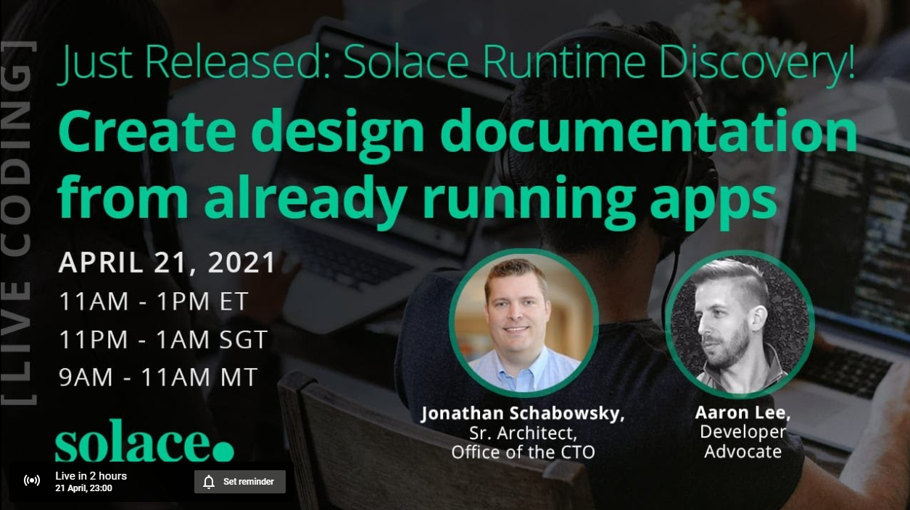
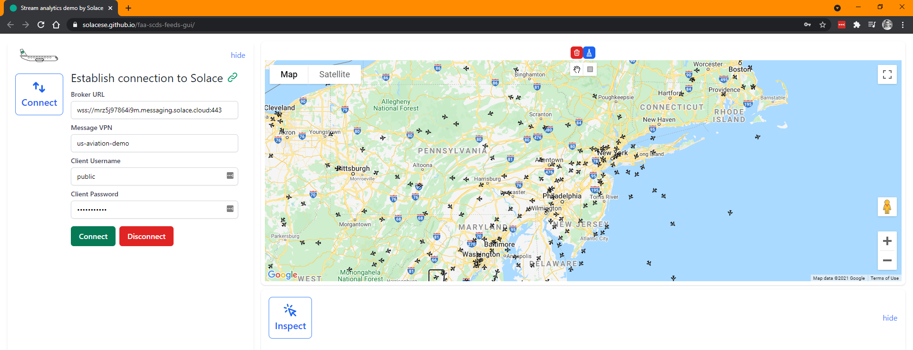

author: Aaron Lee
summary: Follow along to do a Solace Discovery Scan of Topic Hierarchy and Existing Applications
id: solace-discovery
tags:
categories: Solace
environments: Web
status: Draft
feedback link: https://github.com/SolaceDev/solace-dev-codelabs/blob/master/markdown/solace-discovery
analytics account: UA-3921398-10

# Discover your Solace Event Streams with Event Portal

## Overview

Duration: 0:01:00

This CodeLab will walk you through the basics of performing a **Solace Runtime Discovery** scan of your _existing_ (or a demo) Solace application / broker.

This CodeLab is only a placeholder and meant to accompany the live coding stream here: [https://www.youtube.com/watch?v=gXNI7kwFjjo](https://www.youtube.com/watch?v=gXNI7kwFjjo)

The streaming US aviation data used in this CodeLab will eventually be moved somewhere more permanent, and this CodeLab will be updated at that point.

## Prerequisites

Duration: 0:01:00

Not a lot:

- Solace Event Portal (Solace Cloud) account: FREE!! [https://console.solace.cloud/](https://console.solace.cloud/)
- Docker

## Visualize some US Flight Event Stream

Duration: 0:02:00

Some of the data we will be looking can be displayed visually on a map. To see this, try the following link: [https://solacese.github.io/faa-scds-feeds-gui/](https://solacese.github.io/faa-scds-feeds-gui/)

_(Props to Andrew and Robert)_

Use either the existing credentials or these:

- Broker URL: `mrz5j97864i9m.messaging.solace.cloud`
- Message VPN: `us-aviation-demo`
- Client Username: `public`
- Client Password: `ilikeplanes`

At the top of the map, toggle between "hand" to pan around, or "box" to draw filtered areas of the map. The blue button above them will delete all filtered areas.

## Login to Solace Cloud Console

Duration: 0:02:00

We will be doing a Solace Discovery Scan. You will need to log into the Solace Event Portal: [https://console.solace.cloud/](https://console.solace.cloud/)

- Click on "Discovery"
- Click on "How do I run a Discovery Scan" at the top
- Download and run the Discovery agent

## The Discovery Agent

Duration: 0:05:00

The agent is a local application running on your localhost or whatever server your Docker is running on. Point your favourite browser to `http://localhost:8120` to see the Agent GUI.

Use the following credentials to do Solace "Runtime Discovery". (note, these credentials will also work for a Topic Discovery scan):

- Client Username: `public`
- Client Password: `ilikeplanes`
- SEMP Username: `readonly`
- SEMP Password: `readonly`
- Client Protocol: `tcp`
- Client Host: `mrz5j97864i9m.messaging.solace.cloud`
- SEMP Host: `mrz5j97864i9m.messaging.solace.cloud`
- Messaging Port: `55555`
- Message VPN: `us-aviation-demo`
- SEMP Port: `943`
- SEMP Scheme: `https`
- Topics Subscriptions: `>`
- Scan Duration: `60` (seconds)

#### Of course, feel free to scan any broker / Message VPN that you have access to

After the scan is complete, upload it to your Solace Cloud account. Or download the JSON if you wish, you can upload it later.

## Importing to Designer

Duration: 0:05:00

Back in Solace Cloud Console, under the Designer, you should see the scan you just ran. Click the three vertical dots and "Import to Designer".

You will be presented with two sets of data:

- the topic hierarchy scanned
- any scanned Solace clients that were connected, and their subscriptions

### Creating Events from Topics

Navigate through the topic hierarchy. When you navigate/expand a topic tree all the way down to the leaf node, you can then create an event with that static topic. There will appear a little + sign and allow you to create a Portal Event.

To create a topic level with mulitple values (e.g. enums or variable), click the checkmark box to the left of the first value at that level, and then say "Select All". Then you can create a variable for that level.

Watch the video for more details, or check back later when this CodeLab is updated.

### Detecting Client Applications

On the 2nd tab, **Queues & Direct Clients**, you can see what consumers are active and consuming data from Solace. These can be generated into Portal Appliations.

## Move to the Designer

Duration: 0:02:00

Once Events and Applications have been created from your scan, you can move into the Designer view and start enhancing the data there (e.g. description, owner, etc.). Note that for scanned Events (topics), the Schema is not automatically generated as Solace (currently) don't reverse engineer schemas from published payloads.

Finally, you can export the AsyncAPI schema of any Applications you like, and then use any AsyncAPI code generator to build you a new application framework for publishing or subscribing to the data.

## Next Steps

Duration: 0:02:00

Thanks for participating in this codelab! Let us know what you thought in the [Solace Community Forum](https://solace.community/)! If you found any issues along the way we'd appreciate it if you'd raise them by clicking the Report a mistake button at the bottom left of this codelab.
