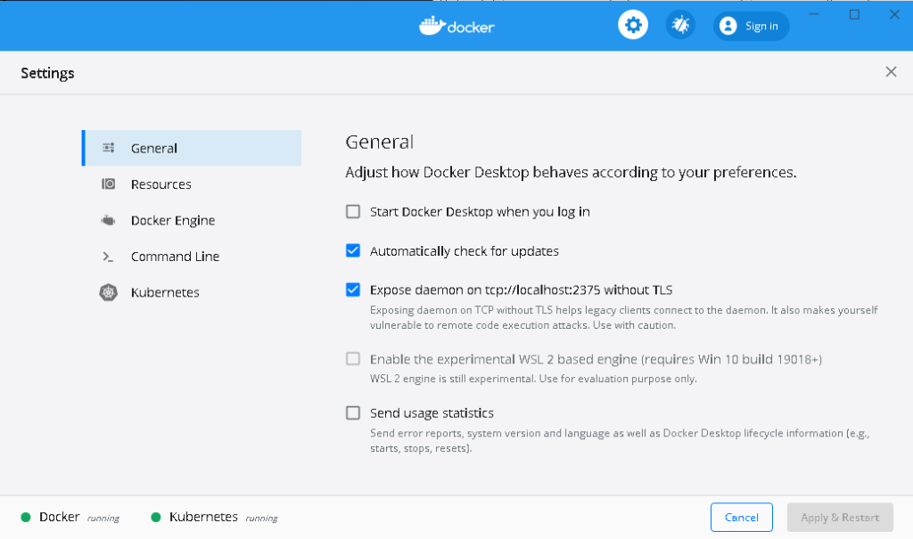
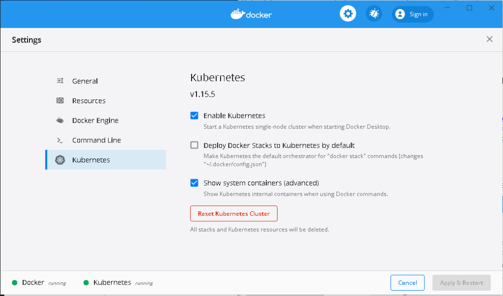
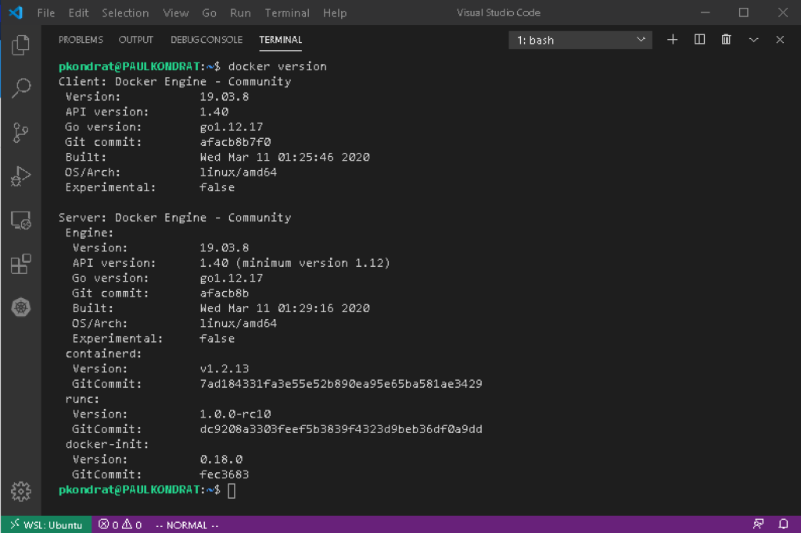
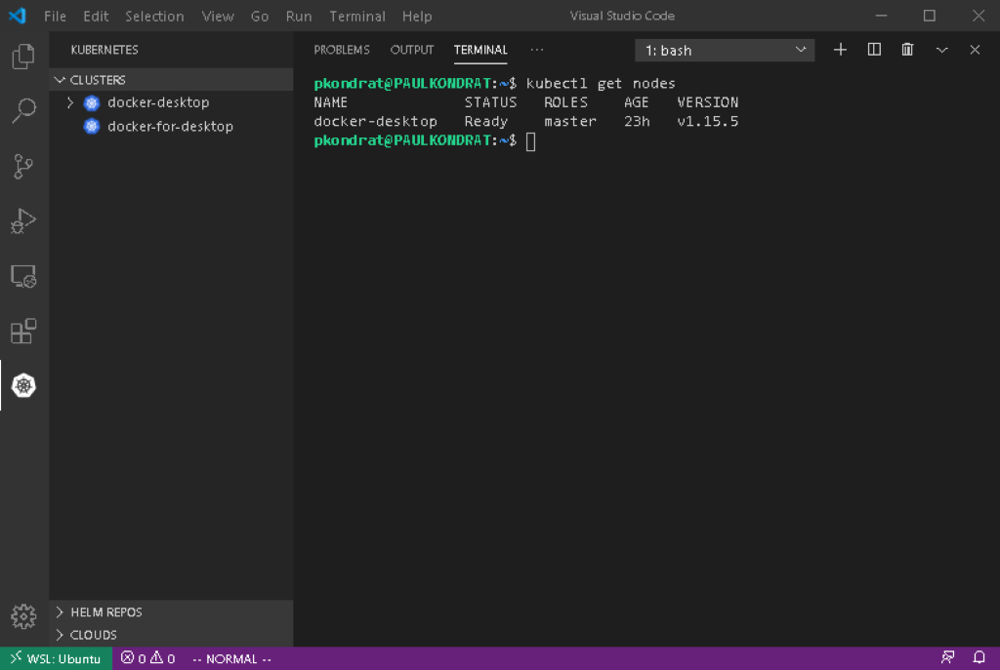
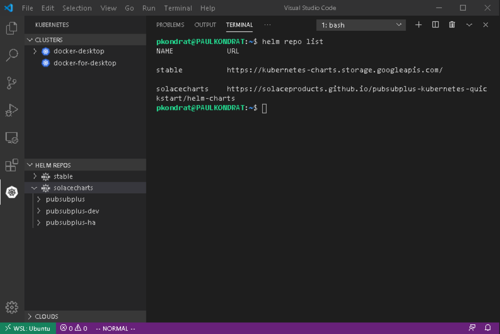
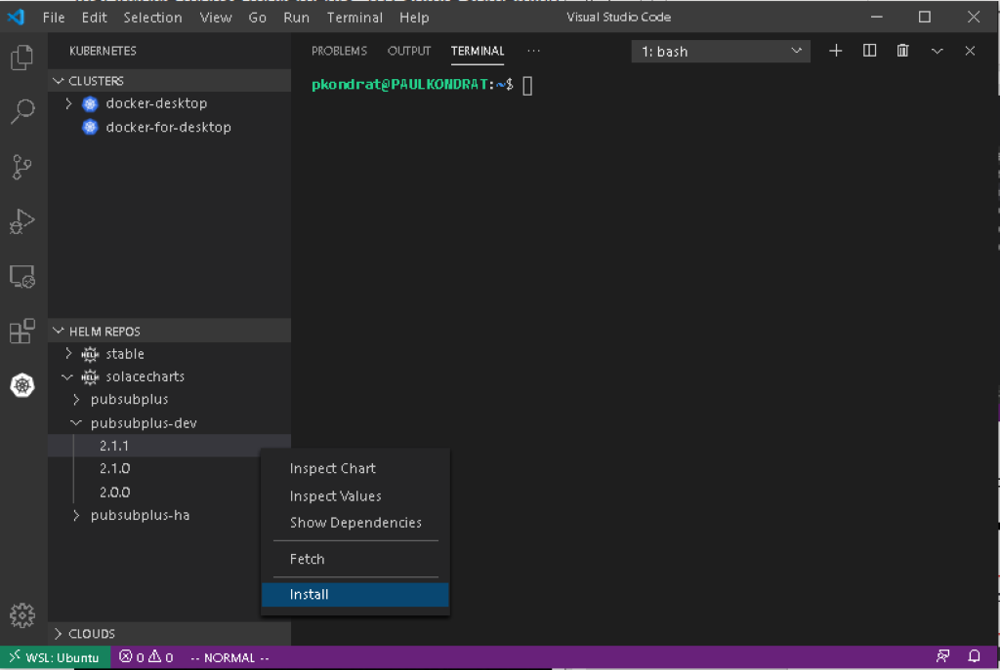
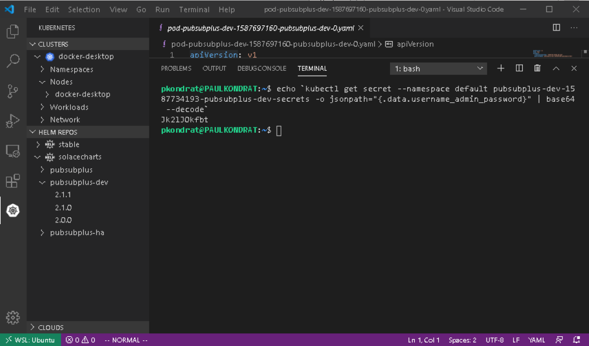
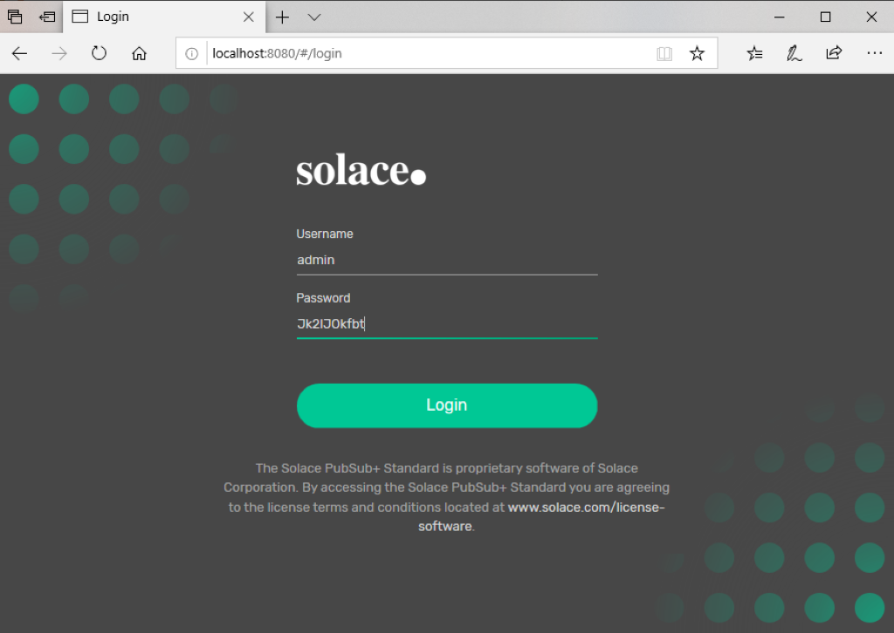
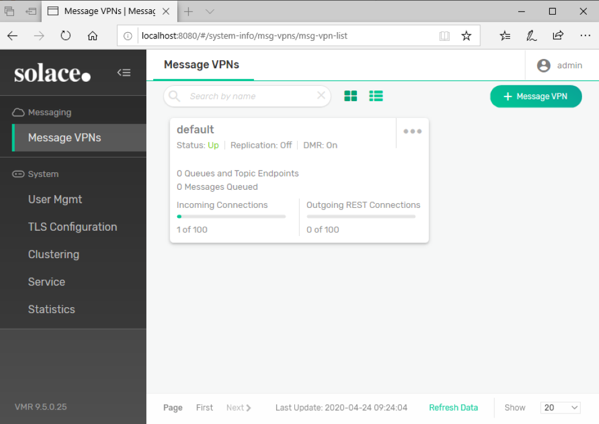

author: Paul Kondrat
summary: Windows 10 Helm / Kubernetes Development Environment Setup using WSL, Docker Desktop and VSC
id: helm-environment-setup
tags: 
categories: Helm, Kubernetes
environments: Web
status: Published
feedback link: https://github.com/SolaceDev/solace-dev-codelabs
analytics account: UA-3921398-10

# Windows 10 Helm / Kubernetes Development Environment Setup

## Overview
Duration: 0:01:00

Are you interested in trying out Kubernetes on your Windows PC?  This CodeLab will show you how to setup a desktop Kubernetes environment using Docker Desktop, Windows Subsystem for Linux, Helm and Visual Studio Code.  Finally now that PubSub+ is available in [Helm Hub](https://hub.helm.sh/), the CodeLab will show you how to install a dev instance of PubSub+ in the environment using Helm.

### Here are the tools we will use:
* **Docker Desktop** - Provides a local Kubernetes Cluster.
* **Windows SubSystem for Linux (WSL)** - Provides a Linux shell to control the Kuberntes environment from.
* **Helm** - CNCF incubator project that helps manage applications in Kubernetes "the package manager for Kubernetes".
* **Visual Studio Code (VSC)** - Popular code editor that has extensions that allow you to launch Helm charts directly from VSC.

## Step 1:  Install Docker Desktop
Duration: 0:10:00

In oder to accomplish the goal of using Helm to install a dev instance of PubSub+ access to a Kubernetes cluster is required.  Docker Desktop has an option to provide this and it's easy to setup.  The following instructions will install Docker Desktop on your Windows PC.

[https://hub.docker.com/editions/community/docker-ce-desktop-windows/](https://hub.docker.com/editions/community/docker-ce-desktop-windows/)



Once it’s installed, you need to check the “Expose daemon on tcp://localhost:2375 without TLS” box.  This is needed so that the Docker cli running in WSL can talk to the daemon running under Windows.



Then you need to “Enable Kubernetes” and (optional) “Show system containers”.  After this a restart of Docker Desktop is required.  It’s also a good idea to increase the resources; I used 3 CPUs, 5GB of Memory and 4GB of swap.

## Step 2:  Setup the Windows Subsystem for Linux (WSL)
Duration:  0:10:00

If you don’t already have the Windows Subsystem for Linux (WSL) configured, then you will need to enable that and install an OS.  I use Ubuntu and downloaded it from the [Windows Store](https://www.microsoft.com/en-ca/p/ubuntu-1804-lts/9n9tngvndl3q?activetab=pivot:overviewtab
).  Once that is setup, you can open Visual Studio Code and install some extensions.

Note:  The following steps were done using Ubuntu 18.04 and WSL1.  At the time of writing Ubuntu 20.04 and WSL2 are just about to be released; the instructions in the following steps differ if using Ubuntu 20.04.

## Step 3:  Install Visual Studio Code Extensions
Duration:  0:02:00

### Install the following extensions in Visual Studio Code:
* **Remote - WSL** – This will allow you to use the Ubuntu terminal in Code (instead of Power Shell)
* **Kubernetes** – This extension allows you to install Helm charts directly from Code to different Kubernetes backends (in this case Docker Desktop)

With Code and the Remote – WSL extension, everything else can be done from the Ubuntu terminal in Code.  The next step is to install the Kubernetes and Docker CLIs in Ubuntu.

## Step 4:  Configure WSL
Duration:  0:05:00

The CLIs for Docker, Helm and Kubernetes must be installed in WSL in order for the Kubernetes extension to function.
To install the Docker CLI, follow the instructions from the Docker web-site:  [https://docs.docker.com/engine/install/ubuntu/](https://docs.docker.com/engine/install/ubuntu/).  The only package required is the “docker-ce-cli”.  Use the Remote Explorer extension to open a Ubuntu window in VSC and use the terminal to install the Docker cli.

Once that is installed, configure the CLI to use the Docker daemon running in Windows:

```bash
$ echo "export DOCKER_HOST=tcp://localhost:2375" >> ~/.bashrc && source ~/.bashrc
```



After confirming that the Docker cli can talk to the Docker daemon (running in Docker Desktop), the next step is to install the Kubernetes cli.

Instructions for installing the Kubernetes CLI can be found here: [https://kubernetes.io/docs/tasks/tools/install-kubectl/](https://kubernetes.io/docs/tasks/tools/install-kubectl/).

Once the kubectl package is installed, it needs to be configured to connect to the Kubernetes cluster running in Docker Desktop; to do this I linked to the .kube directory in my Windows home directory.

```bash
$ ln -s /mnt/c/Users/pkondrat/.kube
```



The final tool to configure in WSL is Helm. To install Helm, I followed the instructions for the binary install of Helm in Linux (which basically involves copying the Helm binary).  

[https://helm.sh/docs/intro/install/](https://helm.sh/docs/intro/install/)

```bash
$ wget https://get.helm.sh/helm-v3.2.0-linux-amd64.tar.gz
$ tar -zxvf helm-v3.2.0-linux-amd64.tar.gz
$ sudo mv linux-amd64/helm /usr/local/bin/helm
```

Finally install the Helm repos:

```bash
$ helm repo add stable https://kubernetes-charts.storage.googleapis.com/
$ helm repo add solacecharts https://solaceproducts.github.io/pubsubplus-kubernetes-quickstart/helm-charts
```

If you click on the Kubernetes extension in VSC, you should see the Helm repos.



With that the environment is setup, the Kubernetes extension can see the cluster running in Docker Desktop and the PubSub+ charts in the Helm Hub.  Now we are ready to deploy a chart.  

## Step 5:  Install the PubSub+ Helm Chart

### There are three charts in the solacecharts repo:
* **pubsubplus** - Deploy a single-node non-HA Solace PubSub+ Event Broker Software onto a Kubernetes Cluster
* **pubsubplus-dev** - Deploy a minimum footprint single-node non-HA Solace PubSub+ Event Broker Software onto a Kubernetes Cluster for development purposes
* **pubsubplus-ha** - Deploy an HA redundancy group of Solace PubSub+ Event Broker Software onto a Kubernetes Cluster

I deployed pubsubplus-dev because my desktop doesn’t have a lot of resources.



One click, that’s it.  The output from deploying the chart was as follows:

```
NAME: pubsubplus-dev-1587734193

LAST DEPLOYED: Fri Apr 24 09:16:34 2020
NAMESPACE: default
STATUS: deployed
REVISION: 1
TEST SUITE: None

NOTES:
== Check Solace PubSub+ deployment progress ==
Deployment is complete when a PubSub+ pod representing an active event broker node's label reports "active=true".

Watch progress by running:
kubectl get pods --namespace default --show-labels -w | grep pubsubplus-dev-1587734193-pubsubplus-dev

For troubleshooting, refer to ***TroubleShooting.md***

== Admin credentials and access ==
*********************************************************************
 * An admin password was not specified and has been auto-generated.
 * You must retrieve it and provide it as value override
 * if using Helm upgrade otherwise your cluster will become unusable.
*********************************************************************

    Username       : admin

    Admin password : 

echo `kubectl get secret --namespace default pubsubplus-dev-1587734193-pubsubplus-dev-secrets -o jsonpath="{.data.username_admin_password}" | base64 --decode`

Use the "semp" service address to access the management API via browser or a REST tool, see Services access below.

== Image used ==
solace/solace-pubsub-standard:latest

== Storage used ==
Using persistent volumes via dynamic provisioning with the "default" StorageClass, ensure it exists: `kubectl get sc | grep default`

== Performance and resource requirements ==
This is a minimum footprint deployment for development purposes. For guaranteed performance, specify a different solace.size value.

Following resources have been requested per PubSub+ pod:

echo `kubectl get statefulset --namespace default pubsubplus-dev-1587734193-pubsubplus-dev -o jsonpath="Minimum resources: {.spec.template.spec.containers[0].resources.requests}"`

== Services access ==
To access services from pods within the k8s cluster, use these addresses:

echo -e "\nProtocol\tAddress\n"`kubectl get svc --namespace default pubsubplus-dev-1587734193-pubsubplus-dev -o jsonpath="{range .spec.ports[*]}{.name}\tpubsubplus-dev-1587734193-pubsubplus-dev.default.svc.cluster.local:{.port}\n"`

To access from outside the k8s cluster, perform the following steps.

Obtain the LoadBalancer IP and the service addresses:

NOTE: At initial deployment it may take a few minutes for the LoadBalancer IP to be available.

Watch the status with: 

kubectl get svc --namespace default -w pubsubplus-dev-1587734193-pubsubplus-dev

export SERVICE_IP=$(kubectl get svc --namespace default pubsubplus-dev-1587734193-pubsubplus-dev --template "{{ range (index .status.loadBalancer.ingress 0) }}{{.}}{{ end }}"); echo SERVICE_IP=$SERVICE_IP
 
Ensure valid SERVICE_IP is returned:

echo -e "\nProtocol\tAddress\n"`kubectl get svc --namespace default pubsubplus-dev-1587734193-pubsubplus-dev -o jsonpath="{range .spec.ports[*]}{.name}\t$SERVICE_IP:{.port}\n"`
```

## Step 6:  Get the Admin password and Login to the PubSub+ Broker Manager
Duration:  0:02:00

To retrieve the password for the admin account use the command line from the chart output in the previous step (it's best to copy from the output of your command to get the correct name of the pod or try 'helm ls' followed by 'helm status <deployment name>' to regenerate the output).  

```bash
echo `kubectl get secret --namespace default <name of your pod>-pubsubplus-dev-secrets -o jsonpath="{.data.username_admin_password}" | base64 --decode`
```



And login to the PubSub+ Broker Manager using a web-browser [http://localhost:8080](http://localhost:8080).





That shows how easy it is to deploy PubSub+ using the new Solace Helm charts recently released on Helm Hub.  All running on a Windows desktop using Docker Desktop, WSL, Visual Studio Code and Helm.

The next [CodeLab](https://codelabs.solace.dev/codelabs/helm-node-samples) will use the environment that we just setup to run some of the PubSub+ Sample Applications from [https://github.com/SolaceSamples](https://github.com/SolaceSamples).
