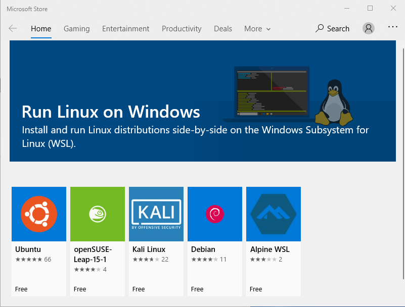
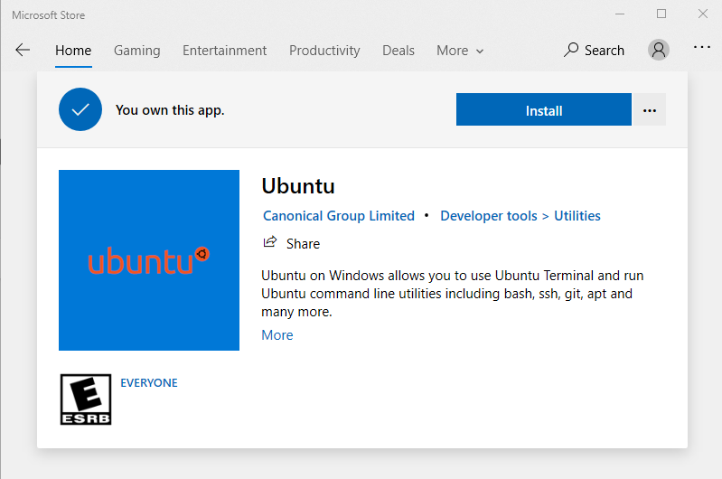
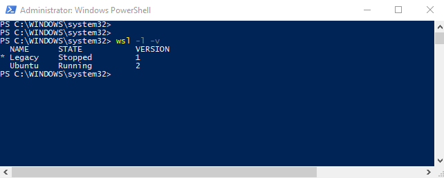
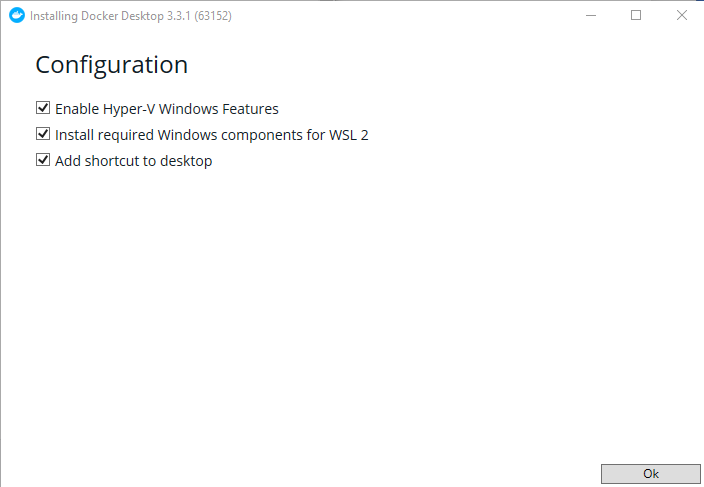

author: Paul Kondrat
summary: Windows 10 Helm / Kubernetes Development Environment Setup using WSL, Docker Desktop and VSC
id: helm-environment-setup
tags:
categories: Helm, Kubernetes
environments: Web
status: Published
feedback link: https://github.com/SolaceDev/solace-dev-codelabs

# Windows 10 Helm / Kubernetes Development Environment Setup

## Overview

Duration: 0:01:00

Are you interested in trying out Kubernetes on your Windows PC? This CodeLab will show you how to setup a desktop Kubernetes environment using Docker Desktop, Windows Subsystem for Linux, Helm and Visual Studio Code. Finally now that PubSub+ is available in [Artifact HUB](https://artifacthub.io/packages/search?page=1&ts_query_web=solace), the CodeLab will show you how to install a dev instance of PubSub+ in the environment using Helm.

### Here are the tools we will use:

- **Windows SubSystem for Linux (WSL)** - Provides a Linux shell to control the Kuberntes environment from.
- **Docker Desktop** - Provides a local Kubernetes Cluster.
- **Helm** - CNCF incubator project that helps manage applications in Kubernetes "the package manager for Kubernetes".
- **Visual Studio Code (VSC)** - Popular code editor that has extensions that allow you to launch Helm charts directly from VSC.

Setting up the dev environment and launching a dev instance of PubSub+ will be done in 6 easy steps:

- **Step 1** - Setup the Windows Subsystem for Linux (WSL)
- **Step 2** - Install Docker Desktop
- **Step 3** - Install Helm
- **Step 4** - Install Visual Studio Code Extensions
- **Step 5** - Install the PubSub+ Helm Chart
- **Step 6** - Get the Admin password and Login to the PubSub+ Broker Manager

## Step 1: Setup the Windows Subsystem for Linux (WSL)

Duration: 0:10:00

If you don’t already have the Windows Subsystem for Linux (WSL) configured, then you will need to enable that and install an OS. Instructions from Microsoft on how to install WSL can be found [here](https://docs.microsoft.com/en-us/windows/wsl/install-win10). Follow the instructions to install WSL2 and make it the default version. A previous version of this codelab used WSL1 with Ubuntu 18.04. This version will use WSL2 and [Ubuntu 20.04](https://www.microsoft.com/en-ca/p/ubuntu-2004-lts/9n6svws3rx71?rtc=1&activetab=pivot:overviewtab). Once WSL is enabled and version 2 is set as the default, the easiest way to install Ubuntu 20.04 is via the [Microsoft Store](https://aka.ms/wslstore).

Select Ubuntu


Select Install


And Launch


Create a Username


Install updates to Ubuntu

```bash
$ sudo apt update
$ sudo apt upgrade
```

And just to be sure, make sure that Ubuntu was properly installed into WSL2.
Open a PowerShell Window as administrator and enter the following command.

```powershell
> wsl -l -v
```



### Once that is setup, it is time to install Docker Desktop in step 2.

## Step 2: Install Docker Desktop

Duration: 0:10:00

In oder to accomplish the goal of using Helm to install a dev instance of PubSub+, access to a Kubernetes cluster is required. Docker Desktop has an option to provide this and it's easy to setup. The following instructions will install Docker Desktop on your Windows PC. If you already have Docker Desktop installed you can skip to the settings.

### Step 2.1: Download and Install Docker Desktop

[Install Docker](https://hub.docker.com/editions/community/docker-ce-desktop-windows/)

Download Docker Desktop for Windows and run the installer. Make sure the "Install required Windows components for WSL 2" box is checked and hit "Ok".



### Step 2.2: Launch Docker Desktop Settings

When the installer completes the installation, launch Docker Desktop from the start menu. Click through the tutorials and navigate to the settings.


### Step 2.3: Configure WSL Integration

Navigate to "Resources" and "WSL INTEGRATION". Enable "Ubuntu".


### Step 2.4: Enable Kubernetes

Navigate to "Kubernetes" and check the "Enable Kubernetes" box. Then select "Apply & Restart".


Click "Install".


When the install is complete you will see the green Kubernetes icon in the bottom left corner.


If you open a PowerShell window or a terminal in the Ubuntu install, you will see that Docker Desktop has installed the kubernetes cli (kubectl) in both environments. With that, you have a functioning single node Kubernetes environment.

### The next step is to install Helm

## Step 3: Install Helm

Duration: 0:05:00

The CLIs for Docker and Kubernetes were installed by Docker Desktop (in Windows and WSL-Ubuntu). Now we must configure Helm in WSL.

### Step 3.1: Install Helm Binary

To install Helm, I followed the instructions for the binary install of Helm in Linux (which basically involves copying the Helm binary).

[https://helm.sh/docs/intro/install/](https://helm.sh/docs/intro/install/)

Open a Ubuntu Window and enter the following commands.

```bash
$ wget https://get.helm.sh/helm-v3.2.0-linux-amd64.tar.gz
$ tar -zxvf helm-v3.2.0-linux-amd64.tar.gz
$ sudo mv linux-amd64/helm /usr/local/bin/helm
```


### Step 3.2: Install Help Repos

Finally install the Helm repos:

```bash
$ helm repo add stable https://charts.helm.sh/stable
$ helm repo add solacecharts https://solaceproducts.github.io/pubsubplus-kubernetes-quickstart/helm-charts
```


It is also possible to install Helm in Windows if you prefer to work in PowerShell. If you use Chocolatey, there is a [Helm package](https://community.chocolatey.org/packages/kubernetes-helm) available there.

### Next step is to configure the extensions in VSC.

## Step 4: Install Visual Studio Code Extensions

Duration: 0:02:00

Install [Visual Studio Code](https://code.visualstudio.com/Download) (if not already installed).

### Step 4.1: Install the following extensions in Visual Studio Code:

- **Remote - Development Pack** – This will allow you to use the Ubuntu terminal in Code (instead of Power Shell)
- **Kubernetes** – This extension allows you to install Helm charts directly from Code to different Kubernetes backends (in this case Docker Desktop)

Note: I also installed the Docker extension but, this is not required.

With Code and the Remote – WSL extension, everything else can be done from the Ubuntu terminal in Code.

### Step 4.2: Launch Remote VSC Window

Launch VSC remote window. Use the "Remote-WSL: New Window Using Distro..." command to open a remote window to Ubuntu WSL.


The new remote window has "WSL: Unbuntu" in the bottom left corner to indicate the environment that the remote VSC window is related to.


Note: Windows Firewall may ask you to allow access for node setup the VSC remote server.

### Step 4.3: Install the Kubernetes Extension in the Remote WSL: Ubuntu Window

Install the Kubernetes extension in the remote VSC window (same as previously done in the local VSC window).

With that the environment is setup, the Kubernetes extension can see the cluster running in Docker Desktop and the PubSub+ charts in the Helm Hub. Now we are ready to deploy a chart.


### The next step is to depoy the PubSub+ Helm chart

## Step 5: Install the PubSub+ Helm Chart

Duration: 0:02:00

### There are three charts in the solacecharts repo:

- **pubsubplus** - Deploy a single-node non-HA Solace PubSub+ Event Broker Software onto a Kubernetes Cluster
- **pubsubplus-dev** - Deploy a minimum footprint single-node non-HA Solace PubSub+ Event Broker Software onto a Kubernetes Cluster for development purposes
- **pubsubplus-ha** - Deploy an HA redundancy group of Solace PubSub+ Event Broker Software onto a Kubernetes Cluster

I deployed pubsubplus-dev because my desktop doesn’t have a lot of resources.

### Step 5.1: Install the pubsubplus-dev Chart


One click, that’s it. The output from deploying the chart was as follows:

```
NAME: pubsubplus-dev-1618757067
LAST DEPLOYED: Sun Apr 18 10:44:28 2021
NAMESPACE: default
STATUS: deployed
REVISION: 1
TEST SUITE: None
NOTES:
== Check Solace PubSub+ deployment progress ==
Deployment is complete when a PubSub+ pod representing an active event broker node's label reports "active=true".
Watch progress by running:
   kubectl get pods --namespace default --show-labels -w | grep pubsubplus-dev-1618757067-pubsubplus-dev

For troubleshooting, refer to ***TroubleShooting.md***

== TLS support ==
TLS has not been enabled for this deployment.

== Admin credentials and access ==
*********************************************************************
* An admin password was not specified and has been auto-generated.
* You must retrieve it and provide it as value override
* if using Helm upgrade otherwise your cluster will become unusable.
*********************************************************************
    Username       : admin
    Admin password : echo `kubectl get secret --namespace default pubsubplus-dev-1618757067-pubsubplus-dev-secrets -o jsonpath="{.data.username_admin_password}" | base64 --decode`
    Use the "semp" service address to access the management API via browser or a REST tool, see Services access below.

== Image used ==
solace/solace-pubsub-standard:latest

== Storage used ==
Using persistent volumes via dynamic provisioning with the "default" StorageClass, ensure it exists: `kubectl get sc | grep default`

== Performance and resource requirements ==
This is a minimum footprint deployment for development purposes. For guaranteed performance, specify a different solace.size value.
Following resources have been requested per PubSub+ pod:
    echo `kubectl get statefulset --namespace default pubsubplus-dev-1618757067-pubsubplus-dev -o jsonpath="Minimum resources: {.spec.template.spec.containers[0].resources.requests}"`

== Services access ==
To access services from pods within the k8s cluster, use these addresses:

    echo -e "\nProtocol\tAddress\n"`kubectl get svc --namespace default pubsubplus-dev-1618757067-pubsubplus-dev -o jsonpath="{range .spec.ports[*]}{.name}\tpubsubplus-dev-1618757067-pubsubplus-dev.default.svc.cluster.local:{.port}\n"`

To access from outside the k8s cluster, perform the following steps.

Obtain the LoadBalancer IP and the service addresses:
NOTE: At initial deployment it may take a few minutes for the LoadBalancer IP to be available.
      Watch the status with: 'kubectl get svc --namespace default -w pubsubplus-dev-1618757067-pubsubplus-dev'

    export SERVICE_IP=$(kubectl get svc --namespace default pubsubplus-dev-1618757067-pubsubplus-dev --template "{{ range (index .status.loadBalancer.ingress 0) }}{{.}}{{ end }}"); echo SERVICE_IP=$SERVICE_IP
    # Ensure valid SERVICE_IP is returned:
    echo -e "\nProtocol\tAddress\n"`kubectl get svc --namespace default pubsubplus-dev-1618757067-pubsubplus-dev -o jsonpath="{range .spec.ports[*]}{.name}\t$SERVICE_IP:{.port}\n"`
```

### Step 5-2: Check that the PubSub+ Pod is Running

Now the Kubernetes extension can be used to see the PubSub+ pod running on the docker-desktop Kubernetes cluster.


### Next step is to get the admin password and connect to the PubSub+ Broker Manager.

## Step 6: Get the Admin password and Login to the PubSub+ Broker Manager

Duration: 0:02:00

### Step 6-1: Get the Password for the admin Account

To retrieve the password for the admin account use the command line from the chart output in the previous step (it's best to copy from the output of your command to get the correct name of the pod or try 'helm ls' followed by 'helm status <deployment name>' to regenerate the output).


Paste the command into the terminal.


```bash
echo `kubectl get secret --namespace default <name of your pod>-pubsubplus-dev-secrets -o jsonpath="{.data.username_admin_password}" | base64 --decode`
```

### Step 6-2: Login to the PubSub+ Manager

Login to the PubSub+ Broker Manager using a web-browser [http://localhost:8080](http://localhost:8080). The username is admin and the password is the output from the previously entered command (in this case AkQxKq1yM1).


## Takeaways

Duration: 0:02:00

That shows how easy it is to deploy PubSub+ using the new Solace Helm charts recently released on [Artifact Hub](https://artifacthub.io/packages/search?page=1&ts_query_web=solace). All running on a Windows desktop using Docker Desktop, WSL, Visual Studio Code and Helm.

The next [CodeLab](https://codelabs.solace.dev/codelabs/helm-node-samples) will use the environment that we just setup to run some of the PubSub+ Sample Applications from [https://github.com/SolaceSamples](https://github.com/SolaceSamples).


Thanks for participating in this codelab! Let us know what you thought in the [Solace Community Forum](https://solace.community/)! If you found any issues along the way we'd appreciate it if you'd raise them by clicking the Report a mistake button at the bottom left of this codelab.
