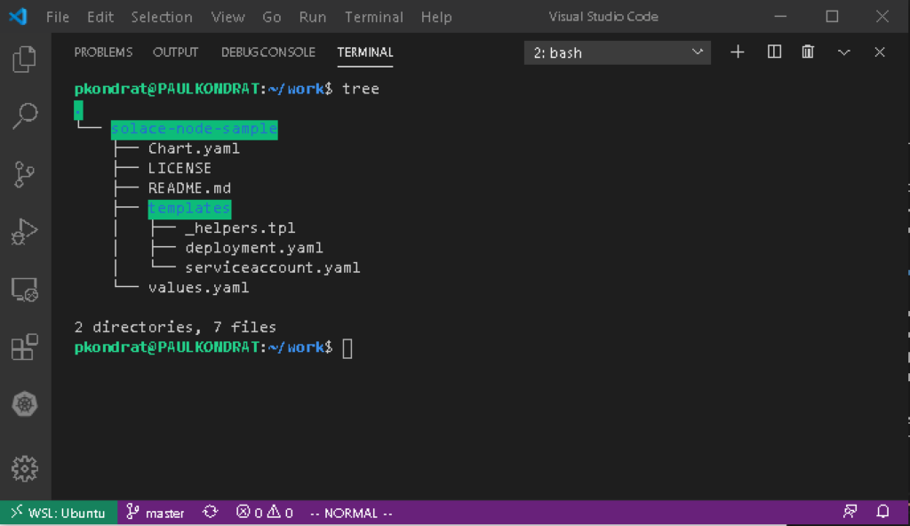
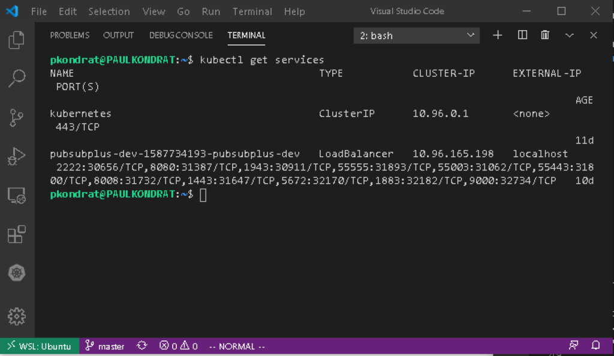
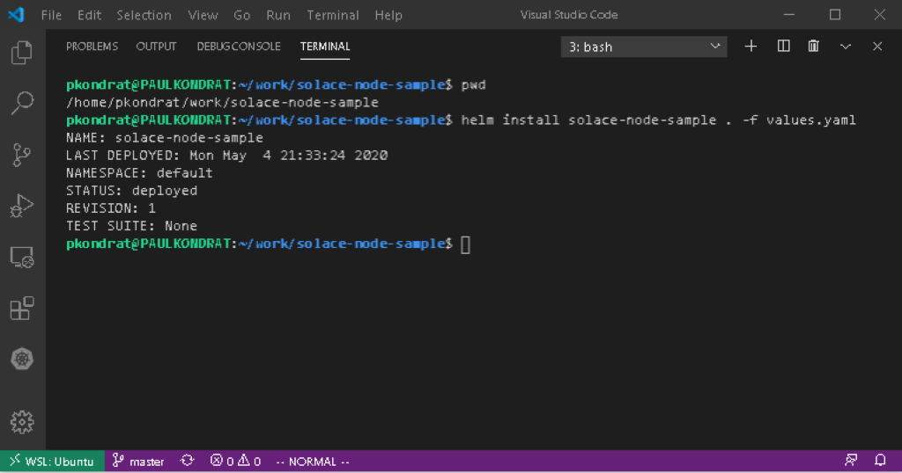
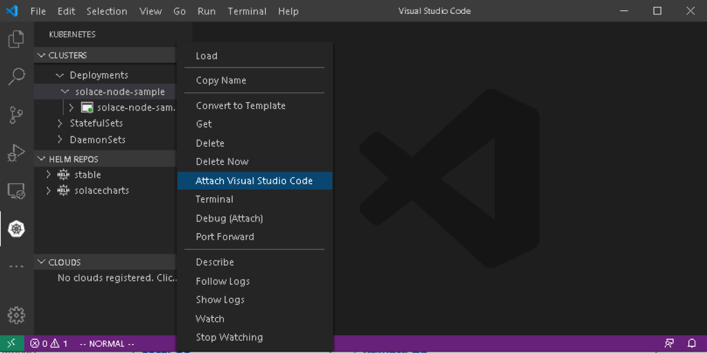
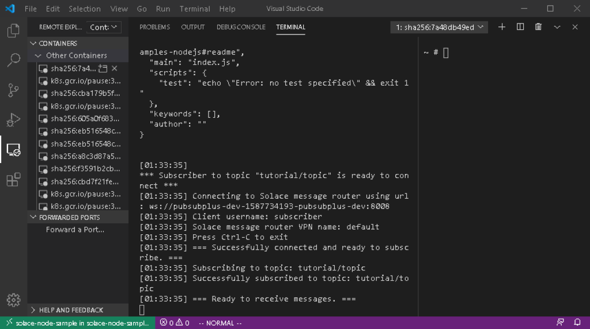
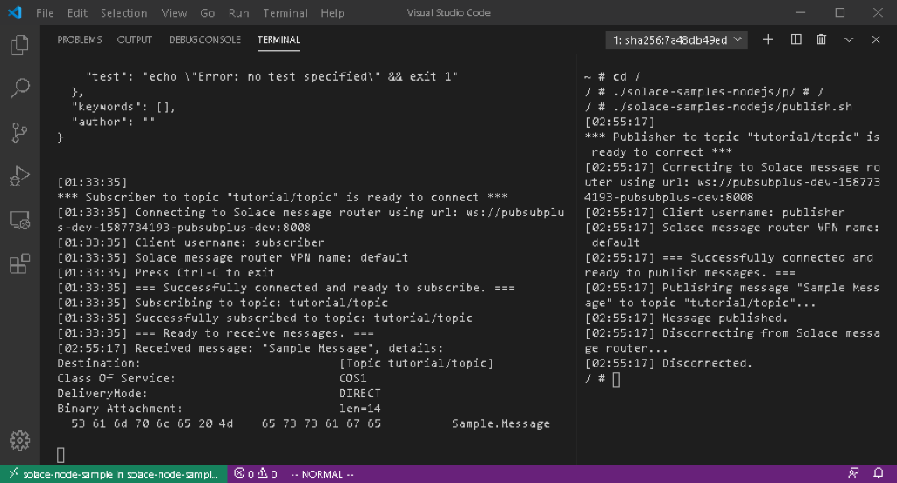

author: Paul Kondrat
summary: PubSub+ Node.js Samples using Helm / Kubernetes with a Desktop Windows Dev Environment 
id: helm-node-samples
tags: 
categories: Helm,, Kubernetes
environments: Web
status: Published
feedback link: https://github.com/SolaceDev/solace-dev-codelabs
analytics account: UA-3921398-10

# PubSub+ Node.js Samples with Helm / Kubernetes

## Overview
Duration: 0:01:00

In a previous [CodeLab](https://codelabs.solace.dev/codelabs/helm-environment-setup) a desktop Kubernetes development environment was setup using Docker Desktop, Windows Subsystem for Linux, Helm and Visual Studio Code.  That Codelab also used the environment to launch a dev instance of PubSub+ uising the [PubSub+ Helm Charts](https://hub.helm.sh/charts/solace).  This CodeLab will use the dev instance installed in the previous CodeLab to run some Node.js sample applications using Kubernetes and Helm.

## Step 1: Clone the Solace Node Sample Chart
Duration:  0:05:00

My colleage Ken Barr created a simple [chart](https://github.com/KenBarr/solace-node-sample) that launches the official Node image from Docker Hub, installs the Solace node.js API from NPM and clones the Solace node.js samples from github.

```bash
git clone git@github.com:KenBarr/solace-node-sample.git
```



The deployment.yaml file is where most of the work is done.  In there you will see what looks a lot like a Kubernetes template however, there are some template functions surrounded by double braces scattered throughout.  The Helm template functions can be used to insert strings extracted from the values.yaml file, do simple conditional formating etc.  You can find the details of the Helm template lanuage in the [Helm docs](https://helm.sh/docs/chart_template_guide/).  When you install a Helm chart, Helm will look at the templates, process all of the Helm template functions and render a Kubernetes template that is suitable for deployment.  

Looking at the deployment.yaml file the key sequence is as follows:

```yaml
command:
    - sh
    - "-ec"
    - |
        apk update && apk upgrade && apk add --no-cache bash git openssh
        npm install solclientjs
        git clone https://github.com/SolaceSamples/solace-samples-nodejs
        cd solace-samples-nodejs
        npm init -y
        echo -e "#!/bin/bash\n node solace-samples-nodejs/src/basic-samples/TopicPublisher.js ws://{{.Values.psb.name}}:8008 publisher@default default" > publish.sh
        chmod +x publish.sh
        node src/basic-samples/TopicSubscriber.js ws://{{.Values.psb.name}}:8008 subscriber@default default
```

The other important file is values.yaml; in that file you can see that the base image is the [node image](https://hub.docker.com/_/node/).  So, the commands above are going to run in the node image (the description of which can be obtained from Docker Hub).  From the code snip above, you can see that the template will install the Solace node.js API from NPM, clone the sample applications from github, create a script to publish a message and finally start the subscriber. 

The code for the sample application that is going to run in the container can be found in [Solace Samples](https://github.com/SolaceSamples) on GitHub.  The node.js samples are found in the [solace-samples-nodejs repo](https://github.com/SolaceSamples/solace-samples-nodejs).  The container implements the [Publish/Subscribe](https://solace.com/samples/solace-samples-nodejs/publish-subscribe/) messaging pattern.

## Step 2:  Install the Chart
Duration:  0:05:00

Before installing the chart, the values.yaml file needs to
 be updated.  In the previous step, you can see that the sample applications need the DNS ({{.Values.psb.name}}) name of the broker that the application is going to connect to.  To get the dns name of the broker that was deployed in the previous code lab use the following command: 

```bash
kubectl get services
```



Edit the values.yaml file and replace "MUST_SPECIFY_SERVICE_NAME" with the service name of the PubSub+ broker.

Now the chart is ready to be deployed.

```bash
helm install solace-node-sample . -f values.yaml
```



## Step 3:  Run the Node.js Sample Applications

In this step we will use Visual Studio Code and the remote developement extensions to attach to the node sample container and run the [sample applications](https://github.com/SolaceSamples/solace-samples-nodejs).  If you haven't already done so, install the [Remote Development](https://code.visualstudio.com/docs/remote/remote-overview) extensions.  Open a new Visual Studio Code window; the remote container extension unfortunately does not work with WSL at time of writing so, this will need to be done from Windows.  Make sure that Kubectl is in your windows path (Docker Desktop should have done this during installation).  Using the Kubernetes extension, right click on the "solace-node-sample" pod and select "Attach Visual Studio Code".  



This will open a new window inside the container using the Remote Container extension.  Split the terminal window and use the Remote Containers extension to display the container logs by right clicking the container and selecting "Show Container Log".



You can see that the subscriber application is running and ready to recieve messages.  



```bash
cd /
/solace-samples-nodejs/publish.sh
```

To send a message and in the logs, the subscriber outputs that it recieved a message.

This shows how to use Visual Studio Code, Kubernetes and Helm to remotely run a sample application in a container.  The node.js application connects to the PubSub+ instance that was previously deployed and sends and recives a message using a publish subscribe messaging pattern.