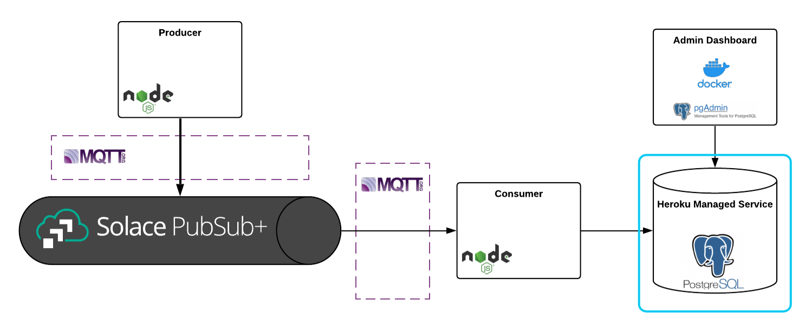
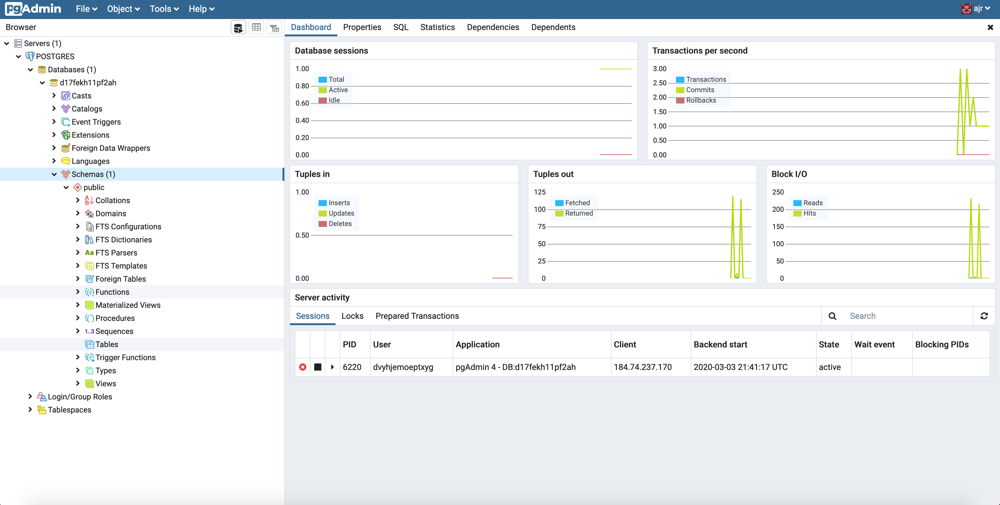
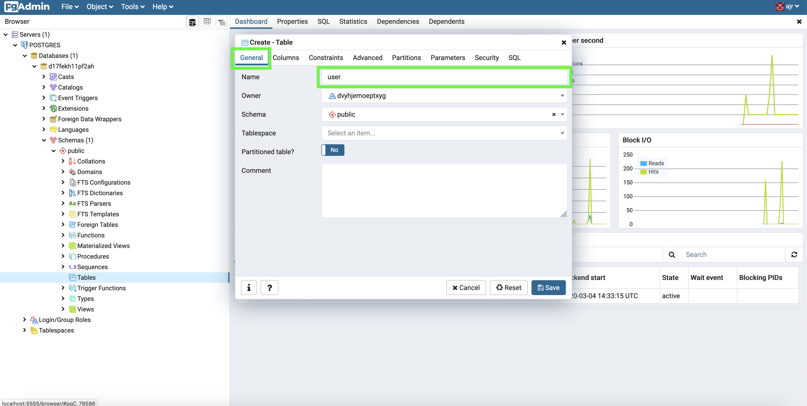
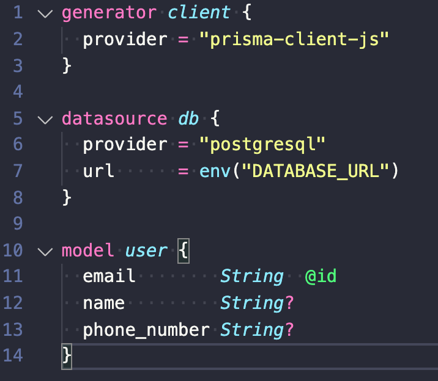

author: Andrew Roberts
summary: A tech stack tutorial with Solace PubSub+, JavaScript, MQTT, and PostgreSQL
id: solace-js-mqtt-pg
tags: iguide
categories: JavaScript,MQTT,PostgreSQL
environments: Web
status: Published
feedback link: https://github.com/solacese/solace-js-mqtt-postgres-blog
analytics account: UA-3921398-10

# Tech Stack Tutorial: Wiring Together Solace PubSub+, JavaScript, MQTT, and PostgreSQL

## Intro

Duration: 0:03:00

In this codelab you're going to learn how to build and manage the tech stack shown by the architecture diagram below:


### Wordy foreword

Hi there CodeLab developer,

My name is Andrew Roberts and I'm a systems engineer at Solace. I'm going to be the person behind this casually worded technical guide, okay?

My personal strategy for beating [analysis paralysis](https://en.wikipedia.org/wiki/Analysis_paralysis#Software_development) goes something like this: default to using well-vetted open source protocols, languages, and frameworks, and whenever possible, leverage free tier SaaS products. After picking the tools for my job, I configure an event mesh using Solace's PubSub+ Event Brokers and plug the tools into it. Since both the event mesh and each one of its nodes (the tools) are scalable, I get to tinker with app specific business logic knowing that what I'm building can scale if I need it to.

In this CodeLab, I’m going to put my personal strategy into action and walk through how to setup one of my favorite tech stacks: Solace PubSub+, JavaScript, MQTT, and PostgreSQL. This tech stack can be extended to support a wide range of use cases, ranging from systems programming to event-driven frontends. This CodeLab will implement a contrived user registration event flow, but don’t pay attention to the event payloads. The more important takeaways of this CodeLab are learning how to connect the services together and working with the MQTT and Postgres clients.

**I hope you enjoy the CodeLab, and please do let us know on our community site if there's a topic you'd like covered.**

## What You'll Learn

Duration: 0:03:00

**📚 This CodeLab will teach you how to:**

- Start a Solace PubSub+ Event Broker: Cloud messaging service (optional)
- Build a basic Node.js MQTT producer
- Start a free managed Postgres service using Heroku
- Use pgadmin4 to administer a Postgres database (optional)
- Use pgadmin4 to add a table to a Postgres database
- Build a basic Node.js MQTT consumer
- Configure Prisma Client JS on the consumer to create items in the database

**🛠️ Tools Used:**

- [Solace PubSub+ Event Broker: Cloud](https://console.solace.cloud/login/new-account)
  - Enterprise-grade messaging as a service, on demand in your favorite public and virtual private clouds.
- [MQTT](http://mqtt.org/)
  - MQTT is a machine-to-machine (M2M)/“Internet of Things” connectivity protocol. It was designed as an extremely lightweight publish/subscribe messaging transport.
- [MQTT.js](https://github.com/mqttjs)
  - MQTT.js is a client library for the MQTT protocol, written in JavaScript for Node.js and the browser.
- [Heroku Postgres](https://www.heroku.com/postgres)
  - Heroku offers a managed Postgres service with a generous free tier, and scaling up is effortless. What’s not to love?
- [pgadmin4](https://hub.docker.com/r/dpage/pgadmin4/)
  - pgAdmin 4 is a web based administration tool for the PostgreSQL database.
- [Prisma Client JS](https://github.com/prisma/prisma-client-js)
  - Prisma Client JS is an auto-generated database client that enables type-safe database access and reduces boilerplate. You can use it as an alternative to traditional ORMs such as Sequelize, TypeORM or Knex.js.

## Environment Setup

Duration: 0:05:00

### Node.js

This CodeLab uses Node.js, so if you don't already have it installed: [Get Node.js using a package manager](https://nodejs.org/en/download/package-manager/).

### Docker

This CodeLab uses Docker, so if you don't already have it installed: [Get Docker](https://docs.docker.com/get-docker/).

### Code Access

Clone the code used in this CodeLab:

```sh
git clone https://github.com/solacese/solace-js-mqtt-postgres-blog.git
cd solace-js-mqtt-postgres-blog
```

## Starting a Solace PubSub+ Event Broker: Cloud Messaging Service

Duration: 0:05:00

In this section you're going to start a Solace Messaging Service that will connect everything else we build:


**⏩ Skip this section if you already have access to a Solace PubSub+ Event Broker.**

There’s no better tool for beating analysis paralysis than the Solace PubSub+ Event Broker. Open protocol support and any-to-any protocol translation for its supported protocols built into the broker means there is absolutely no vendor lock-in with Solace and you get to build using whatever tools you’d like. You get to take for granted that they’re all able to connect and communicate with each other. It’s awesome.

**🏃Steps to get started:**

If you do not already have access to a Solace PubSub+ Event Broker and have never set up a Solace PubSub+ Event Broker: Cloud messaging service before, follow the setup instructions here: [Creating Your First Messaging Service — 1.0 documentation](https://solace.com/cloud-learning/group_getting_started/ggs_signup.html).

## Build a Basic Node.js MQTT Producer

Duration: 0:10:00

In this section you're going to build the Node.js MQTT producer application:


**🔧 Resources for this section:**

- [GitHub repo - producer](https:/github.com/solacese/solace-js-mqtt-postgres-blog/tree/master/mqtt-producer)

JavaScript is becoming a lingua franca for newly minted programmers coming out of university programs, and the ecosystem is full of innovative libraries that solve many categories of problems. The language is becoming increasingly expressive thanks to [ECMAScript](https://www.ecma-international.org/publications/standards/Ecma-262.htm) and today's ESNext (the latest version of the ECMAScript specification), and build tools are becoming easier and easier to use thanks to [Babel](https://babeljs.io/) and low touch bundlers like [Parcel](https://parceljs.org/).

JavaScript paired with MQTT provides a versatile foundation for systems programming, event-driven microservices, event-driven frontends, and more.

In the resources I'll be covering in this section, you'll find skeleton code for a basic JavaScript MQTT producer. At a high level, what this code does is initialize an MQTT client, connect the client to your MQTT broker using the credentials you fill into the `.env` file, and publish a single mock user registration event on topic `User/Registration/Add`. The included MQTT client is a wrapper I wrote around MQTT.js.

I'm not going to cover any MQTT or messaging basics in this blog post, so if you want to learn about topics or need a refresher, follow along with [our documentation](https://docs.solace.com/PubSub-Basics/Understanding-Topics.htm).

**🏃Steps to get started:**

Assuming you followed the instructions in the **Environment Setup** section, run these commands to cd into the producer's source code directory and to install the producer’s dependencies:

```sh
cd mqtt-producer
npm i
```

Before you can run the producer you need to follow the instructions listed in the `.EDIT-ME.env` file and fill in the connection details of your messaging service found in the Connect tab of your messaging service, depicted below.


**Notes:**

1.  Be sure to use the host URL under the "**MQTT Host**" option
2.  If you're using our software broker, the host URL is `tcp://localhost:1883` unless you're not using the default message VPN or have changed the MQTT service's port.

After you fill in the details and rename `.EDIT-ME.env` to `.env`, run this command to start the producer:

```sh
npm run start
```

If you want to re-run the producer, you should Ctrl-C and re-run the command.

## Start a Free Managed PostgreSQL Service Using Heroku

Duration: 0:15:00

In this section you're going to learn to use Heroku to create a Postgres service:



If you check out [database popularity rankings](https://db-engines.com/en/ranking), you'll find Postgres in the top 5. Better yet, Postgres is free, open-source, has a mature ecosystem of tooling around it, and has a large community following. If your project needs a relational database, I think Postgres is an excellent choice.

Before I learned about Heroku's free tier [managed Postgres service](https://www.heroku.com/postgres), I used to pay for a micro-sized RDS instance on AWS any time I needed a database for my projects. No longer! Heroku's managed service is super easy to setup and use, includes a more than generous free tier, and scales with no operational overhead if your project needs it to. This is the type of tool I try to leverage in my projects.

**🏃Steps to get started:**

First, sign up for a Heroku account [here](https://signup.heroku.com/).

Then, once you log in to your new account, click **New > Create new app**.


Click into your newly created Heroku application, click on the **Resources** tab, and start typing "Postgres" in the input depicted below so that we can add the PostgreSQL add-on to our application.


When you select the Postgres add-on, you'll be presented with a modal that allows you to select your plan type. Select **“Hobby Dev — Free”** and then smash the **Provision** button!


In a matter of seconds, your Postgres add-on will be provisioned.


Click into your Postgres add-on, click the **Settings** tab, and you'll see the option to view your Postgres service credentials. Take note of these for later use.


## Use pgadmin4 to Administer a PostgreSQL Database

Duration: 0:15:00

In this section you're going to learn to use pgadmin4 to administer your Postgres service:


**⏩ Feel free to skip this section if you prefer to interact with Postgres using a different method.**

Heroku does not have a built in GUI for administering your Postgres service. Personally, I've found that running pgadmin4 using the [official pgadmin4 docker](https://hub.docker.com/r/dpage/pgadmin4/) image is the easiest solution in this space. This section will go over how to set it up.

**🏃Steps to get started:**

Starting pgadmin4 in your browser is super easy using docker. Assuming you have access to docker on your machine, swap out `<your login name>` and `<your password>` in the commands listed below using any values you want, and then run them:

```
docker pull dpage/pgadmin4
docker run -d -p 5555:80 --name pgadmin -e PGADMIN_DEFAULT_EMAIL="<your login name>" -e PGADMIN_DEFAULT_PASSWORD="<your password>" dpage/pgadmin4
```

Negative
: **⏸️ Pause. Make sure you swapped out `<your login name>` and `<your password>`.**

This command will pull the necessary image and then start it as a container in detached mode, meaning it'll run in the background and not require you to keep your terminal window open.

If you're able to run that command successfully and you open your browser up to localhost:5555, you'll see something like this:


Log in using the credentials you started the container with, right click **Servers**, and then **Create > Server**:


On the **General** tab, fill in a name. Then, using the credentials from your Heroku admin dashboard (depicted in the previous section), click the Connection tab and fill in: **Host name**, **Port**, **Maintenance database** (the database name), **Username**, and **Password**. Click **Save**.


If you've successfully followed along to this point, you'll now be able to use your Postgres service 👍

But here we run into a small issue — what you'll see is something like this:


There are **675** databases showing in my GUI, and they're all the random names generated by Heroku. This is because Heroku’s free tier is a shared service. Don’t worry, there's no security issue here. Our username and password will only work for our database, but it's annoying to have to Ctrl-F our database every time we login to pgadmin.

Luckily there's a work around: restrict the server to only display a single database. To accomplish this, disconnect the server:


Right click the server and click **Properties**, click the **Advanced** tab, and fill in your database name into the DB Restriction field:


Click **Save**, and reconnect the server like so:


If successful, your GUI should be much tidier:



## Use pgadmin4 to Add a Table to a PostgreSQL Database

Duration: 0:10:00

In this section you're going to learn to use pgadmin4 to add a table your Postgres service:


Now that pgadmin4 is setup, let's walk through how to add a table to our database using the GUI. This should go without saying, but probably don't use the GUI for anything besides development.

Our example producer is going to send a user registration event that includes a name, email, and phone number, so we need to create a user table that includes these fields.

**🏃Steps to get started:**

Right click Tables, then click **Create > Table**


Fill in `user` in the **Name** field



Switch to the **Columns** tab and add three columns by clicking the plus button in the top right. Configure each row like you see in the picture below and then click **Save**.


## Build a Basic Node.js MQTT Consumer

Duration: 0:10:00

In this section you're going to build the Node.js MQTT consumer application:


**🔧 Resources for this section:**

- [GitHub repo - consumer](https://github.com/solacese/solace-js-mqtt-postgres-blog/tree/master/mqtt-consumer)

Now that our producer and database is set up, we'll set up a Node.js MQTT consumer to receive user registration events.

In the resources I'll be covering in this section, you'll find a skeleton to a basic JavaScript MQTT consumer. At a high level, what this code does is initialize an MQTT client, connect to your Solace broker using the credentials you fill into the `.env` file, and set up a topic subscription and its corresponding event handler for the topic `User/Registration/Add`. I'm not going to go into much depth here, but you can check out [this repository](https://github.com/solacese/mqtt-event-handler-pattern) for a short writeup on the event handler abstraction that’s included in the MQTT client. In short, I think it's a succinct way to express "execute this function when this type of event is received on this topic."

**🏃Steps to get started:**

Assuming you followed the instructions in the **Environment Setup** section, run these commands to change to the consumer’s source code directory and to install the consumer’s dependencies:

```sh
cd ../mqtt-consumer
npm i
```

Before you can run this consumer you need to follow the instructions listed in the `.EDIT-ME.env` file and fill in the connection details of your messaging service found in the **Connect** tab of your messaging service, depicted below.


**Notes:**

1. Be sure to use the host URL under the “MQTT Host” option
2. If you're using our software broker, the host URL is tcp://localhost:1883 unless you're not using the default message VPN or have changed the MQTT service's port.

After you fill in the details and rename `.EDIT-ME.env` to `.env`, run this command to start the consumer:

```sh
npm run start
```

If you want to re-run the consumer, you should Ctrl-C and re-run the command.

If your consumer successfully starts up, it will listen for events on the `User/Registration/Add` topic and log to console when it receives any. You can use Solace’s Try Me tab to send a couple test messages on that topic if you’d like. In the next section, we're going to use Prisma Client JS to wire together this consumer with our Postgres database.

## Configure Prisma Client JS on the Consumer to Create Items in the Database

Duration: 0:10:00

In this section you're going to enhance the Node.js MQTT consumer application by configuring Prisma Client JS to safely access your Postgres service:


[Prisma Client JS](https://github.com/prisma/prisma-client-js) is an auto-generated database client that enables type-safe database access and reduces boilerplate. You can use it as an alternative to traditional ORMs such as Sequelize, TypeORM or Knex.js. Prisma Client JS is part of the “Prisma Framework,” which is a set of open source tools to access, migrate, and administer a variety of databases (Postgres, MySQL, MongoDb). There’s been a lot of buzz around it, especially in the GraphQL community, so I wanted to give it a try. After playing around with it, in my opinion it lives up to the hype.

I’m going to speed through the steps required to get Prisma up and running, but I recommend that you read Prisma’s GitHub README top to bottom for a better appreciation of what the library offers.

**🏃Steps to get started:**

First, download Prisma’s CLI using this command:

```
npm install -g prisma2
```

Then, make sure you’re in the mqtt-consumer directory, and run:

```
prisma2 init
```

You should see the following output in your terminal:


At this point, navigate to `mqtt-consumer/prisma/.env` and fill in `DATABASE_URL` with the value you find on your Heroku dashboard:


With this environment variable filled out, you’re ready to see why people love Prisma. From the mqtt-consumer directory, run the following commands:

```
prisma2 introspect
prisma2 generate
```

You should see the following output in your terminal:


… and if you look at your schema.prisma now, you’ll see that it has inserted a new code block:



That’s it for setup. When you ran the previous two commands, Prisma2 automatically generated data models based on your database’s existing tables and installed a custom Prisma2 client package inside your node_modules that includes all the methods related to CRUD operations on your objects. Don’t run `npm i @prisma/client`, the generate step does this for you. This easy-to-use client plus being able to store declarative data models in version control (schema.prisma file) is why people love Prisma.

Now all that’s left is to uncomment the client code that takes User Registration Events and creates an item in your database using Prisma.

**Here are the steps:**

Navigate to `mqtt-consumer/src/index.js`

1. uncomment `import { PrismaClient } from "@prisma/client";` ,
2. uncomment the code block after `//initialize and connect prisma client`,
3. comment out `let prismaClient = null;`

Navigate to `mqtt-consumer/src/event-handlers.js`

1. uncomment the code block after `// do some business logic`

Negative
: **⏸️ Pause. Double check to make sure your comments are correct.**

Then, go ahead and start your consumer by running `npm run start` from the mqtt-consumer directory.

From a separate terminal, start up the MQTT producer (run `npm run start` from the mqtt-producer directory) and you should see this:


## Wrap Up

Duration: 0:01:00

You made it 🥳

If you followed all the steps and everything worked, you just built:


### Optional cleanup for pgadmin

Run these commands to stop and remove the dpage/pgadmin4 container, and then remove the dpage/pgadmin4 image.

```
docker rm $(docker stop $(docker ps -a -q --filter ancestor=dpage/pgadmin4 --format="{{.ID}}"))
docker rmi 'dpage/pgadmin4'
```

### Closing thoughts

If you made it this far, you now have a referenceable example of how to wire together Solace PubSub+ Event Broker, JavaScript, MQTT, and PostgreSQL. Knowing how to use these versatile tools together gives you a foundation that you can apply to a wide range of problem categories. You can then spend less time worrying about what technologies to use and more time worrying about building awesome products.

I hope you found this post useful. For more information, visit [PubSub+ for Developers](https://www.solace.dev/). If you have any questions, post them to the [Solace Developer Community](https://solace.community/).
