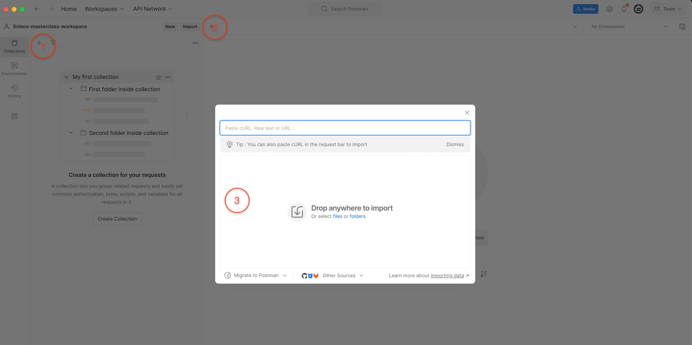

author: HariRangarajan-Solace
summary: This codelab describes the whole technical hands-on part of the Solace Masterclass session
id: solace-masterclass
tags: Solace-Masterclass, Java, Springboot
categories:
environments: Web
status: Published
feedback link: https://github.com/SolaceDev/solace-dev-codelabs/blob/master/markdown/solace-masterclass

# Solace Masterclass

## What you'll learn: Overview

This code lab contains the technical hands on section of the **Solace Masterclass : Implementing Event-Driven-Architectures**
The participants of this masterclass will be implementing this code lab in the Strigo virtual machine provided as a part of the masterclass session.
The Strigo virtual machine contains all the software packages required for implementing the hands on codelab. 

The agenda of the hands-on is as below :

* Use case introduction
* Event Portal design import
* Publish-Subscribe pattern flow
  * Generate AsyncAPI specification from Event Portal
  * Code generation using AsyncAPI code generator
  * Implement business code logic 
  * Implement version control, CI/CD workflow and Event Portal updates
  * Link applications to runtime environments and modelled event mesh (MEM)
* Request-Reply pattern flow
  * Generate AsyncAPI specification from Event Portal
  * Code generation using AsyncAPI code generator
  * Implement business code logic
  * Implement version control, CI/CD workflow and Event Portal updates
  * Link applications to runtime environments and modelled event mesh (MEM) 
* Boot up Confluent Kafka local broker and integrate with Solace cloud

## 1. Use case introduction
As a part of the event storming session earlier you would have discussed and brainstromed on few use cases. In this brain storming you have identified systems, events and processes involved in the flow(s) and also 
designed the topic taxonomy following Solace best practices and recommendations.

In the hands-on section of this masterclass, you can choose one of the below industry domains :

1. Retail
2. Banking

and follow it for implementing. Due to time limit considerations, we will be implementing only a selected subset of the whole design. 

## 2. Event Portal design import

The Event Portal is a cloud-based tool that simplifies the design of your event-driven architecture (EDA). With the Event Portal, you can:
* Define and track relationships between applications in a highly decoupled EDA.
* Easily create and manage events using a user-friendly GUI.

In summary, the Event Portal streamlines event management, making it an essential part of your EDA toolkit.
In the virtual machine box provided to you for this masterclass session, a Github repository has been checked out. 
- Navigate to the folder : <mark>**Solace-masterclass/Postman-collection**</mark> 
- Start Postman application
- Import the file with the name **Establish Environment for Event Portal.postman_collection.json** as a Postman collection as shown below

- Import the file with the name **Environment Definition.postman_environment.json** as a Postman environment as shown below

## 3. Publish-Subscribe pattern flow

### Generate AsyncAPI specification from Event Portal
### Code generation using AsyncAPI code generator
### Implement business code logic
### Implement version control, CI/CD workflow and Event Portal updates
### Link applications to runtime environments and modelled event mesh (MEM)
### Test with sample feed

## 4. Request-Reply pattern flow

### Generate AsyncAPI specification from Event Portal
### Code generation using AsyncAPI code generator
### Implement business code logic
### Implement version control, CI/CD workflow and Event Portal updates
### Link applications to runtime environments and modelled event mesh (MEM)
### Test with sample feed

## 5. Solace and Kafka integration

## 6. Takeaways and benefits

Thanks for participating in this code lab! Let us know what you thought in the [Solace Community Forum](https://solace.community/)! If you found any issues along the way we'd appreciate it if you'd raise them by clicking the Report a mistake button at the bottom left of this codelab.
