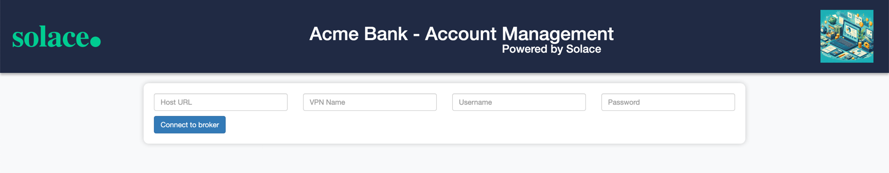

author: HariRangarajan-Solace
summary: This codelab describes the whole technical hands-on part of the Solace Masterclass session
id: solace-masterclass
tags: Solace-Masterclass, Java, Springboot
categories:
environments: Web
status: Published
feedback link: https://github.com/SolaceDev/solace-dev-codelabs/blob/master/markdown/solace-masterclass

# Solace Masterclass

## What you'll learn: Overview

This code lab contains the technical hands on section of the **Solace Masterclass : Implementing
Event-Driven-Architectures**
The participants of this masterclass will be implementing this code lab in the Strigo virtual machine provided as a part
of the masterclass session.
The Strigo virtual machine contains all the software packages required for implementing the hands on code lab.

The agenda of the hands-on is as below :

* Use case introduction
* Cloud account and broker setup
* Event Portal design import
* Application development and testing:
    * Explore the selected use case and understand the interactions between applications and events
    * Implement each application with business code logic as described in the code lab
    * Test the end to end event flow
    * Link applications to runtime environments and modelled event mesh (MEM)
    * Perform an audit and discovery using the Event Portal and Event Management Agent
* Understand the benefits of EDA and Solace in these use cases

## 1. Use case introduction

As a part of the event storming session earlier you would have discussed and brainstormed on few use cases. In this
brainstorming you have identified systems, events and processes involved in the flow(s) and also
designed the topic taxonomy following Solace best practices and recommendations.

In the hands-on section of this masterclass, you can choose one of the below industry domains :

1. Retail
2. Banking

and follow it for implementing. Due to time limit considerations, we will be implementing only a selected subset of the
whole design.

## 2. Solace Cloud Account and broker provisioning

### Step 1 : Solace Cloud Account

In case you do not have an active Solace cloud account, you can register for one via the
link :  [Solace trial account registration](https://console.solace.cloud/login/new-account?product=event-streaming)
Once you have registered and logged in to the Solace cloud account, you can get started with provisioning a Solace
developer grade broker which will be used in the next sections.

### Step 2 : Solace broker provisioning

- Once you are logged in to the Solace cloud portal with the details you registered with , you should see something like
  this:
  

- Click on "Cluster Manager" to go into where you create and manage your broker services.
- Then click the big "+" Plus button to create a new Service.
- Ensure you have selected Developer Service, Amazon Web Services as the cloud service provider,
- and then click the map to find a region close to you:
  

Give your Solace PubSub+ Cloud service instance a name using the naming convention : \
**_FirstName-masterclass**, and then tell it start!.\
For eg. if your name is John Doe, then the name of your broker will be **john-masterclass**

Under the covers, a Solace event broker will be deployed and configured in the cloud you indicated, ports configured,
load-balancer setup, monitoring enabled, etc.
It takes about 5 minutes, and then you'll be ready!
> It is safe to navigate away from the "Solace is starting" page while the broker is being deployed in the cloud. Feel
> free to explore the rest of Solace Mission Control, including the Event Portal!

Once the Solace broker is up and running, click on the broker name and enter it.

- Once your service is deployed and ready, simply click on it to go into it and look at some basic configuration
  information:
  

- Notice some buttons across the top:

* The "Connect" tab shows you all the required connection information for your messaging pub/sub applications (e.g.
  host, username, password, etc.), which we'll need in later steps. The info can be grouped either by protocol or by
  programming language.
* At the top-right, there should be a button saying "Open PubSub+ Broker Manager". Click on that to go into the Manager
  GUI.

- From this webapp, you'll be able to view configured and runtime information, create new queues, create usernames and
  profiles, and other various administrative tasks for the Solace broker.
  

- On the left side of the screen are the main sections to navigate through:

* **Message VPN**: VPN-level stats and config (a Message VPN is a virtual partition of a single broker... one Solace
  broker can host multiple Message VPNs, and each VPN can have different authorization schemes and topic spaces;
  client/messaging application activity happens within the scope of a VPN)
* **Clients**: information about connected and configured client applications
* **Queues**: used for Guaranteed / persistent messaging
* **Connectors**: helpful wizards to connect to a variety of web services
* **Access Control**: where you create new client usernames, ACL profiles, and client profiles
* **Replay**: where you can enable replay, to allow the broker to send previous messages again

## 3. Event Portal design

The Event Portal is a cloud-based tool that simplifies the design of your event-driven architecture (EDA). With the
Event Portal, you can:

* Define and track relationships between applications in a highly decoupled EDA.
* Easily create and manage events using a user-friendly GUI.

In summary, the Event Portal streamlines event management, making it an essential part of your EDA toolkit.

### Step 1 : Import Postman objects

In the virtual machine box provided to you for this masterclass session, a GitHub repository has been checked out.

- Navigate to the folder : <mark>**Solace-masterclass/Postman-collection**</mark>
- Start Postman application
- Import the file with the name **Establish Environment for Event Portal.postman_collection.json** as a Postman
  collection as shown below
  
- Once imported, you should be able to see a Postman collection as below :
  
- Similarly, import the file with the name **Environment Definition.postman_environment.json** as a Postman environment
  as shown below
  
- Once imported, you should be able to see a Postman environment as below :
  

### Step 2 : Create Event Portal token

Follow the steps detailed in the link over
here : [Creating an API Token](https://docs.solace.com/Cloud/ght_api_tokens.htm#Create)
Make sure that you enable the following permissions during the process :

- Event Portal 2.0
    - Designer - Read and Write
    - Runtime Event Manager - Read and Write
    - API Management / Dev Portal - Read and Write
- Event Portal - Read and Write
- Environments - Read and Write
- Account Management - Read and Write

**Keep this token safe as it will not be available again**

### Step 3 : Import Event Portal design

- Open the Postman **environment** that you had imported earlier.
- Paste the token created earlier into the Current value column of the **api_key** variable.
  
- Change the value of the variable **epSampleDomain** to refer to the industry that you want to work with for the course
  of this hands-on exercise. You can choose any of the below values :
    - Retail Industry : `masterclass-retail`
    - Banking industry : `acme-bank`
- Open the Postman **collection** that you had imported earlier.
- Choose the **Training Environment Definition** from the dropdown
- Click on the **Runs** tab and then **Run Collection** button as below :
  
- Click on the **Run Establish Demo Environment** button on the right side without changing any of the scripts or order
  as below :
  
- Once the script has finished execution, switch over to the Solace Cloud Console and Open Event Portal. You should be
  able to see the objects from your selected industry as below :
    - Retail industry :
      
    - Banking industry :
      

- Explore the various EDA artefacts like schemas, events, applications, their relationships and dependencies.

## Step 4. Use case implementation

Based on use case of your choice : Retail or Banking, please follow the appropriate chapter below.

## Step 4.a Retail Domain

### Use case explanation

For the retail domain use case we will be considering a fictitious company called Acme Retail which has been
consistently recognized as the leader in Ecommerce website.
Unfortunately due to legacy and outdated architecture choices and implementation, Acme Retail is encountering major
challenges in expanding their operations of which the major are :

* Order processing errors
* Inventory management issues
* Fraudulent orders

This has impacted their customer's experience, and they are at risk of loosing their customers.
As a solution, they have defined a POC to event enable the Order-to-Cash (OTC) flow. \
Below is the flowchart for this flow :

The dependency between the applications and events are described as below :

* User orders via **Order service**
* **Order service** publishes _Order-Created_ event
* **Inventory-Fraud-Service** subscribes to _Order-Created_, reserves stock and conducts fraud check
* **Inventory-Fraud-Service**:
    * Publishes _Order-Confirmed_ event
    * **Order service** subscribes to _Order-Confirmed_ event for user status updates
* **Payment service** subscribes to _Order-Confirmed_ event and integrates with PSP/Gateway for payment transaction
  processing
* _Order-Confirmed_:
    * Publishes _Payment created_ event
    * Publishes _Payment confirmed_ event
    * **Order service** subscribes to the _Payment confirmed_ event for user updates
* **Shipping service** subscribes to _Payment confirmed_ integrates with 3PL or the logistics provider
* **Shipping service**:
    * Publishes _Shipment created_ event
    * Publishes _Shipment updated_ event
    * **Order service** subscribes to the _Shipment created_ for user updates

As a part of the workshop you will have access to prebuilt applications and artefacts which you will be using in this
segment of the workshop.

### 1. Order Service

#### Introduction

The Order-Service acts as the entry point to the whole flow and emulates the user experience of creating a basket and
converting it into an Order.
As described earlier in the over-all flow definition, it creates the _Order-Created_ events and subscribes to other
relevant events which it uses for showing realtime status updates on the order level.

#### How to run ?

- Navigate to the directory : <mark>**Solace-masterclass/retail-domain/order-service**</mark>
- Open a terminal in this folder and run the command : `mvn clean spring-boot:run`
- Once the application is up and running, open the application using the
  url : [http://localhost:8080/](http://localhost:8080/)
- You should see a page which looks like this :
  
- Here you can connect to your Solace cloud broker instance to publish and subscribe events.
- The connection parameters for the Account management application can be captured from below :
  
- Make a note of the following properties in a separate file as they will be required for the following steps:
    - Public Endpoint
    - Username
    - Password
    - Message VPN \
      

- Fill in the connection details in the appropriate text box and click on the **Connect to broker** button
- You should see a screen as below with the appropriate connection status :
  
- Click on the **Create a new basket for ordering** button to simulate a new basket as below:
  
- In the background after 10-15 seconds, the basket is converted into an order and an _Order-Created_ event is
  automatically triggered and the status of the order is automatically updated to CREATED as below :
  
- The _Order-Created_ is published to the topic defined in the Event Portal design as below :
  
- If you observe the logs closely, you will see that the broker sends back an **ACK or Acknowledge** for every
  **Order-Created** event that is being published. This is because we are publishing these events as **Persistent**
  events.
- You can also verify this quickly by using the **Try-Me** tab. How to do this would have been shown in the earlier half
  of the day when we discussed the Solace Broker features.
- Feel free to trigger a few more orders using the UI and observe the payload and topics on which the events are
  published.
  > aside positive If you need help using the **Try-me** then feel free to ask any of the Solace members running the
  masterclass for assistance.

### 2. Inventory-FraudCheck-Service

#### Introduction

As Acme-Retail has been facing major challenges with fraudulent orders and realtime stock management, the stakeholders
want to ensure that the system is not over committing to orders for which there is no stock. Additionally, they also
want
to do a fraud check on the customer and order to ensure that only legitimate orders are processed and shipped.

This requirement has been implemented in the **Inventory-FraudCheck-Service** which subscribes to each incoming
_Order-Created_ event and performs the inventory reservation and fraud check. Once this is completed, it triggers an
_Order-Confirmed_ event for further processing.

#### How to run ?

* Open up a new terminal window, make sure not to close the earlier window running the **Order-Service**
* Navigate to the location : <mark>**Solace-masterclass/retail-domain/inventory-fraudcheck-service**</mark>
* Run the command : `mvn clean install`
* Run the command : `java -jar target/inventory-fraudcheck-service-0.0.1-SNAPSHOT.jar -h
  HOST_URL -v VPN-NAME -u USER_NAME -p PASSWORD`

> aside positive You would have used the above connection parameters in the earlier step for the **Order-Service**.

* Keep an eye out on the logs to see if the application is starting up properly as expected.

##### Error ?

Did you get an error as below complaining about the absence of a queue object  :

`2024-03-22T12:42:19.725+01:00  INFO 69425 --- [1_ReactorThread] c.s.jcsmp.impl.flow.BindRequestTask  : Client-1: Got BIND ('#P2P/QUE/all-orders-placed') Error Response (503) - Unknown Queue
com.solace.messaging.PubSubPlusClientException$MissingResourceException: 503: Unknown Queue
at com.solace.messaging.receiver.PersistentMessageReceiverImpl.createSolaceConsumer(PersistentMessageReceiverImpl.java:1359)
at com.solace.messaging.receiver.PersistentMessageReceiverImpl.onStart(PersistentMessageReceiverImpl.java:1169)
at com.solace.messaging.receiver.PersistentMessageReceiverImpl.startAsync(PersistentMessageReceiverImpl.java:436)`

If you remember about Solace Queue which we discussed earlier, we differentiated them into 2 types :

1. Durable : Mostly created by an administrator and always exists on the broker unless explicitly deleted by an
   administrator
2. Non-Durable : Temporary in nature, created only by an application and its lifespan is linked to the client that
   created it.

Since in the case of Acme Retail, its critical that no messages are lost during application downtime and also no
subscribing application should be
able to delete the queue object, an architectural choice was made to use **Durable - Exclusive** queue configurations.

To fix the error encountered above you need to manually create the Queue object as below :

* Navigate to the **PubSub+ Broker Manager** as below :
  
* Click on the **Queues** on the left menu, to view a listing of the existing queues and then create a new queue by
  clicking on the **+ Queue** button on the right side as below :
  
* Enter the name of the queue : `all-orders-placed`, click create and keeping the default queue settings click **Apply**
  as below :
  

> aside positive Does the **Access Type** parameter ring any bells and how it influences the consumption of events
> from the queue, benefits, limitations, alternative solutions ? \
> Feel free to discuss with your fellow participants and
> the Solace presenters on this differentiating Solace feature.

* Once the queue is created, go into the newly created queue and click on the **Subscriptions** button on the top :
  
* Click on the **+ Subscription** button on the queue and start adding in the topic patterns which you want to be
  attracted in this queue:
  
* Enter the pattern : `acmeretail/onlineservices/order/created/*/*/*` as shown below and click **Create**

> aside positive Do you recollect how Solace topic filtering and matching works ? Feel free to ask any of the Solace
> presenters if you have any queries

* With the above steps, a new queue has been created with the required subscription which can now be connected to by the
  **Order-Service**

> aside positive Make a note of the above steps as you will be creating multiple queues with similar configuration for
> the other applications.

#### Retry deployment

Now that the missing queue has been created with the proper subscription, restart/rerun the **Order-Service**
application using the same command :
`java -jar target/inventory-fraudcheck-service-0.0.1-SNAPSHOT.jar -h
HOST_URL -v VPN-NAME -u USER_NAME -p PASSWORD`

#### Output

As you closely observe the logging being displayed on the console, you can see no events coming in from the queue. But
how could that be when you clearly created multiple orders from the **Order-Service** ?

If you think closely, you would realize that when you created those orders the queue **all-orders-placed** had not been
created yet. So obviously all the **Order-created** events even though they were marked as persistent and acknowledged
by the broker were lost as the broker could not find an active consumer for them.

Now that you have created the queue, newly published orders will lie in the queue till a consumer processes and
acknowledges the event.
For each incoming **Order-Created** event, an **Order-Confirmed** event will be published as the stock reservation and
fraud check passes.

Conversely, what will happen to the **Order-Confirmed** event if there is no queue attracting the event ? To address
this, we will create a new queue with the required subscription to ensure that the event is being persisted and made
available to the **Order-Service** for processing.

* Follow the above steps for creating a new queue with the below name and subscription :
  | Queue name | Subscription |
  | ---- | ----- |
  | all-order-updates | `acmeretail/onlineservices/order/confirmed/v2/*/*`  |
  As we incorporate new features, we will update this queue's subscriptions with additional event topics.
* Publish a few more orders from the **Order-Service** and see it being processed in the console logs.
* Go back to the **Order-Service** and you will observe that the status of the newly created order is showing as
  VALIDATED as the orders are processed by the **Inventory-FraudCheck-Service**

## Step 4.a Retail Domain - Continued

Let us continue with the next applications in the OTC flow :

### 1. Payment Service

Payment-Service-Provider (PSP) or Payment Gateway integrations are inherently complex due to error handling and
transactions management, asynchronous communication, scalability etc. Due to legacy architectural choices, Acme shop has
faced considerable challenges in having a stable payment integration leading to revenue loss and customer
dissatisfaction is many cases. Hence, PSP integration has been a major component of this POC for validating that Solace
and EDA are a viable solution to this problem statement.

#### Introduction

#### 2. Shipping Service

### Benefits realized

As a result of this POC, Acme Retail has achieved a number of benefits including :

* **Improved scalability**:  Event-driven architectures can be more easily scaled than traditional architectures because
  they are loosely coupled. This means that different parts of the system can be scaled independently without affecting
  other parts.
* **Improved resilience**:  Event-driven architectures are more resilient to failures than traditional architectures.
  This
  is because if one part of the system fails, it will not bring down the entire system. Other parts of the system can
  continue to process events and eventually catch up when the failed part comes back online.
* **Improved agility**:  Event-driven architectures can make it easier to develop and deploy new features. This is
  because
  changes can be made to one part of the system without affecting other parts.
* **Improved visibility**:  Event-driven architectures can provide better visibility into what is happening in the
  system.
  This is because events are a record of what has happened, and they can be used to track the progress of orders,
  identify errors, and audit activity.

## 4.b. Banking domain

For the Acme bank, we will be implementing the following flow :

* The **Account Management** application triggers off an _Account Applied_ event based on user request.
* After background processing, the flow completes with an account being opened and a corresponding _Account Opened_
  event being triggered.
* The **Core Banking** application subscribes to the Account related events and publishes events related to various
  transactions (_Transfer_, _Withdrawal_ and _Deposit_ ) being performed on the accounts
* The account's transaction related events are subscribed to by the **Fraud Detection** application which performs due
  diligence on these transactions and flags potential fraudulent transactions by triggering a _Fraud Detected_ event
* The **Account Management** application subscribes to this _Fraud Detected_ event and after background processing
  triggers a _Fraud Confirmed_ event and suspends the corresponding account by triggering an _Account Suspended_ event
* The _Fraud Detected_, _Fraud Confirmed_ and _Account Suspended_ events are forwarded to a Kafka cluster which feeds a
  dashboard in the **Fraudulent transaction reporting and monitoring** application

Below is a flowchart detailing the use case :

As a part of the workshop you will have access to prebuilt applications and artefacts which you will be using in this
segment of the workshop.

### Step 1 : Account Management application

- Navigate to the directory : <mark>**Solace-masterclass/Banking/account-management**</mark>
- Open a terminal in this folder and run the command : `mvn clean spring-boot:run`
- Once the application is up and running, open the application using the
  url : [http://localhost:8080/](http://localhost:8080/)
- You should see a page which looks like this :
  
- Here you can connect to your Solace cloud broker instance to publish and subscribe events.
- The connection parameters for the Account management application can be captured from below :
  
- Make a note of the following properties in a separate file as they will be required for the following steps:
    - Public Endpoint
    - Username
    - Password
    - Message VPN \
      

- Fill in the connection details in the appropriate text box and click on the **Connect to broker** button
- You should see a screen as below with the appropriate connection status :
  
- Click on the **Apply for a new Acme Bank account** to generate a new account application and trigger an **Account
  applied** event and see a screen as below :
  
- In the background after 10 seconds, a second **Account opened** event is automatically triggered and the status of the
  new account is automatically updated to OPENED as below :
  
- All the account related events are published to the topics defined in the Event Portal design as below :
  
- You can also verify this quickly by using the **Try-Me** tab. How to do this would have been shown in the earlier half
  of the day when we discussed the Solace Broker features.
  aside negative > If you need help using the **Try-me** then feel free to ask any of the Solace members running the
  masterclass for assistance.

### Step 2 : Core Banking application

### Generate AsyncAPI specification from Event Portal

### Code generation using AsyncAPI code generator

### Implement business code logic

### Implement version control, CI/CD workflow and Event Portal updates

### Link applications to runtime environments and modelled event mesh (MEM)

### Test with sample feed

## 4.b. Banking Industry :  Request-Reply pattern flow

### Generate AsyncAPI specification from Event Portal

### Code generation using AsyncAPI code generator

### Implement business code logic

### Implement version control, CI/CD workflow and Event Portal updates

### Link applications to runtime environments and modelled event mesh (MEM)

### Test with sample feed

## 5. Solace and Kafka integration

## 6. Takeaways and benefits

Thanks for participating in this code lab! Let us know what you thought in
the [Solace Community Forum](https://solace.community/)! If you found any issues along the way we'd appreciate it if
you'd raise them by clicking the Report a mistake button at the bottom left of this codelab.
