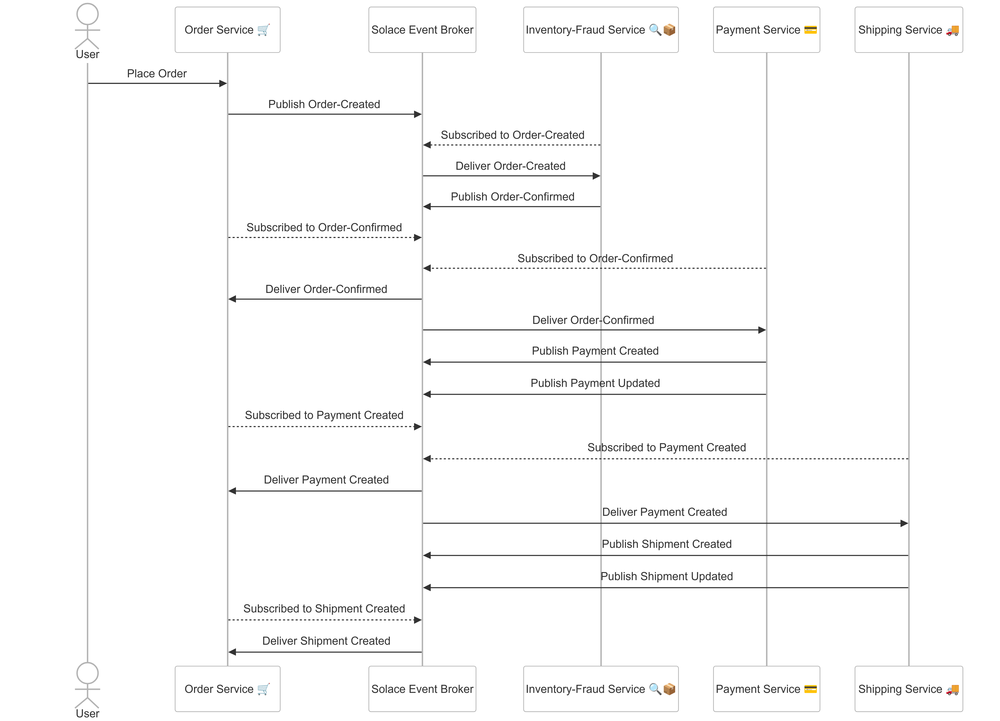
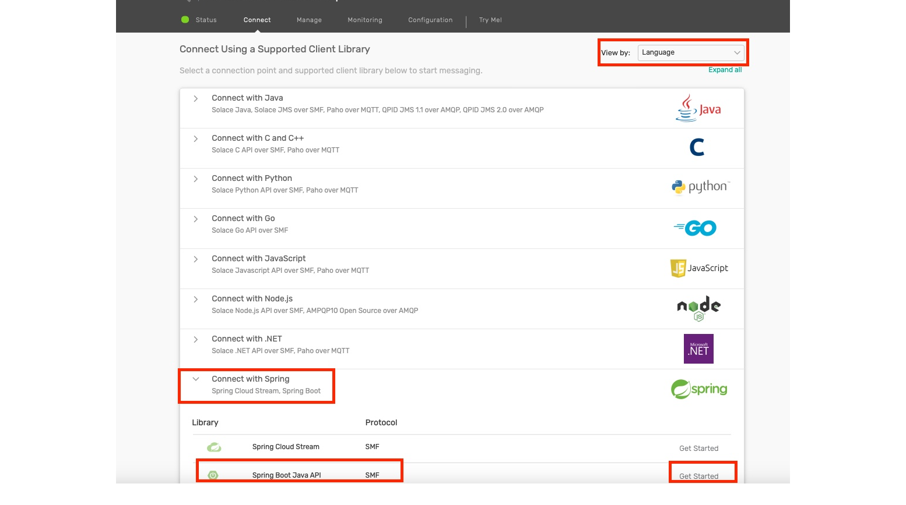

author: HariRangarajan-Solace
summary: This codelab describes the whole technical hands-on part of the Solace Masterclass session
id: solace-masterclass
tags: Solace-Masterclass, Java, Springboot
categories:
environments: Web
status: Published
feedback link: https://github.com/SolaceDev/solace-dev-codelabs/blob/master/markdown/solace-masterclass

# Solace Masterclass

## What you'll learn: Overview


This code lab contains the technical hands on section of the **Solace Masterclass : Implementing
Event-Driven-Architectures**
The participants of this masterclass will be implementing this code lab in the Strigo virtual machine provided as a part
of the masterclass session.
The Strigo virtual machine contains all the software packages required for implementing the hands on code lab.

The agenda of the hands-on is as below :

* Use case introduction
* Cloud account and broker setup
* Event Portal design import
* Application development and testing:
    * Explore the selected use case and understand the interactions between applications and events
    * Implement each application with business code logic as described in the code lab
    * Test the end to end event flow
* Understand the benefits of EDA and Solace in these use cases

## Use case introduction

As a part of the event storming session earlier you would have discussed and brainstormed on few use cases. In this
brainstorming you have identified systems, events and processes involved in the flow(s) and also
designed the topic taxonomy following Solace best practices and recommendations.

In the hands-on section of this masterclass, you can choose one of the below industry domains :

1. Retail
2. Banking

and follow it for implementing. Due to time limit considerations, we will be implementing only a selected subset of the
whole design.

## Solace Cloud Account and broker provisioning

### Step 1 : Solace Cloud Account

In case you do not have an active Solace cloud account, you can register for one via the
link :  [Solace trial account registration](https://console.solace.cloud/login/new-account?product=event-streaming)
Once you have registered and logged in to the Solace cloud account, you can get started with provisioning a Solace
developer grade broker which will be used in the next sections.

### Step 2 : Solace broker provisioning

- Once you are logged in to the Solace cloud portal with the details you registered with , you should see something like
  this:
  

- Click on "Cluster Manager" to go into where you create and manage your broker services.
- Then click the big "+" Plus button to create a new Service.
- Ensure you have selected Developer Service, Amazon Web Services as the cloud service provider,
- and then click the map to find a region close to you:
  

Give your Solace PubSub+ Cloud service instance a name using the naming convention : \
**_FirstName-masterclass**, and then tell it start!.\
For eg. if your name is John Doe, then the name of your broker will be **john-masterclass**

Under the covers, a Solace event broker will be deployed and configured in the cloud you indicated, ports configured,
load-balancer setup, monitoring enabled, etc.
It takes about 5 minutes, and then you'll be ready!
> It is safe to navigate away from the "Solace is starting" page while the broker is being deployed in the cloud. Feel
> free to explore the rest of Solace Mission Control, including the Event Portal!

Once the Solace broker is up and running, click on the broker name and enter it.

- Once your service is deployed and ready, simply click on it to go into it and look at some basic configuration
  information:
  

- Notice some buttons across the top:

* The "Connect" tab shows you all the required connection information for your messaging pub/sub applications (e.g.
  host, username, password, etc.), which we'll need in later steps. The info can be grouped either by protocol or by
  programming language.
* At the top-right, there should be a button saying "Open PubSub+ Broker Manager". Click on that to go into the Manager
  GUI.

- From this webapp, you'll be able to view configured and runtime information, create new queues, create usernames and
  profiles, and other various administrative tasks for the Solace broker.
  

- On the left side of the screen are the main sections to navigate through:

* **Message VPN**: VPN-level stats and config (a Message VPN is a virtual partition of a single broker... one Solace
  broker can host multiple Message VPNs, and each VPN can have different authorization schemes and topic spaces;
  client/messaging application activity happens within the scope of a VPN)
* **Clients**: information about connected and configured client applications
* **Queues**: used for Guaranteed / persistent messaging
* **Connectors**: helpful wizards to connect to a variety of web services
* **Access Control**: where you create new client usernames, ACL profiles, and client profiles
* **Replay**: where you can enable replay, to allow the broker to send previous messages again

## Event Portal design

The Event Portal is a cloud-based tool that simplifies the design of your event-driven architecture (EDA). With the
Event Portal, you can:

* Define and track relationships between applications in a highly decoupled EDA.
* Easily create and manage events using a user-friendly GUI.

In summary, the Event Portal streamlines event management, making it an essential part of your EDA toolkit.

### Step 1 : Import Postman objects

In the virtual machine box provided to you for this masterclass session, a GitHub repository has been checked out.

- Navigate to the folder : <mark>**Solace-masterclass/Postman-collection**</mark>
- Start Postman application
- Import the file with the name **Establish Environment for Event Portal.postman_collection.json** as a Postman
  collection as shown below
  
- Once imported, you should be able to see a Postman collection as below :
  
- Similarly, import the file with the name **Environment Definition.postman_environment.json** as a Postman environment
  as shown below
  
- Once imported, you should be able to see a Postman environment as below :
  

### Step 2 : Create Event Portal token

Follow the steps detailed in the link over
here : [Creating an API Token](https://docs.solace.com/Cloud/ght_api_tokens.htm#Create)
Make sure that you enable the following permissions during the process :

- Event Portal 2.0
    - Designer - Read and Write
    - Runtime Event Manager - Read and Write
    - API Management / Dev Portal - Read and Write
- Event Portal - Read and Write
- Environments - Read and Write
- Account Management - Read and Write

**Keep this token safe as it will not be available again**

### Step 3 : Import Event Portal design

- Open the Postman **environment** that you had imported earlier.
- Paste the token created earlier into the Current value column of the **api_key** variable.
  
- Change the value of the variable **epSampleDomain** to refer to the industry that you want to work with for the course
  of this hands-on exercise. You can choose any of the below values :
    - Retail Industry : `masterclass-retail`
    - Banking industry : `acme-bank`
- Open the Postman **collection** that you had imported earlier.
- Choose the **Training Environment Definition** from the dropdown
- Click on the **Runs** tab and then **Run Collection** button as below :
  
- Click on the **Run Establish Demo Environment** button on the right side without changing any of the scripts or order
  as below :
  
- Once the script has finished execution, switch over to the Solace Cloud Console and Open Event Portal. You should be
  able to see the objects from your selected industry as below :
    - Retail industry :
      
    - Banking industry :
      

- Explore the various EDA artefacts like schemas, events, applications, their relationships and dependencies.

## Use case implementation

Based on use case of your choice : Retail or Banking, please follow the appropriate chapter below.

## Part-A : Retail Domain

### Use case explanation

For the retail domain use case we will be considering a fictitious company called Acme Retail which has been
consistently recognized as the leader in Ecommerce website.
Unfortunately due to legacy and outdated architecture choices and implementation, Acme Retail is encountering major
challenges in expanding their operations as below :

* Order processing errors
* Inventory management issues
* Fraudulent orders

This has impacted their customer's experience, and they are at risk of loosing their customers.
As a solution, they have defined a POC to event enable the Order-to-Cash (OTC) flow. \
Below is the flowchart for this flow :


The dependency between the applications and events are described as below :

* User orders via **Order service**
* **Order service** publishes _Order-Created_ event
* **Inventory-Fraud-Service** subscribes to _Order-Created_, reserves stock and conducts fraud check
* **Inventory-Fraud-Service**:
    * Publishes _Order-Confirmed_ event
    * **Order service** subscribes to _Order-Confirmed_ event for user status updates
* **Payment service** subscribes to _Order-Confirmed_ event and integrates with PSP/Gateway for payment transaction
  processing
* _Order-Confirmed_:
    * Publishes _Payment Created_ event
    * Publishes _Payment Updated_ event
    * **Order service** subscribes to the _Payment Created_ event for user updates
* **Shipping service** subscribes to _Payment Created_ integrates with 3PL or the logistics provider
* **Shipping service**:
    * Publishes _Shipment created_ event
    * Publishes _Shipment updated_ event
    * **Order service** subscribes to the _Shipment created_ for user updates



As a part of the workshop you will have access to prebuilt applications and artefacts which you will be using in this
segment of the workshop.

### 1. Order Service

#### Introduction

The Order-Service acts as the entry point to the whole flow and emulates the user experience of creating a basket and
converting it into an Order.
As described earlier in the over-all flow definition, it creates the _Order-Created_ events and subscribes to other
relevant events which it uses for showing realtime status updates on the order level.

#### How to run ?

- Navigate to the directory : <mark>**Solace-masterclass/retail-domain/order-service**</mark>
- Open a terminal in this folder and run the command : `mvn clean spring-boot:run`
- Once the application is up and running, open the application using the
  url : [http://localhost:8080/](http://localhost:8080/)
- You should see a page which looks like this :
  
- Here you can connect to your Solace cloud broker instance to publish and subscribe events.
- The connection parameters for the Account management application can be captured from below :
  
- Make a note of the following properties in a separate file as they will be required for the following steps:
    - Public Endpoint
    - Username
    - Password
    - Message VPN \
      

- Fill in the connection details in the appropriate text box and click on the **Connect to broker** button
- You should see a screen as below with the appropriate connection status :
  
- Click on the **Create a new basket for ordering** button to simulate a new basket as below:
  
- In the background after 10-15 seconds, the basket is converted into an order and an _Order-Created_ event is
  automatically triggered and the status of the order is automatically updated to CREATED as below :
  
- The _Order-Created_ is published to the topic defined in the Event Portal design as below :
  
- If you observe the logs closely, you will see that the broker sends back an **ACK or Acknowledge** for every
  **Order-Created** event that is being published. This is because we are publishing these events as **Persistent**
  events.
- You can also verify this quickly by using the **Try-Me** tab. How to do this would have been shown in the earlier half
  of the day when we discussed the Solace Broker features.
- Feel free to trigger a few more orders using the UI and observe the payload and topics on which the events are
  published.
  > aside positive If you need help using the **Try-me** then feel free to ask any of the Solace members running the
  masterclass for assistance.

### 2. Inventory-FraudCheck-Service

#### Introduction

As Acme-Retail has been facing major challenges with fraudulent orders and realtime stock management, the stakeholders
want to ensure that the system is not over committing to orders for which there is no stock. Additionally, they also
want to do a fraud check on the customer and order to ensure that only legitimate orders are processed and shipped.

This requirement has been implemented in the **Inventory-FraudCheck-Service** which subscribes to each incoming
_Order-Created_ event and performs the inventory reservation and fraud check. Once this is completed, it triggers an
_Order-Confirmed_ event for further processing.

#### How to run ?

* Open up a new terminal window, make sure not to close the earlier window running the **Order-Service**
* Navigate to the location : <mark>**Solace-masterclass/retail-domain/inventory-fraudcheck-service**</mark>
* Run the command : `mvn clean install`
* Run the command : `java -jar target/inventory-fraudcheck-service-0.0.1-SNAPSHOT.jar -h
  HOST_URL -v VPN-NAME -u USER_NAME -p PASSWORD`

> aside positive You would have used the above connection parameters in the earlier step for the **Order-Service**.

* Keep an eye out on the logs to see if the application is starting up properly as expected.

#### Error ?


Did you get an error as below complaining about the absence of a queue object  :

```Java
2024-03-22T12:42:19.725+01:00  INFO 69425 --- [1_ReactorThread] c.s.jcsmp.impl.flow.BindRequestTask  : Client-1: Got BIND ('#P2P/QUE/all-orders-placed') Error Response (503) - Unknown Queue
com.solace.messaging.PubSubPlusClientException$MissingResourceException: 503: Unknown Queue
at com.solace.messaging.receiver.PersistentMessageReceiverImpl.createSolaceConsumer(PersistentMessageReceiverImpl.java:1359)
at com.solace.messaging.receiver.PersistentMessageReceiverImpl.onStart(PersistentMessageReceiverImpl.java:1169)
at com.solace.messaging.receiver.PersistentMessageReceiverImpl.startAsync(PersistentMessageReceiverImpl.java:436)
```

If you remember about Solace Queue which we discussed earlier, we differentiated them into 2 types :

1. Durable : Mostly created by an administrator and always exists on the broker unless explicitly deleted by an
   administrator
2. Non-Durable : Temporary in nature, created only by an application and its lifespan is linked to the client that
   created it.

Since in the case of Acme Retail, its critical that no messages are lost during application downtime and also no
subscribing application should be
able to delete the queue object, an architectural choice was made to use **Durable - Exclusive** queue configurations.

To fix the error encountered above you need to manually create the Queue object as below :

* Navigate to the **PubSub+ Broker Manager** as below :
  
* Click on the **Queues** on the left menu, to view a listing of the existing queues and then create a new queue by
  clicking on the **+ Queue** button on the right side as below :
  
* Enter the name of the queue : `all-orders-placed`, click create and keeping the default queue settings click **Apply**
  as below :
  

> aside negative Does the **Access Type** parameter ring any bells and how it influences the consumption of events
> from the queue, benefits, limitations, alternative solutions ? \
> Feel free to discuss with your fellow participants and
> the Solace presenters on this differentiating Solace feature.

* Once the queue is created, go into the newly created queue and click on the **Subscriptions** button on the top :
  
* Click on the **+ Subscription** button on the queue and start adding in the topic patterns which you want to be
  attracted in this queue:
  
* Enter the pattern : `acmeretail/onlineservices/order/created/*/*/*` as shown below and click **Create**

> aside negative Do you recollect how Solace topic filtering and matching works ? Feel free to ask any of the Solace
> presenters if you have any queries

* With the above steps, a new queue has been created with the required subscription which can now be connected to by the
  **Order-Service**

> aside positive Make a note of the above steps as you will be creating multiple queues with similar configuration for
> the other applications.

#### Retry deployment

Now that the missing queue has been created with the proper subscription, restart/rerun the
**Inventory-FraudCheck-Service** application using the same command :
`java -jar target/inventory-fraudcheck-service-0.0.1-SNAPSHOT.jar -h HOST_URL -v VPN-NAME -u USER_NAME -p PASSWORD`

#### Output

As you closely observe the logging being displayed on the console, you can see no events coming in from the queue. But
how could that be when you clearly created multiple orders from the **Order-Service** ?


If you think closely, you would realize that when you created those orders the queue **all-orders-placed** had not been
created yet. So obviously all the **Order-created** events even though they were marked as persistent and acknowledged
by the broker were lost as the broker could not find an active consumer for them.

Now that you have created the queue, newly published orders will lie in the queue till a consumer processes and
acknowledges the event.

#### Agile feature enhancement

For each incoming **Order-Created** event, an **Order-Confirmed** event will be published as the stock reservation and
fraud check passes.

This **Order-Confirmed** needs to be subscribed by the **Order Service**. Follow the below steps to enable this flow :

* Create a new queue with the required subscription to ensure that the event is being persisted and made
  available to the **Order-Service** for processing.
    * Follow the above steps for creating a new queue with the below name and subscription :
      | Queue name | Subscription |
      | ---- | ----- |
      | all-order-updates | `acmeretail/onlineservices/order/confirmed/v2/*/*`  |

> aside positive As we incorporate new features, we will update this queue's subscriptions with additional event topics.

* Open the file : **SolaceEventPublisher.java** and make the below updates to the file :
    * In the method **connectToBroker**, add in the code snippet before the return statement :
        ```Java
       final PersistentMessageReceiver orderUpdatesEventReceiver = messagingService.createPersistentMessageReceiverBuilder().build(Queue.durableExclusiveQueue(configProperties.getOrderUpdatesQueueName()));
        orderUpdatesEventReceiver.setReceiveFailureListener(failedReceiveEvent -> System.out.println("### FAILED RECEIVE EVENT " + failedReceiveEvent));
        orderUpdatesEventReceiver.start();
        orderUpdatesEventReceiver.receiveAsync(buildOrdersUpdatesEventHandler(orderUpdatesEventReceiver));
        ```
* Introduce the below two methods in the same SolaceEventPublisher.java :
    ```Java 
    private MessageReceiver.MessageHandler buildOrdersUpdatesEventHandler(final PersistentMessageReceiver orderUpdatesEventReceiver) {
      return (inboundMessage -> {
        try {
            final String inboundTopic = inboundMessage.getDestinationName();
            log.info("Processing message on incoming topic :{} with payload:{}", inboundTopic, inboundMessage.getPayloadAsString());
            boolean eventProcessed = processOrderUpdate(inboundTopic, inboundMessage.getPayloadAsString());
            if (eventProcessed) {
              orderUpdatesEventReceiver.ack(inboundMessage);
            }
        } catch (RuntimeException runtimeException) {
          log.error("Runtime exception encountered while processing incoming event payload :{} on topic:{}. Error is :", inboundMessage.getPayloadAsString(), inboundMessage.getDestinationName(), runtimeException);
        }
      });
    }
    ```

  ```Java
  private boolean processOrderUpdate(final String eventTopic, final String eventJson) {
      try {
          if (eventTopic.contains("order")) {
              final Order order = objectMapper.readValue(eventJson, Order.class);
              final String incomingOrderId = order.getId();
              Order orderObjectFromCache = OrderCache.getInstance().getOrderMap().get(incomingOrderId);
              orderObjectFromCache.setState(Order.OrderState.VALIDATED);
              OrderCache.getInstance().getOrderMap().put(incomingOrderId, orderObjectFromCache);
          } else if (eventTopic.contains("payment")) {
              final Payment payment = objectMapper.readValue(eventJson, Payment.class);
              final String incomingOrderId = payment.getOrderId();
              Order orderObjectFromCache = OrderCache.getInstance().getOrderMap().get(incomingOrderId);
              orderObjectFromCache.setState(Order.OrderState.PAYMENT_PROCESSED);
              OrderCache.getInstance().getOrderMap().put(incomingOrderId, orderObjectFromCache);
          } else if (eventTopic.contains("shipment")) {
              final Shipping shipment = objectMapper.readValue(eventJson, Shipping.class);
              final String incomingOrderId = shipment.getOrderId();
              Order orderObjectFromCache = OrderCache.getInstance().getOrderMap().get(incomingOrderId);
              orderObjectFromCache.setState(Order.OrderState.SHIPPED);
              OrderCache.getInstance().getOrderMap().put(incomingOrderId, orderObjectFromCache);
          }
          return true;
      } catch (JsonProcessingException jsonProcessingException) {
          log.error("Error encountered while processing event:{}, exception:", eventJson, jsonProcessingException);
          return false;
      }
  }
  ```

* In the terminal for the **Order Service** run the command : **mvn clean spring-boot:run**
* Publish a few more orders from the **Order-Service** and see it being processed in the console logs.
* Go back to the **Order-Service** and you will observe that the status of the newly created order is showing as
  VALIDATED as the orders are processed by the **Inventory-FraudCheck-Service**

## Part-A : Retail Domain - Continued

Let us continue with the next applications in the OTC flow :

### 3. Payment Service

Payment-Service-Provider (PSP) or Payment Gateway integrations are inherently complex due to error handling and
transactions management, asynchronous communication, scalability etc. Due to legacy architectural choices, Acme shop has
faced considerable challenges in having a stable payment integration leading to revenue loss and customer
dissatisfaction is many cases. Hence, PSP integration has been a major component of this POC for validating that Solace
and EDA are a viable solution to this problem statement.

#### Introduction

The Payment-Service subscribes to the _Order-Confirmed_ event being published by the **Inventory-Fraudcheck-Service**
and processes the payment integration for that order. \
To denote that the payment processing has begun, it publishes a _Payment Created_ event initially and once the payment
authorization and confirmation comes in a subsequent _Payment Updated_ event is published. \
The _Payment Created_ event is in-turn subscribed by the **Order Service** for user status updates

#### How to run ?

* Open up a new terminal window, make sure not to close the earlier window running the earlier applications
* Navigate to the location : Solace-masterclass/retail-domain/payment-service
* Before starting the application, we need to create the queue that the **payment-service** requires to start.
* Follow the steps from the previous **inventory-fraudcheck-service** section and create a new queue similarly with the
  following name and subscription:
  | Queue name | Subscription |
  | ---- | ----- |
  | all-orders-confirmed | `acmeretail/onlineservices/order/confirmed/*/*/*`  |

> aside positive You can refer to the Event Portal topic design to identify what event and topic taxonomy is in play
> here to understand the Solace topic routing concept better.

* Now that we have configured the queue for feeding the **Payment Service**, we have to make sure that the *
  *Order-Service**
  can also receive the _Payment Created_ events. This is done by updating the subscription list of the
  _all-order-updates_ queue with the topic pattern of the _Payment Created_ events.
* You can do this by :
    * Open the queue configuration for the _all-orders-confirmed_ queue
    * Click on **Subscription** tab
    * Click on **+ Subscription** and add in an additional topic subscription
      as : `acmeretail/onlineservices/payment/created/v1/*/*`

* Once the above queue is created with the proper subscription, run the command : `mvn clean install`
* Run the
  command : `java -jar target/payment-service-0.0.1-SNAPSHOT.jar -h HOST_URL -v VPN-NAME -u USER_NAME -p PASSWORD` and
  observe the console to see what events are getting processed and subsequently produced

#### Testing

To do a complete end-to-end test of the current flow, you can quickly publish a few more orders from the **Order-Service
** and see the following events being produced and consumed across the 3 applications :

1. Order Created
2. Order Confirmed
3. Payment Created
4. Payment Updated

You can also see that the status of the order in the **Order Service** changes from **Validated** to **PAYMENT_PROCESSED
**

### 4. Shipping Service

Similar to the PSP and payment gateway, integrations with third-party logistics (3PL) forms an integral part of the OTC
flow
and is responsible for warehousing, inventory, shipping, tracking, reverse logistics etc.
Considering the criticality of the use case, Acme Retail is opting to include 3PL integration as a part of the POC for
the following reasons :

1. Real time updates
2. Scalability
3. Decoupling of systems
4. Fault tolerance
5. Extensibility

#### Introduction

The **Shipping Service** is the final leg of this POC flow. It subscribes to the _Payment Created_ event, integrates
with the 3PL services and publishes the _Shipment Created_ and _Shipment Updated_ events. \
The **Order Service** subscribes to the _Shipment Created_ for user status updates

#### How to run ?

* Open up a new terminal window, make sure not to close the earlier window running the earlier applications
* Navigate to the location : Solace-masterclass/retail-domain/shipping-service
* Before starting the application, we need to create the queue that the **Shipping service** requires to start.
* Follow the steps from the previous sections and create a new queue similarly with the following name and subscription:
  | Queue name | Subscription | | ---- | ----- |
  | all-payments-confirmed | `acmeretail/onlineservices/payment/*/v1/*/*` |

> aside positive You can refer to the Event Portal topic design to identify what event and topic taxonomy is in play
> here to understand the Solace topic routing concept better.

* Now that we have configured the queue for feeding the **Shipping Service**, we have to make sure that the *
  *Order-Service** can also receive the _Shipment Created_ events. This is done by updating the subscription list of the
  _all-order-updates_ queue with the topic pattern of the Shipment Created events.
* You can do this by :
    * Open the queue configuration for the all-orders-confirmed queue
    * Click on Subscription tab
    * Click on + Subscription and add in an additional topic subscription
      as : `acmeretail/shipping/shipment/created/v1/*/*`
* Once the above queue is created with the proper subscription, run the command : `mvn clean install`
* Run the
  command : `java -jar target/shipping-service-0.0.1-SNAPSHOT.jar -h HOST_URL -v VPN-NAME -u USER_NAME -p PASSWORD`
  and observe the console to see what events are getting processed and subsequently produced.

#### Testing

To do a complete end-to-end test of the current flow, you can quickly publish a few more orders from the **
Order-Service ** and see the following events being produced and consumed across the 4 applications :

* Order Created
* Order Confirmed
* Payment Created
* Payment Updated
* Shipment created
* Shipment updated

You can also see that the status of the order in the Order Service changes from **PAYMENT_PROCESSED** to **SHIPPED**

### Benefits realized

As a result of this POC, Acme Retail has achieved a number of benefits including :

* **Improved scalability**:  Event-driven architectures can be more easily scaled than traditional architectures because
  they are loosely coupled. This means that different parts of the system can be scaled independently without affecting
  other parts.
* **Improved resilience**:  Event-driven architectures are more resilient to failures than traditional architectures.
  This
  is because if one part of the system fails, it will not bring down the entire system. Other parts of the system can
  continue to process events and eventually catch up when the failed part comes back online.
* **Improved agility**:  Event-driven architectures can make it easier to develop and deploy new features. This is
  because
  changes can be made to one part of the system without affecting other parts.
* **Improved visibility**:  Event-driven architectures can provide better visibility into what is happening in the
  system.
  This is because events are a record of what has happened, and they can be used to track the progress of orders,
  identify errors, and audit activity.

## Part-B : Banking domain

### Use case explanation

For the banking domain, we will be working with one of the major banks in the world **Acme Bank** which has been a
leader in online banking and customer journey. They have a large customer base which leads to humungous load of
transactions. \
With an increasing focus on preventing fraudulent transactions, money laundering and to enforce compliance with
regulatory requirements, Acme Bank has to comply with legal and security requirements where it performs checks on all
the transactions being performed in its system.

On the roadmap to comply with these requirements, Acme Bank is currently facing the following challenges :

* Integration Complexity
* Data Silos
* Legacy Systems
* Real time processing

As a solution, Acme Bank has defined a POC to event enable the account handling, transaction management and fraud
detection systems. This POC's use case flowchart is as below :


The application and event dependencies are defined as below :

* The **Account Management** application triggers off an _Account Applied_ event based on user request.
* After background processing, the flow completes with an account being opened and a corresponding _Account Opened_
  event being triggered.
* The **Core Banking** application subscribes to the Account related events and publishes events related to various
  transactions (_Transfer_, _Withdrawal_ and _Deposit_ ) being performed on the accounts
* The account's transaction related events are subscribed to by the **Fraud Detection** application which performs due
  diligence on these transactions and flags potential fraudulent transactions by triggering a _Fraud Detected_ event
* The **Account Management** application subscribes to this _Fraud Detected_ event and after background processing
  triggers a _Fraud Confirmed_ event and suspends the corresponding account by triggering an _Account Suspended_ event


### 1. Account Management application

#### Introduction

The **Account Management** application acts as the entry point for the whole flow and emulates the user experience of
applying for a bank account and the background processing associated with that account.
As described earlier in the overall flow, it starts with triggering an _Account Applied_ followed by a corresponding
_Account Opened_ event.
It also subscribes to other relevant Account related events namely the _Fraud Detected_ event and triggers a _Fraud
Confirmed_ and corresponding _Account Suspended_ events.

#### How to run ?

- Navigate to the directory : <mark>**Solace-masterclass/Banking/account-management**</mark>
- Open a terminal in this folder and run the command : `mvn clean spring-boot:run`
- Once the application is up and running, open the application using the
  url : [http://localhost:8080/](http://localhost:8080/)
- You should see a page which looks like this :
  
- Here you can connect to your Solace cloud broker instance to publish and subscribe events.
- The connection parameters for the Account management application can be captured from below :
  
- Make a note of the following properties in a separate file as they will be required for the following steps:
    - Public Endpoint
    - Username
    - Password
    - Message VPN \
      

- Fill in the connection details in the appropriate text box and click on the **Connect to broker** button
- You should see a screen as below with the appropriate connection status :
  
- Click on the **Apply for a new Acme Bank account** to generate a new account application and trigger an **Account
  applied** event and see a screen as below :
  
- In the background after 10 seconds, a second **Account opened** event is automatically triggered and the status of the
  new account is automatically updated to OPENED as below :
  
- All the account related events are published to the topics defined in the Event Portal design as below :
  
- You can also verify this quickly by using the **Try-Me** tab. How to do this would have been shown in the earlier half
  of the day when we discussed the Solace Broker features.

> aside negative If you need help using the **Try-me** then feel free to ask any of the Solace members running the
> masterclass for assistance.

### 2. Core Banking

#### Introduction

The Core Banking application is responsible for the execution of all the transactions being performed on the bank
accounts like transfers, deposits and withdrawals.
The Core Banking Application randomly generates the above transactions on all the accounts which are active.

#### How to run ?

* Open up a new terminal window, make sure not to close the earlier window running the Account Management application
* Navigate to the directory : <mark>**Solace-masterclass/Banking/core-banking**</mark>
* Run the command : `mvn clean install`
* Run the
  command : `java -jar core-banking/target/core-banking-0.0.1-SNAPSHOT.jar -h HOST_URL -v VPN-NAME -u USER_NAME -p PASSWORD`

> aside positive You would have used the above connection parameters in the earlier step for the Account Management
> application

* Keep an eye out on the logs to see if the application is starting up properly as expected.

#### Error ?


Did you get an error as below complaining about the absence of a queue object  :

  ```Java
  2024-03-22T12:42:19.725+01:00  INFO 69425 --- [1_ReactorThread] c.s.jcsmp.impl.flow.BindRequestTask  : Client-1: Got BIND ('#P2P/QUE/accounts-opened') Error Response (503) - Unknown Queue
  com.solace.messaging.PubSubPlusClientException$MissingResourceException: 503: Unknown Queue
  at com.solace.messaging.receiver.PersistentMessageReceiverImpl.createSolaceConsumer(PersistentMessageReceiverImpl.java:1359)
  at com.solace.messaging.receiver.PersistentMessageReceiverImpl.onStart(PersistentMessageReceiverImpl.java:1169)
  at com.solace.messaging.receiver.PersistentMessageReceiverImpl.startAsync(PersistentMessageReceiverImpl.java:436)
  ```

If you remember about Solace Queue which we discussed earlier, we differentiated them into 2 types :

1. Durable : Mostly created by an administrator and always exists on the broker unless explicitly deleted by an
   administrator
2. Non-Durable : Temporary in nature, created only by an application and its lifespan is linked to the client that
   created it.

Since in the case of the Acme Bank, its critical that no messages are lost during application downtime and also no
subscribing application should be able to delete the queue object, an architectural choice was made to use **Durable -
Exclusive** queue configurations.

To fix the error encountered above you need to manually create the Queue object as below :

* Navigate to the **PubSub+ Broker Manager** as below :
  
* Click on the **Queues** on the left menu, to view a listing of the existing queues and then create a new queue by
  clicking on the **+ Queue** button on the right side as below :
  
* Enter the name of the queue : `accounts-opened`, click create and keeping the default queue settings click **Apply**
  as below :
  

> aside negative Does the **Access Type** parameter ring any bells and how it influences the consumption of events
> from the queue, benefits, limitations, alternative solutions ? \
> Feel free to discuss with your fellow participants and
> the Solace presenters on this differentiating Solace feature.

* Once the queue is created, go into the newly created queue and click on the **Subscriptions** button on the top :
  
* Click on the **+ Subscription** button on the queue and start adding in the topic patterns which you want to be
  attracted in this queue:
  
* Enter the pattern : `acmebank/solace/account/opened/v1/*` as shown below and click **Create**

> aside negative Do you recollect how Solace topic filtering and matching works ? Feel free to ask any of the Solace
> presenters if you have any queries

* With the above steps, a new queue has been created with the required subscription which can now be connected to by the
  **Core-Banking**

> aside positive Make a note of the above steps as you will be creating multiple queues with similar configuration for
> the other applications.

#### Retry deployment

Now that the missing queue has been created with the proper subscription, restart/rerun the **Core Banking**
application using the same command :
`java -jar core-banking/target/core-banking-0.0.1-SNAPSHOT.jar -h HOST_URL -v VPN-NAME -u USER_NAME -p PASSWORD`

#### Output

As you closely observe the logging being displayed on the console, you can see no events coming in from the queue. But
how could that be when you clearly created multiple orders from the **Account Management Application** ?


If you think closely, you would realize that when you created those orders the queue **accounts-opened** had not been
created yet. So obviously all the **Account Opened** events even though they were marked as persistent and acknowledged
by the broker were lost as the broker could not find an active consumer for them.

Now that you have created the queue, newly published orders will lie in the queue till a consumer processes and
acknowledges the event.

So trigger a few more Account creation requests from the **Account Management Application** and see the **Account Opened
** events being triggered. Once this happens, the **Core-Banking** application should receive those events and start
publishing transaction events for the active accounts.

### 3. Fraud Detection

With an increasing focus on preventing fraudulent transactions, money laundering and to enforce compliance with
regulatory requirements, Acme Bank has to comply with legal and security requirements where it performs checks on all
the transactions being performed in its system.

This realtime monitoring of transactions is being handled by the **Fraud Detection** service. It subscribes to all the
transaction events being published by the **Core Banking** application and flags suspicious/potentially fraudulent
transactions by publishing a _Fraud Detected_ event.

#### How to run ?

* Open up a new terminal window, make sure not to close the earlier window running the earlier applications
* Navigate to the directory : <mark>**Solace-masterclass/Banking/fraud-detection**</mark>
* Before starting the application, we need to create the queue that the **Fraud Detection** service requires to start.
* Follow the steps from the previous **Core-Banking** section and create a new queue similarly with the
  following name and subscription:
  | Queue name | Subscription |
  | ---- | ----- |
  | all-transactions | `acmebank/solace/core/*/v1/*/*/*`  |

> aside negative Make sure to compare the above subscription with the Event Portal design and understand what exactly
> are the events that you are subscribing to in this queue. If you have any questions, feel free to confer with the
> fellow participants or one of the Solace team members.

* Now that you have created the queue object for feeding the **Fraud Detection** service, we can build and start the
  application.
* Run the command : `mvn clean install`
* Run the
  command : `java -jar target/fraud-detection-0.0.1-SNAPSHOT.jar -h HOST_URL -v VPN-NAME -u USER_NAME -p PASSWORD`

#### Testing and output

* As the application starts, you should be able to see various transaction events like _Transfers_, _Deposit_ and
  _Withdrawals_ being published on the active accounts.
* The **Fraud Detection** application will start flagging potential fraudulent transactions as per its business logic.

### 4. Completing the flow

Event-Driven Architecture enables modular, iterative development, and fosters innovation by providing a scalable,
resilient, and flexible framework for building modern software systems. By embracing EDA principles and practices,
organizations can drive agility, responsiveness, and innovation in their software development processes.

Till now, we have :

1. Opened new accounts
2. Performed transactions on these active accounts
3. Performed fraud detection checks on these transactions and flagged suspicious transactions

The next step are performing a validation of those suspicious transactions and taking action on the linked accounts.
Let's start with implementing this feature flow across multiple applications in a modular fashion :

#### 4.1 Account Management application

##### New feature

The **Account Management** application subscribes to the _Fraud Detected_ event and validates if the transaction is
actually fraudulent. If found fraudulent, a corresponding _Fraud Confirmed_ event is triggered and the linked account is
suspended by publishing an _Account Suspended_ event.

* Start with creating a new queue for subscribing to the _Fraud Detected event_
* Follow the steps from the previous sections and create two new queues similarly with the following name and
  subscription:
  | Queue name | Subscription | | ---- | ----- |
  | fraud-detected-events | `acmebank/solace/fraud/detected/v1/*/*/*` |
  | accounts-suspended | `acmebank/solace/account/suspended/v1/*` |

> aside positive You can refer to the Event Portal topic design to identify what event and topic taxonomy is in play
> here to understand the Solace topic routing concept better.

* Open the file named SolaceEventPublisher.java in the path :
  account-management/src/main/java/com/solace/acme/bank/accountmanagement/service/SolaceEventPublisher.java
    * Add the following code block in the method **connectToBroker** :
      ```Java
          final PersistentMessageReceiver fraudDetectedEventReceiver = messagingService.createPersistentMessageReceiverBuilder().build(Queue.durableExclusiveQueue(configProperties.getSolaceFraudDetectedEventQueue()));
          fraudDetectedEventReceiver.setReceiveFailureListener(failedReceiveEvent -> log.error("### FAILED RECEIVE EVENT " + failedReceiveEvent));
          fraudDetectedEventReceiver.start();
          fraudDetectedEventReceiver.receiveAsync(buildFraudDetectedEventHandler(fraudDetectedEventReceiver));
      ```
        * Introduce the below new methods in the SolaceEventPublisher.java file :
            ```Java
                  private MessageReceiver.MessageHandler buildFraudDetectedEventHandler(PersistentMessageReceiver fraudDetectedEventReceiver) {
                      return (inboundMessage -> {
                          try {
                              final String inboundTopic = inboundMessage.getDestinationName();
                              log.info("Processing message on incoming topic :{} with payload:{}", inboundTopic, inboundMessage.getPayloadAsString());
                              boolean eventProcessed = fraudService.processFraudDetectedEvent(inboundMessage.getPayloadAsString());
                              if (eventProcessed) {
                                  fraudDetectedEventReceiver.ack(inboundMessage);
                              }
                          } catch (RuntimeException runtimeException) {
                              log.error("Runtime exception encountered while processing incoming event payload :{} on topic:{}. Error is :", inboundMessage.getPayloadAsString(), inboundMessage.getDestinationName(), runtimeException);
                          }
                      });
                  }
          ```
          ```Java
                public void publishFraudConfirmedEvent(final FraudConfirmed fraudConfirmed) {
                  try {
                      String fraudConfirmedJson = objectMapper.writeValueAsString(fraudConfirmed);
                      final OutboundMessage message = messageBuilder.build(fraudConfirmedJson);
                      final Map<String, Object> params = new HashMap<>();
                      params.put("accountID", fraudConfirmed.getAccountNum());
                      params.put("transactionID", fraudConfirmed.getTransactionNum());
                      params.put("amount", fraudConfirmed.getAmount());
                      String topicString = StringSubstitutor.replace(configProperties.getSolaceFraudConfirmedTopic(), params, "{", "}");
                      publisher.publish(message, Topic.of(topicString));
                      log.info("Published FraudConfirmed event :{} on topic : {}", fraudConfirmedJson, topicString);
                  } catch (final RuntimeException runtimeException) {
                      log.error("Error encountered while publishing event, exception :", runtimeException);
                  } catch (JsonProcessingException jsonProcessingException) {
                      log.error("Error encountered while converting fraudConfirmed to JSON string, exception :", jsonProcessingException);
                  }
                }
          ```
          ```Java
              public void publishAccountSuspendedEvent(final AccountAction accountSuspendedAction) {
                try {
                    String accountSuspendedActionJson = objectMapper.writeValueAsString(accountSuspendedAction);
                    final OutboundMessage message = messageBuilder.build(accountSuspendedActionJson);
                    final Map<String, Object> params = new HashMap<>();
                    params.put("accountID", accountSuspendedAction.getAccountNum());
                    String topicString = StringSubstitutor.replace(configProperties.getSolaceAccountSuspendedTopic(), params, "{", "}");
                    publisher.publish(message, Topic.of(topicString));
                    log.info("Published AccountSuspended event :{} on topic : {}", accountSuspendedActionJson, topicString);
                } catch (final RuntimeException runtimeException) {
                    log.error("Error encountered while publishing event, exception :", runtimeException);
                } catch (JsonProcessingException jsonProcessingException) {
                    log.error("Error encountered while converting accountSuspendedActionEvent to JSON string, exception :", jsonProcessingException);
                }
            }
          ```
* Open the file named FraudService.java in the path :
  account-management/src/main/java/com/solace/acme/bank/accountmanagement/service/FraudService.java
    * Introduce the following three new method as below in the file :
        ```Java
              public boolean processFraudDetectedEvent(final String incomingFraudDetectedEventJson) {
                try {
                    final FraudDetected fraudDetectedEvent = objectMapper.readValue(incomingFraudDetectedEventJson, FraudDetected.class);
          
                    boolean isFraud = random.nextBoolean();
                    if (isFraud) {
                        log.info("Flagging potential fraud as confirmed :{}", fraudDetectedEvent);
                        createAndPublishFraudConfirmedEvent(fraudDetectedEvent);
                        accountService.processAccountSuspensionRequest(fraudDetectedEvent.getAccountNum());
                    }
                    return true;
                } catch (JsonProcessingException jsonProcessingException) {
                    log.error("Error encountered while processing FraudDetected event:{}, exception:", incomingFraudDetectedEventJson, jsonProcessingException);
                    return false;
                }
              }
        ```
        ```Java
              private void createAndPublishFraudConfirmedEvent(final FraudDetected fraudDetected) {
                final FraudConfirmed fraudConfirmed = createFraudConfirmedInstance(fraudDetected);
                solaceEventPublisher.publishFraudConfirmedEvent(fraudConfirmed);
              }
      ```
      ```Java
              private FraudConfirmed createFraudConfirmedInstance(final FraudDetected fraudDetected) {
              return Instancio.of(FraudConfirmed.class)
              .generate(field(FraudConfirmed::getDetectionNum), gen -> gen.ints())
              .set(field(FraudConfirmed::getTransactionNum), fraudDetected.getTransactionNum())
              .set(field(FraudConfirmed::getAccountNum), fraudDetected.getAccountNum())
              .set(field(FraudConfirmed::getTransactionType), fraudDetected.getTransactionType())
              .set(field(FraudConfirmed::getAmount), fraudDetected.getAmount())
              .set(field(FraudConfirmed::getCurrency), fraudDetected.getCurrency())
              .set(field(FraudConfirmed::getIncidentDescription), "Confirmed fraudulent transaction")
              .generate(field(FraudConfirmed::getFraudConfirmedBy), gen -> gen.oneOf("John Doe", "Jane Doe", "Comptroller"))
              .set(field(FraudConfirmed::getIncidentTimestamp), fraudDetected.getTimestamp())
              .set(field(FraudConfirmed::getTimestamp), generateCurrentTimestamp())
              .create();
              }
      ```
* Open the file named AccountService.java in the path :
  account-management/src/main/java/com/solace/acme/bank/accountmanagement/service/AccountService.java
    * Introduce the following 2 methods in the class :
      ```Java
          public void processAccountSuspensionRequest(final String accountNumber) {
            log.info("Processing account suspension");
            final AccountAction accountSuspendedAction = createAccountSuspendedEventPayload(accountNumber);
            solaceEventPublisher.publishAccountSuspendedEvent(accountSuspendedAction);
            Account account = AccountsList.getInstance().getAccountsList().get(accountNumber);
            account.setCurrentStatus(Account.Status.SUSPENDED);
            account.setComment("Account suspended due to potential suspicious/fraudulent transaction(s)");
            AccountsList.getInstance().getAccountsList().put(accountNumber, account);
          }
      ```

      ```Java
          private AccountAction createAccountSuspendedEventPayload(final String accountNumber) {
            return AccountAction.builder()
                    .accountNum(accountNumber)
                    .accountAction(Account.Status.SUSPENDED.toString())
                    .timestamp(generateCurrentTimestamp())
                    .build();
          }
      ```

#### 4.2 Core Banking

The _Account Suspended_ event published in the previous step is subscribed to by the **Core Banking** application which
stops all transactions on that account number immediately.

* Start with creating a new queue for subscribing to the _Account Suspended_ event
* Follow the steps from the previous sections and create two new queues similarly with the following name and
  subscription:
  | Queue name | Subscription | | ---- | ----- |
  | accounts-suspended | `acmebank/solace/account/suspended/v1/*` |

> aside positive You can refer to the Event Portal topic design to identify what event and topic taxonomy is in play
> here to understand the Solace topic routing concept better.

* Open the file SolaceEventHandler.java at the location :
  core-banking/src/main/java/com/solace/acme/bank/corebanking/service/SolaceEventHandler.java
    * Add in the following code snippet in the **connectAndConfigureConsumers** method :
      ```Java
          final PersistentMessageReceiver accountSuspendedEventReceiver = messagingService.createPersistentMessageReceiverBuilder().build(Queue.durableExclusiveQueue(configProperties.getAccountsSuspendedQueueName()));
          accountSuspendedEventReceiver.setReceiveFailureListener(failedReceiveEvent -> System.out.println("### FAILED RECEIVE EVENT " + failedReceiveEvent));
          accountSuspendedEventReceiver.start();
          accountSuspendedEventReceiver.receiveAsync(buildAccountsSuspendedEventHandler(accountSuspendedEventReceiver)); 
      ```
    * Add in the following method in the same file :
      ```Java
          private MessageReceiver.MessageHandler buildAccountsSuspendedEventHandler(PersistentMessageReceiver accountOpenedEventReceiver) {
            return (inboundMessage -> {
                try {
                    final String inboundTopic = inboundMessage.getDestinationName();
                    log.info("Processing message on incoming topic :{} with payload:{}", inboundTopic, inboundMessage.getPayloadAsString());
                    boolean eventProcessed = accountsEventProcessor.processAccountSuspendedEvent(inboundMessage.getPayloadAsString());
                    if (eventProcessed) {
                        accountOpenedEventReceiver.ack(inboundMessage);
                    }
                } catch (RuntimeException runtimeException) {
                    log.error("Runtime exception encountered while processing incoming event payload :{} on topic:{}. Error is :",
                            inboundMessage.getPayloadAsString(), inboundMessage.getDestinationName(), runtimeException);
                }
            });
          }
      ```
* Open the file AccountsEventProcessor.java at the location :
  core-banking/src/main/java/com/solace/acme/bank/corebanking/service/AccountsEventProcessor.java
    * Add in the following two methods in the same file :
      ```Java
          public boolean processAccountOpenedEvent(final String accountOpenedActionEventPayload) {
              try {
                  AccountAction accountOpenedEvent = objectMapper.readValue(accountOpenedActionEventPayload, AccountAction.class);
                  Account openedAccount = Account.builder().accountNumber(accountOpenedEvent.getAccountNum()).currentStatus(Account.Status.OPENED).build();
                  AccountsList.getInstance().getAccountsList().put(openedAccount.getAccountNumber(), openedAccount);
                  return true;
              } catch (JsonProcessingException jsonProcessingException) {
                  log.error("Error encountered while processing AccountOpened event:{}, exception:", accountOpenedActionEventPayload, jsonProcessingException);
                  return false;
              }
          }
      ```

      ```Java
          public boolean processAccountSuspendedEvent(final String accountSuspendedActionEventPayload) {
              try {
                  AccountAction accountSuspendedEvent = objectMapper.readValue(accountSuspendedActionEventPayload, AccountAction.class);
                  Account suspendedAccount = Account.builder().accountNumber(accountSuspendedEvent.getAccountNum()).currentStatus(Account.Status.SUSPENDED).build();
                  AccountsList.getInstance().getAccountsList().put(suspendedAccount.getAccountNumber(), suspendedAccount);
                  log.info("After processing the updated map is :{}", AccountsList.getInstance().getAccountsList());
                  return true;
              } catch (JsonProcessingException jsonProcessingException) {
                  log.error("Error encountered while processing AccountOpened event:{}, exception:", accountSuspendedActionEventPayload, jsonProcessingException);
                  return false;
              }
         }
      ```

#### 4.3 Testing the flow

* In the terminal where you were building the **Account-Management** application, run the
  command  : `mvn clean spring-boot:run`
* In the terminal where you were building the **Core-Banking** application, run the commands :
    * `mvn clean install`
    * `java -jar core-banking/target/core-banking-0.0.1-SNAPSHOT.jar -h HOST_URL -v VPN-NAME -u USER_NAME -p PASSWORD`
* Start with a clean flow and kick off the flow by creating multiple new accounts in the **Account Management**
  application
* As the accounts get confirmed, transactions will start flowing through the **Core-Banking** and **Fraud-Detection**
  applications.
* The **Fraud-Detection** application will flag some of these transactions as fraudulent
* The **Account Management** will verify the report of these fraudulent transactions and where applicable will suspend
  the linked accounts, and you can see the status of these accounts being updated in the accounts table.
* Once the accounts are suspended, the **Core-Banking** application will not allow transactions on these accounts

### Benefits realized

As a result of this POC, Acme Bank has achieved a number of benefits including :

* **Improved Efficiency**: By automating tasks and streamlining processes, event-driven architectures can help banks to
improve efficiency and reduce costs. For example, in the diagram you sent, the event of an account being applied for
could trigger a series of automated tasks, such as verifying the applicant's identity and running a credit check. This
would eliminate the need for manual intervention and could significantly speed up the account opening process.
* **Enhanced Customer Experience**: Event-driven architectures can also help banks to improve the customer experience. For
example, if a customer deposits a check, the bank could use an event-driven architecture to send them a notification
that the deposit has been received and credited to their account. This would provide customers with real-time
information about their accounts and help to improve their overall satisfaction with the bank.
* **Reduced Risk**: Event-driven architectures can also help banks to reduce risk. For example, in the diagram you sent, the
event of a fraud attempt could trigger a series of automated actions, such as blocking the transaction and notifying the
customer. This would help to prevent fraudulent transactions from being completed and could save the bank money.

## 6. Takeaways and benefits

Below are some of the key takeaways from this masterclass :
* **Understanding Event-Driven Architecture (EDA)**: Gain insights into the principles, patterns, and benefits of event-driven architecture, and learn how it enables organizations to build scalable, resilient, and responsive systems.

* **Hands-on Experience with Solace**:
  * Learn how to set up and configure Solace messaging infrastructure to support event-driven applications.
  * Explore Solace's features and capabilities, including message routing, topic-based subscriptions, and event-driven integration. 
* Practical Application Development:
  * Acquire practical skills in designing, developing, and testing event-driven applications using Solace messaging. 
  * Understand the end-to-end event flow and learn how to implement business logic within event-driven microservices.
* Unlocking Business Value with EDA and Solace:
  * Discover the business benefits of adopting event-driven architecture and leveraging Solace messaging for various use cases.
  * Learn how EDA and Solace enable organizations to innovate faster, respond to market changes more effectively, and deliver superior customer experiences.


Thanks for participating in this masterclass ! Let us know what you thought in
the [Solace Community Forum](https://solace.community/)! If you found any issues along the way we'd appreciate it if
you'd raise them by clicking the Report a mistake button at the bottom left of this code lab.
