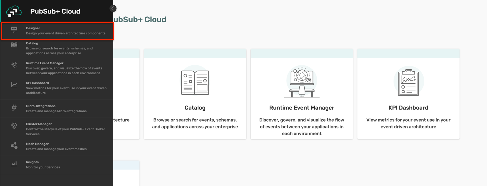
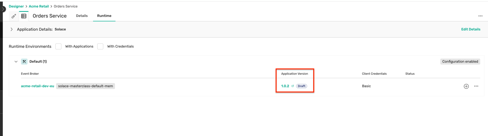
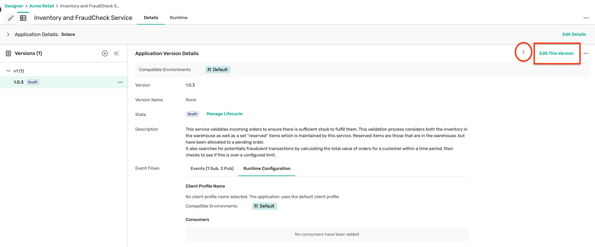
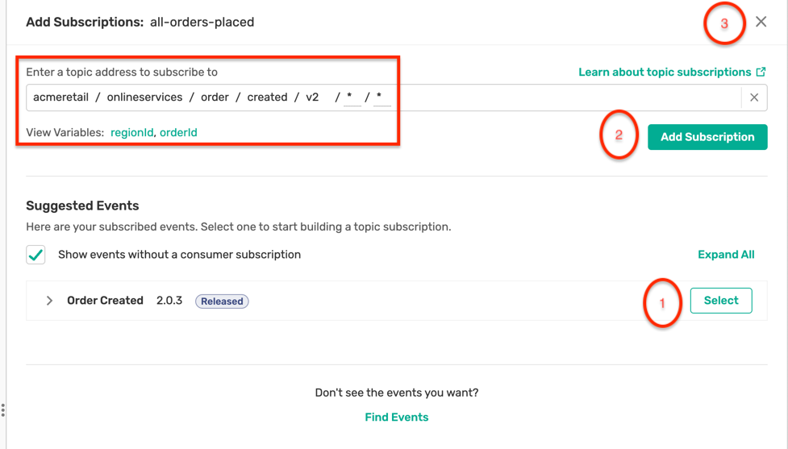
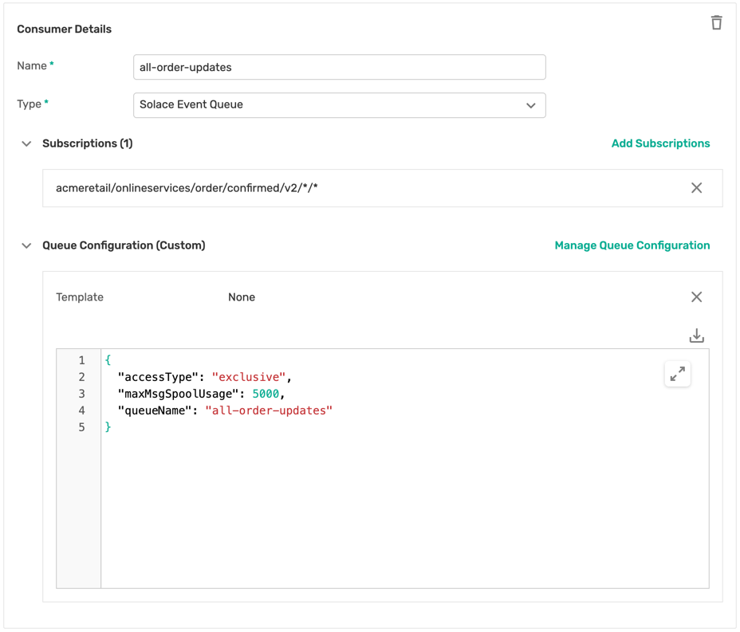
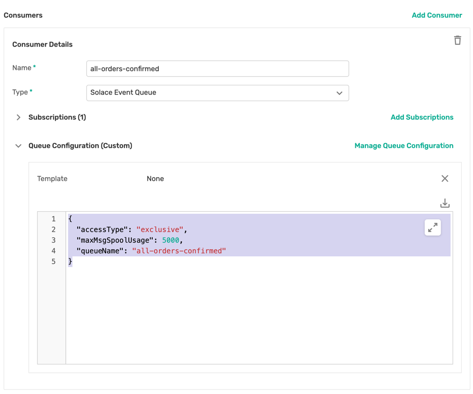
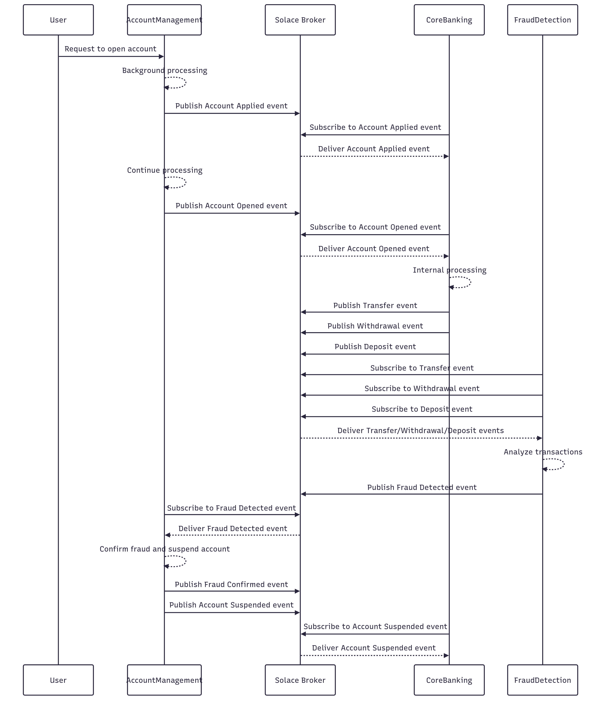
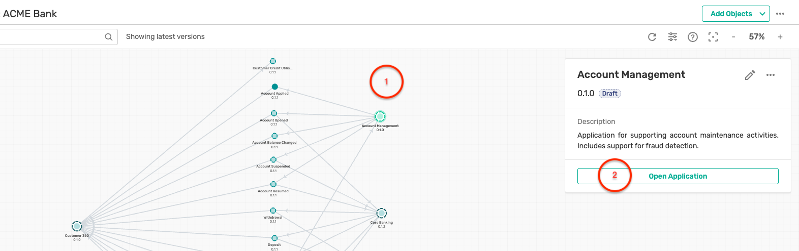

author: HariRangarajan-Solace
summary: This Codelab describes the whole
technical hands-on part of the Solace Masterclass session
id: solace-masterclass
tags: Solace-Masterclass, Java, Springboot
categories: solace
environments: Web
status: Published
feedback link: https://github.com/SolaceDev/solace-dev-codelabs/blob/master/markdown/solace-masterclass

# Solace Masterclass

## What you'll learn: Overview

Duration: 0:01:00


This Codelab contains the technical hands-on section of the **Solace Masterclass: Implementing Event-Driven-Architectures**
Participants of this masterclass will be implementing this Codelab in a Github Codespace environment provided as a part
of the masterclass session.
The codespace contains all the software packages required for implementing the hands-on Codelab.

The agenda of the hands-on is as below :

* Use case introduction
* Cloud account and broker setup
* Event Portal design import
* Application development and testing:
    * Explore the selected use case and understand the interactions between applications and events
    * Implement each application with business code logic as described in the Codelab
    * Test the end to end event flow
* Understand the benefits of EDA and Solace in these use cases

## Use case introduction

Duration: 0:01:00

As a part of the event storming session earlier you would have discussed and brainstormed on few use cases. In this
brainstorming you have identified systems, events and processes involved in the flow(s) and also
designed the topic taxonomy following Solace best practices and recommendations.

In the hands-on section of this masterclass, you can choose one of the below industry domains :

1. Retail
2. Banking

and follow it for implementing.
Due to time limit considerations, we will be implementing only a selected subset of the whole design.

## Solace Cloud Account and broker provisioning

Duration: 0:25:00

### Solace Cloud Account

In case you do not have an active Solace cloud account, you can register for one via the
link: [Solace trial account registration](https://console.solace.cloud/login/new-account?product=event-streaming). \
You can log in to the newly created Solace cloud account using the
link : [Solace Cloud Account Login](https://console.solace.cloud/home?login=true). 
Once you have registered and logged in to the Solace cloud account, you can get started with provisioning a Solace
developer grade broker which will be used in the next sections.

### Provision Your First Solace PubSub Broker

Duration: 10 minutes

#### Navigate to Cluster Manager

1. In the Solace Cloud Console, click **Cluster Manager** in the left navigation
   
2. Click **Create Service** (or the **+** button if you have existing services)
   

#### Configure Your Service

1. Fill in the service configuration details:
  - Name : Choose a concise name (e.g., `solace-masterclass`)
  - Environment : Leave as **Default**
  - Cloud : Choose your preferred cloud provider (AWS, Azure, or GCP)
  - Region : Select a region closest to your location
  - Broker Release : Leave as default (latest stable)
  - Service Type : Select **Developer** (free tier)
    

2. Click **Create Service**

#### Wait for Provisioning

1. The service will take 3-5 minutes to provision
2. Status will show as **Creating...**
   
3. Once complete, the broker details page will load
   

#### Explore Your Broker

1. Navigate through the tabs:
  - **Connect**: Connection details and credentials
    
  - **Manage**: Service management and configuration
    

> aside positive **Checkpoint**: You should now have a running PubSub+ broker service with status "Running" in your
> Cluster Manager.

---

### Configure environment and modelled event mesh

#### Environment Setup

Environments in Solace Cloud represent the runtime environments within your organisation. For example, you may have

- Multiple development environments
- Multiple testing environments
- A Staging or Pre-Production
- A Production environment

1. In the Solace Cloud Console, navigate to the **Environments** tab
   
2. In the **Environments** tab, there is a default environment created for you called "Default"
   
3. Click on the **...** buttons next to the Default environment and select **Runtime Configuration Settings**
   
4. Click on the **Auto on Promotion** radio button to enable automatic promotion of configuration changes from Event
   Portal to the associated PubSub+ Cloud broker
   
5. Click **Save** to save the changes
6. Optional: You can edit some of the environment details like name and description by clicking on the **Edit** button
   under the **...** menu
   

#### Modeled Event Mesh Setup

A modeled event mesh represents an actual event mesh or event flow operating in a specific runtime environment. Modeled
event meshes help you define and visualise event flows between publishing and subscribing applications within your
event-driven architecture (EDA).

1. In the Solace Cloud Console, navigate to the **Runtime Event Manager** tab
   
2. Click on the **Create Modeled Event Mesh** button
   
3. Fill in the details for the modeled event mesh:
  - Name : `Dev-Mesh`
  - Type : `Solace`
  - Description : `Development Modeled Event Mesh`
  - Environment : Select `Default` environment
4. Click **Create** to create the modeled event mesh
   
5. You will see the newly created modeled event mesh in the list
   
6. Click on the modeled event mesh name to view its details
7. Under the **Event Broker Connections** tab, click on **Connect Event Broker**
   
8. Select the PubSub+ Cloud broker you created earlier (e.g., `ep-codelab`) and click **Add**
   
9. You should now see the broker connection listed under the **Event Broker Connections** tab
   

> aside positive **Checkpoint**: You should now have an environment configured with automatic promotion enabled and a
> modeled event mesh connected to your PubSub+ Cloud broker.

## Event Portal design

Duration: 0:10:00

The Event Portal is a cloud-based tool that simplifies the design of your event-driven architecture (EDA). With the
Event Portal, you can:
* Define and track relationships between applications in a highly decoupled EDA.
* Create and manage events using a user-friendly GUI.
In summary, the Event Portal streamlines event management, making it an essential part of your EDA toolkit.

### Step 1 : Import Event Portal designs

- From the Solace cloud account screen, click on the **Designer** button and enter the Event Portal's Designer page as
  below : 
- Based on the choice of your domain, you can select one of the two domain files as below and download it from the links : \
      - Banking Industry : [Download Banking Industry App Domain File](https://github.com/SolaceLabs/solace-masterclass-code/blob/main/ep-app-domains/Acme_Bank_App_Domain.json) \
      - Retail industry : [Download Retail Industry App Domain File](https://github.com/SolaceLabs/solace-masterclass-code/blob/main/ep-app-domains/Acme_Retail_App_Domain.json)
- Click on the **Import Application Domains** button by clicking on the three dots in the top right corner as below :
  
- A file selector dialog box will be displayed so that you can select the application domain file of your choice.
- Select on a file and click  **Open**, this will result in the application domain being imported as below :
  

> aside positive you can import as many application domains as you wish,
> but for time considerations it's advisable to choose one example for implementation.

> aside negative Please note that the initial visualisation of the application domain might be a bit different from the screenshot. 
> You can rearrange the objects as per your preference and save the layout for easier navigation in the future.

- Inside the application domain, you should be able to see the objects from your selected industry as below :
    - Retail industry :
      
    - Banking industry :
      

- Explore the various EDA artifacts like schemas, events, applications, their relationships and dependencies.

> aside positive This is an interesting step from an architecture perspective as the Event Portal is a unique tool
> which helps you visualize the state of your EDA landscape, identify dependencies and versions, etc.

## Use case implementation

Duration: 0:10:00

For the hands-on excercise, we will be using GitHub Codespaces which provides a cloud-based development environment with all the necessary tools and software pre-installed. 

### Setup GitHub Codespace

> aside negative Please note that using GitHub Codespace requires a GitHub account. \
> If you do not have a GitHub account, you can create one for free by visiting [GitHub Sign Up](https://github.com/signup) \
> If your enterprise GitHub account does not have access to GitHub Codespaces, you can use a personal GitHub account to access the Codespaces environment for this workshop.

#### Step 1: **Open the Workshop Repository**

Visit [Solace Developer Workshops](https://github.com/SolaceDev/solace-developer-workshops/)


#### Step 2: Click **Open in GitHub Codespaces**


#### Step 3: Choose **Change Options** → set machine type to **4-core**


#### Step 4: Click **Create Codespace**


> aside negative Please note that the codespace may take a few minutes to initialise. You will see some logs in the terminal during the initialization process. Once the setup is complete, you will have a ready-to-use development environment in the cloud.

### Use case selection

Based on use case of your choice, please follow the appropriate chapter below :

- Retail: Sections 6 and 7
- Banking: Sections 8 and 9

## Part-A : Retail Domain

Duration: 0:45:00

### Use case explanation

For the retail domain use case, we will be considering a fictitious company called Acme Retail which has been
consistently recognized as the leader in Ecommerce website.
Unfortunately, due to legacy and outdated architecture choices and implementation, Acme Retail is encountering major
challenges in expanding their operations as below :

* Order processing errors
* Inventory management issues
* Fraudulent orders

This has impacted their customer's experience, and they are at risk of losing their customers.
As a solution, they have defined a POC to event enable the Order-to-Cash (OTC) flow.

The dependency between the applications and events are described as below :

* User orders via **Order service**
* **Order service** publishes _Order-Created_ event
* **Inventory-Fraud-Service** subscribes to _Order-Created_, reserves stock and conducts fraud check
* **Inventory-Fraud-Service**:
    * Publishes _Order-Confirmed_ event
    * **Order service** subscribes to _Order-Confirmed_ event for user status updates
* **Payment service** subscribes to _Order-Confirmed_ event and integrates with PSP/Gateway for payment transaction
  processing
* **Payment service**
    * Publishes _Payment Created_ event
    * Publishes _Payment Updated_ event
    * **Order service** subscribes to the _Payment Created_ event for user updates
* **Shipping service** subscribes to _Payment Created_ integrates with 3PL or the logistics provider
* **Shipping service**:
    * Publishes _Shipment created_ event
    * Publishes _Shipment updated_ event
    * **Order service** subscribes to the _Shipment created_ for user updates


This POC leverages the following architectural principles and practices :

* **Microservices Architecture**: The system is broken down into smaller, independent services that communicate with
  each other through messages. This makes the system more scalable, resilient, and easier to maintain.
* **Event-Driven Architecture**: Events are used to trigger actions in different parts of the system. For example,
  placing an order triggers an event is subscribed by multiple interested consumers. This makes the system more flexible
  and responsive to changes.
* **Publish-Subscribe Pattern**: Services publish events to a central message broker, and other services can subscribe
  to those events. This allows for loose coupling between services, as they don't need to know about each other
  directly.

As a part of the workshop, you will have access to prebuilt applications and artifacts which you will be using in this
segment of the workshop.

### 1. Order Service

#### Introduction

The Order-Service acts as the entry point to the whole flow and emulates the user experience of creating a basket and
converting it into an Order.
As described earlier in the over-all flow definition, it creates the _Order-Created_ events and subscribes to other
relevant events which it uses for showing realtime status updates on the order level.

#### How to run ?

##### **Part 1 : Broker Configuration**
- Click on the **Designer** button and enter the Designer screen where you should be able to see the newly imported Application Domain.
  
- Click on the **Acme Retail** application domain, where you can visualise the events, applications and their interactions as below :
  
> aside positive Do note that the first time visualization of the events and their interactions might differ from what you see in the screenshot. \
> You can reorder the objects as per your preference
- Click on the **Order Service**, and then on the **Open Application** which pops up as below :
  
- The **Order Service** application screen displays you the various events that are published and subscribed by this version of the application :
  
- Click on the **Configurations** tab on the left sidebar as below :
  
- This opens up the configuration screen, click on the **Create Configurations** button as shown:
  
- A modal window opens up as below, first select the environment and the broker that you have created earlier and click on the **Next:Define Event Handling** button :
  
- For now, we are not configuring any consumers (or subscriptions) for this application, so click on the **Next: Define Access Control** button directly.
  
- For authentication, select the **Basic** access type and enter a client usename and password of your choice as below. **Make sure to keep a note of these credentials as they will be required in the following steps.**
  
- Review the configuration in both the **Define Event Handling** and **Define Access Control** tabs and if everything looks as expected, click **Start Promotion** as below :
  
- An intermediate screen is shown as below indicating some design mismatches, but you can safely ignore them for now and click on the **Preview Promotion** button as below :
  
- The final promotion preview is shown as below, detailing the various configuration objects that will be created on the broker. Click on the **Promote** button as shown :
  
- Once the deployment is completed, you can see the deployed application version on the broker as below :
  

##### **Part 2 : Application build and deployment**
- Navigate to the directory: **solace-masterclass/retail-domain/order-service**
- Open a terminal in this folder and run the command : `mvn clean spring-boot:run`
- Once the application is up and running, open the application using the
  url that is shown in the popup within the codespace.
- You should see a page which looks like this :
  
- Here you can connect to your Solace cloud broker instance to publish and subscribe events.
- The connection parameters for the Order Service application can be captured from below :
  
- Make a note of the following properties in a separate file as they will be required for the following steps:
    - Public Endpoint
    - Message VPN \
      
    > aside negative Just take the endpoint and message vpn details for now, the username and password are the ones you configured in the earlier step in the Event Portal.
- Fill in the connection details in the appropriate text box and click on the **Connect to broker** button
- You should see a screen as below with the appropriate connection status :
  
- Click on the **Create a new basket for ordering** button to simulate a new basket as below:
  
- In the background after 10–15 seconds, the basket is converted into an order and an _Order-Created_ event is
  automatically triggered, and the status of the order is automatically updated to CREATED as below :
  
- The _Order-Created_ is published to the topic defined in the Event Portal design as below :
  
- If you observe the logs closely, you will see that the broker sends back an **ACK or Acknowledge** for every
  **Order-Created** event that is being published. This is because we are publishing these events as **Persistent**
  events.
- You can also verify this quickly by using the **Try-Me** tab. 
- Feel free to trigger a few more orders using the UI and observe the payload and topics on which the events are
  published.
  > aside positive If you need help using the **Try-me** then feel free to ask any of the Solace members running the
  masterclass for assistance.

### 2. Inventory-FraudCheck-Service

#### Introduction

As Acme-Retail has been facing major challenges with fraudulent orders and realtime stock management, the stakeholders
want to ensure that the system is not over committing to orders for which there is no stock. Additionally, they also
want to do a fraud check on the customer and order to ensure that only legitimate orders are processed and shipped.

This requirement has been implemented in the **Inventory-FraudCheck-Service** which subscribes to each incoming
_Order-Created_ event and performs the inventory reservation and fraud check. Once this is completed, it triggers an
_Order-Confirmed_ event for further processing.

#### How to run?

##### **Part 1 : Broker Configuration**
- Similar to how you deployed the credentials for the **Order Service** in the previous step, you will need to deploy the application and credentials for the **Inventory-FraudCheck-Service** as well.
- In the **Designer** screen, enter the Acme Retail application domain
- Click on the **Inventory and FraudCheck Service** and open the application
- Navigate to the **Configuration** tab on the application and add credentials for the application and deploy them to the broker.
> aside positive Make a note of the credentials (username and password) that you enter as they will be used in the following steps for deploying and running the application

##### **Part 2 : Application build and deployment**
* Open up a new terminal window, make sure not to close the earlier window running the **Order-Service**
* Navigate to the location: **solace-masterclass/retail-domain/inventory-fraudcheck-service**
* Run the command : `mvn clean install`
* Run the command : `java -jar target/inventory-fraudcheck-service-0.0.1-SNAPSHOT.jar -h
  HOST_URL -v VPN-NAME -u USER_NAME -p PASSWORD`

> aside positive You would have used the host url and vpn name parameters in the earlier step for the **Order-Service**. \
> The credentials (username and password) should be the same as you set up in the broker configuration section of this application

* Keep an eye out on the logs to see if the application is starting up properly as expected.

#### Error?


Did you get an error as below complaining about the absence of a queue object :

```Java
2024-03-22T12:42:19.725+01:00  INFO 69425 --- [1_ReactorThread] c.s.jcsmp.impl.flow.BindRequestTask  : Client-1: Got BIND ('#P2P/QUE/all-orders-placed') Error Response (503) - Unknown Queue
com.solace.messaging.PubSubPlusClientException$MissingResourceException: 503: Unknown Queue
at com.solace.messaging.receiver.PersistentMessageReceiverImpl.createSolaceConsumer(PersistentMessageReceiverImpl.java:1359)
at com.solace.messaging.receiver.PersistentMessageReceiverImpl.onStart(PersistentMessageReceiverImpl.java:1169)
at com.solace.messaging.receiver.PersistentMessageReceiverImpl.startAsync(PersistentMessageReceiverImpl.java:436)
```

If you remember about Solace Queue which we discussed earlier, we differentiated them into two types :

1. Durable: Mostly created by an administrator and always exists on the broker unless explicitly deleted by an
   administrator
2. Non-Durable: Temporary in nature, created only by an application and its lifespan is linked to the client that
   created it.

Since in the case of Acme Retail, it is critical that no messages are lost during application downtime and also no
subscribing application should be
able to delete the queue object; an architectural choice was made to use **Durable - Exclusive** queue configurations.

To fix the error encountered above, you need to create the Queue object as below :

* Open the **Inventory and FraudCheck Service** and click **Advanced Subscription Setup** as below :
  
* Click on the **Create Consumer** as below and enter the following details in the popup window :
  
  * Name : `all-orders-placed`
  * Type : Solace Event Queue
* Clicking on the **+** symbol for the subscriptions opens up a modal window offering you a pre-selected topic subscription based on your application design
  
> aside negative Do you recollect how Solace topic filtering and matching works? Feel free to ask any of the Solace
> presenters if you have any queries. You can also explore the modal window which tells you how it has derived the subscription.

* Click on the **Configurations** tab on the left sidebar, select the environment and broker selected previously and click on the button **Next:Define Event Handling**.
* In the **Define Event Handling** tab, you should see the consumer created in the earlier step :
  
* Click on the **Next:Define Access Control** button, but no action is requried on this sub-step as the credentials have already been configured for this application.
* Click **Review** and then **Start Promotion**. This will signal Event Portal to push only the new configuration objects to the broker.

* With the above steps, a new queue has been created with the required subscription which can now be connected to by the
  **Inventory-FraudCheck-Service**

> aside positive Make a note of the above steps as you will be creating multiple queues with similar configuration for
> the other applications.

#### Retry deployment

Now that the missing queue has been created with the proper subscription, restart/rerun the
**Inventory-FraudCheck-Service** application using the same command :
`java -jar target/inventory-fraudcheck-service-0.0.1-SNAPSHOT.jar -h HOST_URL -v VPN-NAME -u USER_NAME -p PASSWORD`

#### Output

As you closely observe the logging being displayed on the console, you can see no events coming in from the queue. But
how could that be when you clearly created multiple orders from the **Order-Service** ?


If you think closely, you would realize that when you created those orders, the queue **all-orders-placed** had not been
created yet. So all the **Order-created** events even though they were marked as persistent and acknowledged
by the broker were lost as the broker could not find an active consumer for them.

Now that you have created the queue, newly published orders will lie in the queue till a consumer processes and
acknowledge the event.

Let's test out the flow again till now by building and deploying the Order-Service and observing the logs on the 
**Inventory-FraudCheck-Service** to see incoming order created events.

#### New feature enhancement

For each incoming **Order-Created** event, an **Order-Confirmed** event will be published as the stock reservation and
fraud check passes.

This **Order-Confirmed** needs to be subscribed by the **Order Service**. Follow the below steps to enable this flow :

* Navigate to the Designer screen and open the **Order Service** application.
* In the **Advanced Subscription Setup** tab, create a new consumer with the below settings :
  * Name : `all-order-updates`
  * Type : Solace Event Queue
* Clicking on the **+** symbol for the subscriptions opens up a modal window offering you a pre-selected topic 
  * You should have a subscription setup which looks like this :
  
> aside positive We have already incorporated all the subscriptions required for this exercise.

* Once the consumer is created, navigate to the **Configuration** tab and push the updates to the event broker as you have done for the previous applications.
* Publish a few more orders from the **Order-Service** and see it being processed in the console logs.
* Go back to the **Order-Service,** and you will observe that the status of the newly created order is showing as
  VALIDATED as the orders are processed by the **Inventory-FraudCheck-Service**

## Part-A: Retail Domain—Continued

Duration: 0:30:00

Let us continue with the next applications in the OTC flow :

### 3. Payment Service

Payment-Service-Provider (PSP) or Payment Gateway integrations are inherently complex due to error handling and
transaction management, asynchronous communication, scalability, etc. Due to legacy architectural choices, Acme shop has
faced considerable challenges in having a stable payment integration leading to revenue loss and customer
dissatisfaction in many cases. Hence, PSP integration has been a major component of this POC for validating that Solace
and EDA are a viable solution to this problem statement.

#### Introduction

The Payment-Service subscribes to the _Order-Confirmed_ event being published by the **Inventory-Fraudcheck-Service**
and processes the payment integration for that order. \
To denote that the payment processing has begun, it publishes a _Payment Created_ event initially and once the payment
authorization and confirmation comes in, an additional _Payment Updated_ event is published. \
The _Payment Created_ event is in-turn subscribed by the **Order Service** for user status updates

#### How to run?

##### **Part 1 : Broker Configuration**

* Navigate to the Designer screen and open the **Payment Service** application.
* In the **Advanced Subscription Setup** tab, create a new consumer with the below settings :
  * Name : `all-orders-confirmed`
  * Type : Solace Event Queue
* Clicking on the **+** symbol for the subscriptions opens up a modal window offering you a pre-selected topic
  * You should have a subscription setup which looks like this :
    
* Once the consumer is created, navigate to the **Configuration** tab and push the updates to the event broker as you have done for the previous applications.

##### **Part 2 : Application build and deployment**
* Open up a new terminal window, make sure not to close the earlier window running the earlier applications
* Navigate to the location: **solace-masterclass/retail-domain/payment-service**

* Run the command : `mvn clean install`
* Run the
  command : `java -jar target/payment-service-0.0.1-SNAPSHOT.jar -h HOST_URL -v VPN-NAME -u USER_NAME -p PASSWORD` and
  observe the console to see what events are getting processed and subsequently produced
> aside positive The credentials (username and password) for the Payment Service are the same as you configured on the Configuration tab for this application

#### Testing

To do a complete end-to-end test of the current flow, you can quickly publish a few more orders from the
**Order-Service** and see the following events being produced and consumed across the three applications :

1. Order Created
2. Order Confirmed
3. Payment Created
4. Payment Updated

You can also see that the status of the order in the **Order Service** changes from **Validated** to
**PAYMENT_PROCESSED**

### 4. Shipping Service

Similar to the PSP and payment gateway, integrations with third-party logistics (3PL) forms an integral part of the OTC
flow and is responsible for warehousing, inventory, shipping, tracking, reverse logistics etc.
Considering the criticality of the use case, Acme Retail is opting to include 3PL integration as a part of the POC for
the following reasons :

1. Real time updates
2. Scalability
3. Decoupling of systems
4. Fault tolerance
5. Extensibility

#### Introduction

The **Shipping Service** is the final leg of this POC flow. It subscribes to the _Payment Created_ event, integrates
with the 3PL services and publishes the _Shipment Created_ and _Shipment Updated_ events. \
The **Order Service** subscribes to the _Shipment Created_ for user status updates

#### How to run?

##### **Part 1 : Broker Configuration**
* Navigate to the Designer screen and open the **Shipping Service** application.
* In the **Advanced Subscription Setup** tab, create a new consumer with the below settings :
  * Name : `all-payments-confirmed`
  * Type : Solace Event Queue
* Clicking on the **+** symbol for the subscriptions opens up a modal window offering you a pre-selected topic
  * You should have a subscription setup which looks like this :
    
* Once the consumer is created, navigate to the **Configuration** tab and push the updates to the event broker as you have done for the previous applications.

##### **Part 2 : Application build and deployment**
* Open up a new terminal window, make sure not to close the earlier window running the earlier applications
* Navigate to the location: **solace-masterclass/retail-domain/shipping-service**
* Run the command : `mvn clean install`
* Run the command : `java -jar target/shipping-service-0.0.1-SNAPSHOT.jar -h HOST_URL -v VPN-NAME -u USER_NAME -p PASSWORD`
  and observe the console to see what events are getting processed and subsequently produced.
> aside positive The credentials (username and password) for the Shipping Service are the same as you configured on the Runtime tab for this application

#### Testing

To do a complete end-to-end test of the current flow, you can quickly publish a few more orders from the
**Order-Service** and see the following events being produced and consumed across the 4 applications :

* Order Created
* Order Confirmed
* Payment Created
* Payment Updated
* Shipment created
* Shipment updated

You can also see that the status of the order in the Order Service changes from **PAYMENT_PROCESSED** to **SHIPPED**

### Benefits realized

As a result of this POC, Acme Retail has achieved a number of benefits including :

* **Improved scalability**: Event-driven architectures can be more easily scaled than traditional architectures because
  they are loosely coupled. This means that different parts of the system can be scaled independently without affecting
  other parts.
* **Improved resilience**: Event-driven architectures are more resilient to failures than traditional architectures.
  This
  is because if one part of the system fails, it will not bring down the entire system. Other parts of the system can
  continue to process events and eventually catch up when the failed part comes back online.
* **Improved agility**: Event-driven architectures can make it easier to develop and deploy new features. This is
  because
  changes can be made to one part of the system without affecting other parts.
* **Improved visibility**: Event-driven architectures can provide better visibility into what is happening in the
  system.
  This is because events are a record of what has happened, and they can be used to track the progress of orders,
  identify errors, and audit activity.

## Part-B : Banking domain

Duration: 0:45:00

### Use case explanation

For the banking domain, we will be working with one of the major banks in the world **Acme Bank** which has been a
leader in online banking and customer journey. They have a large customer base which leads to a humungous load of
transactions. \
As the importance of preventing fraudulent transactions and money laundering grows, Acme Bank is compelled to adhere to
stringent legal and security standards. This necessitates thorough transaction monitoring across its systems to ensure
compliance with regulatory mandates

On the roadmap to comply with these requirements, Acme Bank is currently facing the following challenges :

* Integration Complexity
* Data Silos
* Legacy Systems
* Real time processing

As a solution, Acme Bank has defined a POC to event enable account handling, transaction management and fraud
detection systems.
The application and event dependencies are defined as below :

* The **Account Management** application triggers off an _Account Applied_ event based on user request.
* After background processing, the flow completes with an account being opened and a corresponding _Account Opened_
  event being triggered.
* The **Core Banking** application subscribes to the Account related events and publishes events related to various
  transactions (_Transfer_, _Withdrawal_ and _Deposit_ ) being performed on the accounts
* The account's transaction related events are subscribed to by the **Fraud Detection** application which performs due
  diligence on these transactions and flags potential fraudulent transactions by triggering a _Fraud Detected_ event
* The **Account Management** application subscribes to this _Fraud Detected_ event, and after background processing
  triggers a _Fraud Confirmed_ event and suspends the corresponding account by triggering an _Account Suspended_ event



### 1. Account Management application

#### Introduction

The **Account Management** application acts as the entry point for the whole flow and emulates the user experience of
applying for a bank account and the background processing associated with that account.
As described earlier in the overall flow, it starts with triggering an _Account Applied_ followed by a corresponding
_Account Opened_ event.
It also subscribes to other relevant Account related events namely the _Fraud Detected_ event and triggers a _Fraud
Confirmed_ and corresponding _Account Suspended_ events.

#### How to run ?

##### **Part 1 : Broker Configuration**
- Click on the **Designer** button and enter the Designer screen where you should be able to see the newly imported Application Domain.

- Click on the **Acme Bank** application domain, where you can visualise the events, applications and their interactions as below :
  
> aside positive Do note that the first time visualization of the events and their interactions might differ from what you see in the screenshot. \
> You can reorder the objects as per your preference
- Click on the **Account Management**, and then on the **Open Application** which pops up as below :
  
- The **Account Management** application screen displays you the various events that are published and subscribed by this version of the application.
  
- Click on the **Configuration** tab on the left of the sidebar as below. This opens up the configuration screen, click on the **Create Configurations** button as shown:
  
- A modal window opens up as below, first select the environment and the broker that you have created earlier and click on the Next:Define Event Handling button :
  
- For now, we are not configuring any consumers (or subscriptions) for this application, so click on the Next: Define Access Control button directly.
  
- For authentication, select the **Basic** access type and enter a client username and password of your choice as below. Make sure to keep a note of these credentials as they will be required in the following steps.
  
- Review the configuration in both the Define Event Handling and Define Access Control tabs and if everything looks as expected, click Start Promotion as below :
  
- An intermediate screen is shown as below indicating some design mismatches, but you can safely ignore them for now and click on the Preview Promotion button as below :
  
- The final promotion preview is shown as below, detailing the various configuration objects that will be created on the broker. Click on the Promote button as shown :
  
- Once the deployment is completed, you can see the deployed application version on the broker as below :
  

##### **Part 2 : Application build and deployment**

- Navigate to the directory: **solace-masterclass/banking-domain/account-management**
- Open a terminal in this folder and run the command : `mvn clean spring-boot:run`
- Once the application is up and running, open the application using the url that is shown in the popup within the codespace.
- You should see a page which looks like this :
  
- Here you can connect to your Solace cloud broker instance to publish and subscribe events.
- The connection parameters for the Account management application can be captured from below :
  
- Make a note of the following properties in a separate file as they will be required for the following steps:
    - Public Endpoint
    - Message VPN \
    
- The credentials (username and password) were configured in the previous step.
- Fill in the connection details in the appropriate text box and click on the **Connect to broker** button
- You should see a screen as below with the appropriate connection status :
  
- Click on the **Apply for a new Acme Bank account** to generate a new account application and trigger an **Account
  applied** event and see a screen as below :
  
- In the background after 10 seconds, a second **Account opened** event is automatically triggered and the status of the
  new account is automatically updated to OPENED as below :
  
- All the account related events are published to the topics defined in the Event Portal design as below :
  
- You can also verify this quickly by using the **Try-Me** tab. How to do this would have been shown in the earlier half
  of the day when we discussed the Solace Broker features.
> aside negative If you need help using the **Try-me** then feel free to ask any of the Solace members running the
> masterclass for assistance.

### 2. Core Banking

#### Introduction

The Core Banking application is responsible for the execution of all the transactions being performed on the bank
accounts like transfers, deposits and withdrawals.
The Core Banking Application randomly generates the above transactions on all the accounts which are active.

#### How to run?

##### **Part 1 : Broker Configuration**
- Similar to how you deployed the credentials for the **Account Management** in the previous step, you will need to deploy the application and credentials for the **Core Banking** as well.
- In the **Designer** screen, enter the Acme Bank application domain
- Click on the **Core Banking** and open the application
- Navigate to the **Configuration** tab on the application and add credentials for the application and deploy them to the broker.
> aside positive Make a note of the credentials (username and password) that you enter as they will be used in the following steps for deploying and running the application

##### **Part 2 : Application build and deployment**
* Open up a new terminal window, make sure not to close the earlier window running the Account Management application
* Navigate to the directory: **solace-masterclass/banking-domain/core-banking**
* Run the command : `mvn clean install`
* Run the
  command : `java -jar target/core-banking-0.0.1-SNAPSHOT.jar -h HOST_URL -v VPN-NAME -u USER_NAME -p PASSWORD`

> aside positive You would have used the host url and vpn name parameters in the earlier step for the **Account Management**. \
> The credentials (username and password) should be the same as you set up in the broker configuration section of this application

* Keep an eye out on the logs to see if the application is starting up properly as expected.

#### Error?


Did you get an error as below complaining about the absence of a queue object :

  ```Java
  2024-03-22T12:42:19.725+01:00  INFO 69425 --- [1_ReactorThread] c.s.jcsmp.impl.flow.BindRequestTask  : Client-1: Got BIND ('#P2P/QUE/accounts-opened') Error Response (503) - Unknown Queue
  com.solace.messaging.PubSubPlusClientException$MissingResourceException: 503: Unknown Queue
  at com.solace.messaging.receiver.PersistentMessageReceiverImpl.createSolaceConsumer(PersistentMessageReceiverImpl.java:1359)
  at com.solace.messaging.receiver.PersistentMessageReceiverImpl.onStart(PersistentMessageReceiverImpl.java:1169)
  at com.solace.messaging.receiver.PersistentMessageReceiverImpl.startAsync(PersistentMessageReceiverImpl.java:436)
  ```

If you remember about Solace Queue which we discussed earlier, we differentiated them into 2 types :

1. Durable: Mostly created by an administrator and always exists on the broker unless explicitly deleted by an
   administrator
2. Non-Durable: Temporary in nature, created only by an application and its lifespan is linked to the client that
   created it.

Given the criticality for Acme Bank to maintain message integrity during application downtime, alongside the imperative
that subscribing applications cannot delete queue objects, an architectural decision was made to implement
**Durable-Exclusive** queue configurations.

To fix the error encountered above, you need to manually create the Queue object as below :

* Open the **Core Banking** application and click **Advanced Subscription Setup** as below : :
  

* Click on the **Create Consumer** as below and enter the following details in the popup window :
  
  * Name : `accounts-opened`
  * Type : Solace Event Queue
* Clicking on the **+** symbol for the subscriptions opens up a modal window offering you a pre-selected topic subscription based on your application design
* Event Portal identifies multiple possible subscriptions for this consumer, so ensure you select the correct one as below :
  
> aside negative Do you recollect how Solace topic filtering and matching works? Feel free to ask any of the Solace
> presenters if you have any queries. You can also explore the modal window which tells you how it has derived the subscription.
* Click on the **Configurations** tab on the left sidebar, select the environment and broker selected previously and click on the button **Next:Define Event Handling**
* In the **Define Event Handling** tab, you should see the consumer created in the earlier step :
  
* Click on the **Next:Define Access Control** button, but no action is requried on this sub-step as the credentials have already been configured for this application.
* Click **Review** and then **Start Promotion**. This will signal Event Portal to push only the new configuration objects to the broker.
* With the above steps, a new queue has been created with the required subscription which can now be connected to by the
  **Core-Banking**

> aside positive Make a note of the above steps as you will be creating multiple queues with similar configuration for
> the other applications.

#### Retry deployment

Now that the missing queue has been created with the proper subscription, restart/rerun the **Core Banking**
application using the same command :
`java -jar target/core-banking-0.0.1-SNAPSHOT.jar -h HOST_URL -v VPN-NAME -u USER_NAME -p PASSWORD`

#### Output

As you closely observe the logging being displayed on the console, you can see no events coming in from the queue. But
how could that be when you clearly created multiple orders from the **Account Management Application** ?


If you think closely, you would realize that when you created those orders the queue **accounts-opened** had not been
created yet. So all the **Account Opened** events even though they were marked as persistent and acknowledged
by the broker were lost as the broker could not find an active consumer for them.

Now that you have created the queue, newly published orders will lie in the queue till a consumer processes and
acknowledge the event.

So trigger a few more Account creation requests from the **Account Management Application** and see the
**Account Opened** events being triggered. Once this happens, the **Core-Banking** application should receive those
events and start publishing transaction events for the active accounts.

### 3. Fraud Detection

As the need to prevent fraudulent transactions and money laundering intensifies, Acme Bank is obligated to adhere to
stringent legal and security standards. This entails conducting comprehensive transaction checks across its system to
ensure compliance with regulatory mandates.

This realtime monitoring of transactions is being handled by the **Fraud Detection** service. It subscribes to all the
transaction events being published by the **Core Banking** application and flags suspicious/potentially fraudulent
transactions by publishing a _Fraud Detected_ event.

#### How to run?

##### **Part 1 : Broker Configuration**

* Navigate to the Designer screen and open the **Fraud Detection** application.
* In the **Advanced Subscription Setup** tab, create a new consumer with the below settings :
  * Name : `all-transactions`
  * Type : Solace Event Queue
* Clicking on the **+** symbol for the subscriptions opens up a modal window offering you a pre-selected topic
  * You should have a subscription setup which looks like this :
    
* Once the consumer is created, navigate to the **Configuration** tab, create configurations and credentials for pushing to the event broker as you have done for the previous applications.
* Now that you have created the configuration for feeding the **Fraud Detection** service, we can build and start the
  application.
* 
##### **Part 2 : Application build and deployment**
* Open up a new terminal window, make sure not to close the earlier window running the earlier applications
* Navigate to the directory: **solace-masterclass/banking-domain/fraud-detection**
* Run the command : `mvn clean install`
* Run the command : `java -jar target/fraud-detection-0.0.1-SNAPSHOT.jar -h HOST_URL -v VPN-NAME -u USER_NAME -p PASSWORD`

#### Testing and output

* As the application starts, you should be able to see various transaction events like _Transfers_, _Deposit_ and
  _Withdrawals_ being published on the active accounts.
* The **Fraud Detection** application will start flagging potential fraudulent transactions as per its business logic.

## Part-B: Banking domain-Continued

Duration: 0:25:00

### 4. Completing the flow

Event-Driven Architecture enables modular, iterative development, and fosters innovation by providing a scalable,
resilient, and flexible framework for building modern software systems. By embracing EDA principles and practices,
organizations can drive agility, responsiveness, and innovation in their software development processes.

Till now, we have :

1. Opened new accounts
2. Performed transactions on these active accounts
3. Performed fraud detection checks on these transactions and flagged suspicious transactions

The next steps are performing a validation of those suspicious transactions and taking action on the linked accounts.
Let's start with implementing this feature flow across multiple applications in a modular fashion :

#### 4.1 Account Management application

The **Account Management** application subscribes to the _Fraud Detected_ event and validates if the transaction is
actually fraudulent. If found fraudulent, a corresponding _Fraud Confirmed_ event is triggered and the linked account is
suspended by publishing an _Account Suspended_ event.

* Start with creating a new queue for subscribing to the _Fraud Detected_ event
* Navigate to the Designer screen and open the **Account Management** application.

* In the **Advanced Subscription Setup** tab, create a new consumer with the below settings :
  * Name : `fraud-detected-events`
  * Type : Solace Event Queue
* Clicking on the **+** symbol for the subscriptions opens up a modal window offering you a pre-selected topic
  * You should have a subscription setup which looks like this :
    
* Once the consumer is created, navigate to the **Configuration** tab and push the updates to the event broker as you have done for the previous applications.
* Navigate to the folder : **solace-masterclass/banking-domain/account-management**
> aside negative If you need any assistance in this, please feel free to reach out to the Solace instructors nearby.

* Open the file named **com.solace.acme.bank.accountmanagement.service.SolaceEventPublisher.java** in the IDE project :
    * Add the following code block in the method **connectToBroker** :
      ```Java
          final PersistentMessageReceiver fraudDetectedEventReceiver = messagingService.createPersistentMessageReceiverBuilder().build(Queue.durableExclusiveQueue(configProperties.getSolaceFraudDetectedEventQueue()));
          fraudDetectedEventReceiver.setReceiveFailureListener(failedReceiveEvent -> log.error("### FAILED RECEIVE EVENT " + failedReceiveEvent));
          fraudDetectedEventReceiver.start();
          fraudDetectedEventReceiver.receiveAsync(buildFraudDetectedEventHandler(fraudDetectedEventReceiver));
      ```
      > aside positive This code snippet builds a subscriber which will receive persistent messages published to the
      queue **fraud-detected-events**
        * Introduce the below new methods in the SolaceEventPublisher.java file :
            ```Java
                  private MessageReceiver.MessageHandler buildFraudDetectedEventHandler(PersistentMessageReceiver fraudDetectedEventReceiver) {
                      return (inboundMessage -> {
                          try {
                              final String inboundTopic = inboundMessage.getDestinationName();
                              log.info("Processing message on incoming topic :{} with payload:{}", inboundTopic, inboundMessage.getPayloadAsString());
                              boolean eventProcessed = fraudService.processFraudDetectedEvent(inboundMessage.getPayloadAsString());
                              if (eventProcessed) {
                                  fraudDetectedEventReceiver.ack(inboundMessage);
                              }
                          } catch (RuntimeException runtimeException) {
                              log.error("Runtime exception encountered while processing incoming event payload :{} on topic:{}. Error is :", inboundMessage.getPayloadAsString(), inboundMessage.getDestinationName(), runtimeException);
                          }
                      });
                  }
          ```
          > aside positive This defines a handler which processes the incoming event from the **fraud-detected-events**
          queue.
* Open the file named **com.solace.acme.bank.accountmanagement.service.FraudService.java** in the same project :
    * Introduce the following new method as below in the file :
        ```Java
              public boolean processFraudDetectedEvent(final String incomingFraudDetectedEventJson) {
                try {
                    final FraudDetected fraudDetectedEvent = objectMapper.readValue(incomingFraudDetectedEventJson, FraudDetected.class);
          
                    boolean isFraud = random.nextBoolean();
                    if (isFraud) {
                        log.info("Flagging potential fraud as confirmed :{}", fraudDetectedEvent);
                        createAndPublishFraudConfirmedEvent(fraudDetectedEvent);
                        accountService.processAccountSuspensionRequest(fraudDetectedEvent.getAccountNum());
                    }
                    return true;
                } catch (JsonProcessingException jsonProcessingException) {
                    log.error("Error encountered while processing FraudDetected event:{}, exception:", incomingFraudDetectedEventJson, jsonProcessingException);
                    return false;
                }
              }
        ```
      > aside positive This code snippet contains the business logic for processing the Fraud Detected event payload
      queue.
* Open the file named **com.solace.acme.bank.accountmanagement.service.AccountService.java** in the same project :
    * Introduce the following method in the class :
      ```Java
          public void processAccountSuspensionRequest(final String accountNumber) {
            log.info("Processing account suspension");
            final AccountAction accountSuspendedAction = createAccountSuspendedEventPayload(accountNumber);
            solaceEventPublisher.publishAccountSuspendedEvent(accountSuspendedAction);
            Account account = AccountsList.getInstance().getAccountsList().get(accountNumber);
            account.setCurrentStatus(Account.Status.SUSPENDED);
            account.setComment("Account suspended due to potential suspicious/fraudulent transaction(s)");
            AccountsList.getInstance().getAccountsList().put(accountNumber, account);
          }
      ```
      > aside positive This code snippet contains the business logic for instantiating
      > and publishing an _Account Suspended_ event in response to the _Fraud Detected_ transaction

#### 4.2 Core Banking

The _Account Suspended_ event published in the previous step is subscribed to by the **Core Banking** application which
stops all transactions on that account number immediately.
* 
* Start with creating a new queue for subscribing to the _Account Suspended_ event
* In the **Advanced Subscription Setup** tab, create a new consumer with the below settings :
  * Name : `accounts-suspended`
  * Type : Solace Event Queue
* Clicking on the **+** symbol for the subscriptions opens up a modal window offering you a pre-selected topic
  * You should have a subscription setup which looks like this :
    
* Once the consumer is created, navigate to the **Configuration** tab and push the updates to the event broker as you have done for the previous applications.
* Navigate to the location :**solace-masterclass/banking-domain/core-banking**

> aside negative If you need any assistance in this, please feel free to reach out to the Solace instructors nearby.

* Open the file **com.solace.acme.bank.corebanking.service.SolaceEventHandler.java** in the project :
    * Add in the following code snippet in the **connectAndConfigureConsumers** method :
      ```Java
          final PersistentMessageReceiver accountSuspendedEventReceiver = messagingService.createPersistentMessageReceiverBuilder().build(Queue.durableExclusiveQueue(configProperties.getAccountsSuspendedQueueName()));
          accountSuspendedEventReceiver.setReceiveFailureListener(failedReceiveEvent -> System.out.println("### FAILED RECEIVE EVENT " + failedReceiveEvent));
          accountSuspendedEventReceiver.start();
          accountSuspendedEventReceiver.receiveAsync(buildAccountsSuspendedEventHandler(accountSuspendedEventReceiver)); 
      ```
      > aside positive This code snippet builds a subscriber which will receive persistent messages published to the
      queue **accounts-suspended**

    * Add in the following method in the same file :
      ```Java
          private MessageReceiver.MessageHandler buildAccountsSuspendedEventHandler(PersistentMessageReceiver accountOpenedEventReceiver) {
            return (inboundMessage -> {
                try {
                    final String inboundTopic = inboundMessage.getDestinationName();
                    log.info("Processing message on incoming topic :{} with payload:{}", inboundTopic, inboundMessage.getPayloadAsString());
                    boolean eventProcessed = accountsEventProcessor.processAccountSuspendedEvent(inboundMessage.getPayloadAsString());
                    if (eventProcessed) {
                        accountOpenedEventReceiver.ack(inboundMessage);
                    }
                } catch (RuntimeException runtimeException) {
                    log.error("Runtime exception encountered while processing incoming event payload :{} on topic:{}. Error is :",
                            inboundMessage.getPayloadAsString(), inboundMessage.getDestinationName(), runtimeException);
                }
            });
          }
      ```
      > aside positive This code snippet builds a handler for processing the events attracted to the queue **accounts-suspended**

* Open the file **com.solace.acme.bank.corebanking.service.AccountsEventProcessor.java** in the same project :
    * Add in the following method in the file :
      ```Java
          public boolean processAccountSuspendedEvent(final String accountSuspendedActionEventPayload) {
              try {
                  AccountAction accountSuspendedEvent = objectMapper.readValue(accountSuspendedActionEventPayload, AccountAction.class);
                  Account suspendedAccount = Account.builder().accountNumber(accountSuspendedEvent.getAccountNum()).currentStatus(Account.Status.SUSPENDED).build();
                  AccountsList.getInstance().getAccountsList().put(suspendedAccount.getAccountNumber(), suspendedAccount);
                  log.info("After processing the updated map is :{}", AccountsList.getInstance().getAccountsList());
                  return true;
              } catch (JsonProcessingException jsonProcessingException) {
                  log.error("Error encountered while processing AccountOpened event:{}, exception:", accountSuspendedActionEventPayload, jsonProcessingException);
                  return false;
              }
         }
      ```
      > aside positive This code snippet implements the business logic for handling the suspension of an account

#### 4.3 Testing the flow

* In the terminal where you were building the **Account-Management** application, stop the application (if running) and
  run the
  command  : `mvn clean spring-boot:run`
* In the terminal where you were building the **Core-Banking** application, stop the application (if running) run the
  commands :
    * `mvn clean install`
    * `java -jar target/core-banking-0.0.1-SNAPSHOT.jar -h HOST_URL -v VPN-NAME -u USER_NAME -p PASSWORD`
* Make sure that the **Fraud-Detection** service is also running.
* Start with a clean flow and kick off the flow by creating multiple new accounts in the **Account Management**
  application
* As the accounts get confirmed, transactions will start flowing through the **Core-Banking** and **Fraud-Detection**
  applications.
* The **Fraud-Detection** application will flag some of these transactions as fraudulent
* The **Account Management** will verify the report of these fraudulent transactions and where applicable will suspend
  the linked accounts, and you can see the status of these accounts being updated in the accounts' table.
* Once the accounts are suspended, the **Core-Banking** application will not allow transactions on these accounts

### Benefits realized

As a result of this POC, Acme Bank has achieved a number of benefits including :

* **Improved Efficiency**: By automating tasks and streamlining processes, event-driven architectures can help banks to
  improve efficiency and reduce costs. For example, in the diagram you sent, the event of an account being applied for
  could trigger a series of automated tasks, such as verifying the applicant's identity and running a credit check. This
  would eliminate the need for manual intervention and could significantly speed up the account opening process.
* **Enhanced Customer Experience**: Event-driven architectures can also help banks to improve the customer experience.
  For
  example, if a customer deposits a check, the bank could use an event-driven architecture to send them a notification
  that the deposit has been received and credited to their account. This would provide customers with real-time
  information about their accounts and help to improve their overall satisfaction with the bank.
* **Reduced Risk**: Event-driven architectures can also help banks to reduce risk. For example, in the diagram you sent,
  the
  event of a fraud attempt could trigger a series of automated actions, such as blocking the transaction and notifying
  the
  customer. This would help to prevent fraudulent transactions from being completed and could save the bank money.

## Takeaways and benefits

Duration: 0:05:00

Below are some of the key takeaways from this masterclass :

* **Understanding Event-Driven Architecture (EDA)**: Gain insights into the principles, patterns, and benefits of
  event-driven architecture, and learn how it enables organizations to build scalable, resilient, and responsive
  systems.

* **Hands-on Experience with Solace**:
    * Learn how to set up and configure Solace messaging infrastructure to support event-driven applications.
    * Explore Solace's features and capabilities, including message routing, topic-based subscriptions, and event-driven
      integration.
* Practical Application Development:
    * Acquire practical skills in designing, developing, and testing event-driven applications using Solace messaging.
    * Understand the end-to-end event flow and learn how to implement business logic within event-driven microservices.
* Unlocking Business Value with EDA and Solace:
    * Discover the business benefits of adopting event-driven architecture and leveraging Solace messaging for various
      use cases.
    * Learn how EDA and Solace enable organizations to innovate faster, respond to market changes more effectively, and
      deliver superior customer experiences.


Thanks for participating in this masterclass! Let us know what you thought in
the [Solace Community Forum](https://solace.community/)! If you found any issues along the way, we'd appreciate it if
you'd raise them by clicking the Report a mistake button at the bottom left of this Codelab.

## Appendix and references

Duration: 0:01:00

- Link for the Solace Cloud Account: [Solace Cloud Account](https://console.solace.cloud/home?login=true)