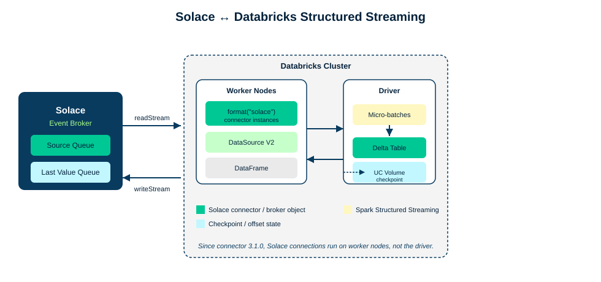

author: Solace Developer Relations
summary: Stream events between Solace and Databricks using the Solace Spark connector, with checkpointing to Unity Catalog and credentials in secret scopes
id: spark-streaming
categories: databricks,spark,analytics,integration
environments: Web
status: Draft
feedback link: https://github.com/SolaceDev/solace-dev-codelabs/issues

# Streaming between Solace and Databricks

## What you'll build

Duration: 0:03:00

> aside negative
> **This codelab is under construction.** The steps and code are complete, but several screenshots are still placeholders. Don't rely on the images yet, follow the text and code blocks instead.

This codelab is written for **Databricks**. You will use the [Solace Spark connector](https://github.com/SolaceProducts/pubsubplus-connector-spark) to move events between a Solace event broker and Spark Structured Streaming, running on a Databricks cluster.



The connector implements Spark's DataSource V2 API and registers itself under `format("solace")`. Once it's installed, moving data in either direction is a single Structured Streaming read or write:

* **Read path:** a Solace queue is consumed by connector instances that run **on the Databricks worker nodes**, and land as rows in a DataFrame you can transform and write to a Delta table.
* **Write path:** DataFrame rows go out through `writeStream.format("solace")` and are published to a topic.

Pay attention to that "on the worker nodes" detail as you go through this codelab. It's the reason you'll set up a Last Value Queue in Step 3, and it's why Step 6 spends some extra time on checkpointing.

This codelab is written for Databricks, but self-managed Spark works too. Four steps differ, each one is called out inline in a **Self-managed Spark** box, and Appendix A pulls all of them together in one table.

Every code sample here is also available as runnable code in the [`spark-streaming/code`](https://github.com/SolaceDev/solace-dev-codelabs/tree/master/markdown/spark-streaming/code) folder: a Databricks notebook, a self-managed `spark-submit` project, a sample publisher, and a `docker-compose.yml` if you don't have a Databricks workspace handy.

### Prerequisites

* A Solace event broker service (Solace Cloud, software broker, or appliance)
* A Databricks workspace with permission to create a cluster and install Maven libraries
* Basic familiarity with Spark Structured Streaming

### What you'll learn

* How to provision the Solace broker objects the connector needs, including the Last Value Queue
* How to install the connector on a Databricks cluster and read Solace messages into a DataFrame
* How to checkpoint to a Unity Catalog Volume and survive a stream restart without losing or duplicating data
* How to publish DataFrame rows back to Solace as messages
* How to move credentials into Databricks secrets
* How to tune the connector for throughput, parallelism, and high availability

> aside negative
> **Note:** this codelab targets connector version `3.1.7`. A 4.x line exists for Spark 4.0, Scala 2.13, and Java 17 on DBR 17.3 LTS, see the Recap step for a link.

## Get Solace messaging

Duration: 0:04:00

You need a Solace event broker to send and receive messages. Already have access to one with a message VPN? Skip to the bottom of this step and fill in the connection details table.

> aside positive
> The fastest way to get one is a free Solace Cloud service.

[Sign up for a free Solace Cloud account](https://console.solace.cloud/login/new-account) and create a messaging service. It takes a couple of minutes and gives you a fully configured broker.

### Alternative: software broker or appliance

* **Software broker:** run the free, feature-complete Solace Standard edition as a Docker container. See the [Solace downloads page](https://solace.com/downloads/) and the [software broker quick start](https://docs.solace.com/Software-Broker/Software-Broker-Set-Up/Configuring-Broker-Docker-Container.htm).
* **Appliance:** if your organization already runs a Solace appliance, ask your broker administrator for a message VPN and client username.

### Find your connection details

Open the Solace Cloud console for your service and go to the **Connect** tab. You need the **SMF host** here, not the JMS URI. The connector talks to Solace over native Solace Message Format (SMF), not JMS.

> aside negative
> **Common mistake:** don't grab the JMS connection URI. Use the SMF host from the Connect tab instead: it looks like `tcps://<host>:55443` for TLS or `tcp://<host>:55555` for plaintext.

Fill in this table now. You'll use every value in it for the rest of the codelab.

| Value | Yours |
|---|---|
| SMF host (e.g. `tcps://mr-xxxx.messaging.solace.cloud:55443`) | |
| Message VPN | |
| Client username | |
| Client password | |

## Provision your broker objects

Duration: 0:08:00

Before the connector can read or write anything, you need a source queue and a **Last Value Queue (LVQ)** on the broker. This step is the same on every platform.

### Create the source queue

1. In Solace Cloud (or Broker Manager), go to **Queues** and create a new queue, for example `spark/orders/source`.
2. Add a topic subscription for the topic the connector should consume, for example `solace/spark/stream/orders`.


> aside positive
> Set **Maximum Delivered Unacknowledged Messages per Flow** to twice the `batchSize` you plan to use for the read stream (Step 5 uses `batchSize` 100, so set this to 200). This is the single biggest throughput lever in the whole setup, and it's easy to forget. Too low a value here throttles the connector no matter how well you tune the Spark side.

### Create the Last Value Queue

Since connector 3.1.0, the Solace connection runs **on the Spark worker nodes** instead of the driver. That's better use of the cluster and better throughput, but it also means the worker nodes need somewhere to report their progress back to, since they're not talking to the driver directly anymore. That's what the LVQ is for. It sits on the broker next to the Spark checkpoint, and when the stream restarts, the connector reads it to figure out the last message it fully processed.

Create the LVQ manually with these properties:

| Property | Value |
|---|---|
| Access type | Exclusive |
| Spool quota | 0 |
| Owner | the client username the connector authenticates as |
| Non-owner permission | No Access |
| Subscription | the topic you will set as `lvq.topic` |
| ACL | Publish **and** Subscribe on that topic |


Or let the connector create it for you: enable **Allow Client to Create Endpoints** on the client profile your connector's username uses, and grant Publish and Subscribe ACL on the LVQ topic. The connector creates the LVQ itself, with the right properties already set.


> aside positive
> This codelab walks through manual creation, since most readers don't administer their own broker and might not have permission to touch client profiles. If you do have that access, self-provisioning saves you a step.

> aside negative
> Don't delete or modify the LVQ or its offset state between runs. That's the same as losing your Spark checkpoint: the connector won't know where it left off.

> aside negative
> Solace partitioned queues aren't supported in connector 3.1.7.

## Create your cluster and install the connector

Duration: 0:07:00

### Create the cluster

Create a Databricks cluster on one of the two certified runtimes:

* **DBR 15.4 LTS** (Spark 3.5.0, Scala 2.12)
* **DBR 16.4 LTS** (Spark 3.5.2, Scala 2.12)


> aside negative
> On DBR 15.4 LTS, the connector is only certified with **Photon acceleration turned off**. Check that toggle before you finish creating the cluster. Cluster policies and cloned clusters are the two most common ways it quietly gets turned back on.

### Install the connector

1. On the cluster's **Libraries** tab, choose **Install new** → **Maven**.
2. Enter the coordinates: `com.solacecoe.connectors:pubsubplus-connector-spark:3.1.7`.


> aside negative
> If an older version of the connector is already on this cluster, remove it first. Leftover jars from a previous version cause version conflicts, and the connector won't start.

> aside positive
> On Shared compute clusters, you need permission to install from Maven Central and access the resulting jars. If the install fails, that permission is the first thing to check with your workspace admin. See the [Databricks library permissions documentation](https://docs.databricks.com/en/libraries/index.html).

### Create a notebook

Create a Python notebook and attach it to the cluster. Everything from Step 5 on runs here.

> aside positive
> This connector is certified on Azure Databricks, but the Databricks runtime is the same across AWS and Google Cloud too, so every step here applies unchanged on those clouds.

> aside negative
> **Self-managed Spark:** install with `spark-submit --packages com.solacecoe.connectors:pubsubplus-connector-spark:3.1.7`, or `--jars` if you're air-gapped. You also need to set `sparkRuntimePlatform` to `OTHER` on every stream, since it defaults to `DATABRICKS` and otherwise runs a Unity Catalog check you don't need. See Appendix A for the full picture.

## Read from Solace into a DataFrame

Duration: 0:10:00

This part is the same everywhere. In your notebook, start a read stream against the source queue you created in Step 3:

```python
df = (spark.readStream
      .format("solace")
      .option("host", "tcps://<host>:55443")
      .option("vpn", "<vpn>")
      .option("username", "<user>")
      .option("password", "<password>")
      .option("queue", "<source-queue>")
      .option("lvq.name", "<lvq-name>")
      .option("lvq.topic", "<lvq-topic>")
      .option("connectRetries", 2)
      .option("reconnectRetries", 2)
      .option("batchSize", 100)
      .option("partitions", 1)
      .option("includeHeaders", True)
      .load())

display(df)
```

Publish a few test messages to your source topic (Broker Manager's **Try Me!** panel works fine) and watch them show up:


### Source schema

Every DataFrame the connector produces has this shape:

| Column | Type | Meaning |
|---|---|---|
| `Id` | String | Replication group message ID of the incoming message |
| `Payload` | Binary | Message payload |
| `PartitionKey` | String | Partition key, if present in the message |
| `Topic` | String | Topic the message was published to |
| `TimeStamp` | Timestamp | Sender timestamp if present, otherwise receipt time at the connector |
| `Headers` | Map\<String, Binary\> | Present only when `includeHeaders` is `true` |

### Transform and write to Delta

`Payload` comes through as raw bytes, so cast it and parse it into a structured column:

```python
from pyspark.sql.functions import col, from_json

parsed = df.select(
    col("Id"),
    col("Topic"),
    col("TimeStamp"),
    from_json(col("Payload").cast("string"), order_schema).alias("order"))

(parsed.writeStream
      .format("delta")
      .option("checkpointLocation", "<checkpoint-path>")
      .toTable("orders_bronze"))
```

Leave `checkpointLocation` alone for now. Step 6 covers what needs to happen there on Databricks.

## Checkpoint to a Unity Catalog Volume

Duration: 0:08:00

A few things to know before you touch any Databricks-specific options, since they apply on any platform:

* The connector acknowledges messages and writes processed message IDs to the Spark checkpoint once Spark signals commit, meaning Spark is done with that data.
* That's where the LVQ from Step 3 comes in: it holds the offset state so the worker nodes and the driver can agree on where to pick back up after a restart.
* Checkpoint writes can still fail, say during an instance crash. The connector handles duplicates in most cases, but keep your downstream systems idempotent anyway. That's the guide's own advice, and it's worth taking seriously.

### Why Databricks needs extra options here

Databricks executor nodes can't reach Unity Catalog Volumes directly. So when your checkpoint path is a UC Volume, the connector has to authenticate through unified auth using a **Databricks workspace-level service principal**:

```python
      .option("sparkRuntimePlatform", "DATABRICKS")
      .option("databricksSecretScope", "solace-dev-credentials")
      .option("databricksHost", "databricks-host")
      .option("databricksClientId", "databricks-client-id")
      .option("databricksClientSecret", "databricks-client-secret")
      .option("databricksClientSecretRefreshInterval", 1440)
```


> aside negative
> `databricksHost`, `databricksClientId`, and `databricksClientSecret` are **secret names inside the scope**, not the actual values. It's easy to read them as the literal host, ID, and secret, but they're just pointers to where those live.

> aside negative
> The service principal needs access to both the UC Volume you're checkpointing to and the secret scope. Grant one but not the other and it fails in a way that won't obviously point you back to the missing permission.

> aside negative
> **Secret rotation:** `databricksClientSecretRefreshInterval` defaults to 1440 minutes. Rotating the secret is your platform admin's job, not the connector's, but the refresh interval needs to fire after rotation finishes and before the old secret expires. Get the timing wrong and the connector keeps using the old secret until the next cycle. No restart needed once the interval is set correctly.

> aside positive
> The UC Volume check only kicks in when the checkpoint path contains `Volumes`. Checkpointing to plain DBFS on Databricks? None of the `databricks*` options apply, which is why some jobs work fine without anyone ever touching this section.

> aside negative
> **Self-managed Spark:** set `sparkRuntimePlatform` to `OTHER` and point `checkpointLocation` at S3, HDFS, or another shared filesystem instead. Skip the `databricks*` options entirely. Just make sure it's actually shared storage: a local path on a multi-node cluster isn't, and that's the most common way this breaks.

### Prove it survives a restart

Don't just take this on faith. Try it:

1. With the stream running, publish a few messages and confirm they land in the Delta table.
2. Stop the stream (`query.stop()` in the notebook, or cancel the running cell).
3. Restart the read stream with the same `checkpointLocation`, `queue`, and `lvq.name`.
4. Publish a few more messages and confirm the table picks up exactly where it left off, with no gap and no duplicates.

## Publish back to Solace

Duration: 0:08:00

Now the other direction: turning DataFrame rows into Solace messages. This is the same on every platform.

```python
query = (result_df.writeStream
         .format("solace")
         .option("host", "tcps://<host>:55443")
         .option("vpn", "<vpn>")
         .option("username", "<user>")
         .option("password", "<password>")
         .option("topic", "solace/spark/stream/processing/result")
         .option("batchSize", 100)
         .option("publishAckTimeout", 5000)
         .option("publishAckTimeoutFailOnError", True)
         .outputMode("append")
         .option("checkpointLocation", "<uc-volume-path>")
         .start())
```

### Sink schema

| Column | Required | Notes |
|---|---|---|
| `Id` | **Yes** | The connector throws without it; used to track published-message state. Overridden by the deprecated `id` option. |
| `Payload` | **Yes** | Binary. The connector throws without it. |
| `Topic` | Conditional | Required unless the `topic` option is set. The option overrides the column when both are present. |
| `PartitionKey` | No | Matters when a partitioned queue subscribes downstream |
| `TimeStamp` | No | Maps to Sender Timestamp on the outgoing Solace message |
| `Headers` | No | Applied only when `includeHeaders` is `true` |

> aside negative
> The `id` option is deprecated, so carry an `Id` column on your DataFrame instead of using it.

> aside positive
> `publishAckTimeout` defaults to 5000 ms and `publishAckTimeoutFailOnError` defaults to `true`. That means a slow broker fails the batch loudly instead of quietly losing messages. Tune the timeout to match your real network latency and batch size, and leave `publishAckTimeoutFailOnError` on unless you have a good reason not to. When a publish fails, the message ID gets logged with the exception.

### Two publish patterns

`writeStream` as shown above covers most cases. If a single micro-batch needs to reach Solace and somewhere else too, like a second Delta table or an external API, reach for `forEachBatch` instead:

```python
def send_batch(batch_df, batch_id):
    (batch_df.write
        .format("solace")
        .option("host", "tcps://<host>:55443")
        .option("vpn", "<vpn>")
        .option("username", "<user>")
        .option("password", "<password>")
        .option("topic", "solace/spark/stream/processing/result")
        .save())
    batch_df.write.format("delta").mode("append").saveAsTable("orders_published")

(result_df.writeStream
    .foreachBatch(send_batch)
    .option("checkpointLocation", "<uc-volume-path>")
    .start())
```

## Move your credentials into Databricks secrets

Duration: 0:06:00

Go back to the read stream you wrote in Step 5 and delete the plaintext `username` and `password` values. If the connector's running on Databricks, there's no reason not to use Databricks secrets instead.

```python
      .option("host", dbutils.secrets.get(scope="solace-dev-credentials", key="host"))
      .option("vpn", "default")
      .option("username", dbutils.secrets.get(scope="solace-dev-credentials", key="username"))
      .option("password", dbutils.secrets.get(scope="solace-dev-credentials", key="password"))
```


> aside positive
> Already created a secret scope in the previous step for the Unity Catalog service principal? Reuse it here instead of creating a second one.

The same pattern works for OAuth. Pull `solace.oauth.client.client-id`, `solace.oauth.client.credentials.client-secret`, and `solace.oauth.client.auth-server.truststore.password` from the scope, and set `solace.apiProperties.AUTHENTICATION_SCHEME` to `AUTHENTICATION_SCHEME_OAUTH2`.

```python
      .option("solace.apiProperties.AUTHENTICATION_SCHEME", "AUTHENTICATION_SCHEME_OAUTH2")
      .option("solace.oauth.client.client-id", dbutils.secrets.get(scope="solace-dev-credentials", key="oauth-client-id"))
      .option("solace.oauth.client.credentials.client-secret", dbutils.secrets.get(scope="solace-dev-credentials", key="oauth-client-secret"))
      .option("solace.oauth.client.auth-server.truststore.password", dbutils.secrets.get(scope="solace-dev-credentials", key="truststore-password"))
```

> aside positive
> You can also keep certificates in cloud object storage and restrict access through Unity Catalog to just the clusters that need to reach Solace. See the [Databricks data governance documentation](https://docs.databricks.com/en/data-governance/unity-catalog/index.html) for how.

> aside negative
> **Self-managed Spark:** `dbutils` doesn't exist outside Databricks, so use OAuth2 client credentials, a rotating token file, or a client certificate instead. Appendix A has the option names for all three.

## Scale and operate

Duration: 0:07:00

### Parallelism

`partitions` controls how many consumers read from the queue at once, spread across your worker nodes. It defaults to `1`.

> aside positive
> Set `partitions=0` and you get one consumer per worker node, which scales automatically as you add nodes. That's what you want on an autoscaling Databricks cluster. On a fixed-size cluster, pick a fixed number instead so your broker-side connection count stays predictable.

### Throughput

`batchSize` defaults to **1**, which is why a connector you haven't touched yet feels slow. Whatever value you pick, set Maximum Delivered Unacknowledged Messages on the source queue (Step 3) to twice that. `queue.receiveWaitTimeout` (default 10000 ms) controls how long the connector waits before it submits a partial micro-batch instead of waiting for a full one.

### Idle connections

`connectIdleTimeoutInMillis` and `connectIdleTimeoutCheckInMillis` are both off by default, and you need to set both to turn the feature on. It's worth doing on long-running clusters where Spark sessions don't shut down cleanly. When an idle connection closes, any pending unacknowledged messages get redelivered, so make sure your downstream is idempotent. The connection comes back on restart, or as soon as new messages arrive while the job is running.

### Replay

Set `replayStrategy` to `BEGINNING`, `TIMEBASED`, or `REPLICATION-GROUP-MESSAGE-ID`, along with whichever of `replayStartTime` (format `yyyy-MM-dd'T'HH:mm:ss`), `replayStartTimeTimezone` (default UTC), or `replayReplicationGroupMessageId` the strategy needs. This is how you rebuild a Delta table without republishing source data, and it needs the replay log turned on at the broker.

### Recovery edge cases

* `ackLastProcessedMessages` acknowledges the previous run's messages on restart. Only use it if downstream genuinely finished processing them, and note it does nothing if a replay strategy is set.
* `ignoreCheckpointMessageIdComparisonError` handles messages arriving from a different replication group. Left at the default (`false`), the connector throws `SolaceReplicationGroupMessageIdNotComparableException` and stops. Set it to `true` and it logs a warning and treats the message as new, with no deduplication.

### High availability and disaster recovery

`connectRetries`, `reconnectRetries` (default 3), `connectRetriesPerHost`, and `reconnectRetryWaitInMillis` (default 3000) control how the connector reconnects, and you can give it a comma-separated host list for active and standby sites. Set any of the retry counts to `-1` to retry forever.

### Cluster policy gotcha

Remember the Shared compute permission from Step 4? It bites in production too: a cluster policy change can quietly remove the ability to install the connector library, and the first sign is a job that stopped working with no code change behind it. Photon turning back on after a cluster clone is the same story.

### Escape hatch

Anything you can't set directly, `solace.apiProperties.<Property>` passes straight through to the underlying Solace Java API, for example `solace.apiProperties.reapply_subscriptions=false` or `solace.apiProperties.pub_ack_window_size=50`. The [JCSMPProperties documentation](https://docs.solace.com/API-Developer-Online-Ref-Documentation/java/com/solacesystems/jcsmp/JCSMPProperties.html) has the full list.

> aside negative
> **Self-managed Spark:** `partitions=0` still works, but it tracks whatever worker count you have right now rather than scaling with it, so pick a value on purpose. Everything else here applies as-is.

## Recap and next steps

Duration: 0:02:00

You now know how to:

* ✅ Read Solace messages into a Spark DataFrame, on worker nodes, with a Last Value Queue backing recovery
* ✅ Write DataFrame rows back to Solace as messages
* ✅ Checkpoint to a Unity Catalog Volume and survive a stream restart without losing or duplicating data

### Keep going

* [Runnable code assets for this codelab](https://github.com/SolaceDev/solace-dev-codelabs/tree/master/markdown/spark-streaming/code): the Databricks notebook, the self-managed project, the sample publisher, and docker-compose
* [Solace connector for Spark on the Databricks Hub](https://solace.com/connectors/)
* [Apache Spark Hub entry](https://solace.com/connectors/?fwp_connectors_search=spark)
* [SolaceProducts/pubsubplus-connector-spark on GitHub](https://github.com/SolaceProducts/pubsubplus-connector-spark)
* [Solace Spark connector user guide](https://github.com/SolaceProducts/pubsubplus-connector-spark/blob/master/README.md)
* [Solace Community](https://solace.community/)

> aside positive
> There's also a 4.x line of this connector for **Spark 4.0, Scala 2.13, and Java 17 on DBR 17.3 LTS**. Check the [pubsubplus-connector-spark releases page](https://github.com/SolaceProducts/pubsubplus-connector-spark/releases) for details.

Comparing stream processors? Try the [Solace and Apache Flink codelab](https://codelabs.solace.dev/codelabs/flink-streaming-2-10/index.html) next.

Thanks for completing this codelab! Let us know what you thought in the [Solace Community Forum](https://solace.community/). If you found any issues along the way, use the **Report a mistake** button at the bottom left of this page.

## Appendix A: Running on self-managed Spark

Duration: 0:05:00

Not on Databricks at all? Here's every difference from the steps above in one place, plus the self-managed authentication options in full.

| Step | On Databricks | On self-managed Spark |
|---|---|---|
| Install (Step 4) | Cluster Libraries → Maven | `spark-submit --packages com.solacecoe.connectors:pubsubplus-connector-spark:3.1.7`, or `--jars` offline |
| Platform option (Step 4) | `sparkRuntimePlatform` defaults to `DATABRICKS`, nothing to set | Set `sparkRuntimePlatform` to `OTHER` |
| Runtime (Step 4) | DBR 15.4 LTS or DBR 16.4 LTS | Spark 3.5.x, Scala 2.12, JDK 11 |
| Checkpoint (Step 6) | Unity Catalog Volume plus workspace service principal | S3, HDFS, or another shared filesystem. No `databricks*` options |
| Credentials (Step 8) | `dbutils.secrets.get` | OAuth2 client credentials, rotating token file, or client certificate |
| Parallelism (Step 9) | `partitions=0` tracks the autoscaling cluster | `partitions=0` tracks a fixed worker count, so choose deliberately |

### Self-managed authentication options

**1. OAuth2 client credentials**

```python
      .option("solace.apiProperties.AUTHENTICATION_SCHEME", "AUTHENTICATION_SCHEME_OAUTH2")
      .option("solace.oauth.client.auth-server-url", "<auth-server-url>")
      .option("solace.oauth.client.client-id", "<client-id>")
      .option("solace.oauth.client.credentials.client-secret", "<client-secret>")
      .option("solace.oauth.client.auth-server.truststore.file", "<truststore-path>")
      .option("solace.oauth.client.token.refresh.interval", 60)
```

Keep the refresh interval (default 60 seconds) shorter than your token's expiry.

**2. Rotating token read from file**

```python
      .option("solace.oauth.client.access-token", "/absolute/path/to/token")
      .option("solace.oauth.client.token.refresh.interval", 60)
```

A token loses some of its lifetime between being written and being read, so keep that gap small. If the file stops updating, the connector retries according to `reconnectRetries`, then gives up.

**3. Client certificate**

```python
      .option("solace.apiProperties.AUTHENTICATION_SCHEME", "AUTHENTICATION_SCHEME_CLIENT_CERTIFICATE")
      .option("solace.apiProperties.SSL_TRUST_STORE", "<truststore-path>")
      .option("solace.apiProperties.SSL_KEY_STORE", "<keystore-path>")
```

Set the matching truststore/keystore format and password properties alongside these.

### Dependency and spark-submit reference

Maven:

```xml
<dependency>
    <groupId>com.solacecoe.connectors</groupId>
    <artifactId>pubsubplus-connector-spark</artifactId>
    <version>3.1.7</version>
</dependency>
```

sbt:

```scala
libraryDependencies += "com.solacecoe.connectors" % "pubsubplus-connector-spark" % "3.1.7"
```

A complete `spark-submit` command for a self-managed cluster:

```bash
spark-submit \
  --packages com.solacecoe.connectors:pubsubplus-connector-spark:3.1.7 \
  --conf spark.executor.instances=3 \
  --class com.example.SolaceSparkJob \
  ./solace-spark-selfmanaged.jar \
  --sparkRuntimePlatform OTHER
```
