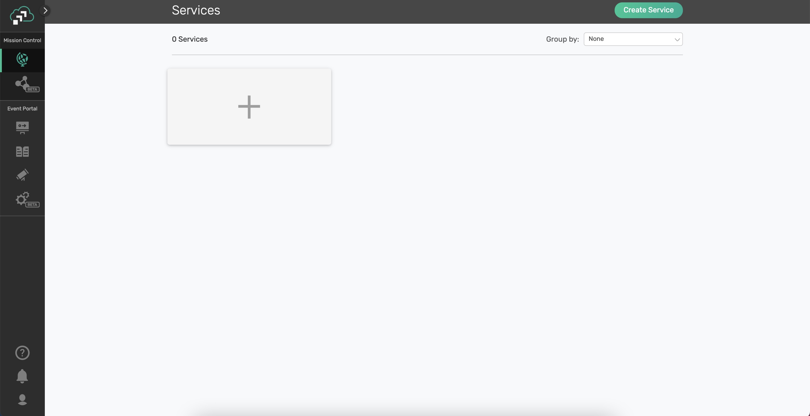
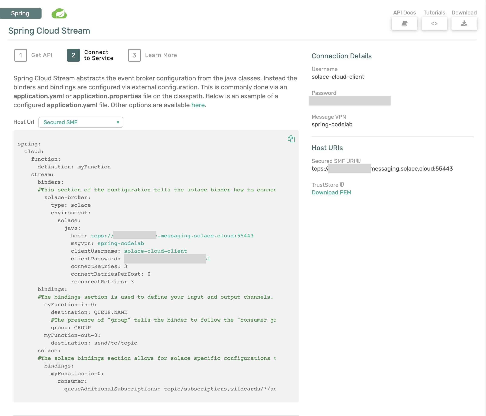
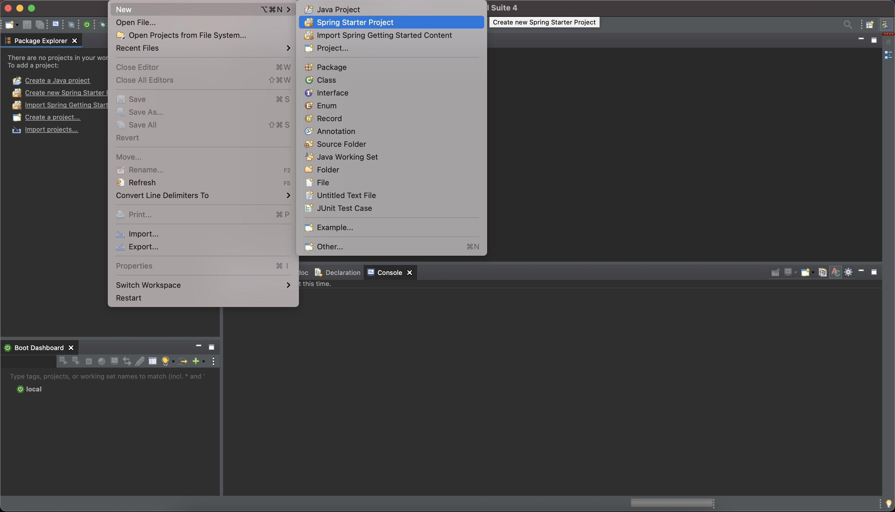

author: Marc DiPasquale
summary: This codelab walks a developer through the basics of Spring Cloud Stream
id: spring-cloud-stream-basics
categories: Spring,Java
tags: workshop
environments: Web
status: Published
feedback link: https://github.com/SolaceDev/solace-dev-codelabs/blob/master/markdown/spring-cloud-stream-basics/spring-cloud-stream-basics.md

# Spring Cloud Stream Basics

## What You'll Learn

Duration: 0:02:00


This codelab will help you get started with Spring Cloud Stream. We'll quickly cover some basic fundamentals before jumping in to actually creating some Spring Cloud Stream microservices to see the framework in action.

You'll learn:

- Spring Cloud Stream Basics
- How to create a Cloud Stream Processor
- How to use Function Composition to create a processing pipeline
- Tips, Tricks & Insights along the way

Valuable Resources:

- The Spring Cloud Stream [Reference Guide](https://cloud.spring.io/spring-cloud-static/spring-cloud-stream/current/reference/html/spring-cloud-stream.html#spring-cloud-stream-reference)
- Spring Sample [Github Repository](https://github.com/spring-cloud/spring-cloud-stream-samples)
- Solace Sample [Github Repository](https://github.com/SolaceSamples/solace-samples-spring)

> aside positive
> After you complete this codelab be sure to checkout the [Spring Cloud Stream - Beyond the Basics](https://codelabs.solace.dev/codelabs/spring-cloud-stream-beyond/#0) one!

## What You'll Need

Duration: 0:08:00

🛠 This page covers the setup needed to perform this codelab. 🛠

### Spring Cloud Stream Requirements

✅ Spring Cloud Stream just requires Java and Maven to use 🚀

- Java 1.8+ (Check version using `java -version`)
- Maven 3.3+ (Check version using `mvn -version`)
  - On mac you can `brew install maven`
  - Other install instructions [here](https://maven.apache.org/install.html)
- Your favorite Java IDE 💥

### Create your Messaging Service

✅ (1) Sign up for a free Solace Cloud account

Navigate to [this link](https://console.solace.cloud/login/new-account) and fill out the required information. No credit card required! If you already have an account, skip right to #2.

✅ (2) Create a messaging service

After you create your Solace Cloud account and sign in to the Solace Cloud Console, you'll be routed to the Solace Cloud Landing page.


Click on 'Cluster Manager' and all the messaging services associated with your account will show up if you have any already created. To create a new service, click either button as depicted in the image below:



Fill out all the details for your messaging service, and then click "Create" at the bottom of the page. Note: make sure you choose the "Developer" option for the Service Type


Your service should be ready to use in a few minutes

✅ (3) Take note of the connection details

If your messaging service was created successfully, you'll be routed to the summary page of your new messaging service. From the service summary page, click on the "Connect" tab so we can take note of the connection details we'll need later.


After you click the "Connect" tab, sort the supported client library menu by `Language` and click on the "Connect with Spring" box to expand it. 


Click on the Get Started button next to the Spring Cloud Stream option. 


Take note of the "Connect to Service" section and you'll see that the connection details are already configured in the  spring.cloud.stream.binders part of the config to connect a Spring Cloud Stream microservice to your PubSub+ Messaging Service. We'll be using this soon 😄



🚀 Setup complete! Let's get going! 🚀

## Cloud Stream Fundamentals

Duration: 0:05:00

### Cloud Stream Basics

Spring Cloud Stream is a framework for creating highly scalable, event-driven microservices connected by pluggable messaging services. Messaging services are pluggable via Binders that we'll cover in a bit. The framework is based on Spring Boot and Spring Integration.

Spring Cloud Stream has three different types of message exchange contracts as pictures below.

1. Suppliers are sources of events
1. Sinks are consumers of events
1. Processors are both consumers and subscribers of events


### Message Exchange Contracts Map to Java Functions

As of Spring Cloud Stream v3 the preferred programming model is to use Java Functions to implement your cloud stream apps.

We just mentioned the 3 types of Cloud Stream message exchange contract are "Sources", "Sinks" and "Processors".
Those map to functions as follows:

- `java.util.function.Supplier` -> Source [Producer/Publisher of Events]
- `java.util.function.Consumer` -> Sink [Subscriber/Consumer of Events]
- `java.util.function.Function` -> Processor [ Consumes, Processes, and Produces Events ]

### Binders

Spring Cloud Stream Binders are really what make the framework useful. Binders provide an abstraction layer between your code and the messaging systems over which events are flowing. This allows you to write your code without having to worry about learning messaging APIs! When messages are sent or received from the messaging system they pass through the messaging system specific binder which knows how to communicate with that specific message broker.

As of the creation of this codelab the available Cloud Stream Binders are:

- RabbitMQ
- Apache Kafka
- Amazon Kinesis
- Google PubSub
- Solace PubSub+
- Azure Event Hubs
- Apache RocketMQ

Today we're going to use the [Solace PubSub+ Binder](https://github.com/SolaceProducts/solace-spring-cloud/tree/master/solace-spring-cloud-starters/solace-spring-cloud-stream-starter) which supports publish subscribe and consumer groups.

### Communication Models

Instead of having to learn Messaging APIs, developers just have to understand the communication models that Spring Cloud Stream supports. There are 3 supported models, but support varies per binder.

1. Publish-subscribe: subscribers are independent from each other & receive events in order
1. Consumer groups: fan-out and load-balancing across multiple consumers
1. Stateful partitioning support: in-order processing for consistency and performance

🚀 So what are we waiting for!? Let's get started 🚀

## Your First Processor

Duration: 0:10:00

In this section we are going to apply what we learned in the last few sections and create our first "processor" microservice. We'll create the Spring microservice in the diagram below and use the Solace "Try-Me" tab as the producer and consumer. 


We will be using Spring Tool Suite as IDE for the codelab exercise. You can download Spring Tool Suite [here](https://spring.io/tools) 
### Use Spring Initializr to Generate your Project

🚀 First we're going to use Spring Initializr to generate our Spring Boot project for us.

1. Open the Spring Tool Suite IDE.
1. Choose `File -> New -> Spring Starter Project`
   
1. On the first screen give your project a name of "springone" and click `Next`
1. On the second screen search for "solace" under Available and choose both "Solace PubSub+" and "Cloud Stream"
   
1. Click `Finish`

✅ You should see a new project named "springone" in your IDE!

If you look at the `pom.xml` file you'll see a few important things:

- This is a Spring Boot project which has a parent of `spring-boot-starter-parent`
- The java version you chose is included
- The "Spring Cloud Stream" and "Spring Cloud Starter Stream Solace" dependencies are included


### Add Messaging Service Connection Info

Open the application config file under `src/main/resources` and enter the properties below substituting the connection information with your messaging services' connect info we got from the Solace Cloud Connect tab in the previous section.

### <strong>A. PubSub+ Broker running locally in Docker</strong>

Review your Broker setup running on Docker container and make note of host, port, message VPN, client username and password.

**Option 1: application.properties**   

```
spring.cloud.stream.binders.solace.type=solace
spring.cloud.stream.binders.solace.environment.solace.java.host=tcp://localhost:55555
spring.cloud.stream.binders.solace.environment.solace.java.msgVpn=default
spring.cloud.stream.binders.solace.environment.solace.java.clientUsername=default
spring.cloud.stream.binders.solace.environment.solace.java.clientPassword=default
spring.cloud.stream.binders.solace.environment.solace.java.connectRetries=0
spring.cloud.stream.binders.solace.environment.solace.java.connectRetriesPerHost=0
```

**Option 2: application.yml**   
```
spring:
  cloud:
    stream:
      binders:
        solace:
          type: solace
          environment:
            solace:
              java:
                clientPassword: default
                clientUsername: default
                connectRetries: 0
                connectRetriesPerHost: 0
                host: 'tcp://localhost:55555'
                msgVpn: default
```
> aside negative
> If you want to use YAML for configuration, create an empty file with the name application.yml and copy the above content.

### <strong>B. PubSub+ Broker running on Solace Cloud</strong>

Locate and use the credentials from the cloud broker setup.


> aside negative
> Update the host, port, message VPN, client username and password based on your cloud connection details.

**Option 1: application.properties**   

```
spring.cloud.stream.binders.solace.type=solace
spring.cloud.stream.binders.solace.environment.solace.java.host=tcps://xxxxxxx.messaging.solace.cloud:55443
spring.cloud.stream.binders.solace.environment.solace.java.msgVpn==**********
spring.cloud.stream.binders.solace.environment.solace.java.clientUsername=solace-cloud-client
spring.cloud.stream.binders.solace.environment.solace.java.clientPassword=**********
spring.cloud.stream.binders.solace.environment.solace.java.connectRetries=0
spring.cloud.stream.binders.solace.environment.solace.java.connectRetriesPerHost=0
```

**Option 2: application.yml**   
```
spring:
  cloud:
    stream:
      binders:
        solace:
          type: solace
          environment:
            solace:
              java:
                clientPassword: default
                clientUsername: default
                connectRetries: 0
                connectRetriesPerHost: 0
                host: tcps://xxxxxxx.messaging.solace.cloud:55443
                msgVpn: **********
```

> aside negative
> If you want to use YAML for configuration, create an empty file with the name application.yml and copy the above content.

### Write the Java Function

Now to write some code!

Open the `SpringoneApplication.java` file. Unless you chose different settings when creating your project it should be under `src/main/java/com/example/demo`

When you open the project you'll see the basic skeleton of a Spring Boot app, including the `@SpringBootApplication` java annotation.

> aside positive
> **@SpringBootApplication** Indicates a configuration class that declares one or more @Bean methods and also triggers auto-configuration and component scanning. This is a convenience annotation that is equivalent to declaring @Configuration, @EnableAutoConfiguration and @ComponentScan.

Let's go ahead and create a `java.util.function.Function` bean that takes in a String, changes is it to all uppercase and returns a String.
The code might look something like below:

```
@Bean
public Function<String, String> uppercase(){
   return v -> {
      System.out.println("Uppercasing: " + v);
      return v.toUpperCase();
   };
}
```

> aside negative
> Note: You might need to add imports, this is done by clicking `ctrl + shift + 0` and then choose java.util.function.Function

🚀 That's it! No Messaging code and we have an app that can retrieve a message, process it and publish a message!
🚀 Let's test it out.

Run your app by right clicking on your project, choosing "Run As" and "Spring Boot App" if using Spring Tool Suite. From the command line you can also run by entering `mvn clean spring-boot:run`


> aside positive
> Note: You can find more details about Spring's functional binding in the 'Function Composition' section. You can also refer to [spring documentation] (https://docs.spring.io/spring-cloud-stream/docs/3.1.1/reference/html/spring-cloud-stream.html#_bindings)

## Test your Microservice

Duration: 0:03:00

### <strong>A. PubSub+ Broker running locally in Docker</strong>
✅ In order to test your function open Solace PubSub+ Manager and navigate to the Try Me! tab


This page will allow you to send and receive messages to see if your function is working as expected.

To test your function perform the following steps:

1. Click the `Connect` button for the "Subscriber"
1. Type "uppercase-out-0" into the "Subscribe to a topic to receive direct messages" box and click `Subscribe`
1. Click the `Connect` button for the "Publisher"
1. Type "uppercase-in-0" as the topic to publish to.
1. Type "Spring One is Awesome!" in the "Message Content" box and click `Publish`

🚀 You should see your application printed "Uppercasing: Spring One is Awesome!" in your IDE and the "Subscriber" in the "Try Me!" menu in Solace Cloud should show that a message was received that contained "SPRING ONE IS AWESOME!"

### <strong>B. PubSub+ Broker running on Solace Cloud</strong>

✅ In order to test your function open Solace Cloud, select the messaging service and navigate to the Try Me! tab


This page will allow you to send and receive messages to see if your function is working as expected.

To test your function perform the following steps:

1. Click the `Connect` button for the "Subscriber"
1. Type "uppercase-out-0" into the "Subscribe to a topic to receive direct messages" box and click `Subscribe`
1. Click the `Connect` button for the "Publisher"
1. Type "uppercase-in-0" as the topic to publish to.
1. Type "Spring One is Awesome!" in the "Message Content" box and click `Publish`

🚀 You should see your application printed "Uppercasing: Spring One is Awesome!" in your IDE and the "Subscriber" in the "Try Me!" menu in Solace Cloud should show that a message was received that contained "SPRING ONE IS AWESOME!"

> aside positive
> Note that the "uppercase-in-0" and "uppercase-out-0" are default binding names which follow a convention of `<functionName>` + `-in-` + `<index>` for input bindings and `<functionName>` + `-out-` + `<index>` for output bindings. Those can be changed by setting them in the Spring configuration file. [More information here](https://cloud.spring.io/spring-cloud-static/spring-cloud-stream/current/reference/html/spring-cloud-stream.html#_common_binding_properties)

🎉 **Congratulations! You just created your first Spring Cloud Stream microservice!**

## Function Composition

Duration: 0:10:00

Another powerful feature of Spring Cloud Stream is inherited from Spring Cloud Function, and that feature is the capability of doing Function Composition. This allows you to create simple functions as Spring Beans that can be individually tested, re-used and chained together to create a processing chain.

We'll extend the processor microservice we created in Step 4 to both uppercase and reverse the String found in the payload of the message. Following functional programming best practices we want to keep our functions simple and re-usable so instead of just adding the new business logic of reversing the String to the existing Function we'll create a new function and use functional composition to effectively create a processing pipeline in our microservice. The end result will look like the diagram below, note that there are now two separate functions in our microservice. 


Instead of just talking about Function Composition let's try it out 😁.     
In the same class where you already have your "uppercase" function let's create a "reverse" function that takes in a string and reverses the ordering. This function would like something like this:

```
@Bean
public Function<String, String> reverse(){
	return v -> {
		System.out.println("Reversing: " + v);
        return new StringBuilder(v).reverse().toString();
   };
}
```

Now that we have two functions Spring Cloud Stream won't just assume what bindings we want to be created so we need to go configure them in the application config file. Assuming we want to uppercase an incoming String and then reverse it we will add these properties to the file:

**Option 1: application.properties**
```
spring.cloud.stream.binders.solace.type=solace
spring.cloud.stream.binders.solace.environment.solace.java.host=tcps://xxxxxxx.messaging.solace.cloud:55443
spring.cloud.stream.binders.solace.environment.solace.java.msgVpn==**********
spring.cloud.stream.binders.solace.environment.solace.java.clientUsername=solace-cloud-client
spring.cloud.stream.binders.solace.environment.solace.java.clientPassword=**********
spring.cloud.stream.binders.solace.environment.solace.java.connectRetries=0
spring.cloud.stream.binders.solace.environment.solace.java.connectRetriesPerHost=0
spring.cloud.function.definition=uppercase|reverse
spring.cloud.stream.function.bindings.uppercasereverse-in-0=input
spring.cloud.stream.function.bindings.uppercasereverse-out-0=output
```

**Option 2: application.yml**
```
spring:
  cloud:
    function:
      definition: uppercase|reverse
    stream:
      function:
        bindings:        
          uppercasereverse-in-0: input
          uppercasereverse-out-0: output      
      binders:
        solace:
          type: solace
          environment:
            solace:
              java:
                clientPassword: *************
                clientUsername: solace-cloud-client
                connectRetries: 0
                connectRetriesPerHost: 0
                host: tcps://**********.messaging.solace.cloud:55443
                msgVpn: spring-codelab
```

> aside positive
> Note that Spring Cloud Stream performs [Content Type Negotiation](https://docs.spring.io/spring-cloud-stream/docs/current/reference/html/spring-cloud-stream.html#content-type-management) between each function so you could have a String output from one function and a POJO going into another as long as the framework knows how to deal with the Message Conversion. Read more about that in the [Reference Guide](https://docs.spring.io/spring-cloud-stream/docs/current/reference/html/spring-cloud-stream.html#content-type-management).

✅ We now have our function all wired up so go ahead and stop the app and restart it.  

🥳 Woohoo we have now created a Spring Cloud Stream app that uses a pipeline of functions to process incoming messages!

## Test your Function Composition

Duration: 0:03:00

### <strong>A. PubSub+ Broker running locally in Docker</strong>
✅ In order to test your function open Solace PubSub+ Manager and navigate to the Try Me! tab


This page will allow you to send and receive messages to see if your function is working as expected.

To test your function perform the following steps:

1. Click the `Connect` button for the "Subscriber"
1. Type "output" into the "Subscribe to a topic to receive direct messages" box and click `Subscribe`
1. Click the `Connect` button for the "Publisher"
1. Type "input" as the topic to publish to.
1. Type "Spring One is Awesome!" in the "Message Content" box and click `Publish`

🚀 You should see your application printed 

```
Uppercasing: Spring One is Awesome!
Reversing: SPRING ONE IS AWESOME!
```
in your IDE and the "Subscriber" in the "Try Me!" menu in Solace Cloud should show that a message was received that contained "!EMOSEWA SI ENO GNIRPS"

### <strong>B. PubSub+ Broker running on Solace Cloud</strong>

✅ In order to test your function composition open Solace Cloud, select the messaging service and navigate to the Try Me! tab


This page will allow you to send and receive messages to see if your function is working as expected.

To test your function perform the following steps:

1. Click the `Connect` button for the "Subscriber"
1. Type "output" into the "Subscribe to a topic to receive direct messages" box and click `Subscribe`
1. Click the `Connect` button for the "Publisher"
1. Type "input" as the topic to publish to.
1. Type "Spring One is Awesome!" in the "Message Content" box and click `Publish`

🚀 You should see your application printed 

```
Uppercasing: Spring One is Awesome!
Reversing: SPRING ONE IS AWESOME!
```

in your IDE and the "Subscriber" in the "Try Me!" menu in Solace Cloud should show that a message was received that contained "!EMOSEWA SI ENO GNIRPS"

## Takeaways + Next Steps

Duration: 0:02:00

✅ Hopefully this codelab showed you how easy it can be to create event-driven microservices using Spring Cloud Stream. Note that you didn't have to learn any messaging APIs as the Cloud Stream Binder abstracts them from you!   
✅ Move on to the [Spring Cloud Stream Beyond the Basics](https://codelabs.solace.dev/codelabs/spring-cloud-stream-beyond/#0) codelab.  
✅ Learn how to generate Cloud Stream apps using AsyncAPI [here]  (https://codelabs.solace.dev/codelabs/design-to-code-workshop/#0).  
✅ Learn how to publish to dynamic topics using Spring Cloud Stream by a sample [here](https://github.com/SolaceSamples/solace-samples-spring/blob/master/cloud-stream-dynamic-destination-processor/src/main/java/com/solace/samples/spring/scs/DynamicDestinationProcessor.java). 


Thanks for participating in this codelab! Let us know what you thought in the [Solace Community Forum](https://solace.community/)! If you found any issues along the way we'd appreciate it if you'd raise them by clicking the Give feedback button at the bottom left of this codelab.
