author: Marc DiPasquale
summary: This Codelab Covers more advanced features of using Spring Cloud Stream and the Solace PubSub+ Binder
id: spring-cloud-stream-beyond
tags: workshop
categories: spring, java
environments: Web
status: Published
feedback link: https://github.com/SolaceDev/solace-dev-codelabs/blob/master/markdown/spring-cloud-stream-beyond

# Spring Cloud Stream - Beyond the Basics

## What you'll learn: Overview
Duration: 0:03:00

This codelab is a follow-on to the [Spring Cloud Stream Basics](https://codelabs.solace.dev/codelabs/spring-cloud-stream-basics/#0) one. If you aren't yet familiar with the Spring Cloud Stream framework go ahead and jump over there to get a quick introduction to the framework. This codelab will go into more detail (Beyond the Basics 😜) of developing your Cloud Stream microservice with imperative functions. We will be using the Solace binder and Event Broker thoughout. The majority of features we will learn today apply at the framework level and do not depend on the underlying broker/binder of choice, however a few will be Solace specific and I will try to specify that when necessary. 

Also note that while Spring Cloud Stream supports both imperative and reactive functions this codelab will be focused on the use of imperative ones. 

💡 You'll Learn:
* How to choose your communication model
* How to use concurrency to scale your apps
* How to use Message Headers
* How to subscribe using Wildcards
* How to publish to dynamic topics and in batches
* How to handle error scenarios

💎 Valuable Resources:
* The Spring Cloud Stream [Reference Guide](https://cloud.spring.io/spring-cloud-static/spring-cloud-stream/current/reference/html/spring-cloud-stream.html#spring-cloud-stream-reference)
* Solace Binder [Docs](https://github.com/SolaceProducts/solace-spring-cloud/tree/master/solace-spring-cloud-starters/solace-spring-cloud-stream-starter)
* Spring Sample [Github Repository](https://github.com/spring-cloud/spring-cloud-stream-samples)
* Solace Sample [Github Repository](https://github.com/SolaceSamples/solace-samples-spring)

Positive
: 👉 **Have Questions? Ask them in the [Solace Community](https://solace.community)** 👈

## What you need: Prerequisites
Duration: 0:05:00

🛠  This page covers the setup needed to perform this codelab. 🛠

### Spring Cloud Stream Requirements

✅ Spring Cloud Stream just requires Java and Maven to use 🚀

* Java 1.8+ (Check version using `java -version`)
* Maven 3.3+ (Check version using `mvn -version`)
 * On mac you can `brew install maven`
 * Other install instructions [here](https://maven.apache.org/install.html)
* Your favorite Java IDE 💥

### Create your Messaging Service

✅ (1) Sign up for a free Solace Cloud account

Navigate to [this link](https://console.solace.cloud/login/new-account?utm_source=devrel) and fill out the required information. No credit card required! If you already have an account, skip right to #2.

✅ (2) Create a messaging service

After you create your Solace Cloud account and sign in to the Solace Cloud Console, you'll be routed to the Solace Cloud Landing page.


Click on 'Cluster Manager' and all the messaging services associated with your account will show up if you have any already created. To create a new service, click either button as depicted in the image below:


Fill out all the details for your messaging service, and then click "Create" at the bottom of the page. Note: make sure you choose the "Developer" option for the Service Type


Your service should be ready to use in a few minutes

✅ (3) Take note of the connection details

If your messaging service was created successfully, you'll be routed to the summary page of your new messaging service. From the service summary page, click on the "Connect" tab so we can take note of the connection details we'll need later.


After you click the "Connect" tab, sort the supported client library menu by `Language` and click on the "Connect with Spring" box to expand it. 

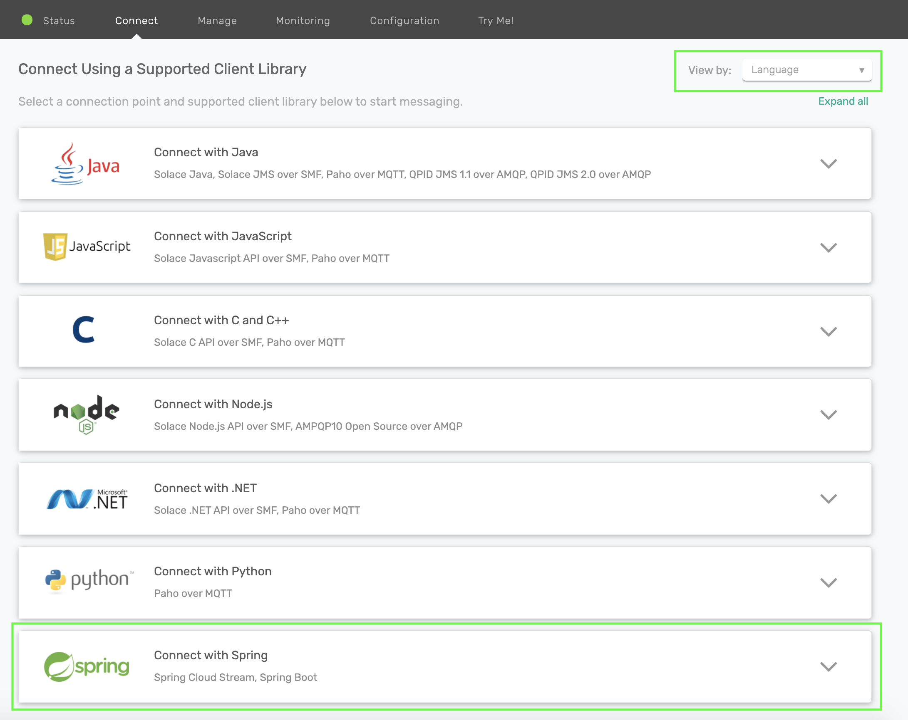

Click on the Get Started button next to the Spring Cloud Stream option. 

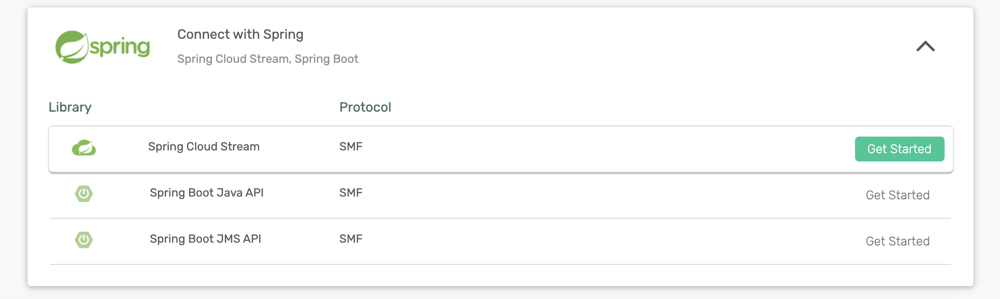

Take note of the "Connect to Service" section and you'll see that the connection details are already configured in the  `spring.cloud.stream.binders` part of the config to connect a Spring Cloud Stream microservice to your PubSub+ Messaging Service. We'll be using this soon 😄

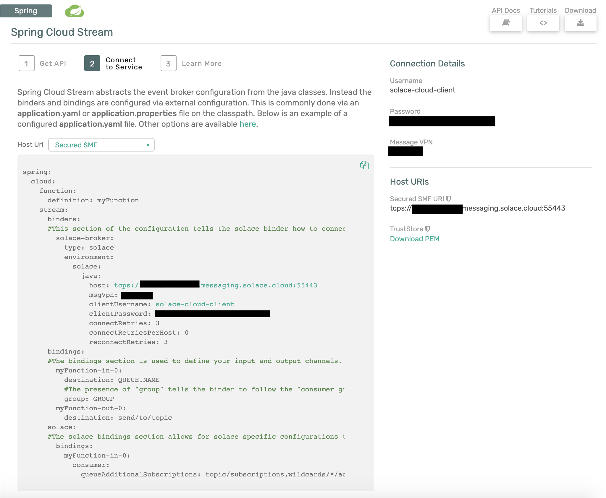

### Create a Spring Cloud Stream Microservice 

✅ (1) Create an Empty Spring Cloud Stream Microservice to use throughout this codelab 

Navigate to [start.spring.io](https://start.spring.io/#!dependencies=solace,cloud-stream) and choose the "Solace PubSub+" and the "Cloud Stream" dependencies. If you used that link we already added them for you 😉.
You can leave everything else as the default or modify the Java version, package info, etc. as desired. 

Click the "Generate" button which will download the project. You can then unzip it and import the project into your preferred Java IDE as a maven project. I'll be using [Spring Tool Suite 4 for Eclipse](https://spring.io/tools) in the screenshots.
Your imported project should look like this: 


✅ (2) Add your Connection Details from the Messaging Service

Change the `application.properties` file to `application.yml` and copy and paste the `spring.cloud.stream.binders` part of the Spring Cloud Stream configuration previously found in the "Connect to Service" widget in your Message Service. It should look something like this, but with the values that were provided by your Message Service. 

``` yaml
spring:
  cloud:
    stream:
      binders:
        solace-cloud:
          type: solace
          environment:
            solace:
              java:
                clientUsername: default
                clientPassword: default
                host: 'tcp://localhost:55555'
                msgVpn: default
```

🚀 Setup complete! Let's get going! 🚀


## Communication Models and How to Choose
Duration: 0:20:00

As discussed in the [Spring Cloud Stream Basics](https://codelabs.solace.dev/codelabs/spring-cloud-stream-basics/#0) codelab, the Cloud Stream framework supports multiple communication models. Since the Solace Binder supports both Publish-Subscribe and Consumer Groups we will focus on those. Note that this decision is made on an input binding, or where you configure consumption of events/messages. 

Before we jump into choosing our consumption model, which is done via configuration, let's create a quick `Consumer` app that we can use. 
1. Open the `DemoApplication.java` file in your microservice.
1. Write a quick `Consumer` function that receives a `String`
```java
@Bean
public Consumer<String> myConsumer(){
	return v -> {
		System.out.println("Received: " + v);
	};
}
```     

Positive
: If you are using eclipse you can use `ctrl + shift + o` on Windows or `cmd + shift + o` on Mac to include imports. You want to choose the `java.util.function.Consumer` if given multiple options.

Now that we have a function we'll look at the different options to configure the *binding* which tells the binder how to connect your function to the underlying message broker. 

When using Spring Cloud Stream with the Solace Binder you can decide between 3 options:
1. Publish-Subscribe (Non-Durable): My events must be processed in order so I want them processed by one microservice AND I only care about receiving events when my microservice is connected. 
1. Publish-Subscribe (Durable): My events must be processed in order so I want them processed by one microservice AND I want events saved when my microservice is disconnected.
1. Consumer Groups: I need to be able to scale my microservices up/down in order to process my events and order isn't important.  

Positive
: 💥 Note that sometimes order **and** scaling matters! This is also possible by using dynamic topics and wildcard subscriptions that we'll cover in an upcoming section. Learn more about Solace topics in [this video](https://www.youtube.com/watch?v=PP1nNlgERQI&ab_channel=Solace).

### Publish-Subscribe (Non-Durable) 
There are many use cases where you need to process events in order as they are published to a defined topic. In order to do this with Spring Cloud Stream you would create your `Function` or `Consumer` function and configure the input binding for it to receive messages from a specific destination. There are two ways to do this with the Solace binder. The standard way, with no Solace specific configurations, is non-durable and we'll start there.

👀 Under the covers this option will use a Non-Durable Anonymous Queue on the broker to hold the messages for the consuming microservice. Let's check it out!
This option will deliver events in order to your microservice while it remains up and running. To do this we just to specify a `destination`, but NO `group` on your input binding. 

So open your `application.yml` file and add the following config to what already exists. This configuration is telling Spring Cloud Stream that you want your `myConsumer` function to receive events that are published to the `spring/cloud/stream` topic. 
``` yaml
spring:
  cloud:
    function:
      definition: myConsumer
    stream:
      bindings:
        myConsumer-in-0:
          destination: spring/cloud/stream
```

Go ahead and run your app from your IDE or use `mvn clean spring-boot:run`. You should see the app start up and connect to the event broker. Note that under the covers the Solace Binder will bind your function to a Non-Durable Anonymous (or Temporary) queue on the broker.    
This endpoint type in Solace is a temporary queue that will deliver messages to your app in order while your app remains online. It however is NOT a durable endpoint and will be removed after your application goes offline for more than 30 seconds.     

You'll see the name of your Anonymous Queue shown in a log entry on the console from the *SolaceQueueProvisioner* class: 
```
SolaceQueueProvisioner : Subscribing queue #P2P/QTMP/v:b0e95afab69a/scst/an/59e7cbe3-ec38-4da8-a8fa-d1e428f6eb56/plain/spring/cloud/stream to topic spring/cloud/stream

```

🛠 **Let's test this out using the "Try-Me" tab in the PubSub+ Manager.**
1. Get to the "Try-Me" tab!
1. If using Docker, Software or Hardware PubSub+ Event Brokers
  1. Navigate to PubSub+ Manager, `localhost:8080` by default when using Software but otherwise get from your Admin
  1. Default username and password is `admin` and `admin`
  1. Choose your Messaging VPN, by default it would be `default`
1. If using Solace PubSub+ Cloud
  1. Navigate to the Solace PubSub+ Cloud Console
  1. Choose "Cluster Manager" -> and click the messaging service you created earlier
  1. Click the "Open PubSub+ Broker Manager" link at the top right
1. Click the "Try-Me!" option on the left menu
1. Click "Connect" on the "Publisher" side
  1. If it doesn't automatically connect use the credentials we got during Step 2. 
1. Type in the `spring/cloud/stream` topic
1. Change the "Message" to whatever you'd like and click "Send"

Positive
: 💥 Note that you'll see that the messages arrive in the order that you send them. 

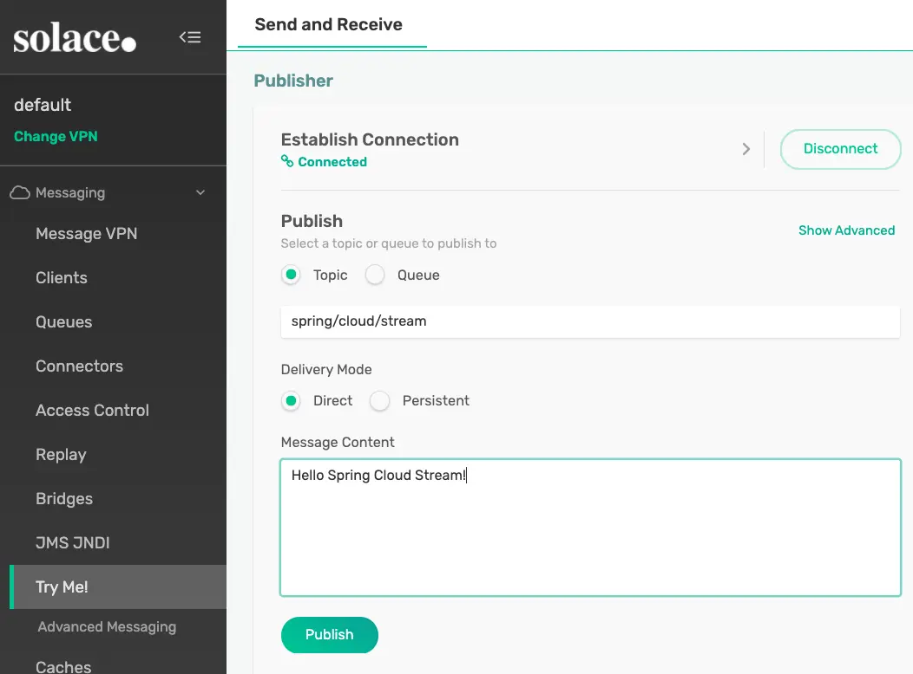

This option is great when we don't need to store messages/events when the app is offline, but what if we do!?

### Publish-Subscribe (Durable)
Sometimes it isn't enough to be able to deliver messages/events only while the app remains connected to the broker; there are many scenarios where you want messages stored while the app is offline while still maintaining order. In this case the Solace Binder allows you to follow the Publish-Subscribe pattern and consume from an Exclusive Durable Queue that will do just that. 

Positive
: 💥 As a bonus, this configuration also allows you to create a Primary/Secondary type of configuration where you can have multiple microservices ready to process the events and if the Primary disconnects the Secondary will take over. 

In order to modify the input binding to create an Exclusive Durable Queue we need to add a `group` to our binding and also set the Solace specific property `queueAccessType` to use an exclusive queue. We do that with the configuration below. 
``` yaml
spring:
  cloud:
    function:
      definition: myConsumer
    stream:
      bindings:
        myConsumer-in-0:
          destination: spring/cloud/stream
          group: exclusive
      solace:
        bindings:
          myConsumer-in-0:
            consumer:
              queue-access-type: 1 #1 is Exclusive; 0 is Non-Exclusive (and default)
```

Now if you restart your app in your IDE or use `ctrl-c` followed by `mvn clean spring-boot:run` on the cli you'll see that a durable queue was created. 
```
SolaceQueueProvisioner : Subscribing queue scst/wk/exclusive/plain/spring/cloud/stream to topic spring/cloud/stream
```

And if you look in PubSub+ Manager you'll find that the queue is "Exclusive" which means that the first microservice which connects to it will receive all the messages in the order they are received by the broker. 


🛠 Go ahead and test it out by sending more messages with the "Try-Me" tab. Now that the queue is durable you can even stop your app, send a bunch of messages and then start it back up to see that they are delivered in order. 


### Consumer Groups
Another popular consuming pattern is using what are called **Consumer Groups**. Consumer groups in Spring Cloud Stream allow you to have multiple consumers sharing the processing of events. 
To do this you just need to specify a `group` on your input binding. 

To configure this on our app that has the `myConsumer` Consumer function your config would look like this.
```
spring:
  cloud:
    function:
      definition: myConsumer
    stream:
      bindings:
        myConsumer-in-0:
          destination: spring/cloud/stream
          group: nonexclusive
```

When using the Solace Binder and specifying a `group` the binder will actually create a Durable Non-Exclusive Queue Endpoint by default. This durable queue will hold messages for your microservices if they get disconnected. 
Go ahead and run the app via your IDE or using `mvn clean spring-boot:run`, you'll see the following log message that specifies the queue. 
```
SolaceQueueProvisioner : Subscribing queue scst/wk/nonexclusive/plain/spring/cloud/stream to topic spring/cloud/stream
```

And in the PubSub+ Manager you'll see that it created a non-exclusive queue:


#### Scaling
So we're using the Consumer Group pattern (which uses a Non-Exclusive Queue!) so we can have multiple consumers share the processing of events. What are the choices for scaling!?

**Option 1 - Multiple Instances of your Microservice**
The first option is just to start up more instances of your microservice. This is common in a Kubernetes environment where your microservice runs in it's own container. Each instance of the microservice will connect to the same non-exclusive queue on the Solace broker and the broker will spread the messages across all consumers. 

**Option 2 - Concurrent Message Consumption in a Single Microservice**
The second option is to use the [concurrency consumer property](https://docs.spring.io/spring-cloud-stream/docs/3.1.1/reference/html/spring-cloud-stream.html#_consumer_properties) to enable concurrent message consumption for a particular consumer binding. Under the covers the Solace binder will create a separate flow for each concurrent consumer that will handle events in it's own thread. Note that this approach allows the concurrent consumers to share the same Solace Session.

Modify your microservice's configuration to set a concurrency of 5 like seen below: 
``` yaml
spring:
  cloud:
    function:
      definition: myConsumer
    stream:
      bindings:
        myConsumer-in-0:
          destination: spring/cloud/stream
          group: nonexclusive
          consumer:
            concurrency: 5
```

When you restart your app in your IDE or use `ctrl-c` followed by `mvn clean spring-boot:run` on the cli you'll see that the Solace binder creates 5 separate "flow receivers". Note that they all share the same Solace session and will process events on separate threads. 
```
JCSMPInboundChannelAdapter : Creating consumer 1 of 5 for inbound adapter 5722ebd9-7f2a-40ba-b635-235a86938638
FlowReceiverContainer : Binding flow receiver container 76e517b1-d1a8-4ab2-975f-e4eb0b12535a
JCSMPInboundChannelAdapter : Creating consumer 2 of 5 for inbound adapter 5722ebd9-7f2a-40ba-b635-235a86938638
FlowReceiverContainer : Binding flow receiver container 0aba1d4b-fe21-42ed-ae3b-db6fc5a62d61
JCSMPInboundChannelAdapter : Creating consumer 3 of 5 for inbound adapter 5722ebd9-7f2a-40ba-b635-235a86938638
FlowReceiverContainer : Binding flow receiver container 67fa395b-6f50-40b5-ab34-b7fff446c50e
JCSMPInboundChannelAdapter : Creating consumer 4 of 5 for inbound adapter 5722ebd9-7f2a-40ba-b635-235a86938638
FlowReceiverContainer : Binding flow receiver container 798380cc-6140-4194-9f14-4bbfe7821485
JCSMPInboundChannelAdapter : Creating consumer 5 of 5 for inbound adapter 5722ebd9-7f2a-40ba-b635-235a86938638
```

✅ If you modify your code to add a logger and change the print line to a log entry, as seen below:
``` java
package com.example.demo;

import java.util.function.Consumer;

import org.slf4j.Logger;
import org.slf4j.LoggerFactory;
import org.springframework.boot.SpringApplication;
import org.springframework.boot.autoconfigure.SpringBootApplication;
import org.springframework.context.annotation.Bean;

@SpringBootApplication
public class DemoApplication {

	private static final Logger logger = LoggerFactory.getLogger(DemoApplication.class);


	public static void main(String[] args) {
		SpringApplication.run(DemoApplication.class, args);
	}

	@Bean
	public Consumer<String> myConsumer(){
		return v -> {
			logger.info("Received: " + v);
		};
	}
}
```

🛠 And send a bunch of messages from the "Try-Me" tab you'll see that each message is handled in it's own thread allowing one microservice to process multiple messages at once!
```
2021-05-13 16:37:34.137 INFO 85614 --- [pool-4-thread-1] com.example.demo.DemoApplication        : Received: Hello World
2021-05-13 16:37:34.237 INFO 85614 --- [pool-4-thread-2] com.example.demo.DemoApplication        : Received: Hello World
2021-05-13 16:37:34.314 INFO 85614 --- [pool-4-thread-3] com.example.demo.DemoApplication        : Received: Hello World
2021-05-13 16:37:34.333 INFO 85614 --- [pool-4-thread-4] com.example.demo.DemoApplication        : Received: Hello World
2021-05-13 16:37:34.377 INFO 85614 --- [pool-4-thread-5] com.example.demo.DemoApplication        : Received: Hello World
```

In most cases you'll want to do some performance testing to see what mix of scaling works best for you! Maybe you have 2 instances of your microservice each with a `concurrency` of 5. Unfortunately there is no magic answer that works across the board.


## Message Headers
Duration: 0:10:00
Consumer Side

By default when coding your Spring Cloud Stream microservice you are writing Spring Cloud Function beans that can be re-used for multiple purposes and can leverage the framework's [Content Type Negotiation](https://docs.spring.io/spring-cloud-stream/docs/current/reference/html/spring-cloud-stream.html#content-type-management) to pass your POJOs directly into the function while decoupling your business logic from the specific runtime target and triggering mechanism (web endpoint, stream processor, task). This is convenient, but sometimes when creating a function for a stream processor our business logic requires the use of metadata in the message headers that we need access to on the Consuming side or need to set on the Publishing side.

### Consumer - Accessing Headers
We'll start with the consuming side. In order to get access to the headers you'll need to set the input argument to a `Message<?>` type. 
Once you have the Spring Message object you can retrieve a map of the headers using the `getHeaders()` method. Note that because the input argument is now a `Message<?>` you would now use the `getPayload()` method to get the actual payload itself. 

For example, if we modify the `Consumer` from the previous section to take in a `Message<String>` we can now access the headers as seen below. 
``` java
@Bean
public Consumer<Message<String>> myConsumer(){
      return v -> {
        logger.info("Received: " + v.getPayload());
        logger.info("All Headers: " + v.getHeaders());
      };
}
```

And if we want to access individual headers we can then read them from that map. 
Note that a list of common [Solace Headers are found in the Solace Binder docs](https://github.com/SolaceProducts/solace-spring-cloud/tree/master/solace-spring-cloud-starters/solace-spring-cloud-stream-starter#solace-headers).

``` java
@Bean
public Consumer<Message<String>> myConsumer(){
      return v -> {
        logger.info("Received: " + v.getPayload());
        logger.info("Destination: " + v.getHeaders().get("solace_destination"));
        logger.info("TTL: " + v.getHeaders().get("solace_timeToLive"));
      };
}
```

Positive
: 💡 Note that we're currently working with the Spring Engineering team to allow for enhanced header mapping capabilities that will allow for the parsing of topic levels into headers. 

### Publishing - Setting Headers
On the source/publishing side of things we sometimes also need to set headers that downstream listeners may need access to. In order to do this we will need the output argument of our Function to also be a `Message<?>` object. Note that if you don't return a `Message<?>` object the framework will re-use the headers on the inbound message on the outbound one minus the headers defined or filtered by *SpringIntegrationProperties.messageHandlerNotPropagatedHeaders* or the Solace Binder `headerExclusions` producer property

For example, the code below sets a header named "Key" to the value "Value" on an outbound message.  
``` java
@Bean
Supplier<Message<String>> mySupplier(){
	return () -> {
		return MessageBuilder.withPayload("Hello Headers").setHeader("Key", "Value").build();
	};
}
```

In order to run it go ahead and modify your app config to look like the below: 
``` yaml
spring:
  cloud:
    function:
      definition: myConsumer;mySupplier
    stream:
      poller:
        fixed-delay: 10000
      bindings:
        myConsumer-in-0:
          destination: spring/cloud/stream
          group: nonexclusive
          consumer:
            concurrency: 5
        mySupplier-out-0:
          destination: spring/cloud/stream
```

And modify your `Consumer` function to print out the "Key" header:
``` java
@Bean
public Consumer<Message<String>> myConsumer() {
  return v -> {
    logger.info("Received myConsumer: " + v.getPayload());
    logger.info("Destination: " + v.getHeaders().get("solace_destination"));
    logger.info("TTL: " + v.getHeaders().get("solace_timeToLive"));
    logger.info("My Custom Header: " + v.getHeaders().get("Key"));
  };
}
```

Positive
: When using the Solace binder you can also set SolaceHeaders with "Write" access as defined [here](https://github.com/SolaceProducts/solace-spring-cloud/tree/master/solace-spring-cloud-starters/solace-spring-cloud-stream-starter#solace-headers)

Note the Solace Binder offers two producer properties that may come in handy for publishing apps that want to set headers: 
1. The `spring.cloud.stream.solace.bindings.BINDING_NAME.producer.headerExclusions` property allows you to exclude headers from the published message. 
1. The `spring.cloud.stream.solace.bindings.BINDING_NAME.producer.nonserializableHeaderConvertToString` property allows you to include the `toString` version of a non-serialiazable header. Note that if this is not set to true and a non-serializable header is set an exception would be thrown. 

## Wildcard Subscriptions
Duration: 0:10:00

Since we're using the Solace binder we really want to be able to make topic subscriptions with wildcards. The good news is that we're in luck! There are 2 different options for configuring your topic subscriptions on consuming funcitons. Both options are configured in the Spring application properties. 

### Wildcards in the destination
The first way to do it is in the `destination` property itself. The Solace binder uses the `destination` property to both name the queue that the app will bind to, but also as a topic subscription on the queue. 

To test this functionality out go ahead and change the configuration of `myConsumer-in-0` to have a destination using wildcards and restart your app in your IDE or using `ctrl-c` followed by `mvn clean spring-boot:run` on the cli.
``` yaml
spring:
  cloud:
    function:
      definition: myConsumer
    stream:
      bindings:
        myConsumer-in-0:
          destination: 'spring/*/stream/>'
          group: nonexclusive
          consumer:
            concurrency: 5
```

Now go ahead and use the "Try-Me" tab to send a few test messages that match the pattern. 
Maybe publish to `spring/cloud/stream/5` and `spring/boot/stream/anything`. You should see that the application receives the messages! 

Positive
: Learn more about why you'd want to use Hierarchical Topics and Wildcard Subscriptions in the [All About Solace Topics](https://www.youtube.com/watch?v=PP1nNlgERQI&ab_channel=Solace) video! You can also learn more about Solace wildcards in the [docs](https://docs.solace.com/PubSub-Basics/Wildcard-Charaters-Topic-Subs.htm).

If you were to navigate to the queue in the PubSub+ Manager you'll see that the created queue substituted the wildcards with underscores in the queue name as they are invalid characters in a queue name, but applied the proper topic subscription to the queue.      
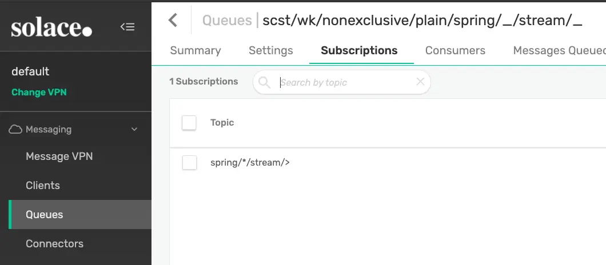


### Wildcards in queueAdditionalSubscrptions
The second place you can add topic subscriptions and also use wildcards when using the Solace binder is using the `queueAdditionalSubscriptions` consumer property. 
This property is available under `spring.cloud.stream.solace.bindings.BINDING_NAME.consumer.queueAdditionalSubscriptions` and allows for 1 to many extra topic subscriptions to be added. 

For example, if we wanted to add `pub/*/plus` and `a/b/>` subscriptions to our app we could add those subscriptions to the queue by doing the following: 
``` yaml
spring:
  cloud:
    function:
      definition: myConsumer
    stream:
      bindings:
        myConsumer-in-0:
          destination: 'spring/*/stream/>'
          group: nonexclusive
          consumer:
            concurrency: 5
      solace:
        bindings:
          myConsumer-in-0:
            consumer:
              queueAdditionalSubscriptions:
                - 'a/b/>'
                - 'pub/*/plus'
```

After restarting our app we can see that the subscriptions on our queue have been updated to include our two additions:
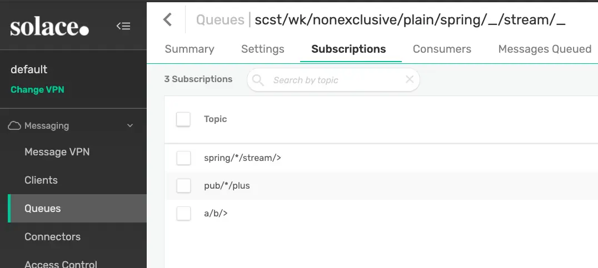

💥 We can now use Solace wildcards to filter for the exact events that we're interested in! 

## Dynamic Publishing
Duration: 0:15:00

Now that we know how to subscribe using wildcards we're halfway to taking advantage of Solace's dynamic topics. The second part of that is of course to be able to publish to whatever topic we need to! We want to publish to a unique topic for each event, no worries I've got you covered! 

The Spring Cloud Stream framework allows for 2 different ways to publish to dynamic topics using the imperative style.  
1. Using `StreamBridge`
1. Using the `BinderHeaders.TARGET_DESTINATION` header

Negative
: If you're using the reactive programming style you can use the `EmitterProcessor` for dynamic publishing but we won't be covering that in this codelab. 

### StreamBridge
The first option for dynamic publishing is using `StreamBridge`. Note that this option is processed at the framework level and will work with any Cloud Stream binder that you choose to use. `StreamBridge` will cache a channel within Spring for each destination that you publish to. This options is solid if you're going to be publishing to a small number of destinations as the channel will remain in cache and you can lookup the channel for monitoring/metrics if you desire. Note that the number of channels cached is configurable via `spring.cloud.stream.dynamic-destination-cache-size`. 

Let's update our `myConsumer` function to publish to dynamic topics. 
``` java
@Bean
public Consumer<Message<String>> myConsumer(StreamBridge sb) {
    return v -> {
        logger.info("Received myConsumer: " + v.getPayload());
        logger.info("CorrelationID: " + v.getHeaders().get("solace_correlationId"));

        // Use whatever business logic you'd like to figure out the topic!
        String cid = (String) v.getHeaders().get("solace_correlationId");
        if (cid == null) {
            cid = Integer.toString(1);
        }
        String myTopic = "solace/cid/".concat(cid);
        logger.info("Publishing to: " + myTopic);
        sb.send(myTopic, v.getPayload());
    };
}
```

Positive
: Note that StreamBridge does not send the output of the function as message, but rather can be used to send a message whenever needed during processing. This can come in handy to send alerts during processing.

🛠 To test this out go ahead and open up the "Try-Me" tab. On the *Subscriber* side subscribe to "solace/cid/>". 
On the *Publisher* side, click "Show Advanced", set a "Correlation ID" of 1 and send a message to the `a/b/c` topic. 
Change the "Correlation ID" value to 2 and send again. You should now see that the app is publishing to dynamic topics and your *Subscriber* is consuming them. 

You should see something like the image below: 
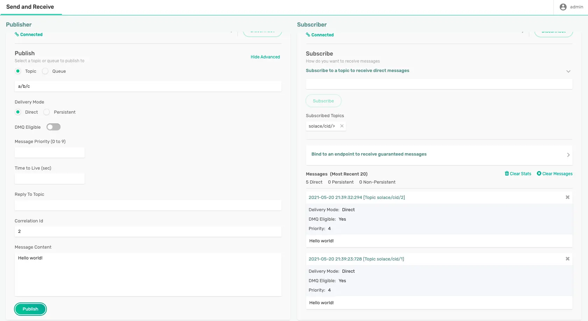

✅ Now you know how to use StreamBridge to publish to dynamic topics!

### BinderHeaders.TARGET_DESTINATION
The second way to publish to a dynamic destination is to use the `BinderHeaders.TARGET_DESTINATION` header. Note that this option will only work with binders that explicity support the feature, including Solace. When setting this header the framework is actually delegating the dynamic publishing to the Binder itself and therefore may result in better performance than the StreamBridge option depending on the binder's implementation. 
🚀 If using the Solace binder this dynamic publishing option results in lower latencies as the Binder doesn't create/cache Spring Integration channels. 

Different than when using StreamBridge, when using the `BinderHeaders.TARGET_DESTINATION` option you would actually use a `Function` or `Supplier` and return a `Message<?>` with the header set to the destination you'd like the message to be published to. If the `BinderHeaders.TARGET_DESTINATION` header is set it will override the default `destination` that is configured on the output binding. This allows you to configure a default destination that is used a majority of the time and only override it when necessary if desired. 

Let's create a `myFunction` Function that will perform the same processing that we just implemented with `StreamBridge`.    
Your code will look something like this: 
``` java
@Bean
public Function<Message<String>, Message<String>> myFunction() {
    return v -> {
        logger.info("Received myFunction: " + v.getPayload());
        logger.info("CorrelationID: " + v.getHeaders().get("solace_correlationId"));
        
        // Use whatever business logic you'd like to figure out the topic!
        String cid = (String) v.getHeaders().get("solace_correlationId");
        if (cid == null) {
          cid = Integer.toString(1);
        }
        String myTopic = "solace/cid/".concat(cid);
        logger.info("Publishing to: " + myTopic);
        return MessageBuilder.withPayload(v.getPayload()).setHeader(BinderHeaders.TARGET_DESTINATION, myTopic).build();
    };
}
```

Go ahead and update your Spring configuration to look like the following. This configuration sets the input and output bindings for your function `myFunction` and also sets the default output topic to `my/default/topic` which the app overrides.  
``` yaml
spring:
  cloud:
    function:
      definition: myFunction
    stream:
      bindings:
        myFunction-in-0:
          destination: 'a/b/>'
          group: nonexclusive
          consumer:
            concurrency: 5
        myFunction-out-0:
          destination: 'my/default/topic'
```

🛠 Go ahead and test the function by repeating the "Try-Me" steps that we used above to test the `StreamBridge` implementation. You should see the same result :) 


## Batch Publishing
Duration: 0:07:00

Sometimes when following the `Supplier` or the `Function` pattern you may need to send more than one output message for each one that you process. As we saw earlier, you can use StreamBridge to send messages whenever you'd like, but there is also another option. That options is to return a `Collection<Message<?>>` object in your Function. When doing this Spring Cloud Stream will send each member of the collection as it's own message. 

### Batch Publish to Default Binding Destination
👀 Let's check it out! Go ahead and **comment out your previous code** and create a `myFunction` function that takes in a String and returns a `Collection<Message<String>>`. It should look something like this: 
``` java 
@Bean
public Function<String, Collection<Message<String>>> myFunction() {
    return v -> {
        logger.info("Received: " + v);
        
        ArrayList<Message<String>> msgList = new ArrayList<Message<String>>();
        msgList.add(MessageBuilder.withPayload("Payload 1").build());
        msgList.add(MessageBuilder.withPayload("Payload 2").build());
        msgList.add(MessageBuilder.withPayload("Payload 3").build());
        
        return msgList;
    };
}
```

The code above will result in 3 messages being sent to the default output binding destination each time a message is received on the input binding.  

If you still have the application properties configured from the previous section you can leave them be, if not go ahead and add these properties. Note that the default output binding destination is `my/default/topic`.
``` yaml
spring:
  cloud:
    function:
      definition: myFunction
    stream:
      bindings:
        myFunction-in-0:
          destination: 'a/b/>'
          group: nonexclusive
        myFunction-out-0:
          destination: 'my/default/topic'
```

🛠 Test it out by starting your app via your IDE or using `mvn clean spring-boot:run` inside of your project. Use the "Try-Me" **Subscriber** to subscribe to the `my/default/topic/` topic and then use the **Publisher** to send a message to the `a/b/c` topic. You should see your Subscriber receive 3 messages for each message that you send 🎊. 

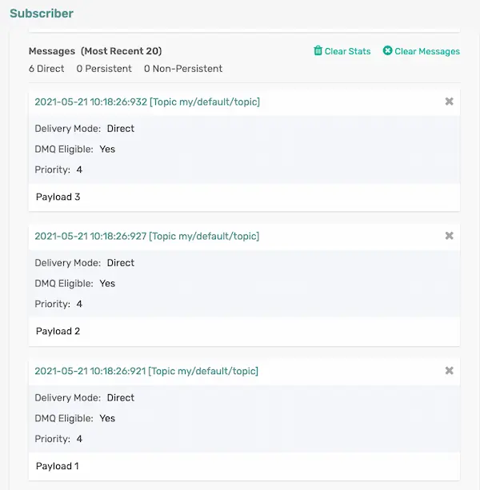

### Batch Publish to Dynamic Binding Destinations
😱 That's cool! But what's even cooler? You can combine this batch publishing functionality with the dynamic publishing tricks we learned earlier 😱

Check out this Function noting a few things: 
🥳 You can use both StreamBridge & BinderHeaders.TARGET_DESTINATION in conjunction with Batch Publishing
😎 When using StreamBridge you don't need to actually build the Message object, just like before
🤑 When using BinderHeaders.TARGET_DESTINATION you can have some messages go to the default binding destination and others go to dynamic ones!

``` java
@Bean
public Function<String, Collection<Message<String>>> myFunction(StreamBridge sb) {
    return v -> {
        logger.info("Received: " + v);
        
        // Do some processing & use StreamBridge to send an Alert to a dynamic topic
        sb.send("some/other/topic/1", v);
        
        // Do some more processing and create a list of messages to send upon returning
        ArrayList<Message<String>> msgList = new ArrayList<Message<String>>();
        // Send to default topic
        msgList.add(MessageBuilder.withPayload("Payload 1").build());
        // Send to dynamic topics using BinderHeaders.TARGET_DESTINATION
        msgList.add(MessageBuilder.withPayload("Payload 2").setHeader(BinderHeaders.TARGET_DESTINATION, "some/other/topic/2").build());
        msgList.add(MessageBuilder.withPayload("Payload 3").setHeader(BinderHeaders.TARGET_DESTINATION, "some/other/topic/3").build());
        
        return msgList;
    };
}
```

🛠 Add a topic subscription of `some/other/topic/>` to your "Try-Me" **Subscriber**, resend a message to `a/b/c` and checkout what your **Subscriber** receives.      

You'll note that you received 1 message on the default binding destination of `my/default/topic` and the other 3 messages went to `some/other/topic/X` where X is a number as defined in the code. 

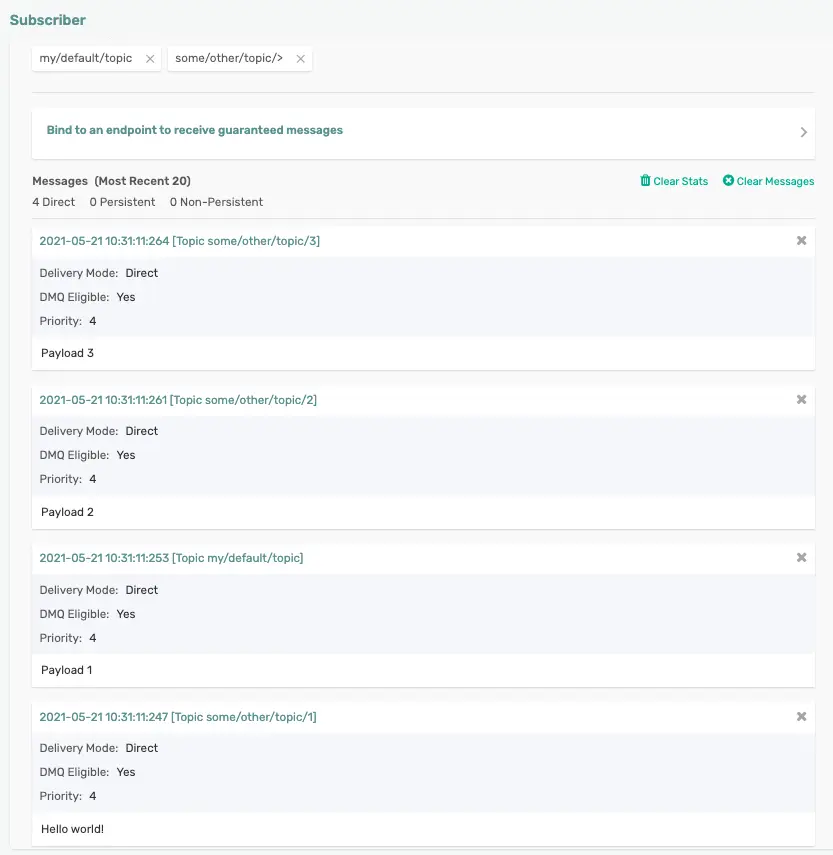


## Client/Manual Acknowledgements
Duration: 0:12:00

By default when using Spring Cloud Stream with imperative functions (not reactive!) it automatically acknowledges a message when the Function successfully exists. However sometimes you want more control. In this section we'll cover how you can use client/manual acknowledgements to handle this situation. 

Using Client/Manual Acknowledgements can be simplified into a two step process:  
1. Disable auto-acknowledgement in the acknowledgment callback header
2. Acknowledge the message! 

Since we're dealing with acknowledgements we know we're essentially dealing with a message/event broker and we'll need to receive the `Message<?>` object itself. Once we have the `Message<?>` object we can access the `AcknowledgementCallback` in the header and disable auto ack as follows: 

``` java
// Disable Auto-Ack
AcknowledgmentCallback ackCallback = StaticMessageHeaderAccessor.getAcknowledgmentCallback(v); 
ackCallback.noAutoAck(); 
```

Now that we've disabled auto ack we are in charge of handling the Acknowledgement and can choose from 3 options using Spring's `AckUtils`. When using Manual Acknowledgements make sure you ALWAYS acknowledge the message! We'll talk more about when you _should_ use these options in the **Consumer Error Handling** section of this codelab.  
1. ACCEPT 
1. REJECT  
1. REQUEUE

Negative
: Note that the Acknowledgement options of ACCEPT, REJECT, REQUEUE may differ depending on the functionality of the underlying message/event broker so be sure to reference the docs for the binder that you're using. 

When using the Solace binder and handing your events in multiple threads you'll also want to ensure that you catch the `SolaceAcknowledgementException` which may get thrown in a REQUEUE scenarios.

``` java
// Acknowledge the Message!
try {
    AckUtils.accept(ackCallback);
    //AckUtils.requeue(ackCallback);
    //AckUtils.reject(ackCallback);
} catch (SolaceAcknowledgmentException e) {
    //TODO Log a warning? Message was re-queued on broker and will be re-delivered to a consumer
}
```
If using the Solace Binder you can learn how it handles the different AckUtils Status options in the [Manual Message Acknowledgement binder docs](https://github.com/SolaceProducts/solace-spring-cloud/tree/master/solace-spring-cloud-starters/solace-spring-cloud-stream-starter#manual-message-acknowledgment). Refer to the [AckUtils documentation](https://docs.spring.io/spring-integration/api/org/springframework/integration/acks/AckUtils.html) and [AcknowledgmentCallback documentation](https://javadoc.io/doc/org.springframework.integration/spring-integration-core/latest/org/springframework/integration/acks/AcknowledgmentCallback.html) for more info on these objects at the Spring level.

Positive
: Two of the most common uses of Manual Acknowledgements are to:
  1. Implement the Reactor Pattern and handle messages in separate threads while keeping the number of connections/sessions/flows to the event broker to a minimum. 
  1. Be able to handle many messages when dealing with high throughput. This is common when inserting into a down stream datastore and not wanting to do an insert/update for each and every message.       

👉 Let's go ahead and put it all together with a simple sample Function (**Comment out previous code**) that receives a `Message<String>`, disable auto-ack, executes some simple business logic and decides whether it wants to accept, reject or requeue a message. 

1️⃣  First off let's go ahead and change our application configuration to create a fresh queue and set `queueMaxMsgRedelivery` so we don't get stuck in an infinite loop of rejecting/receiving the same message over and over again. Note that the queue name will be different because we changed the group to `clientAck` and the group is used as part of the queue naming convention.
``` yaml
spring:
  cloud:
    function:
      definition: myFunction
    stream:
      bindings:
        myFunction-in-0:
          destination: 'a/b/>'
          group: clientAck
        myFunction-out-0:
          destination: 'my/default/topic'
      solace:
        bindings:
          myFunction-in-0:
            consumer:
               queueMaxMsgRedelivery: 2
```

2️⃣  Next go ahead and modify your java code to add the following Function (comment out or delete other code so it doesn't interfere)     

``` java
@Bean
public Function<Message<String>, String> myFunction() {
        return v -> {
            logger.info("Received: " + v);

            // Disable Auto-Ack
            AcknowledgmentCallback ackCallback = StaticMessageHeaderAccessor.getAcknowledgmentCallback(v);
            ackCallback.noAutoAck();

            // TODO Execute Business Logic + Maybe even pass to another thread?
            // Use CorrelationID for easy business logic...
            String cid = (String) v.getHeaders().get("solace_correlationId");
            if (cid == null) {
				cid = "none";
			}
            
            // Acknowledge the Message!
            try {
                if (cid.equals("accept")) {
                    logger.info("Accepting the Message");
                    AckUtils.accept(ackCallback);
                } else if (cid.equals("requeue")) {
                    logger.info("Requeuing the Message");
                    AckUtils.requeue(ackCallback);
                    Thread.sleep(60000);
                } else {
                    logger.info("Rejecting the Message");
                    AckUtils.reject(ackCallback);
                    Thread.sleep(60000);
                }
            } catch (SolaceAcknowledgmentException e) {
                logger.warn("Warning, exception occurred but message will be re-queued on broker and re-delivered", e);
                return null; //Don't send an output message
            }

            return "My Payload";
        };
}
```

🛠 Let's test this out using the "Try-Me" tool as usual. In the **Publisher** set the "Correlation Id" (which is under "Show Advanced") to "accept" and publish a message to the `a/b/c` topic like seen in the image below.         
🛠 You should see that your microservice accepts the message and if you navigate to your Queue, which should be named *scst/wk/nonexclusive/plain/a/b/_*, you'll see that there are no messages remaining on the queue. 

🛠 Now change the "Correlation ID" to "requeue" and send the message again. You'll see that the message gets requeued and if you navigate to your queue in PubSub+ Manager in a timely manner (within 2 minutes since we set retries to 2, are using a single consumer, and set a sleep of 60 seconds after requeuing) you'll see the message remains on the queue.

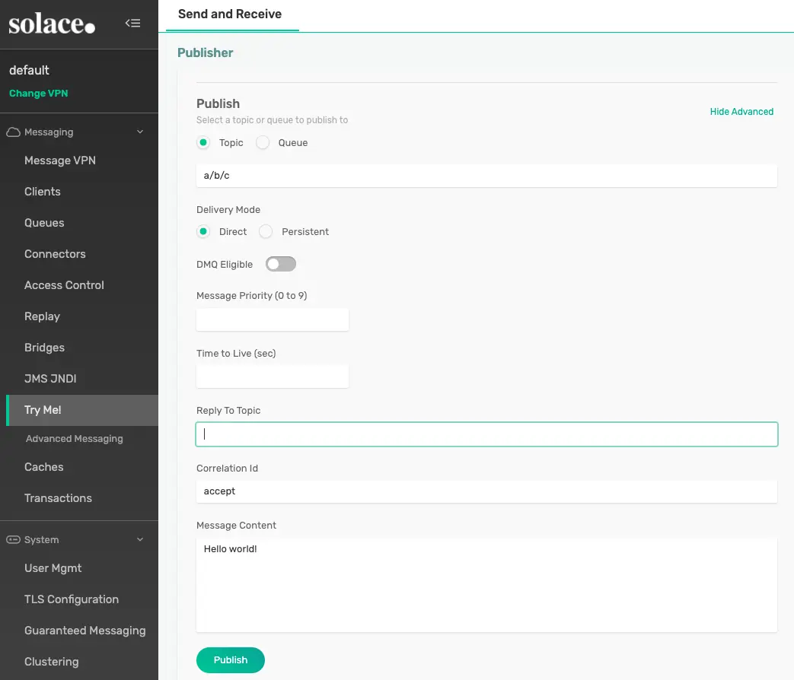

💡 Now that you know how to use Manual Acknowledgements we'll talk about when to use them as part of Consumer Error Handling in the next section!

## Consumer Error Handling
Duration: 0:15:00

There are several mechanisms available to the developer when consuming messages with a Spring Cloud Stream microservice. Some of these mechanisms are internal to the framework and available for any binder, while others are specific to the binder that you're using. In this codelab I'll cover the framework options as well as error handling options made available by the Solace Binder. 

### Provided by the Framework

**Retries**
The [Error Handling](https://docs.spring.io/spring-cloud-stream/docs/current/reference/html/spring-cloud-stream.html#spring-cloud-stream-overview-error-handling) section in the Spring Cloud Stream reference guide goes into more detail around the available options, but in general for developers using imperative functions the framework provides retrying of exceptions using the [Spring Retry](https://github.com/spring-projects/spring-retry) library and developers creating reactive functions can take advantage of `retryBackoff` capabilities in project reactor. 

The framework provides reasonable defaults, but when using the the `SpringRetry` library you can configure the `RetryTemplate` to configure options such the number of retry events, the backoff interval and even which exceptions to retry or not retry. If you need custom retry logic you can also provide your own instance of the `RetryTemplate` for use. It is important to note that these retries take place inside of the microservice itself and the message is not being sent back to the underlying message system. 

Negative
: When using reactive functions (such as if you're using `Flux` or `Mono`) the framework connects the `Flux` or `Mono` into your Function and that's it. The messages are acknowledged immediately after they are handed to the function and does not wait for success/failure. This may result in the loss of messages if your app were to crash and is why I would not use reactive functions with Spring Cloud Stream if message loss is not acceptable per your requirements.

Configuring the `RetryTemplate` on an input binding would look something like this:
``` yaml
spring:
  cloud:
    function:
      definition: myFunction
    stream:
      bindings:
        myFunction-in-0:
          destination: 'a/b/>'
          group: clientAck
          consumer:
            max-attempts: 2
            back-off-initial-interval: 1
            back-off-multiplier: 3
            default-retryable: true
            retryable-exceptions:
              java.lang.IllegalStateException: true
```


####Consumer Error Channels

Negative
: It is highly recommended to upgrade the Spring Cloud Stream version to 3.2.5 (or higher) to take advantage of binding-specific error handling functionality. 

**Spring Cloud Stream pre-v3.2.5**

If you are using Spring Cloud Stream version prior to 3.2.5, continue reading. Otherwise, continue to the next section **Spring Cloud Stream v3.2.5 or higher**. The error channel specification follows the convention of `@ServiceActivator`, an annotation-based approach for specifying global and destination-specific error handlers. 


After the Retries have been exhausted the Cloud Stream framework will next send an `ErrorMessage` to a binding specific error channel, which is formatted as `<destination>.<group>.errors`. You can configure a `@ServiceActivator` to listen on that Spring Integration channel to try to handle the Exception. If you do not register a listener then the framework will pass the `ErrorMessage` along to the global `errorChannel` Spring Integration Channel where a different `@ServiceActivator` can listen. However, if listening on this global errorChannel do not try to handle the message itself as the binder will already have been notified that the message has failed and will be implementing it's own error handling. This global errorChannel is moreso useful for logging or publishing an alert elsewhere. 

Here is an example `@ServiceActivator` listening to the binding specific error channel. Note that `inputChannel` name is derived from the yaml above that defines the destination as `a/b/>` and the group as `clientAck`. If your binding specific error handler exits successfully then the binder will acknowledge/accept the message back to the broker, if an exception is thrown then the binder error handling process will kick in. Note that if you are using Client/Manual acknowledgements you can also use them in the binding specific error handler. 
``` java
@ServiceActivator(inputChannel = "a/b/>.clientAck.errors") 
public void handleError(ErrorMessage message) {
    logger.info("Binding Specific Error Handler executing business logic for: " + message.toString());
    logger.info("Exception is here: " + message.getPayload());
}
```

And here is an example of a `@ServiceActivator` listening on the global error channel. Note that the global error channel will only receive the ErrorMessage if there is no binding specific error channel. 
``` java
@ServiceActivator(inputChannel = "errorChannel")
public void handleNotificationErrorChannel(ErrorMessage message) {
    logger.info("Global errorChannel received msg. NO BUSINESS LOGIC HERE! Notify ONLY!" + message.toString());
}
```

**Spring Cloud Stream v3.2.5 or higher**

If your Maven BOM in the pom file does not include Spring Cloud Stream v3.2.5 (or higher) jar file, you can explicity add it to the dependencies section.

```
<dependency>
    <groupId>org.springframework.cloud</groupId>
    <artifactId>spring-cloud-stream</artifactId>
    <version>3.2.5</version>
</dependency>
```

After the Retries have been exhausted the Cloud Stream framework will next send an `ErrorMessage` to a binding specific error channel, as specified by **`<spring>.<cloud>.<stream>.<bindings>.<binding_name>.error-handler-definition`**. You can configure a `@Bean` function to handle the Exception. If you do not register a function then the framework will pass the `ErrorMessage` along to the global `errorChannel`, a different `@Bean` function assigned to handle the error message. This can be specified as **`<spring>.<cloud>.<stream>.<default>.error-handler-definition`**. Do not try to handle the message itself as the binder will already have been notified that the message has failed and will be implementing it's own error handling. This global errorChannel is more so useful for logging or publishing an alert elsewhere. 

Here is an example of registering binding-specific and global error handlers in the configuration.

```
spring:
  cloud:
    function:
      definition: myFunction
    stream:
      default:
        error-handler-definition: handleGlobalError
      bindings:
        myFunction-in-0:       
          destination: 'a/b/>'
          group: clientAck
          error-handler-definition: handleBindingError
          consumer:
            max-attempts: 2
            back-off-initial-interval: 1
            back-off-multiplier: 3
            default-retryable: true
            retryable-exceptions:
              java.lang.IllegalStateException: true
```

Here is an example of binding-specific error handler function. If your binding specific error handler exits successfully then the binder will acknowledge/accept the message back to the broker, if an exception is thrown then the binder error handling process will kick in. Note that if you are using Client/Manual acknowledgements you can also use them in the binding specific error handler. **[NOTE: This point is questionable]**

``` java
@Bean
public void handleError(ErrorMessage message) {
    logger.info("Binding Specific Error Handler executing business logic for: " + message.toString());
    logger.info("Exception is here: " + message.getPayload());
}
```

And here is an example of a global error channel, an error handling function that will be invoked to handle errors from all channels that do not have binding-specific error handlers.

``` java
@Bean
public void handleNotificationErrorChannel(ErrorMessage message) {
    logger.info("Global errorChannel received msg. NO BUSINESS LOGIC HERE! Notify ONLY!" + message.toString());
}
```

**Testing Error Handler functions**

🛠 You can easily test this out be changing your `myFunction` to throw a RuntimeException like below:
``` java
public Function<Message<String>, String> myFunction() {
    return v -> {
        logger.info("Received: " + v);

        // Logic to Avoid infinite loop of message being re-delivered when testing error
        // handling during codelab. DO NOT USE IN PRODUCTION CODE
        if (true == (Boolean) v.getHeaders().get("solace_redelivered")) {
            logger.warn("Exiting successfully to ACK msg and avoid infinite redelivieres");
            return null;
        }

        throw new RuntimeException("Oh no!");
    };
}
```

🛠 Go ahead and use the "Try-Me" tool to publish a message to the "a/b/c" topic. You should see that the binding specific error handler received the message. 


**Don't send a message!**
It is common to have a microservice that receives an event, processes it, and publishes an outbound event. But what if I don't want to send an output message!? The framework makes this easy, just `return null` and no outbound message will be published. 

```java
@Bean
public Function<String, String> myFunction() {
    return v -> {
        logger.info("Received: " + v);
            
        if (!sendMessageDownstream(v)) {
          logger.warn("Not Sending an Outbound Message");
          return null; //Don't send a message, but ACCEPT it to remove it from the queue
        } else {
          return processMessage(v);
        }
    };
}
```

### Provided by the Solace Binder
So what happens after internal retries are exhausted!? The message is given back to the binder which for further error handling.
I'll cover error handling by example in this codelab, but be sure to read the [Failed Consumer Message Error Handling](https://github.com/SolaceProducts/solace-spring-cloud/tree/master/solace-spring-cloud-starters/solace-spring-cloud-stream-starter#failed-consumer-message-error-handling) section of the Solace Binder docs for all the detail. 

At a high level the Solace Binder offers 2 options: 
1. **Requeuing the message back to the queue on the Solace Event Broker.** Note that this is the default option. By putting the message back on the queue the broker will re-deliver the message to a consuming app. This may result in it being re-delivered to the same microservice instance or potentially another instance in your consumer group. If you are going to use this option be sure to consider what you want your queue's max message redelivery to be set to and also consider if you would like a Solace [Dead Message Queue](https://docs.solace.com/Configuring-and-Managing/Setting-Dead-Msg-Queues.htm) . 
1. **Publishing the message to a separate Error Queue**. This option can be chosen by setting the `autoBindErrorQueue` consumer property option to true and will result in the Binder creating a separate error queue to publish errors to(by default). The Error Queue will be a Durable Queue on the Solace Event Broker and can be configured by the options starting with "errorQueue" in the [Solace Consumer Properties](https://github.com/SolaceProducts/solace-spring-cloud/tree/master/solace-spring-cloud-starters/solace-spring-cloud-stream-starter#solace-consumer-properties). This option allows your messages that result in an exception to be published elsewhere for further error handling. 

✅ Here is an example of how you would configure the error queue to be used on our `myFunction` example. 
``` yaml
spring:
  cloud:
    function:
      definition: myFunction
    stream:
      bindings:
        myFunction-in-0:
          destination: 'a/b/>'
          group: clientAck
            max-attempts: 2
        myFunction-out-0:
          destination: 'my/default/topic'
      solace:
        bindings:
          myFunction-in-0:
            consumer:
               autoBindErrorQueue: true
               errorQueueMaxDeliveryAttempts: 3
               errorQueueAccessType: 1
               errorQueueRespectsMsgTtl: true
```

✅ If we start our app with the configuration above we'll see that an error queue named `scst/error/wk/clientAck/plain/a/b/_` is created. You can see it in PubSub+ Manager. 

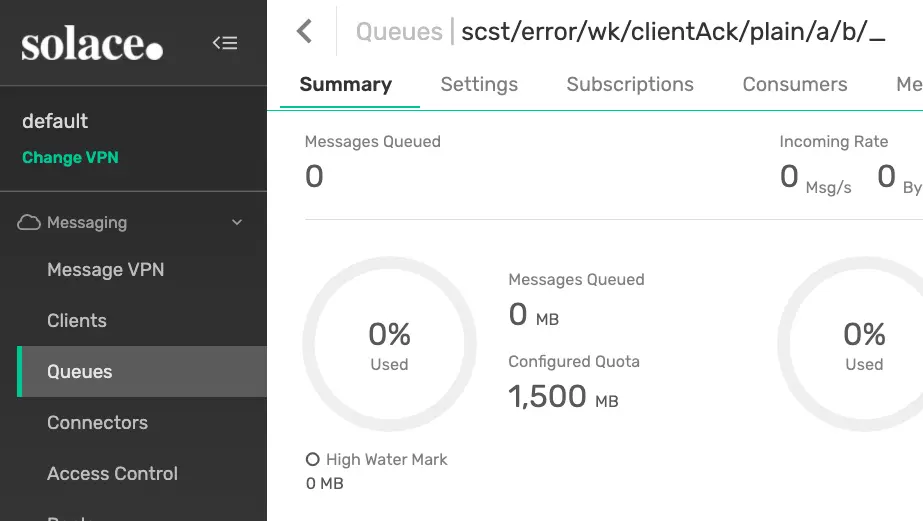


🛠 The easiest way to test these options out are to have your function `throw new RuntimeException("Oh no!!")` and use the "Try-Me" tab to send test messages 👍
``` java
public Function<Message<String>, String> myFunction() {
    return v -> {
        logger.info("Received: " + v);

        // Logic to Avoid infinite loop of message being re-delivered when testing error
        // handling during codelab. DO NOT USE IN PRODUCTION CODE
        if (true == (Boolean) v.getHeaders().get("solace_redelivered")) {
            logger.warn("Exiting successfully to ACK msg and avoid infinite redelivieres");
            return null;
        }

        throw new RuntimeException("Oh no!");
    };
}
```

### Guidance
Okay so we have all of these options, how do we choose what to do when handling errors? It of course all goes back to your requirements.
1. In general, keep it simple when possible! 
 * Handle your exceptions and don't throw them when possible.  
 * Think about how your function might fail and configure the `RetryTemplate` (Would Retrying really help?) and binding specific error channel appropriately.
 * Do you want messages that do throw exceptions to end up on another queue? (use `autoBindErrorQueue`)
1. If you need more control and are fine writing more messaging specific code then I would make use of both the internal framework and binder error handling options in conjunction with **Client/Manual Acknowledgements** that we covered in a previous section. Then do something like the following: 
 * Handle your exceptions and don't throw them
 * Think about how your function might fail and configure the `RetryTemplate` (Would Retrying really help?) and binding specific error channel appropriately.
 * Use the Client/Manual Ack to `REQUEUE` messages that end in an error scenario that may be successful if retried, even if by another instance in the Consumer Group. For example, maybe an infrastructure issue where your microservice couldn't get a response from a downstream service. 
 * Identify your failure scenarios that wouldn't work if retried and consider if you want to send them all to one queue for further processing or to several destinations. If one queue then use the `autoBindErrorQueue` option and use the Client/Manual Ack to `REJECT` the message and let the binder handle it for you. However, if you prefer to send to several destinations for error processing then use `StreamBridge` as covered in the **Dynamic Publishing** section to publish where you'd like. After publishing be sure to use the Client/Manual Ack to `ACCEPT` the message.  

✅ Now that we know about exception handling options on the Consumer side we'll cover Publisher error handling in the next section!

## Publisher Error Handling
Duration: 0:12:00

When creating event-driven microservices you are using asynchronous communications by default. This can sometimes make it tricky to handle publishing errors. Luckily there are a few options available to you when using Spring Cloud Stream with the Solace Binder, if using other binders please check as error handling options may differ. 

The two options are: 
1. Producer Error Channels
1. Publisher Confirmation

Positive
: If you're using the Solace Binder, definitely take a read through the Solace Binders docs for [Failed Producer Error Handling.](https://github.com/SolaceProducts/solace-spring-cloud/tree/master/solace-spring-cloud-starters/solace-spring-cloud-stream-starter#failed-producer-message-error-handling)

### Producer Error Channels
Producer Error Channels allow you to remain asynchronous and have a callback triggered when a send/publishing failure occurs. This can be enabled by setting the `errorChannelEnabled` producer property to true. Note that this functionality is disabled by default. 

✅ Let's continue using our `myFunction` function and configure the outbound side to enable the publisher error channel. 
``` yaml
spring:
  cloud:
    function:
      definition: myFunction
    stream:
      bindings:
        myFunction-in-0:
          destination: 'a/b/>'
          group: clientAck
        myFunction-out-0:
          destination: 'my/default/topic'
          producer:
            error-channel-enabled: true
```

✅ Next we need to add a listener in the code
``` java
@ServiceActivator(inputChannel="my/default/topic.errors")
public void handlePublishError(ErrorMessage message) {
    logger.warn("Message Publish Failed for: " + message);
    logger.info("Original Message: " + message.getOriginalMessage());
}	
```

🛠 The easiest way to test this out when using Solace is to prevent our `client-username` from being able to publish to our output destination.
* Log in to the PubSub+ Manager
* Choose your VPN and choose "Access Control" 
* Click "ACL Profiles" and click on the ACL Profile for your Client Username. (By default it is "default")
* Click "Publish Topic", verify the "Publish Default Action" is "Allow" 
* Click the "+ Exception" button and add "my/default/topic"     
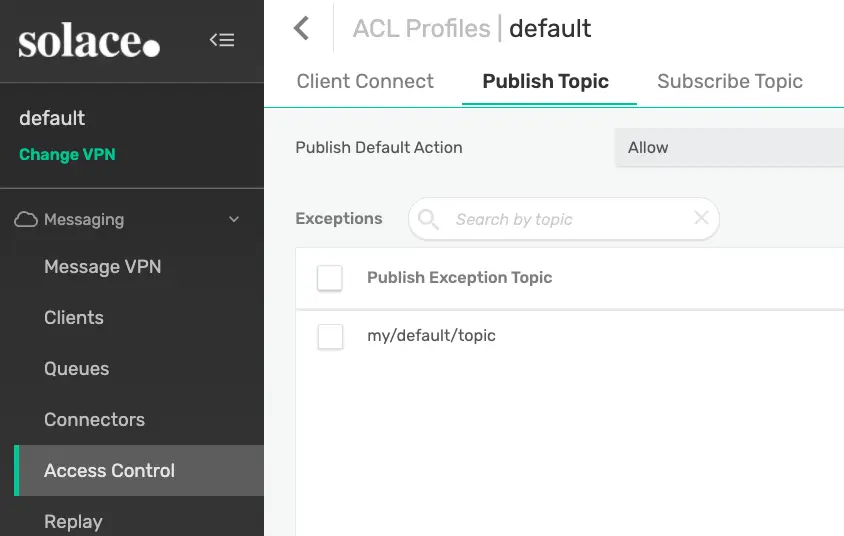

🛠 Let's use the "Try-Me" tool to send a message to the `a/b/c` topic and trigger our function. 
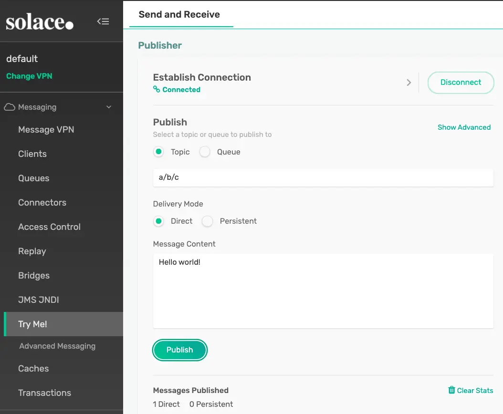

🛠 You should see that our listener logged the message failed to publish and you can add custom error handling logic. 


### Publisher Confirmations
If you need to wait to ensure your message was absolutely retrieved by the broker before continuing processing or you just want to keep the code simple and avoid extra callbacks then Publisher Confirmations in conjunction with StreamBridge may be the way to go for publishing messages from your microservice. This option allows you to use a `Future` to wait for publish confirmations and may differ per binder. With the Solace binder, for each message you create a `CorrelationData` instance and set it as your `SolaceBinderHeaders.CONFIRM_CORRELATION` header value. You can then use `CorrelationData.getFuture().get()` to wait for the publish acknowledgement from the broker. If the publish failed then an exception would be thrown. Read more in the [Publisher Confirmations](https://github.com/SolaceProducts/solace-spring-cloud/tree/master/solace-spring-cloud-starters/solace-spring-cloud-stream-starter#publisher-confirmations) section of the Solace Binder docs. 

To test this out go ahead and delete or comment out your current function and app config and replace it with the Function and binding config below. This code will wire up the `myConsumer` **Consumer** that will receive a message and use `StreamBridge` to send outgoing messages. By using StreamBridge we can send while still in our function and use the `Future` to wait for the publish to succeed or fail. Note that the code below will result in a failure if a  message is published to the `a/b/c` topic with a payload of "fail" assuming that we still have the *ACL Profile* set up to deny publishing to the `my/default/topic` as configured earlier in this section.       

**Java Code**
``` java
@Bean
public Consumer<String> myConsumer(StreamBridge sb) {
    return v -> {
        logger.info("Received myConsumer: " + v);

        CorrelationData correlationData = new CorrelationData();
        Message<String> message = MessageBuilder.withPayload("My Payload")
                .setHeader(SolaceBinderHeaders.CONFIRM_CORRELATION, correlationData).build();

        if (v.equals("fail")) {
            sb.send("my/default/topic", message);
        } else {
            sb.send("pub/sub/plus", message);
        }
        
        try {
            correlationData.getFuture().get(30, TimeUnit.SECONDS);
            logger.info("Publish Successful");
            // Do success logic
        } catch (InterruptedException | ExecutionException | TimeoutException e) {
            logger.error("Publish Failed");
            // Do failure logic
        }
    };
}
```

**Spring Config - for application.yml**
``` yaml
spring:
  cloud:
    function:
       definition: myConsumer
    stream:
      bindings:
        myConsumer-in-0:
          destination: 'a/b/>'
```
🛠 Go ahead and use the "Try-Me" tool to send a message to the `a/b/c` topic with a payload of "Hello World". You'll see the app processes the message and Publishing succceeds. If you then change the payload of the message to "fail" you'll see that the Publish to the `my/default/topic` fails and "Publish Failed" is logged. This allows the developer to execute error handling prior to exiting the funtion. 

Negative
: ⚠️  Keep in mind that waiting for the broker to acknowledge the message was received can be time consuming, especially if going across a wide area network, so this option should be used with caution.

🚨 **Just a Reminder - Go ahead and remove that ACL Profile Exception before you forget and get weird exceptions later** 

## Testing
Duration: 0:03:00

This section will (might 😝) be expanded in the future, for now these are the things to keep in mind: 
1. Write your code using Spring Cloud Function and keep your functions simple. Test your functions with unit tests that do not require the underlying message broker.
1. Spring Cloud Stream does offer a test binder which is automatically included if you generate your microservice from [start.spring.io](https://start.spring.io). Check out the [Testing](https://docs.spring.io/spring-cloud-stream/docs/current/reference/html/spring-cloud-stream.html#_testing) section of the Spring Cloud Stream reference guide for guidance on how to use it. This can be used to test simple binding configurations. 
``` xml
<dependency>
    <groupId>org.springframework.boot</groupId>
    <artifactId>spring-boot-starter-test</artifactId>
    <scope>test</scope>
</dependency>
<dependency>
    <groupId>org.springframework.cloud</groupId>
    <artifactId>spring-cloud-stream</artifactId>
    <scope>test</scope>
    <classifier>test-binder</classifier>
    <type>test-jar</type>
</dependency>
```
1. Keep in mind that the test binder will not be able to simulate the topic to queue mappings that occur with the Solace Binder & Solace PubSub+ Event Broker. Because of this you will want to run integration tests in a "real environment" that has an actual PubSub+ Event Broker. This is usually done by spinning up an Event Broker in a docker container or in [PubSub+ Cloud](https://console.solace.cloud/?utm_source=devrel) using the REST API.


## Takeaways & Next Steps
Duration: 0:03:00

Hopefully you learned quite a bit about the use of Spring Cloud Stream to create event-driven microservices, especially when it comes to using it with the Solace binder and Solace PubSub+ Event Brokers.  

For next steps I would recommend:
✅ Checking out the [AsyncAPI Code Generator Template for Spring Cloud Stream](https://github.com/asyncapi/java-spring-cloud-stream-template). This template allows you to start with a design and generate a Spring Cloud Stream microservice that is pre-configured with the input and output bindings necessary for your microservice to be wired up to the underlying messaging system. Don't want to read? Here is a [YouTube video](https://youtu.be/QEDL6AqsaJc) covering AsyncAPI code gen with Spring Cloud Stream!
✅ Learn about Solace Event Broker's Multi-protocol capabilties that allow your Spring Cloud Stream apps to exchange events/messages with other Spring and non-Spring apps. [YouTube Video!](https://youtu.be/FHoyGgP2TZM) 
✅ Learning about the [Solace Event Portal](https://console.solace.cloud/login/new-account?utm_source=devrel) which allows you to design your EDA and export AsyncAPI documents to help kickstart code generation. 


Thanks for participating in this codelab! Let us know what you thought in the [Solace Community Forum](https://solace.community/)! If you found any issues along the way we'd appreciate it if you'd raise them by clicking the Report a mistake button at the bottom left of this codelab.
