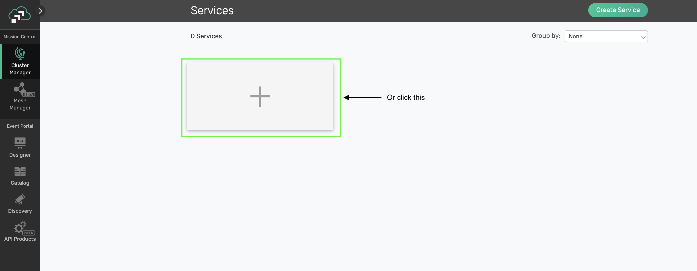

author: Marc DiPasquale
summary: This Codelab Covers more advanced features of using Spring Cloud Stream and the Solace PubSub+ Binder
id: spring-cloud-stream-beyond
tags: workshop
categories: spring, java
environments: Web
status: Published
feedback link: https://github.com/SolaceDev/solace-dev-codelabs/blob/master/markdown/spring-cloud-stream-beyond

# Spring Cloud Stream - Beyond the Basics

## What you'll learn: Overview
Duration: 0:03:00

This codelab is a follow-on to the [Spring Cloud Stream Basics](https://codelabs.solace.dev/codelabs/spring-cloud-stream-basics/#0) one. If you aren't yet familiar with the Spring Cloud Stream framework go ahead and jump over there to get a quick introduction to the framework. This codelab will go into more detail (Beyond the Basics 😜) of developing your Cloud Stream microservice. We will be using the Solace binder and Event Broker thoughout. The majority of features we will learn today apply at the framework level and do not depend on the underlying broker/binder of choice, however a few will be Solace specific and I will try to specify that when necessary. 

💡 You'll Learn:
* How to choose your communication model
* How to use concurrency to scale your apps
* How to use Message Headers
* How to subscribe using Wildcards
* How to publish to dynamic topics and in batches
* How to handle error scenarios

💎 Valuable Resources:
* The Spring Cloud Stream [Reference Guide](https://cloud.spring.io/spring-cloud-static/spring-cloud-stream/current/reference/html/spring-cloud-stream.html#spring-cloud-stream-reference)
* Solace Binder [Docs](https://github.com/SolaceProducts/solace-spring-cloud/tree/master/solace-spring-cloud-starters/solace-spring-cloud-stream-starter)
* Spring Sample [Github Repository](https://github.com/spring-cloud/spring-cloud-stream-samples)
* Solace Sample [Github Repository](https://github.com/SolaceSamples/solace-samples-spring)

## What you need: Prerequisites
Duration: 0:05:00

🛠  This page covers the setup needed to perform this codelab. 🛠

### Spring Cloud Stream Requirements

✅ Spring Cloud Stream just requires Java and Maven to use 🚀

* Java 1.8+ (Check version using `java -version`)
* Maven 3.3+ (Check version using `mvn -version`)
 * On mac you can `brew install maven`
 * Other install instructions [here](https://maven.apache.org/install.html)
* Your favorite Java IDE 💥

### Create your Messaging Service

✅ (1) Sign up for a free Solace Cloud account

Navigate to [this link](https://console.solace.cloud/login/new-account) and fill out the required information. No credit card required! If you already have an account, skip right to #2.

✅ (2) Create a messaging service

After you create your Solace Cloud account and sign in to the Solace Cloud Console, you'll be routed to the Solace Cloud Landing page.


Click on 'Messaging Services' and all the messaging services associated with your account will show up if you have any already created. To create a new service, click either button as depicted in the image below:



Fill out all the details for your messaging service, and then click "Create" at the bottom of the page. Note: make sure you choose the "Developer" option for the Service Type


Your service should be ready to use in a few minutes

✅ (3) Take note of the connection details

If your messaging service was created successfully, you'll be routed to the summary page of your new messaging service. From the service summary page, click on the "Connect" tab so we can take note of the connection details we'll need later.


After you click the "Connect" tab, click the "Connect with Spring" box, choose "Spring Cloud Stream", and click the "Connect to Service" option. We'll be using the "Secured SMF Host" URL in a minute 👍


### Create a Spring Cloud Stream Microservice 

✅ (1) Create an Empty Spring Cloud Stream Microservice to use throughout this codelab 

Navigate to [start.spring.io](https://start.spring.io/#!dependencies=solace,cloud-stream) and choose the "Solace PubSub+" and the "Cloud Stream" dependencies. If you used that link we already added them for you 😉.
You can leave everything else as the default or modify the Java version, package info, etc. as desired. 

Click the "Generate" button which will download the project. You can then unzip it and import the project into your preferred Java IDE as a maven project. I'll be using [Spring Tool Suite 4 for Eclipse](https://spring.io/tools) in the screenshots.
Your imported project should look like this: 


✅ (2) Add your Connection Details from the Messaging Service

Change the `application.properties` file to `application.yml` and copy and paste the `spring.cloud.stream.binders` part of the Spring Cloud Stream configuration previously found in the "Connect to Service" widget in your Message Service. 
It should look something like this:

``` yaml
spring:
  cloud:
    stream:
      binders:
        solace-cloud:
          type: solace
          environment:
            solace:
              java:
                clientUsername: default
                clientPassword: default
                host: 'tcp://localhost:55555'
                msgVpn: default
```

🚀 Setup complete! Let's get going! 🚀


## Communication Models and How to Choose
Duration: 0:20:00

As discussed in the [Spring Cloud Stream Basics](https://codelabs.solace.dev/codelabs/spring-cloud-stream-basics/#0) codelab, the Cloud Stream framework supports multiple communication models. Since the Solace Binder supports both Publish-Subscribe and Consumer Groups we will focus on those. Note that this decision is made on an input binding, or where you configure consumption of events/messages. 

Before we jump into choosing our consumption model, which is done via configuration, let's create a quick `Consumer` app that we can use. 
1. Open the `DemoApplication.java` file in your microservice.
1. Write a quick `Consumer` function that receives a `String`
```java
@Bean
public Consumer<String> myConsumer(){
	return v -> {
		System.out.println("Received: " + v);
	};
}
```

Now that we have a function we'll look at the different options to configure the *binding* which tells the binder how to connect your function to the underlying message broker. 

When using Spring Cloud Stream with the Solace Binder you can decide between 3 options:
1. Publish-Subscribe (Non-Durable): My events must be processed in order so I want them processed by one microservice AND I only care about receiving events when my microservice is connected. 
1. Publish-Subscribe (Durable): My events must be processed in order so I want them processed by one microservice AND I want events saved when my microservice is disconnected.
1. Consumer Groups: I need to be able to scale my microservices up/down in order to process my events and order isn't important.  

Positive
: 💥 Note that sometimes order **and** scaling matters! This is also possible by using dynamic topics and wildcard subscriptions that we'll cover in an upcoming section. Learn more about Solace topics in [this video](https://www.youtube.com/watch?v=PP1nNlgERQI&ab_channel=Solace).

### Publish-Subscribe (Non-Durable) 
There are many use cases where you need to process events in order as they are published to a defined topic. In order to do this with Spring Cloud Stream you would create your `Function` or `Consumer` function and configure the input binding for it to receive messagesfrom a specific destination. There are two ways to do this with the Solace binder. The standard way, with no Solace specific configurations, is non-durable and we'll start there.

👀 Under the covers this option will use a Non-Durable Anonymous Queue on the broker to hold the messages for the consuming microservice. Let's check it out!
This option will deliver events in order to your microservice while it remains up and running. To do this we just to specify a `destination`, but NO `group` on your input binding. 

So open your `application.yml` file and add the following config to what already exists. This configuration is telling Spring Cloud Stream that you want your `myConsumer` 
``` yaml
spring:
  cloud:
    function:
      definition: myConsumer
    stream:
      bindings:
        myConsumer-in-0:
          destination: spring/cloud/stream
```

Go ahead and run your app. You should see the app start up and connect to the event broker. Note that under the covers the Solace Binder will bind your function to a Non-Durable Anonymous (or Temporary) queue on the broker. 
This endpoint type in Solace is a temporary queue that will deliver messages to your app in order while your app remains online. It however is NOT a durable endpoint and will be removed after your application goes offline for more than 30 seconds.     

You'll see the name of your Anonymous Queue shown in a log entry on the console from the *SolaceQueueProvisioner* class: 
```
SolaceQueueProvisioner : Subscribing queue #P2P/QTMP/v:b0e95afab69a/scst/an/59e7cbe3-ec38-4da8-a8fa-d1e428f6eb56/plain/spring/cloud/stream to topic spring/cloud/stream

```

🛠 **Let's test this out using the *Try-Me* tab in Solace Cloud.**
1. Navigate to the Solace Cloud Console
1. Choose "Cluster Manager" -> and click the messaging service you created earlier
1. Click the "Try-Me!" option on the top menu
1. Click "Connect" on the "Publisher" side
1. Type in the `spring/cloud/stream` topic
1. Change the "Message" to whatever you'd like and click "Send"

Positive
: 💥 Note that you'll see that the messages arrive in the order that you send them. 

### TODO - INSERT TRY-ME IMAGE.

This option is great when we don't need to store messages/events when the app is offline, but what if we do!?

### Publish-Subscribe (Durable)
Sometimes it isn't enough to be able to deliver messages/events only while the app remains connected to the broker; there are many scenarios where you want messages stored while the app is offline while still maintaining order. In this case the Solace Binder allows you to follow the Publish-Subscribe pattern and consume from an Exclusive Durable Queue that will do just that. 

Positive
: 💥 As a bonus, this configuration also allows you to create a Primary/Secondary type of configuration where you can have multiple microservices ready to process the events and if the Primary disconnects the Secondary will take over. 

In order to modify the input binding to create an Exclusive Durable Queue we need to add a `group` to our binding and also set the Solace specific property `queueAccessType` to `EndpointProperties.ACCESSTYPE_NONEXCLUSIVE`. We do that with the configuration below. 
``` yaml
spring:
  cloud:
    function:
      definition: myConsumer
    stream:
      bindings:
        myConsumer-in-0:
          destination: spring/cloud/stream
          group: exclusive
      solace:
        bindings:
          myConsumer-in-0:
            consumer:
              queue-access-type: 1 #1 is Exclusive; 0 is Non-Exclusive (and default)
```

Now if you restart your app you'll see that a durable queue was created. 
```
SolaceQueueProvisioner : Subscribing queue scst/wk/exclusive/plain/spring/cloud/stream to topic spring/cloud/stream
```

And if you look in PubSub+ Manager you'll find that the queue is "Exclusive" which means that the first microservice which connects to it will receive all the messages in the order they are received by the broker. 


🛠 Go ahead and test it out by sending more messages with the "Try-Me" tab. Now that the queue is durable you can even stop your app, send a bunch of messages and then start it back up to see that they are delivered in order. 


### Consumer Groups
Another popular consuming pattern is using what are called **Consumer Groups**. Consumer groups in Spring Cloud Stream allow you to have multiple consumers sharing the processing of events. 
To do this you just need to specify a `group` on your input binding. 

To configure this on our app that has the `myConsumer` Consumer function your config would look like this.
```
spring:
  cloud:
    function:
      definition: myConsumer
    stream:
      bindings:
        myConsumer-in-0:
          destination: spring/cloud/stream
          group: nonexclusive
```

When using the Solace Binder and specifying a `group` the binder will actually create a Durable Non-Exclusive Queue Endpoint by default. This durable queue will hold messages for your microservices if they get disconnected. 
Go ahead and run the app, you'll see the following log message that specifies the queue. 
```
SolaceQueueProvisioner : Subscribing queue scst/wk/nonexclusive/plain/spring/cloud/stream to topic spring/cloud/stream
```

And in the PubSub+ Manager you'll see that it created a non-exclusive queue:


#### Scaling
So we're using the Consumer Group pattern (which uses a Non-Exclusive Queue!) so we can have multiple consumers share the processing of events. What are the choices for scaling!?

**Option 1 - Multiple Instances of your Microservice**
The first option is just to start up more instances of your microservice. This is common in a Kubernetes environment where your microservice runs in it's own container. Each instance of the microservice will connect to the same non-exclusive queue on the Solace broker and the broker will spread the messages across all consumers. 

**Option 2 - Concurrent Message Consumption in a Single Microservice**
The second option is to use the [concurrency consumer property](https://docs.spring.io/spring-cloud-stream/docs/3.1.1/reference/html/spring-cloud-stream.html#_consumer_properties) to enable concurrent message consumption for a particular consumer binding. Under the covers the Solace binder will create a separate flow for 

Modify your microservice's configuration to set a concurrency of 5 like seen below: 
``` yaml
spring:
  cloud:
    function:
      definition: myConsumer
    stream:
      bindings:
        myConsumer-in-0:
          destination: spring/cloud/stream
          group: nonexclusive
          consumer:
            concurrency: 5
```

When you restart your app you'll see that the Solace binder creates 5 separate "flow receivers". Note that they all share the same Solace session and will process events on separate threads. 
```
JCSMPInboundChannelAdapter : Creating consumer 1 of 5 for inbound adapter 5722ebd9-7f2a-40ba-b635-235a86938638
FlowReceiverContainer : Binding flow receiver container 76e517b1-d1a8-4ab2-975f-e4eb0b12535a
JCSMPInboundChannelAdapter : Creating consumer 2 of 5 for inbound adapter 5722ebd9-7f2a-40ba-b635-235a86938638
FlowReceiverContainer : Binding flow receiver container 0aba1d4b-fe21-42ed-ae3b-db6fc5a62d61
JCSMPInboundChannelAdapter : Creating consumer 3 of 5 for inbound adapter 5722ebd9-7f2a-40ba-b635-235a86938638
FlowReceiverContainer : Binding flow receiver container 67fa395b-6f50-40b5-ab34-b7fff446c50e
JCSMPInboundChannelAdapter : Creating consumer 4 of 5 for inbound adapter 5722ebd9-7f2a-40ba-b635-235a86938638
FlowReceiverContainer : Binding flow receiver container 798380cc-6140-4194-9f14-4bbfe7821485
JCSMPInboundChannelAdapter : Creating consumer 5 of 5 for inbound adapter 5722ebd9-7f2a-40ba-b635-235a86938638
```

✅ If you modify your code to add a logger and change the print line to a log entry, as seen below:
``` java
package com.example.demo;

import java.util.function.Consumer;

import org.slf4j.Logger;
import org.slf4j.LoggerFactory;
import org.springframework.boot.SpringApplication;
import org.springframework.boot.autoconfigure.SpringBootApplication;
import org.springframework.context.annotation.Bean;

@SpringBootApplication
public class DemoApplication {

	private static final Logger logger = LoggerFactory.getLogger(DemoApplication.class);


	public static void main(String[] args) {
		SpringApplication.run(DemoApplication.class, args);
	}

	@Bean
	public Consumer<String> myConsumer(){
		return v -> {
			logger.info("Received: " + v);
		};
	}
}
```

🛠 And send a bunch of messages from the "Try-Me" tab you'll see that each message is handled in it's own thread allowing one microservice to process multiple messages at once!
```
2021-05-13 16:37:34.137 INFO 85614 --- [pool-4-thread-1] com.example.demo.DemoApplication        : Received: Hello World
2021-05-13 16:37:34.237 INFO 85614 --- [pool-4-thread-2] com.example.demo.DemoApplication        : Received: Hello World
2021-05-13 16:37:34.314 INFO 85614 --- [pool-4-thread-3] com.example.demo.DemoApplication        : Received: Hello World
2021-05-13 16:37:34.333 INFO 85614 --- [pool-4-thread-4] com.example.demo.DemoApplication        : Received: Hello World
2021-05-13 16:37:34.377 INFO 85614 --- [pool-4-thread-5] com.example.demo.DemoApplication        : Received: Hello World
```

In most cases you'll want to do some performance testing to see what mix of scaling works best for you! Maybe you have 2 instances of your microservice each with a `concurrency` of 5. Unfortunately there is no magic answer that works across the board.


## Message Headers
Duration: 0:07:00
Consumer Side

By default when coding your Spring Cloud Stream microservice you are writing Spring Cloud Function beans that can be re-used for multiple purposes and can leverage the framework's [Content Type Negotiation](https://docs.spring.io/spring-cloud-stream/docs/current/reference/html/spring-cloud-stream.html#content-type-management) to pass your POJOs directly into the function while decoupling your business logic from the specific runtime target and triggering mechanism (web endpoint, stream processor, task). This is convenient, but sometimes when creating a function for a stream processor our business logic requires the use of metadata in the message headers that we need access to on the Consuming side or need to set on the Publishing side.

### Consumer - Accessing Headers
We'll start with the consuming side. In order to get access to the headers you'll need to set the input argument to a `Message<?>` type. 
Once you have the Spring Message object you can retrieve a map of the headers using the `getHeaders()` method. Note that because the input argument is now a `Message<?>` you would now use the `getPayload()` method to get the actual payload itself. 

For example, if we modify the `Consumer` from the previous section to take in a `Message<String>` we can now access the headers as seen below. 
``` java
@Bean
public Consumer<Message<String>> myConsumer(){
      return v -> {
        logger.info("Received: " + v.getPayload());
        logger.info("All Headers: " + v.getHeaders());
      };
}
```

And if we want to access individual headers we can then read them from that map. 
Note that a list of common [Solace Headers are found in the Solace Binder docs](https://github.com/SolaceProducts/solace-spring-cloud/tree/master/solace-spring-cloud-starters/solace-spring-cloud-stream-starter#solace-headers).

``` java
@Bean
public Consumer<Message<String>> myConsumer(){
      return v -> {
        logger.info("Received: " + v.getPayload());
        logger.info("Destination: " + v.getHeaders().get("solace_destination"));
        logger.info("TTL: " + v.getHeaders().get("solace_timeToLive"));
      };
}
```
**TODO: Add in app routing using headers?**      
**NOTE Future Enhancement Coming soon to allow for header mapping capabilities**

### Publishing - Setting Headers
On the source/publishing side of things we sometimes also need to set headers that downstream listeners may need access to. In order to do this we will need the output argument of our Function to also be a `Message<?>` object. Note that if you don't return a `Message<?>` object the framework will re-use the headers on the inbound message on the outbound one minus the headers defined or filtered by *SpringIntegrationProperties.messageHandlerNotPropagatedHeaders* or the Solace Binder `headerExclusions` producer property

For example, the code below sets a header named "Key" to the value "Value" on an outbound message.  
``` java
@Bean
Supplier<Message<String>> mySupplier(){
	return () -> {
		return MessageBuilder.withPayload("Hello Headers").setHeader("Key", "Value").build();
	};
}
```

In order to run it go ahead and modify your app config to look like the below: 
``` yaml
spring:
  cloud:
    function:
      definition: myConsumer;mySupplier
    stream:
      poller:
        fixed-delay: 10000
      bindings:
        myConsumer-in-0:
          destination: spring/cloud/stream
          group: nonexclusive
          consumer:
            concurrency: 5
        mySupplier-out-0:
          destination: spring/cloud/stream
```

And modify your `Consumer` function to print out the "Key" header:
``` java
@Bean
public Consumer<Message<String>> myConsumer() {
  return v -> {
    logger.info("Received myConsumer: " + v.getPayload());
    logger.info("Destination: " + v.getHeaders().get("solace_destination"));
    logger.info("TTL: " + v.getHeaders().get("solace_timeToLive"));
    logger.info("My Custom Header: " + v.getHeaders().get("Key"));
  };
}
```

Positive
: When using the Solace binder you can also set SolaceHeaders with "Write" access as defined [here](https://github.com/SolaceProducts/solace-spring-cloud/tree/master/solace-spring-cloud-starters/solace-spring-cloud-stream-starter#solace-headers)

Note the Solace Binder offers two producer properties that may come in handy for publishing apps that want to set headers: 
1. The `spring.cloud.stream.solace.bindings.BINDING_NAME.producer.headerExclusions` property allows you to exclude headers from the published message. 
1. The `spring.cloud.stream.solace.bindings.BINDING_NAME.producer.nonserializableHeaderConvertToString` property allows you to include the `toString` version of a non-serialiazable header. Note that if this is not set to true and a non-serializable header is set an exception would be thrown. 

## Wildcard Subscriptions
Duration: 0:15:00
2 ways: in the destination in queueAdditionalSubscriptions
<NEW> Extract topic levels as variables? 

## Dynamic Publishing
Duration: 0:15:00
2 ways: StreamBridge and TARGET_DESTINATION Header

## Batch Publishing
Duration: 0:07:00
return Collection<Message<?>>

## Client/Manual Acknowledgements
Duration: 0:07:00
foooo

## Consumer Error Handling
Duration: 0:15:00
Retry Templates in framework
Solace redeliveries and DLQ/DMQ
Publish to Error Queue
Custom! 

## Publisher Error Handling
Duration: 0:07:00
How to handle it!

## Takeaways & Next Steps
Duration: 0:03:00
✅ < Fill IN TAKEAWAY 1>   
✅ < Fill IN TAKEAWAY 2>   
✅ < Fill IN TAKEAWAY 3> 

Next Steps: 
AsyncAPI Code Gen
Tracing?


Thanks for participating in this codelab! Let us know what you thought in the [Solace Community Forum](https://solace.community/)! If you found any issues along the way we'd appreciate it if you'd raise them by clicking the Report a mistake button at the bottom left of this codelab.

### Info Boxes
Plain Text followed by green & yellow info boxes 

Negative
: This will appear in a yellow info box.

Positive
: This will appear in a green info box.

### Bullets
Plain Text followed by bullets
* Hello
* CodeLab
* World

### Numbered List
1. List
1. Using
1. Numbers

### Add an Image or a GIF


