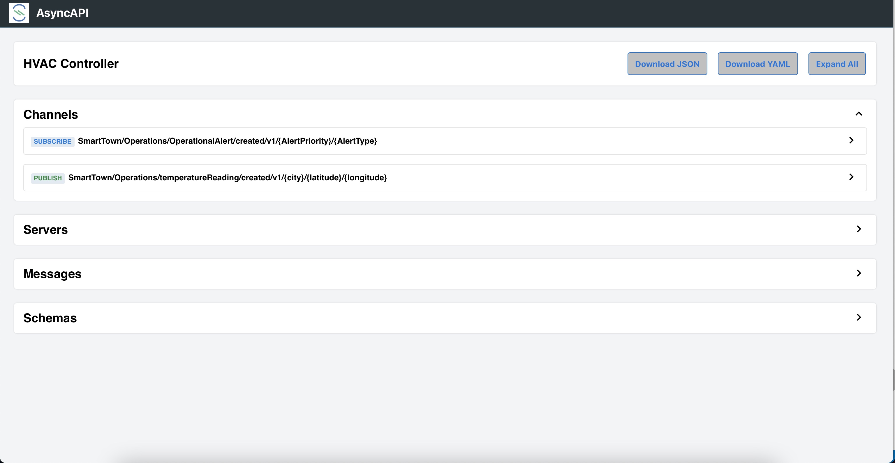

author: Giri Venkatesan
summary: SpringOne 2021 workshop for Developing Asynchronous APIs for the Event-Driven World Using Spring Cloud Stream, AsyncAPI, and an Event Mesh
id: springone-2021-asyncapi-workshop
tags: workshop,springone
categories: Spring,Java,AsyncAPI
environments: Web
status: Hidden
feedback link: https://github.com/SolaceDev/solace-dev-codelabs/blob/master/markdown/springone-2021-asyncapi-workshop

# Developing Asynchronous APIs for the Event-Driven World Using Spring Cloud Stream, AsyncAPI, and an Event Mesh

## Overview

Duration: 0:01:00

Are you passionate about building modern, real-time applications? Is your organization adopting an event-driven architecture (EDA) to compete in our event-driven world? Build and expand your developer toolbox by learning how to define asynchronous APIs, implement them using Spring Cloud Stream microservices, and globally distribute them across multi-cloud and on-premises environments using an event mesh.

In this workshop, we will create API Products that helps others to consume Business capabilities of a _SmartTown_ where APIs are a way of life. We will also

- Learn how to define asynchronous APIs.
- Use the AsyncAPI Generator template for Spring Cloud Stream.
- Develop event-driven microservices using Spring Cloud Stream and Java.
- Connect your microservices to an event mesh made of PubSub+ Event Brokers and stream events across the globe

Prerequisites

- Intermediate level of knowledge coding with Java
- Computer

## Requirements

Duration: 0:01:00

🛠 This page covers the setup needed to perform this codelab. 🛠

### AsyncAPI Generator Requirements

✅ Install instructions available [here](https://github.com/asyncapi/generator#requirements)

- Node.js v12.16+ (Check version using `node -v`)
- npm v6.13.7+ (Check version using `npm -version`)

We'll install the generator itself later 👍

### Spring Cloud Stream Requirements

✅ Spring Cloud Stream just requires Java and Maven to use 🚀

- Java 1.8+ (Check version using `java -version`)
- Maven 3.3+ (Check version using `mvn -version`)
  - On mac you can `brew install maven`
  - Other install instructions [here](https://maven.apache.org/install.html)
- Your favorite Java IDE 💥

### PubSub+ Event Broker

✅ Use the following credentials for connecting to PubSub+ Broker. The SMF Host details will be shared by the instructor.


- SMF Host: `tcp://?????.messaging.solace.cloud:55555`
- Message VPN: `springone-2021`
- Username: `smarttown`
- Password: `smarttown`

✅ Note that the Broker, Username with appropriate permissions are already setup and ready for use during the workshop.

> aside positive
> If you want to sing up and explore Solace capabilities, you can sign-up for a free Solace Cloud Account using [this link](https://bit.ly/try-solace-free).
Note that no credit card is required. You will receive an email to activate the account and will then be prompted to start the free trail.

✅ Event mesh requires two or more Solace PubSub+ Brokers on different geographic locations to stream events across the globe.🚀

## Spring Cloud Stream

Duration: 0:03:00


Spring Cloud Stream is a framework for creating highly scalable, event-driven microservices connected by pluggable messaging services. Messaging services are pluggable via Binders that we'll cover in a bit. The framework is based on Spring Boot and Spring Integration.

Spring Cloud Stream has three different types of message exchange contracts as pictures below.

1. Suppliers are sources of events
1. Sinks are consumers of events
1. Processors are both consumers and subscribers of events

### Message Exchange Contracts Map to Java Functions

As of Spring Cloud Stream v3 the preferred programming model is to use Java Functions to implement your cloud stream apps.

We just mentioned the 3 types of Cloud Stream message exchange contract are "Sources", "Sinks" and "Processors".
Those map to functions as follows:

- `java.util.function.Supplier` -> Source [Producer/Publisher of Events]
- `java.util.function.Consumer` -> Sink [Subscriber/Consumer of Events]
- `java.util.function.Function` -> Processor [ Consumes, Processes, and Produces Events ]

### Binders

Spring Cloud Stream Binders are really what make the framework useful. Binders provide an abstraction layer between your code and the messaging systems over which events are flowing. This allows you to write your code without having to worry about learning messaging APIs! When messages are sent or received from the messaging system they pass through the messaging system specific binder which knows how to communicate with that specific message broker.

As of the creation of this codelab the available Cloud Stream Binders are:

- RabbitMQ
- Apache Kafka
- Amazon Kinesis
- Google PubSub
- Solace PubSub+
- Azure Event Hubs
- Apache RocketMQ

> aside positive
> Today we're going to use the [Solace PubSub+ Binder](https://github.com/SolaceProducts/solace-spring-cloud/tree/master/solace-spring-cloud-starters/solace-spring-cloud-stream-starter) which supports publish subscribe and consumer groups.

### Communication Models

Instead of having to learn Messaging APIs, developers just have to understand the communication models that Spring Cloud Stream supports. There are 3 supported models, but support varies per binder.

1. Publish-subscribe: subscribers are independent from each other & receive events in order
1. Consumer groups: fan-out and load-balancing across multiple consumers
1. Stateful partitioning support: in-order processing for consistency and performance

### Valuable Resources:

- The Spring Cloud Stream [Reference Guide](https://cloud.spring.io/spring-cloud-static/spring-cloud-stream/current/reference/html/spring-cloud-stream.html#spring-cloud-stream-reference)
- Spring Sample [Github Repository](https://github.com/spring-cloud/spring-cloud-stream-samples)
- Solace Sample [Github Repository](https://github.com/SolaceSamples/solace-samples-spring)
- Solace Codelab - [Spring Cloud Stream - Basics](https://codelabs.solace.dev/codelabs/spring-cloud-stream-basics/)
- Solace Codelab - [Spring Cloud Stream - Beyond the Basics](https://codelabs.solace.dev/codelabs/spring-cloud-stream-beyond)

## AsyncAPI

Duration: 0:03:00


AsyncAPI has emerged as the industry standard for defining asynchronous, event-driven APIs; you can think of it as OpenAPI for the asynchronous world.    

It is an open source initiative that provides both 
* a specification to describe and document your asynchronous applications in a machine-readable format, and 
* tooling (such as code generators) to make life easier for developers tasked with implementing them.

### AsyncAPI Document

An AsyncAPI document that defines the application that you want to develop. This document can be represented as JSON objects conforming to the JSON standards, or an YAML file. You can either manually create the document or use an event portal.

The AsyncAPI initiative provides a handy, interactive tool called the [AsyncAPI playground](https://playground.asyncapi.io) to make the document creation easier. 


Alternatively you can generate this document from EDA tools such as [Event Portal](https://solace.com/products/portal/) of Solace PubSub+ platform. Typically they are design-time tools allowing architects and developers to collaborate using a GUI to design the event-driven architecture. 

Having a catalog of well-organized channels and events for reuse will also save you both time and headaches while collaborating, instead of having to comb through a bunch of files in various locations.

### AsyncAPI Generator

AsyncAPI Generator is a tool that can generate a skeleton code from the AsyncAPI document, reducing the need to laboriously create boilerplate code saving time and effort.

The AsyncAPI Code Generator supports templates to generate code for a variety of different languages and protocols, but for this workshop we’re going to use the [Spring Cloud Stream template](https://github.com/asyncapi/java-spring-cloud-stream-template).

The Spring Cloud Stream framework provides an easy way to get started with event-driven microservices by providing binders that allow the developer to create their microservices without having to learn messaging APIs.

```
Example:

ag ~/AsyncApiDocument.yaml https://github.com/asyncapi/java-spring-cloud-stream-template.git
```

### Coding Business Logic

The generated spring project is a regular Spring Boot Java project with generated classes under the javaPackage and an _application.yml_ file for configuration. It contains:
* Generated classes under javaPackage include POJOs defined from the schemas in the AsyncAPI document and 
* _Application.java_ which contains the actual Spring Cloud Functions to handle messages delivered on the channels as defined in the AsyncAPI document where we’ll add our business logic.

### Valuable Resources:

- [AsyncAPI Code Generator](https://www.asyncapi.com/generator)
- [AsyncAPI vs OpenAPI](https://solace.com/blog/asyncapi-vs-openapi/)
- [AsyncAPI Code Generation: Microservices Using Spring Cloud Stream](https://solace.com/blog/asyncapi-codegen-microservices-using-spring-cloud-stream/)

## Event Mesh

Duration: 0:03:00


> An Event Mesh is a configurable and dynamic infrastructure layer for distributing events among decoupled applications, cloud services and devices.
 
 It enables event communications to be governed, flexible, reliable and fast. An event mesh is created and enabled through a network of interconnected event brokers.

### How is “event mesh” different from service mesh?

[Event mesh complements service mesh](https://solace.com/blog/event-mesh-service-mesh-for-microservices/) completing the application connectivity layer to provide the full set of inter-application communication patterns enterprises need to realize their digital transformation ambitions. It is a layer parallel to service mesh and completes the application architecture by providing the full set of inter-application communication patterns.   

Service mesh for RESTful and general request/reply interactions; event mesh for asynchronous, event-based interactions.

Both meshes are similar in that they enable better communication between applications by putting certain functions into a layer between the network and the application. However, there are a few important distinctions:

- Service mesh connects microservices in cloud environments – Kubernetes only today – with the promise of enabling this communication between different Kubernetes clusters and perhaps other clouds in the future.
- Event mesh connects not only microservices but also legacy applications, cloud-native services, devices, and data sources/sinks and these can operate both in cloud and non-cloud environments. An event mesh can connect any event source to any event handler.


An event mesh is:

1. Inherently ‘event-driven’
2. Created by connecting event brokers
3. Environment agnostic (can be deployed anywhere) and
4. Dynamic

### Valuable Resources:

- [What is an Event Mesh?](https://solace.com/what-is-an-event-mesh/)
- [Event Mesh - Resources](https://solace.com/resources/event-mesh)
- [How to Build an Event Mesh with Solace PubSub+](https://www.youtube.com/watch?v=8Pln8dNSd4U)

## API Products

Duration: 0:03:00

API products are groups of related APIs that fulfil some business functions, often in a bounded content helping others to consume your Business capabilities.

### Event-Driven APIs

Event-Driven APIs offers a subscription “push” model rather than the request-response model of conventional RESTful APIs. They are implemented using an event gateway for publish/subscribe distribution.


* API Product implementations employs microservice architecture internally and expose the functionality through APIs, while hiding the underlying implementation. 
* Exposed API Products are grouped by Domain facilitating better _cataloging_, _documentation_ and _governance_.


### Solace PubSub+ Event Portal

The Market’s First API Portal…for Events

[PubSub+ Event Portal](https://solace.com/blog/api-portal-for-events/) lets you design your event-driven applications, events, and schemas as interconnected network diagrams your team can go over in design reviews.

With the PubSub+ Event Portal, you can:

- Define and model event-driven systems
- Visualize existing relationships
- Develop consistent event-driven applications
- Discover and share events of interest
- Govern the event-driven system
- Integrate with 3rd-party systems for programmatic interactions
- Manage and audit changes to events, schemas, and applications
- Runtime event discovery
- Understand statistics about events


### Solace PubSub+ Event Portal - Designer

Designer is a tool to design and view all aspects of your event-driven architectures. It is through Designer that you can create new events and associate the payload schema to these events. It provides a graphical representation of application domains, applications, schemas, and events. Designer is also used to visualize the interaction of events between applications and to provision your architecture into the Event Portal.


### Valuable Resources:

- [PubSub+ Event Portal - Overview](https://docs.solace.com/Solace-Cloud/Event-Portal/event-portal.htm)
- [PubSub+ Event Portal - Getting started](https://solace.com/resources/pubsub-event-portal/eventportal-get-started-demo-video)
- [PubSub+ Event Portal - Resources](https://solace.com/resources/pubsub-event-portal)

## SmartTown (Internal View)

Duration: 0:04:00

SmartTown uses information and communication technology to improve operational efficiency, share information with the public and provide a better quality of government service and citizen welfare. SmartTown uses internal microservice architecture with functionality exposed through APIs and externally exposed API products while hiding the implementation details.

### Event-Driven Design


#### Application Domain View


Though the SmartTown EDA solution shall encompass various aspects of automation and control - we will scope only the Analytics and Operations applications for this workshop.

#### Application View


A view that captures the relationship between Applications within the Domain based on their publish/subscribe action on the domain events.
#### _"SmartTown - Operations"_ - Events

- **TemperatureReading** - An event generated by an Temperature Sensor (IoT Device) with temperature reading and a timestamp
- **OperationalAlert** - An event generated when the temperature is found to be out of bounds with an alert type and prioritization level.
#### Event Details View


## SmartTown (External View)


Duration: 0:03:00

Next step in building an Event API product involves bundling of high-value, share-worthy events. The resulting bundle is released as a specification for public consumption. The generated specification is based on a commonly understood standard - like AsyncAPI. 

AsyncAPI also provides tools to generate code (supports popular languages) helping consumers directly go from spec-to-code, leaving the only responsibility of updating the business logic.

* Set the Event API product name, description and server connection settings (connection url and protocol).


* Grant permission on events for Publish & Subscribe

* Save the API Product

The next logical step is to expose the curated bundle of APIs to make them discoverable. 
* PubSub+ Event Portal hosts the curated Event API products on publicly accessible URLs.

* Exposed AsyncAPI URL


Interested parties can download the AsyncAPI specification from this public URL and build applications with minimal code using AsyncAPI codegen tools.

## Microservices

Duration: 0:03:00


SmartTown EDA implementation is expected to expose the City-based Temperature Alert events for external consumption based on the TemperatureReading events published by the IoT Sensors.

This would result in two distinct microservices:

1. A Sensor Data Simulator microservice, which will publish temperature reading every second (or a fixed period). For simplicity sake, the reading of CPU temperature where the microservice is run is used.
1. A second microservice that subscribes to the temperature reading events and publish an alert event with appropriate priority set.

### IoT Data Collector Microservice (Sensor Data Simulator)

In real world, this would have been a service that any device that collects temperature reading from a device (using IoT sensors) and publish an event with device context details like location, zone, device id, device class, timestamp etc.

In this workshop, we will be using a pre-built simulator microservice to publish temperature reading events. Essentially, it is a spring boot application that connects to Solace PubSub+ Broker and publishes a temperature reading event.

> aside positive
> We may have to update the connection credentials on necessary configuration files to connect to the Event Broker hosting the SmartTown EDA solution

### AC-City Alert Generator Microservice

A microservice that subscribes to temperature reading events and generates alerts based on the detected temperature range with appropriate priority (LOW, MEDIUM or HIGH). This alert event carries the context of city, alert type and level to facilitate a city-level temperature alert aggregation and management.

In this workshop, this application will be built from scratch by:

1. Downloading the AsyncAPI document of the Event API Product on the Solace PubSub+ platform
1. Generating Spring Cloud Stream microservice from the AsyncAPI document
1. Implementing business logic to generate alert

> aside positive
> We may have to update the connection credentials on necessary configuration files to connect to the Event Broker hosting the SmartTown EDA solution

## Workshop - IoT Sensor Data Simulation


Duration: 0:08:00

###Clone Git repository

* Launch Terminal application 
* Execute the following command 
  ```
  cd ~/github

  git clone https://github.com/Mrc0113/smarttown.git
  ```
  This would create a directory by name __smarttown__ and checkout the git repository contents.
  

The directory __github/cloudstream/iot-data-collector__ contains a prebuilt spring cloud stream project that can readily publish temperature reading data. You just have to update the application.yml configuration with host details.

###Launch Spring Tool Suite

* Open Spring Cloud Suite tool by clicking on the icon in the desktop
* Import cloud stream projects from the smarttown folder as 'Existing maven projects' 


####TemperatureReading.java

✅ Review the TemperatureReading java file. It carries temperature reading data - a simple POJO with attributes and corresponding getters/setters.

####Application.java

✅ Review the Application.java, specifically the Supplier function.

```
@Bean
Supplier<Message<TemperatureReading>> publishTemperatureData()  {
  return () -> {
    // Collect CPU metrics 
    SystemInfo si = new SystemInfo();
    HardwareAbstractionLayer hal = si.getHardware();
    Sensors sensors = hal.getSensors();
    CentralProcessor processor = hal.getProcessor();
    double[] loadAverage = processor.getSystemLoadAverage(1);
    BigDecimal cpuLoad = new BigDecimal((loadAverage[0] < 0 ? 0 : loadAverage[0]));
    BigDecimal cpuTemp = new BigDecimal(50.0 + cpuLoad.doubleValue() * 8.0);
    // Construct the topic name with alert type and priority as per the Topic hierarchy design
    // SmartTown/Operations/temperatureReading/created/v1/{city}/{latitude}/{longitude}
    String topic = "SmartTown/Operations/temperatureReading/created/v1/" + city + "/" + latitude + "/" + longitude;	        			
    TemperatureReading data = new TemperatureReading(cpuLoad, city, latitude, longitude, cpuTemp);
    logger.info(data.toString());	

    // Set the target destination on the message with the constructed topic name
    return MessageBuilder.withPayload(data)
            .setHeader(BinderHeaders.TARGET_DESTINATION, topic)
            .build();		
  };
}	

```

✅ The Supplier function is a Cloud Stream message exchange contract that publishes an event to configured Event Broker.

✅ Notice the topic name construction:     

__SmartTown/Operations/temperatureReading/created/v1/{city}/{latitude}/{longitude}__

The values for variables _city, latitude_ and _longitude_ are read from the configuration file via @Value annotation.

```
    @Value("${application.latitude}")
    public BigDecimal latitude;
    @Value("${application.longitude}")
    public BigDecimal longitude;
    @Value("${application.city}")
    public String city;

```

The topic name is dynamically constructed by concatenating the root topic name and dynamic values picked up from the application configuration. 

✅ The return value from the _Supplier_ function is a Spring Cloud Stream _Message_ that is set with destination as the dynamic topic and published to the Broker.

✅ The temperature simulation is closely tied to CPU load on the machine, which can be manipulated using _stress_ system utility. The simulation logic is built to generate a temperature value as a multiple of CPU load.

> aside positive
> _stress_ utility is used to dynamically increase the CPU load, which in turn affects the simulation to produce higher temperature readings.

####application.yml

> aside positive
> Before you proceed, make sure that you have received connection details for the Solace PubSub+ Event Broker from the instructor and keep it handy.

✅ Review the application.yml

```
server.port: 8082
application:
  city: <enter your city here>      # e.g., Bangalore
  latitude: <enter latitude>        # e.g., 13.019568
  longitude: <enter longitude>      # e.g., 77.596809
spring:
  cloud:
    function:
      definition: publishTemperatureData
    stream:
      bindings:
        publishTemperatureData-out-0:
          destination: SmartTown/Operations/temperatureReading/created/v1/*/*/*
      binders:
        solace-binder:
          type: solace
          environment:
            solace:
              java:
                host: 'tcp://xxxxx.messaging.solace.cloud:55555' # get the host name from instructor
                msgVpn: springone-2021
                clientUsername: smarttown
                clientPassword: smarttown
logging:
  level:
    root: info
    org:
      springframework: info
      
```

Affect the following changes on the application configuration file:
1. Goto [Latlang.net](https://www.latlong.net) and enter your city name to get latitude and longitude values
2. In the yml file
   * Update your city name
   * Update latitude
   * Update longitude
   * Update the host name (instructor to provide the host name)
3. Save the file

####Running the IoT Data Simulation

✅ Open a terminal, change directory to iot-data-collector project and run the following maven command.
```
cd ~/github/smarttown/cloudstream/iot-data-collector
mvn clean spring-boot:run
```
This should run the simulator microservice and publish temperature reading events to the Event Broker.

```
mvn clean spring-boot:run


ubuntu@ip-172-31-4-68:~/github/smarttown/cloudstream/iot-data-collector$ mvn clean spring-boot:run
WARNING: An illegal reflective access operation has occurred
WARNING: Illegal reflective access by com.google.inject.internal.cglib.core.$ReflectUtils$1 (file:/usr/share/maven/lib/guice.jar) to method java.lang.ClassLoader.defineClass(java.lang.String,byte[],int,int,java.security.ProtectionDomain)
WARNING: Please consider reporting this to the maintainers of com.google.inject.internal.cglib.core.$ReflectUtils$1
WARNING: Use --illegal-access=warn to enable warnings of further illegal reflective access operations
WARNING: All illegal access operations will be denied in a future release
[INFO] Scanning for projects...
[INFO] 
[INFO] ------------------< com.springone:iot-data-collector >------------------
[INFO] Building iot-data-collector 0.0.1-SNAPSHOT
[INFO] --------------------------------[ jar ]---------------------------------
[INFO] 
[INFO] --- maven-clean-plugin:3.1.0:clean (default-clean) @ iot-data-collector ---
[INFO] Deleting /home/ubuntu/github/smarttown/cloudstream/iot-data-collector/target
[INFO] 
[INFO] >>> spring-boot-maven-plugin:2.5.3:run (default-cli) > test-compile @ iot-data-collector >>>
[INFO] 
[INFO] --- maven-resources-plugin:3.2.0:resources (default-resources) @ iot-data-collector ---
[INFO] Using 'UTF-8' encoding to copy filtered resources.
[INFO] Using 'UTF-8' encoding to copy filtered properties files.
[INFO] Copying 1 resource
[INFO] Copying 0 resource
[INFO] 
[INFO] --- maven-compiler-plugin:3.8.1:compile (default-compile) @ iot-data-collector ---
[INFO] Changes detected - recompiling the module!
[INFO] Compiling 2 source files to /home/ubuntu/github/smarttown/cloudstream/iot-data-collector/target/classes
[INFO] 
[INFO] --- maven-resources-plugin:3.2.0:testResources (default-testResources) @ iot-data-collector ---
[INFO] Using 'UTF-8' encoding to copy filtered resources.
[INFO] Using 'UTF-8' encoding to copy filtered properties files.
[INFO] skip non existing resourceDirectory /home/ubuntu/github/smarttown/cloudstream/iot-data-collector/src/test/resources
[INFO] 
[INFO] --- maven-compiler-plugin:3.8.1:testCompile (default-testCompile) @ iot-data-collector ---
[INFO] No sources to compile
[INFO] 
[INFO] <<< spring-boot-maven-plugin:2.5.3:run (default-cli) < test-compile @ iot-data-collector <<<
[INFO] 
[INFO] 
[INFO] --- spring-boot-maven-plugin:2.5.3:run (default-cli) @ iot-data-collector ---
[INFO] Attaching agents: []

  .   ____          _            __ _ _
 /\\ / ___'_ __ _ _(_)_ __  __ _ \ \ \ \
( ( )\___ | '_ | '_| | '_ \/ _` | \ \ \ \
 \\/  ___)| |_)| | | | | || (_| |  ) ) ) )
  '  |____| .__|_| |_|_| |_\__, | / / / /
 =========|_|==============|___/=/_/_/_/
 :: Spring Boot ::                (v2.5.3)

2021-08-31 15:30:04.526  INFO 7223 --- [           main] c.s.asyncapi.datacollector.Application   : Starting Application using Java 11.0.10 on ip-172-31-4-68 with PID 7223 (/home/ubuntu/github/smarttown/cloudstream/iot-data-collector/target/classes started by ubuntu in /home/ubuntu/github/smarttown/cloudstream/iot-data-collector)
2021-08-31 15:30:04.529  INFO 7223 --- [           main] c.s.asyncapi.datacollector.Application   : No active profile set, falling back to default profiles: default
2021-08-31 15:30:05.179  INFO 7223 --- [           main] faultConfiguringBeanFactoryPostProcessor : No bean named 'errorChannel' has been explicitly defined. Therefore, a default PublishSubscribeChannel will be created.
2021-08-31 15:30:05.188  INFO 7223 --- [           main] faultConfiguringBeanFactoryPostProcessor : No bean named 'integrationHeaderChannelRegistry' has been explicitly defined. Therefore, a default DefaultHeaderChannelRegistry will be created.
2021-08-31 15:30:05.231  INFO 7223 --- [           main] trationDelegate$BeanPostProcessorChecker : Bean 'org.springframework.integration.config.IntegrationManagementConfiguration' of type [org.springframework.integration.config.IntegrationManagementConfiguration] is not eligible for getting processed by all BeanPostProcessors (for example: not eligible for auto-proxying)
2021-08-31 15:30:05.237  INFO 7223 --- [           main] trationDelegate$BeanPostProcessorChecker : Bean 'integrationChannelResolver' of type [org.springframework.integration.support.channel.BeanFactoryChannelResolver] is not eligible for getting processed by all BeanPostProcessors (for example: not eligible for auto-proxying)
2021-08-31 15:30:05.238  INFO 7223 --- [           main] trationDelegate$BeanPostProcessorChecker : Bean 'integrationDisposableAutoCreatedBeans' of type [org.springframework.integration.config.annotation.Disposables] is not eligible for getting processed by all BeanPostProcessors (for example: not eligible for auto-proxying)
2021-08-31 15:30:05.424  INFO 7223 --- [           main] o.s.b.w.embedded.tomcat.TomcatWebServer  : Tomcat initialized with port(s): 8082 (http)
2021-08-31 15:30:05.431  INFO 7223 --- [           main] o.apache.catalina.core.StandardService   : Starting service [Tomcat]
2021-08-31 15:30:05.432  INFO 7223 --- [           main] org.apache.catalina.core.StandardEngine  : Starting Servlet engine: [Apache Tomcat/9.0.50]
2021-08-31 15:30:05.490  INFO 7223 --- [           main] o.a.c.c.C.[Tomcat].[localhost].[/]       : Initializing Spring embedded WebApplicationContext
2021-08-31 15:30:05.490  INFO 7223 --- [           main] w.s.c.ServletWebServerApplicationContext : Root WebApplicationContext: initialization completed in 919 ms
2021-08-31 15:30:06.025  INFO 7223 --- [           main] o.s.i.endpoint.EventDrivenConsumer       : Adding {logging-channel-adapter:_org.springframework.integration.errorLogger} as a subscriber to the 'errorChannel' channel
2021-08-31 15:30:06.026  INFO 7223 --- [           main] o.s.i.channel.PublishSubscribeChannel    : Channel 'application.errorChannel' has 1 subscriber(s).
2021-08-31 15:30:06.026  INFO 7223 --- [           main] o.s.i.endpoint.EventDrivenConsumer       : started bean '_org.springframework.integration.errorLogger'
2021-08-31 15:30:06.026  INFO 7223 --- [           main] o.s.i.endpoint.EventDrivenConsumer       : Adding {router} as a subscriber to the 'publishTemperatureData_integrationflow.channel#0' channel
2021-08-31 15:30:06.026  INFO 7223 --- [           main] o.s.integration.channel.DirectChannel    : Channel 'application.publishTemperatureData_integrationflow.channel#0' has 1 subscriber(s).
2021-08-31 15:30:06.026  INFO 7223 --- [           main] o.s.i.endpoint.EventDrivenConsumer       : started bean 'publishTemperatureData_integrationflow.org.springframework.integration.config.ConsumerEndpointFactoryBean#0'
2021-08-31 15:30:06.027  INFO 7223 --- [           main] o.s.c.s.binder.DefaultBinderFactory      : Creating binder: solace-binder
2021-08-31 15:30:06.072  INFO 7223 --- [           main] .SolaceMessageChannelBinderConfiguration : Connecting JCSMP session JCSMPSession
2021-08-31 15:30:06.090  INFO 7223 --- [           main] c.s.j.protocol.impl.TcpClientChannel     : Connecting to host 'orig=tcp://mrnsau5ltlr4o.messaging.solace.cloud:55555, scheme=tcp://, host=mrnsau5ltlr4o.messaging.solace.cloud, port=55555' (host 1 of 1, smfclient 1, attempt 1 of 1, this_host_attempt: 1 of 21)
2021-08-31 15:30:06.109  INFO 7223 --- [           main] c.s.j.protocol.impl.TcpClientChannel     : Connected to host 'orig=tcp://mrnsau5ltlr4o.messaging.solace.cloud:55555, scheme=tcp://, host=mrnsau5ltlr4o.messaging.solace.cloud, port=55555' (smfclient 1)
2021-08-31 15:30:06.136  INFO 7223 --- [           main] o.s.c.s.binder.DefaultBinderFactory      : Caching the binder: solace-binder
2021-08-31 15:30:06.136  INFO 7223 --- [           main] o.s.c.s.binder.DefaultBinderFactory      : Retrieving cached binder: solace-binder
2021-08-31 15:30:06.206  INFO 7223 --- [           main] .s.s.c.s.b.o.JCSMPOutboundMessageHandler : Creating producer to topic SmartTown/Operations/temperatureReading/created/v1/*/*/* <message handler ID: 79002921-86ea-41b4-8e3f-31f4f4d6a4cf>
2021-08-31 15:30:06.206  INFO 7223 --- [           main] c.s.s.c.s.b.util.SharedResourceManager   : No producer exists, a new one will be created
2021-08-31 15:30:06.217  INFO 7223 --- [           main] o.s.c.s.m.DirectWithAttributesChannel    : Channel 'application.publishTemperatureData-out-0' has 1 subscriber(s).
2021-08-31 15:30:06.219  INFO 7223 --- [           main] o.s.i.e.SourcePollingChannelAdapter      : started bean 'publishTemperatureData_integrationflow.org.springframework.integration.config.SourcePollingChannelAdapterFactoryBean#0'
2021-08-31 15:30:06.229  INFO 7223 --- [           main] o.s.b.w.embedded.tomcat.TomcatWebServer  : Tomcat started on port(s): 8082 (http) with context path ''
2021-08-31 15:30:06.238  INFO 7223 --- [           main] c.s.asyncapi.datacollector.Application   : Started Application in 2.143 seconds (JVM running for 2.44)
2021-08-31 15:30:06.277  INFO 7223 --- [   scheduling-1] c.s.asyncapi.datacollector.Application   : TemperatureReading [mCpuLoad=0.66000000000000003108624468950438313186168670654296875, mCity=Bangalore, mLatitude=13.019568, mLongitude=77.596809, mCpuTemp=55.280000000000001136868377216160297393798828125]
2021-08-31 15:30:07.331  INFO 7223 --- [   scheduling-1] c.s.asyncapi.datacollector.Application   : TemperatureReading [mCpuLoad=0.66000000000000003108624468950438313186168670654296875, mCity=Bangalore, mLatitude=13.019568, mLongitude=77.596809, mCpuTemp=55.280000000000001136868377216160297393798828125]
2021-08-31 15:30:08.337  INFO 7223 --- [   scheduling-1] c.s.asyncapi.datacollector.Application   : TemperatureReading [mCpuLoad=0.66000000000000003108624468950438313186168670654296875, mCity=Bangalore, mLatitude=13.019568, mLongitude=77.596809, mCpuTemp=55.280000000000001136868377216160297393798828125]
2021-08-31 15:30:09.344  INFO 7223 --- [   scheduling-1] c.s.asyncapi.datacollector.Application   : TemperatureReading [mCpuLoad=0.66000000000000003108624468950438313186168670654296875, mCity=Bangalore, mLatitude=13.019568, mLongitude=77.596809, mCpuTemp=55.280000000000001136868377216160297393798828125]
2021-08-31 15:30:10.351  INFO 7223 --- [   scheduling-1] c.s.asyncapi.datacollector.Application   : TemperatureReading [mCpuLoad=0.60999999999999998667732370449812151491641998291015625, mCity=Bangalore, mLatitude=13.019568, mLongitude=77.596809, mCpuTemp=54.88000000000000255795384873636066913604736328125]
2021-08-31 15:30:11.358  INFO 7223 --- [   scheduling-1] c.s.asyncapi.datacollector.Application   : TemperatureReading [mCpuLoad=0.60999999999999998667732370449812151491641998291015625, mCity=Bangalore, mLatitude=13.019568, mLongitude=77.596809, mCpuTemp=54.88000000000000255795384873636066913604736328125]
2021-08-31 15:30:12.365  INFO 7223 --- [   scheduling-1] c.s.asyncapi.datacollector.Application   : TemperatureReading [mCpuLoad=0.60999999999999998667732370449812151491641998291015625, mCity=Bangalore, mLatitude=13.019568, mLongitude=77.596809, mCpuTemp=54.88000000000000255795384873636066913604736328125]
2021-08-31 15:30:13.372  INFO 7223 --- [   scheduling-1] c.s.asyncapi.datacollector.Application   : TemperatureReading [mCpuLoad=0.60999999999999998667732370449812151491641998291015625, mCity=Bangalore, mLatitude=13.019568, mLongitude=77.596809, mCpuTemp=54.88000000000000255795384873636066913604736328125]
2021-08-31 15:30:14.379  INFO 7223 --- [   scheduling-1] c.s.asyncapi.datacollector.Application   : TemperatureReading [mCpuLoad=0.60999999999999998667732370449812151491641998291015625, mCity=Bangalore, mLatitude=13.019568, mLongitude=77.596809, mCpuTemp=54.88000000000000255795384873636066913604736328125]
2021-08-31 15:30:15.386  INFO 7223 --- [   scheduling-1] c.s.asyncapi.datacollector.Application   : TemperatureReading [mCpuLoad=0.560000000000000053290705182007513940334320068359375, mCity=Bangalore, mLatitude=13.019568, mLongitude=77.596809, mCpuTemp=54.4800000000000039790393202565610408782958984375]
2021-08-31 15:30:16.392  INFO 7223 --- [   scheduling-1] c.s.asyncapi.datacollector.Application   : TemperatureReading [mCpuLoad=0.560000000000000053290705182007513940334320068359375, mCity=Bangalore, mLatitude=13.019568, mLongitude=77.596809, mCpuTemp=54.4800000000000039790393202565610408782958984375]
2021-08-31 15:30:17.399  INFO 7223 --- [   scheduling-1] c.s.asyncapi.datacollector.Application   : TemperatureReading [mCpuLoad=0.560000000000000053290705182007513940334320068359375, mCity=Bangalore, mLatitude=13.019568, mLongitude=77.596809, mCpuTemp=54.4800000000000039790393202565610408782958984375]
2021-08-31 15:30:18.405  INFO 7223 --- [   scheduling-1] c.s.asyncapi.datacollector.Application   : TemperatureReading [mCpuLoad=0.560000000000000053290705182007513940334320068359375, mCity=Bangalore, mLatitude=13.019568, mLongitude=77.596809, mCpuTemp=54.4800000000000039790393202565610408782958984375]
2021-08-31 15:30:19.412  INFO 7223 --- [   scheduling-1] c.s.asyncapi.datacollector.Application   : TemperatureReading [mCpuLoad=0.560000000000000053290705182007513940334320068359375, mCity=Bangalore, mLatitude=13.019568, mLongitude=77.596809, mCpuTemp=54.4800000000000039790393202565610408782958984375]
2021-08-31 15:30:20.418  INFO 7223 --- [   scheduling-1] c.s.asyncapi.datacollector.Application   : TemperatureReading [mCpuLoad=0.520000000000000017763568394002504646778106689453125, mCity=Bangalore, mLatitude=13.019568, mLongitude=77.596809, mCpuTemp=54.159999999999996589394868351519107818603515625]
2021-08-31 15:30:21.424  INFO 7223 --- [   scheduling-1] c.s.asyncapi.datacollector.Application   : TemperatureReading [mCpuLoad=0.520000000000000017763568394002504646778106689453125, mCity=Bangalore, mLatitude=13.019568, mLongitude=77.596809, mCpuTemp=54.159999999999996589394868351519107818603515625]
2021-08-31 15:30:22.431  INFO 7223 --- [   scheduling-1] c.s.asyncapi.datacollector.Application   : TemperatureReading [mCpuLoad=0.520000000000000017763568394002504646778106689453125, mCity=Bangalore, mLatitude=13.019568, mLongitude=77.596809, mCpuTemp=54.159999999999996589394868351519107818603515625]
2021-08-31 15:30:23.438  INFO 7223 --- [   scheduling-1] c.s.asyncapi.datacollector.Application   : TemperatureReading [mCpuLoad=0.520000000000000017763568394002504646778106689453125, mCity=Bangalore, mLatitude=13.019568, mLongitude=77.596809, mCpuTemp=54.159999999999996589394868351519107818603515625]
rttown/cloudstream/iot-data-collector$ 
....
....
```

####Simulate CPU load on the machine

✅ Open a terminal and run the following command to simulate load on the machine.
```
stress -c 6 -t 180
```

As the CPU load increases, you will see the temperature reading increasing as well. This variation will help the alert generator microservice (next one) to publish temperature alerts with different priority levels.

## Workshop - Alert Generator Microservice

Duration: 0:10:00

We will be building this microservice using AsyncAPI Generator tool from the AsyncAPI document hosted by the PubSub+ Event Portal.

###Review API Product URL

✅ Open Chrome browser and go to the following url:

_[Instructor to share the AsyncAPI public url]_


You can click on the __Download YAML__ button and download the document from this portal - just you need to move it to the cloudstream folder.

Run the following command on a terminal window
```
mv ~/Downloads/asyncapi.yaml ~/github/smarttown/asyncapi/
```

✅ Make the following updates to the asyncapi.yaml file

```
Append the line below 

      x-scs-function-name: processTemperatureReading

a) After 

channels:
  SmartTown/Operations/OperationalAlert/created/v1/{AlertPriority}/{AlertType}:
    subscribe:

b) And after

  SmartTown/Operations/temperatureReading/created/v1/{city}/{latitude}/{longitude}:
    publish:
```

With this change, the channels section of the YAML file will look like this
```
channels:
  SmartTown/Operations/OperationalAlert/created/v1/{AlertPriority}/{AlertType}:
    subscribe:
      x-scs-function-name: processTemperatureReading
      message:
        $ref: "#/components/messages/OperationalAlert"
    parameters:
      AlertType:
        schema:
          type: "string"
      AlertPriority:
        schema:
          type: "string"
  SmartTown/Operations/temperatureReading/created/v1/{city}/{latitude}/{longitude}:
    publish:
      x-scs-function-name: processTemperatureReading
      message:
        $ref: "#/components/messages/TemperatureReading"
    parameters:
      city:
        schema:
          type: "string"
      latitude:
        schema:
          type: "string"
      longitude:
        schema:
          type: "string"
```

###Generate code usign AsyncAPI Code Generator

✅ Change directory to cloudstream and run the following command

```
cd ~/github/smarttown/cloudstream
```

> aside positive
> Before you proceed, make sure that you have received connection details for the Solace PubSub+ Event Broker from the instructor and keep it handy.

Run the following command to invoke AsyncAPI code generator utility.

```
ag -o ac-city-alert-generator -p binder=solace -p dynamicType=header -p artifactId=ac-city-alert-generator  -p groupId=com.springone -p javaPackage=com.springone.asyncapi.alertgenerator -p host=tcp://mrnsau5ltlr4o.messaging.solace.cloud:55555 -p username=smarttown -p password=smarttown -p msgVpn=springone-2021 ../asyncapi/asyncapi.yaml @asyncapi/java-spring-cloud-stream-template --force-write
```

This command will take some time (minute or so) and complete with the following message.

```
Done! ✨
Check out your shiny new generated files at /home/ubuntu/github/smarttown/cloudstream/ac-city-alert-generator.
```
###Open Spring Tool Suite

* Open Spring Cloud Suite tool by clicking on the icon in the desktop (if not open already)
* Import cloud stream projects from the smarttown folder as 'Existing maven projects' and choose smarttown/cloudstream folder.


####TemperatureReading.java

✅ Review the TemperatureReading java file. It carries temperature reading data - a simple POJO with attributes and corresponding getters/setters. 

It is same as the TemperatureReading POJO present in the iot-data-collector microservice.

####OperationalAlert.java

✅ Review the OperationalAlert java file. It carries operational alert data - a simple POJO with attributes and corresponding getters/setters. 

> aside negative
> Add the import statement manually at the top of the file along with other import statements.
> ```
> import com.fasterxml.jackson.annotation.JsonProperty;
> ```

####Application.java

✅ Review the Application.java, specifically the Supplier function.

> aside negative
> Add the @Bean annotation before the Function statement 
> ```
>   @Bean
> 	public Function<TemperatureReading, Message<OperationalAlert>> processTemperatureReading() {
> ```

Let us review the Function
```
@Bean
  public Function<TemperatureReading, Message<OperationalAlert>> processTemperatureReading() {
    return data -> {
      // Add business logic here.
      logger.info(data.toString());
      String alertType = "string";
      String alertPriority = "string";
      String topic = String.format("SmartTown/Operations/OperationalAlert/created/v1/%s/%s",
        alertType, alertPriority);
      OperationalAlert payload = new OperationalAlert();
      Message message = MessageBuilder
        .withPayload(payload)
        .setHeader(BinderHeaders.TARGET_DESTINATION, topic)
        .build();

      return message;
    };
  }
```

This Spring Cloud Stream _Function_ contract is a processor that subscribes to __TemperatureReading__ message, and publishes a __OperationalAlert__ message. 

The business logic of what transpires in this function is something we will be coding here. Our goal is to generate Alerts of HighTemperature type with three distinct priority levels:
* LOW: When temperature > 60 and <= 70
* MEDIUM: When temperature > 70 and <= 80
* HIGH: When temperature > 80

With the updated logic, the Function contract will be
```
@Bean
public Function<TemperatureReading, Message<OperationalAlert>> processTemperatureReading() {
  return data -> {
    // NOTE: A return value of null indicates that no message will be published to the Broker 
    if (data.getMCpuTemp().doubleValue() <= 60)
      return null;
    
    // Since the goal is to generate temperature alerts, set the alertType to a 
    // default value of 'HighTemperature' 
    String alertType = "HighTemperature"; // HighCpuLoad
    
    // Based on the defined bounds for Low, Medium and High temperature,
    // check the incoming temperature reading and set the alert priority appropriately
    String alertPriority = "High";
    if (data.getMCpuTemp().doubleValue() > 60 && data.getMCpuTemp().doubleValue() <= 70)
      alertPriority = "Low";
    else if (data.getMCpuTemp().doubleValue() > 70 && data.getMCpuTemp().doubleValue() <= 80)
      alertPriority = "Medium";
    
    // Construct the topic name with alert type and priority as per the Topic hierarchy design
    //		SmartTown/Operations/OperationalAlert/created/v1/{AlertPriority}/{AlertType}
    String topic = String.format("SmartTown/Operations/OperationalAlert/created/v1/%s/%s",
      alertType, alertPriority);
    
    // Construct an OperatinalAlert object 
    OperationalAlert payload = new OperationalAlert(alertPriority, alertType, data.getMCity(), data.getMCpuTemp(), 
                            data.getMLatitude(), data.getMLongitude());
    
    logger.info("Operational Alert: \n" + payload.toString());
    

    // Add OperationalAlert as type parameter to Message declaration (AsyncAPI codegen will fix this soon)
    Message<OperationalAlert> message = MessageBuilder
      .withPayload(payload)
      .setHeader(BinderHeaders.TARGET_DESTINATION, topic)
      .build();

    return message;
  };
```

There could be other internal services like monitor and external applications like analytics, dashboard could subscribe to this Alert event.

✅ Notice the topic name construction:     

__SmartTown/Operations/OperationalAlert/created/v1/{AlertPriority}/{AlertType}__

The topic name is dynamically constructed by concatenating the root topic name and computed values for _AlertPriority_, and _AlertType_ . 

✅ The return value from the _Function_ function is a Spring Cloud Stream _Message_ that is set with destination as the dynamic topic and published to the Broker.

✅ The temperature simulation is closely tied to CPU load on the machine, which can be manipulated using _stress_ system utility. The simulation logic is built to generate a temperature value as a multiple of CPU load.

####application.yml

> aside positive
> 1. Before you proceed, make sure that you have received connection details for the Solace PubSub+ Event Broker from the instructor and keep it handy.

> aside positive
> 2. Note the City name you used in the iot-data-collector microservice, as you would want to use the same city name to subscribe to TemperatureReading events. Otherwise, this microservice will end up receiving TemperatureReading events from all cities.

✅ Review the application.yml

```
spring:
  cloud:
    function:
      definition: processTemperatureReading
    stream:
      bindings:
        processTemperatureReading-out-0:
          destination: 'SmartTown/Operations/OperationalAlert/created/v1/{AlertPriority}/{AlertType}'
        processTemperatureReading-in-0:
          destination: SmartTown/Operations/temperatureReading/created/v1/*/*/*
      binders:
        solace-binder:
          type: solace
          environment:
            solace:
              java:
                host: <enter solace host url> # e.g., 'tcp://xxxxx.messaging.solace.cloud:55555'
                msgVpn: springone-2021
                clientUsername: smarttown
                clientPassword: smarttown
logging:
  level:
    root: info
    org:
      springframework: info

```

Affect the following changes on the application configuration file:
1. In the yml file
   * Update the host name (instructor to provide )
   * Update the bindings for _processTemperatureReading-in-0_ with the City name you are publishing the TemperatureReading events. Assuming that your city is _London_     
      From: 
      ```
        destination: SmartTown/Operations/temperatureReading/created/v1/*/*/*
      ```
      To: 
      ```
        destination: SmartTown/Operations/temperatureReading/created/v1/London/*/*
      ```
2. Save the file

## Workshop - Execution

Duration: 0:08:00

####Running the IoT Data Simulation

✅ Open a terminal, change directory to iot-data-collector project and run the following maven command.
```
cd ~/github/smarttown/cloudstream/iot-data-collector
mvn clean spring-boot:run
```
This should run the simulator microservice and publish temperature reading events to the Event Broker.

####Running the Alert Generator

✅ Open a terminal, change directory to ac-city-alert-generator project and run the following maven command.
```
cd ~/github/smarttown/cloudstream/ac-city-alert-generator
mvn clean spring-boot:run
```
This should run the alert generator microservice that subscribes to temperature reading event and publishes appropriate operational alert  events to the Event Broker.

Output from the alert generator microservice:
```
ubuntu@ip-172-31-30-54:~$ cd cl
bash: cd: cl: No such file or directory
ubuntu@ip-172-31-30-54:~$ cd github/smarttown/cloudstream/ac-city-alert-generator/
ubuntu@ip-172-31-30-54:~/github/smarttown/cloudstream/ac-city-alert-generator$ mvn clean spring-boot:run
WARNING: An illegal reflective access operation has occurred
WARNING: Illegal reflective access by com.google.inject.internal.cglib.core.$ReflectUtils$1 (file:/usr/share/maven/lib/guice.jar) to method java.lang.ClassLoader.defineClass(java.lang.String,byte[],int,int,java.security.ProtectionDomain)
WARNING: Please consider reporting this to the maintainers of com.google.inject.internal.cglib.core.$ReflectUtils$1
WARNING: Use --illegal-access=warn to enable warnings of further illegal reflective access operations
WARNING: All illegal access operations will be denied in a future release
[INFO] Scanning for projects...
[INFO] 
[INFO] ---------------< com.springone:ac-city-alert-generator >----------------
[INFO] Building ac-city-alert-generator 1
[INFO] --------------------------------[ jar ]---------------------------------
[INFO] 
[INFO] --- maven-clean-plugin:3.1.0:clean (default-clean) @ ac-city-alert-generator ---
[INFO] Deleting /home/ubuntu/github/smarttown/cloudstream/ac-city-alert-generator/target
[INFO] 
[INFO] >>> spring-boot-maven-plugin:2.4.7:run (default-cli) > test-compile @ ac-city-alert-generator >>>
[INFO] 
[INFO] --- maven-resources-plugin:3.2.0:resources (default-resources) @ ac-city-alert-generator ---
[INFO] Using 'UTF-8' encoding to copy filtered resources.
[INFO] Using 'UTF-8' encoding to copy filtered properties files.
[INFO] Copying 1 resource
[INFO] Copying 0 resource
[INFO] 
[INFO] --- maven-compiler-plugin:3.8.1:compile (default-compile) @ ac-city-alert-generator ---
[INFO] Changes detected - recompiling the module!
[INFO] Compiling 3 source files to /home/ubuntu/github/smarttown/cloudstream/ac-city-alert-generator/target/classes
[INFO] 
[INFO] --- maven-resources-plugin:3.2.0:testResources (default-testResources) @ ac-city-alert-generator ---
[INFO] Using 'UTF-8' encoding to copy filtered resources.
[INFO] Using 'UTF-8' encoding to copy filtered properties files.
[INFO] skip non existing resourceDirectory /home/ubuntu/github/smarttown/cloudstream/ac-city-alert-generator/src/test/resources
[INFO] 
[INFO] --- maven-compiler-plugin:3.8.1:testCompile (default-testCompile) @ ac-city-alert-generator ---
[INFO] No sources to compile
[INFO] 
[INFO] <<< spring-boot-maven-plugin:2.4.7:run (default-cli) < test-compile @ ac-city-alert-generator <<<
[INFO] 
[INFO] 
[INFO] --- spring-boot-maven-plugin:2.4.7:run (default-cli) @ ac-city-alert-generator ---
Downloading from central: https://repo.maven.apache.org/maven2/org/springframework/boot/spring-boot-buildpack-platform/2.4.7/spring-boot-buildpack-platform-2.4.7.pom
Downloaded from central: https://repo.maven.apache.org/maven2/org/springframework/boot/spring-boot-buildpack-platform/2.4.7/spring-boot-buildpack-platform-2.4.7.pom (3.1 kB at 8.6 kB/s)
Downloading from central: https://repo.maven.apache.org/maven2/com/fasterxml/jackson/module/jackson-module-parameter-names/2.11.4/jackson-module-parameter-names-2.11.4.pom
Downloaded from central: https://repo.maven.apache.org/maven2/com/fasterxml/jackson/module/jackson-module-parameter-names/2.11.4/jackson-module-parameter-names-2.11.4.pom (4.0 kB at 105 kB/s)
Downloading from central: https://repo.maven.apache.org/maven2/com/fasterxml/jackson/module/jackson-modules-java8/2.11.4/jackson-modules-java8-2.11.4.pom
Downloaded from central: https://repo.maven.apache.org/maven2/com/fasterxml/jackson/module/jackson-modules-java8/2.11.4/jackson-modules-java8-2.11.4.pom (3.2 kB at 146 kB/s)
Downloading from central: https://repo.maven.apache.org/maven2/net/java/dev/jna/jna-platform/5.5.0/jna-platform-5.5.0.pom
Downloaded from central: https://repo.maven.apache.org/maven2/net/java/dev/jna/jna-platform/5.5.0/jna-platform-5.5.0.pom (1.8 kB at 82 kB/s)
Downloading from central: https://repo.maven.apache.org/maven2/net/java/dev/jna/jna/5.5.0/jna-5.5.0.pom
Downloaded from central: https://repo.maven.apache.org/maven2/net/java/dev/jna/jna/5.5.0/jna-5.5.0.pom (1.6 kB at 51 kB/s)
Downloading from central: https://repo.maven.apache.org/maven2/org/springframework/boot/spring-boot-loader-tools/2.4.7/spring-boot-loader-tools-2.4.7.pom
Downloaded from central: https://repo.maven.apache.org/maven2/org/springframework/boot/spring-boot-loader-tools/2.4.7/spring-boot-loader-tools-2.4.7.pom (2.3 kB at 81 kB/s)
Downloading from central: https://repo.maven.apache.org/maven2/org/apache/maven/shared/maven-common-artifact-filters/3.1.1/maven-common-artifact-filters-3.1.1.pom
Downloaded from central: https://repo.maven.apache.org/maven2/org/apache/maven/shared/maven-common-artifact-filters/3.1.1/maven-common-artifact-filters-3.1.1.pom (5.8 kB at 242 kB/s)
Downloading from central: https://repo.maven.apache.org/maven2/org/springframework/boot/spring-boot-buildpack-platform/2.4.7/spring-boot-buildpack-platform-2.4.7.jar
Downloading from central: https://repo.maven.apache.org/maven2/org/springframework/boot/spring-boot-loader-tools/2.4.7/spring-boot-loader-tools-2.4.7.jar
Downloading from central: https://repo.maven.apache.org/maven2/net/java/dev/jna/jna/5.5.0/jna-5.5.0.jar
Downloading from central: https://repo.maven.apache.org/maven2/net/java/dev/jna/jna-platform/5.5.0/jna-platform-5.5.0.jar
Downloading from central: https://repo.maven.apache.org/maven2/com/fasterxml/jackson/module/jackson-module-parameter-names/2.11.4/jackson-module-parameter-names-2.11.4.jar
Downloaded from central: https://repo.maven.apache.org/maven2/org/springframework/boot/spring-boot-buildpack-platform/2.4.7/spring-boot-buildpack-platform-2.4.7.jar (202 kB at 2.3 MB/s)
Downloading from central: https://repo.maven.apache.org/maven2/org/apache/maven/shared/maven-common-artifact-filters/3.1.1/maven-common-artifact-filters-3.1.1.jar
Downloaded from central: https://repo.maven.apache.org/maven2/com/fasterxml/jackson/module/jackson-module-parameter-names/2.11.4/jackson-module-parameter-names-2.11.4.jar (9.3 kB at 88 kB/s)
Downloading from central: https://repo.maven.apache.org/maven2/org/codehaus/plexus/plexus-interpolation/1.16/plexus-interpolation-1.16.jar
Downloaded from central: https://repo.maven.apache.org/maven2/org/apache/maven/shared/maven-common-artifact-filters/3.1.1/maven-common-artifact-filters-3.1.1.jar (61 kB at 428 kB/s)
Downloading from central: https://repo.maven.apache.org/maven2/org/eclipse/sisu/org.eclipse.sisu.plexus/0.3.4/org.eclipse.sisu.plexus-0.3.4.jar
Downloaded from central: https://repo.maven.apache.org/maven2/org/codehaus/plexus/plexus-interpolation/1.16/plexus-interpolation-1.16.jar (61 kB at 383 kB/s)
Downloading from central: https://repo.maven.apache.org/maven2/org/eclipse/sisu/org.eclipse.sisu.inject/0.3.4/org.eclipse.sisu.inject-0.3.4.jar
Downloaded from central: https://repo.maven.apache.org/maven2/org/springframework/boot/spring-boot-loader-tools/2.4.7/spring-boot-loader-tools-2.4.7.jar (245 kB at 1.1 MB/s)
Downloaded from central: https://repo.maven.apache.org/maven2/org/eclipse/sisu/org.eclipse.sisu.plexus/0.3.4/org.eclipse.sisu.plexus-0.3.4.jar (205 kB at 874 kB/s)
Downloaded from central: https://repo.maven.apache.org/maven2/org/eclipse/sisu/org.eclipse.sisu.inject/0.3.4/org.eclipse.sisu.inject-0.3.4.jar (379 kB at 1.4 MB/s)
Downloaded from central: https://repo.maven.apache.org/maven2/net/java/dev/jna/jna-platform/5.5.0/jna-platform-5.5.0.jar (2.7 MB at 8.3 MB/s)
Downloaded from central: https://repo.maven.apache.org/maven2/net/java/dev/jna/jna/5.5.0/jna-5.5.0.jar (1.5 MB at 4.3 MB/s)
[INFO] Attaching agents: []

  .   ____          _            __ _ _
 /\\ / ___'_ __ _ _(_)_ __  __ _ \ \ \ \
( ( )\___ | '_ | '_| | '_ \/ _` | \ \ \ \
 \\/  ___)| |_)| | | | | || (_| |  ) ) ) )
  '  |____| .__|_| |_|_| |_\__, | / / / /
 =========|_|==============|___/=/_/_/_/
 :: Spring Boot ::                (v2.4.7)

2021-09-01 10:26:09.867  INFO 10117 --- [           main] c.s.asyncapi.alertgenerator.Application  : Starting Application using Java 11.0.10 on ip-172-31-30-54 with PID 10117 (/home/ubuntu/github/smarttown/cloudstream/ac-city-alert-generator/target/classes started by ubuntu in /home/ubuntu/github/smarttown/cloudstream/ac-city-alert-generator)
2021-09-01 10:26:09.883  INFO 10117 --- [           main] c.s.asyncapi.alertgenerator.Application  : No active profile set, falling back to default profiles: default
2021-09-01 10:26:10.311  INFO 10117 --- [           main] faultConfiguringBeanFactoryPostProcessor : No bean named 'errorChannel' has been explicitly defined. Therefore, a default PublishSubscribeChannel will be created.
2021-09-01 10:26:10.316  INFO 10117 --- [           main] faultConfiguringBeanFactoryPostProcessor : No bean named 'taskScheduler' has been explicitly defined. Therefore, a default ThreadPoolTaskScheduler will be created.
2021-09-01 10:26:10.319  INFO 10117 --- [           main] faultConfiguringBeanFactoryPostProcessor : No bean named 'integrationHeaderChannelRegistry' has been explicitly defined. Therefore, a default DefaultHeaderChannelRegistry will be created.
2021-09-01 10:26:10.349  INFO 10117 --- [           main] trationDelegate$BeanPostProcessorChecker : Bean 'org.springframework.integration.config.IntegrationManagementConfiguration' of type [org.springframework.integration.config.IntegrationManagementConfiguration] is not eligible for getting processed by all BeanPostProcessors (for example: not eligible for auto-proxying)
2021-09-01 10:26:10.355  INFO 10117 --- [           main] trationDelegate$BeanPostProcessorChecker : Bean 'integrationChannelResolver' of type [org.springframework.integration.support.channel.BeanFactoryChannelResolver] is not eligible for getting processed by all BeanPostProcessors (for example: not eligible for auto-proxying)
2021-09-01 10:26:10.355  INFO 10117 --- [           main] trationDelegate$BeanPostProcessorChecker : Bean 'integrationDisposableAutoCreatedBeans' of type [org.springframework.integration.config.annotation.Disposables] is not eligible for getting processed by all BeanPostProcessors (for example: not eligible for auto-proxying)
2021-09-01 10:26:10.752  INFO 10117 --- [           main] o.s.c.s.binder.DefaultBinderFactory      : Creating binder: solace-binder
2021-09-01 10:26:10.807  INFO 10117 --- [           main] .SolaceMessageChannelBinderConfiguration : Connecting JCSMP session JCSMPSession
2021-09-01 10:26:10.823  INFO 10117 --- [           main] c.s.j.protocol.impl.TcpClientChannel     : Connecting to host 'orig=tcp://mrnsau5ltlr4o.messaging.solace.cloud:55555, scheme=tcp://, host=mrnsau5ltlr4o.messaging.solace.cloud, port=55555' (host 1 of 1, smfclient 1, attempt 1 of 1, this_host_attempt: 1 of 21)
2021-09-01 10:26:10.841  INFO 10117 --- [           main] c.s.j.protocol.impl.TcpClientChannel     : Connected to host 'orig=tcp://mrnsau5ltlr4o.messaging.solace.cloud:55555, scheme=tcp://, host=mrnsau5ltlr4o.messaging.solace.cloud, port=55555' (smfclient 1)
2021-09-01 10:26:10.875  INFO 10117 --- [           main] o.s.c.s.binder.DefaultBinderFactory      : Caching the binder: solace-binder
2021-09-01 10:26:10.875  INFO 10117 --- [           main] o.s.c.s.binder.DefaultBinderFactory      : Retrieving cached binder: solace-binder
2021-09-01 10:26:10.877  INFO 10117 --- [           main] o.s.c.s.m.DirectWithAttributesChannel    : Channel 'application.processTemperatureReading-in-0' has 1 subscriber(s).
2021-09-01 10:26:10.935  INFO 10117 --- [           main] o.s.i.endpoint.EventDrivenConsumer       : Adding {logging-channel-adapter:_org.springframework.integration.errorLogger} as a subscriber to the 'errorChannel' channel
2021-09-01 10:26:10.936  INFO 10117 --- [           main] o.s.i.channel.PublishSubscribeChannel    : Channel 'application.errorChannel' has 1 subscriber(s).
2021-09-01 10:26:10.936  INFO 10117 --- [           main] o.s.i.endpoint.EventDrivenConsumer       : started bean '_org.springframework.integration.errorLogger'
2021-09-01 10:26:10.936  INFO 10117 --- [           main] o.s.c.s.binder.DefaultBinderFactory      : Retrieving cached binder: solace-binder
2021-09-01 10:26:10.994  INFO 10117 --- [           main] .s.s.c.s.b.o.JCSMPOutboundMessageHandler : Creating producer to topic SmartTown/Operations/OperationalAlert/created/v1/{AlertPriority}/{AlertType} <message handler ID: 92e32821-d3a0-44fa-bd69-aff80555ef00>
2021-09-01 10:26:10.994  INFO 10117 --- [           main] c.s.s.c.s.b.util.SharedResourceManager   : No producer exists, a new one will be created
2021-09-01 10:26:11.003  INFO 10117 --- [           main] o.s.c.s.m.DirectWithAttributesChannel    : Channel 'application.processTemperatureReading-out-0' has 1 subscriber(s).
2021-09-01 10:26:11.004  INFO 10117 --- [           main] o.s.c.s.binder.DefaultBinderFactory      : Retrieving cached binder: solace-binder
2021-09-01 10:26:11.025  INFO 10117 --- [           main] c.s.s.c.s.b.p.SolaceQueueProvisioner     : Creating anonymous (temporary) queue scst/an/ed5b436b-b489-4997-a960-191a7e216c42/plain/SmartTown/Operations/temperatureReading/created/v1/Bangalore/_/_
2021-09-01 10:26:11.026  INFO 10117 --- [           main] c.s.s.c.s.b.p.SolaceQueueProvisioner     : Testing consumer flow connection to queue scst/an/ed5b436b-b489-4997-a960-191a7e216c42/plain/SmartTown/Operations/temperatureReading/created/v1/Bangalore/_/_ (will not start it)
2021-09-01 10:26:11.043  INFO 10117 --- [           main] c.s.s.c.s.b.p.SolaceQueueProvisioner     : Connected test consumer flow to queue scst/an/ed5b436b-b489-4997-a960-191a7e216c42/plain/SmartTown/Operations/temperatureReading/created/v1/Bangalore/_/_, closing it
2021-09-01 10:26:11.046  INFO 10117 --- [           main] o.s.c.stream.binder.BinderErrorChannel   : Channel 'SmartTown/Operations/temperatureReading/created/v1/Bangalore/*/*.anon.ed5b436b-b489-4997-a960-191a7e216c42.errors' has 1 subscriber(s).
2021-09-01 10:26:11.046  INFO 10117 --- [           main] o.s.c.stream.binder.BinderErrorChannel   : Channel 'SmartTown/Operations/temperatureReading/created/v1/Bangalore/*/*.anon.ed5b436b-b489-4997-a960-191a7e216c42.errors' has 2 subscriber(s).
2021-09-01 10:26:11.050  INFO 10117 --- [           main] c.s.s.c.s.b.i.JCSMPInboundChannelAdapter : Creating 1 consumer flows for queue #P2P/QTMP/v:pri-aws-us-west-2a-nsau5ltlr4o/scst/an/ed5b436b-b489-4997-a960-191a7e216c42/plain/SmartTown/Operations/temperatureReading/created/v1/Bangalore/_/_ <inbound adapter 7b44f75f-561a-4d6c-a2c9-e74faec2ecfa>
2021-09-01 10:26:11.050  INFO 10117 --- [           main] c.s.s.c.s.b.i.JCSMPInboundChannelAdapter : Creating consumer 1 of 1 for inbound adapter 7b44f75f-561a-4d6c-a2c9-e74faec2ecfa
2021-09-01 10:26:11.051  INFO 10117 --- [           main] c.s.s.c.s.b.util.FlowReceiverContainer   : Binding flow receiver container f276b9e1-4b94-49b6-9fd6-e37b22c17875
2021-09-01 10:26:11.057  INFO 10117 --- [           main] c.s.s.c.s.b.p.SolaceQueueProvisioner     : Subscribing queue #P2P/QTMP/v:pri-aws-us-west-2a-nsau5ltlr4o/scst/an/ed5b436b-b489-4997-a960-191a7e216c42/plain/SmartTown/Operations/temperatureReading/created/v1/Bangalore/_/_ to topic SmartTown/Operations/temperatureReading/created/v1/Bangalore/*/*
2021-09-01 10:26:11.058  INFO 10117 --- [           main] c.s.s.c.s.b.i.JCSMPInboundChannelAdapter : started com.solace.spring.cloud.stream.binder.inbound.JCSMPInboundChannelAdapter@5a034157
2021-09-01 10:26:11.069  INFO 10117 --- [           main] c.s.asyncapi.alertgenerator.Application  : Started Application in 1.555 seconds (JVM running for 1.832)
2021-09-01 10:26:11.218  INFO 10117 --- [pool-4-thread-1] c.s.asyncapi.alertgenerator.Application  : Operational Alert: 
OperationalAlert [ severity: Low alertType: HighTemperature city: Bangalore temperature: 60.0799999999999982946974341757595539093017578125 lat: 13.019568 _long: 77.596809 ]
2021-09-01 10:26:12.176  INFO 10117 --- [pool-4-thread-1] c.s.asyncapi.alertgenerator.Application  : Operational Alert: 
OperationalAlert [ severity: Low alertType: HighTemperature city: Bangalore temperature: 60.0799999999999982946974341757595539093017578125 lat: 13.019568 _long: 77.596809 ]
2021-09-01 10:26:13.181  INFO 10117 --- [pool-4-thread-1] c.s.asyncapi.alertgenerator.Application  : Operational Alert: 
OperationalAlert [ severity: Low alertType: HighTemperature city: Bangalore temperature: 60.0799999999999982946974341757595539093017578125 lat: 13.019568 _long: 77.596809 ]
^C2021-09-01 10:27:16.999  INFO 10117 --- [extShutdownHook] c.s.s.c.s.b.i.JCSMPInboundChannelAdapter : Stopping all 1 consumer flows to queue #P2P/QTMP/v:pri-aws-us-west-2a-nsau5ltlr4o/scst/an/ed5b436b-b489-4997-a960-191a7e216c42/plain/SmartTown/Operations/temperatureReading/created/v1/Bangalore/_/_ <inbound adapter ID: 7b44f75f-561a-4d6c-a2c9-e74faec2ecfa>
2021-09-01 10:27:17.468  INFO 10117 --- [pool-4-thread-1] c.s.s.c.s.b.i.InboundXMLMessageListener  : Closing flow receiver to destination #P2P/QTMP/v:pri-aws-us-west-2a-nsau5ltlr4o/scst/an/ed5b436b-b489-4997-a960-191a7e216c42/plain/SmartTown/Operations/temperatureReading/created/v1/Bangalore/_/_
2021-09-01 10:27:17.468  INFO 10117 --- [pool-4-thread-1] c.s.s.c.s.b.util.FlowReceiverContainer   : Unbinding flow receiver container f276b9e1-4b94-49b6-9fd6-e37b22c17875
2021-09-01 10:27:17.473  INFO 10117 --- [extShutdownHook] c.s.s.c.s.b.i.JCSMPInboundChannelAdapter : stopped com.solace.spring.cloud.stream.binder.inbound.JCSMPInboundChannelAdapter@5a034157
2021-09-01 10:27:17.482  INFO 10117 --- [extShutdownHook] o.s.c.stream.binder.BinderErrorChannel   : Channel 'application.SmartTown/Operations/temperatureReading/created/v1/Bangalore/*/*.anon.ed5b436b-b489-4997-a960-191a7e216c42.errors' has 1 subscriber(s).
2021-09-01 10:27:17.482  INFO 10117 --- [extShutdownHook] o.s.c.stream.binder.BinderErrorChannel   : Channel 'application.SmartTown/Operations/temperatureReading/created/v1/Bangalore/*/*.anon.ed5b436b-b489-4997-a960-191a7e216c42.errors' has 0 subscriber(s).
2021-09-01 10:27:17.483  INFO 10117 --- [extShutdownHook] .s.s.c.s.b.o.JCSMPOutboundMessageHandler : Stopping producer to topic SmartTown/Operations/OperationalAlert/created/v1/{AlertPriority}/{AlertType} <message handler ID: 92e32821-d3a0-44fa-bd69-aff80555ef00>
2021-09-01 10:27:17.484  INFO 10117 --- [extShutdownHook] c.s.s.c.s.b.util.SharedResourceManager   : 92e32821-d3a0-44fa-bd69-aff80555ef00 is the last user, closing producer...
2021-09-01 10:27:17.485  INFO 10117 --- [extShutdownHook] o.s.i.endpoint.EventDrivenConsumer       : Removing {logging-channel-adapter:_org.springframework.integration.errorLogger} as a subscriber to the 'errorChannel' channel
2021-09-01 10:27:17.485  INFO 10117 --- [extShutdownHook] o.s.i.channel.PublishSubscribeChannel    : Channel 'application.errorChannel' has 0 subscriber(s).
2021-09-01 10:27:17.485  INFO 10117 --- [extShutdownHook] o.s.i.endpoint.EventDrivenConsumer       : stopped bean '_org.springframework.integration.errorLogger'
2021-09-01 10:27:17.488  INFO 10117 --- [extShutdownHook] c.s.s.c.s.b.SolaceMessageChannelBinder   : Closing JCSMP session JCSMPSession
2021-09-01 10:27:17.489  INFO 10117 --- [extShutdownHook] c.s.j.protocol.impl.TcpClientChannel     : Channel Closed (smfclient 1)
[INFO] ------------------------------------------------------------------------
[INFO] BUILD SUCCESS
[INFO] ------------------------------------------------------------------------
[INFO] Total time:  01:11 min
[INFO] Finished at: 2021-09-01T10:27:17Z
[INFO] ------------------------------------------------------------------------
ubuntu@ip-172-31-30-54:~/github/smarttown/cloudstream/ac-city-alert-generator$ 
ubuntu@ip-172-31-30-54:~/github/smarttown/cloudstream/ac-city-alert-generator$ mvn clean spring-boot:run
WARNING: An illegal reflective access operation has occurred
WARNING: Illegal reflective access by com.google.inject.internal.cglib.core.$ReflectUtils$1 (file:/usr/share/maven/lib/guice.jar) to method java.lang.ClassLoader.defineClass(java.lang.String,byte[],int,int,java.security.ProtectionDomain)
WARNING: Please consider reporting this to the maintainers of com.google.inject.internal.cglib.core.$ReflectUtils$1
WARNING: Use --illegal-access=warn to enable warnings of further illegal reflective access operations
WARNING: All illegal access operations will be denied in a future release
[INFO] Scanning for projects...
[INFO] 
[INFO] ---------------< com.springone:ac-city-alert-generator >----------------
[INFO] Building ac-city-alert-generator 1
[INFO] --------------------------------[ jar ]---------------------------------
[INFO] 
[INFO] --- maven-clean-plugin:3.1.0:clean (default-clean) @ ac-city-alert-generator ---
[INFO] Deleting /home/ubuntu/github/smarttown/cloudstream/ac-city-alert-generator/target
[INFO] 
[INFO] >>> spring-boot-maven-plugin:2.4.7:run (default-cli) > test-compile @ ac-city-alert-generator >>>
[INFO] 
[INFO] --- maven-resources-plugin:3.2.0:resources (default-resources) @ ac-city-alert-generator ---
[INFO] Using 'UTF-8' encoding to copy filtered resources.
[INFO] Using 'UTF-8' encoding to copy filtered properties files.
[INFO] Copying 1 resource
[INFO] Copying 0 resource
[INFO] 
[INFO] --- maven-compiler-plugin:3.8.1:compile (default-compile) @ ac-city-alert-generator ---
[INFO] Changes detected - recompiling the module!
[INFO] Compiling 3 source files to /home/ubuntu/github/smarttown/cloudstream/ac-city-alert-generator/target/classes
[INFO] 
[INFO] --- maven-resources-plugin:3.2.0:testResources (default-testResources) @ ac-city-alert-generator ---
[INFO] Using 'UTF-8' encoding to copy filtered resources.
[INFO] Using 'UTF-8' encoding to copy filtered properties files.
[INFO] skip non existing resourceDirectory /home/ubuntu/github/smarttown/cloudstream/ac-city-alert-generator/src/test/resources
[INFO] 
[INFO] --- maven-compiler-plugin:3.8.1:testCompile (default-testCompile) @ ac-city-alert-generator ---
[INFO] No sources to compile
[INFO] 
[INFO] <<< spring-boot-maven-plugin:2.4.7:run (default-cli) < test-compile @ ac-city-alert-generator <<<
[INFO] 
[INFO] 
[INFO] --- spring-boot-maven-plugin:2.4.7:run (default-cli) @ ac-city-alert-generator ---
[INFO] Attaching agents: []

  .   ____          _            __ _ _
 /\\ / ___'_ __ _ _(_)_ __  __ _ \ \ \ \
( ( )\___ | '_ | '_| | '_ \/ _` | \ \ \ \
 \\/  ___)| |_)| | | | | || (_| |  ) ) ) )
  '  |____| .__|_| |_|_| |_\__, | / / / /
 =========|_|==============|___/=/_/_/_/
 :: Spring Boot ::                (v2.4.7)

2021-09-01 10:27:46.445  INFO 10353 --- [           main] c.s.asyncapi.alertgenerator.Application  : Starting Application using Java 11.0.10 on ip-172-31-30-54 with PID 10353 (/home/ubuntu/github/smarttown/cloudstream/ac-city-alert-generator/target/classes started by ubuntu in /home/ubuntu/github/smarttown/cloudstream/ac-city-alert-generator)
2021-09-01 10:27:46.448  INFO 10353 --- [           main] c.s.asyncapi.alertgenerator.Application  : No active profile set, falling back to default profiles: default
2021-09-01 10:27:46.975  INFO 10353 --- [           main] faultConfiguringBeanFactoryPostProcessor : No bean named 'errorChannel' has been explicitly defined. Therefore, a default PublishSubscribeChannel will be created.
2021-09-01 10:27:46.980  INFO 10353 --- [           main] faultConfiguringBeanFactoryPostProcessor : No bean named 'taskScheduler' has been explicitly defined. Therefore, a default ThreadPoolTaskScheduler will be created.
2021-09-01 10:27:46.982  INFO 10353 --- [           main] faultConfiguringBeanFactoryPostProcessor : No bean named 'integrationHeaderChannelRegistry' has been explicitly defined. Therefore, a default DefaultHeaderChannelRegistry will be created.
2021-09-01 10:27:47.012  INFO 10353 --- [           main] trationDelegate$BeanPostProcessorChecker : Bean 'org.springframework.integration.config.IntegrationManagementConfiguration' of type [org.springframework.integration.config.IntegrationManagementConfiguration] is not eligible for getting processed by all BeanPostProcessors (for example: not eligible for auto-proxying)
2021-09-01 10:27:47.018  INFO 10353 --- [           main] trationDelegate$BeanPostProcessorChecker : Bean 'integrationChannelResolver' of type [org.springframework.integration.support.channel.BeanFactoryChannelResolver] is not eligible for getting processed by all BeanPostProcessors (for example: not eligible for auto-proxying)
2021-09-01 10:27:47.019  INFO 10353 --- [           main] trationDelegate$BeanPostProcessorChecker : Bean 'integrationDisposableAutoCreatedBeans' of type [org.springframework.integration.config.annotation.Disposables] is not eligible for getting processed by all BeanPostProcessors (for example: not eligible for auto-proxying)
2021-09-01 10:27:47.466  INFO 10353 --- [           main] o.s.c.s.binder.DefaultBinderFactory      : Creating binder: solace-binder
2021-09-01 10:27:47.517  INFO 10353 --- [           main] .SolaceMessageChannelBinderConfiguration : Connecting JCSMP session JCSMPSession
2021-09-01 10:27:47.535  INFO 10353 --- [           main] c.s.j.protocol.impl.TcpClientChannel     : Connecting to host 'orig=tcp://mrnsau5ltlr4o.messaging.solace.cloud:55555, scheme=tcp://, host=mrnsau5ltlr4o.messaging.solace.cloud, port=55555' (host 1 of 1, smfclient 1, attempt 1 of 1, this_host_attempt: 1 of 21)
2021-09-01 10:27:47.556  INFO 10353 --- [           main] c.s.j.protocol.impl.TcpClientChannel     : Connected to host 'orig=tcp://mrnsau5ltlr4o.messaging.solace.cloud:55555, scheme=tcp://, host=mrnsau5ltlr4o.messaging.solace.cloud, port=55555' (smfclient 1)
2021-09-01 10:27:47.597  INFO 10353 --- [           main] o.s.c.s.binder.DefaultBinderFactory      : Caching the binder: solace-binder
2021-09-01 10:27:47.598  INFO 10353 --- [           main] o.s.c.s.binder.DefaultBinderFactory      : Retrieving cached binder: solace-binder
2021-09-01 10:27:47.599  INFO 10353 --- [           main] o.s.c.s.m.DirectWithAttributesChannel    : Channel 'application.processTemperatureReading-in-0' has 1 subscriber(s).
2021-09-01 10:27:47.663  INFO 10353 --- [           main] o.s.i.endpoint.EventDrivenConsumer       : Adding {logging-channel-adapter:_org.springframework.integration.errorLogger} as a subscriber to the 'errorChannel' channel
2021-09-01 10:27:47.663  INFO 10353 --- [           main] o.s.i.channel.PublishSubscribeChannel    : Channel 'application.errorChannel' has 1 subscriber(s).
2021-09-01 10:27:47.663  INFO 10353 --- [           main] o.s.i.endpoint.EventDrivenConsumer       : started bean '_org.springframework.integration.errorLogger'
2021-09-01 10:27:47.664  INFO 10353 --- [           main] o.s.c.s.binder.DefaultBinderFactory      : Retrieving cached binder: solace-binder
2021-09-01 10:27:47.726  INFO 10353 --- [           main] .s.s.c.s.b.o.JCSMPOutboundMessageHandler : Creating producer to topic SmartTown/Operations/OperationalAlert/created/v1/{AlertPriority}/{AlertType} <message handler ID: 3da051b4-c04c-4530-919a-fae91a6e2618>
2021-09-01 10:27:47.726  INFO 10353 --- [           main] c.s.s.c.s.b.util.SharedResourceManager   : No producer exists, a new one will be created
2021-09-01 10:27:47.736  INFO 10353 --- [           main] o.s.c.s.m.DirectWithAttributesChannel    : Channel 'application.processTemperatureReading-out-0' has 1 subscriber(s).
2021-09-01 10:27:47.737  INFO 10353 --- [           main] o.s.c.s.binder.DefaultBinderFactory      : Retrieving cached binder: solace-binder
2021-09-01 10:27:47.761  INFO 10353 --- [           main] c.s.s.c.s.b.p.SolaceQueueProvisioner     : Creating anonymous (temporary) queue scst/an/169ea18d-639a-4ac4-92ed-6cdf59ed9fa9/plain/SmartTown/Operations/temperatureReading/created/v1/Bangalore/_/_
2021-09-01 10:27:47.762  INFO 10353 --- [           main] c.s.s.c.s.b.p.SolaceQueueProvisioner     : Testing consumer flow connection to queue scst/an/169ea18d-639a-4ac4-92ed-6cdf59ed9fa9/plain/SmartTown/Operations/temperatureReading/created/v1/Bangalore/_/_ (will not start it)
2021-09-01 10:27:47.779  INFO 10353 --- [           main] c.s.s.c.s.b.p.SolaceQueueProvisioner     : Connected test consumer flow to queue scst/an/169ea18d-639a-4ac4-92ed-6cdf59ed9fa9/plain/SmartTown/Operations/temperatureReading/created/v1/Bangalore/_/_, closing it
2021-09-01 10:27:47.782  INFO 10353 --- [           main] o.s.c.stream.binder.BinderErrorChannel   : Channel 'SmartTown/Operations/temperatureReading/created/v1/Bangalore/*/*.anon.169ea18d-639a-4ac4-92ed-6cdf59ed9fa9.errors' has 1 subscriber(s).
2021-09-01 10:27:47.783  INFO 10353 --- [           main] o.s.c.stream.binder.BinderErrorChannel   : Channel 'SmartTown/Operations/temperatureReading/created/v1/Bangalore/*/*.anon.169ea18d-639a-4ac4-92ed-6cdf59ed9fa9.errors' has 2 subscriber(s).
2021-09-01 10:27:47.787  INFO 10353 --- [           main] c.s.s.c.s.b.i.JCSMPInboundChannelAdapter : Creating 1 consumer flows for queue #P2P/QTMP/v:pri-aws-us-west-2a-nsau5ltlr4o/scst/an/169ea18d-639a-4ac4-92ed-6cdf59ed9fa9/plain/SmartTown/Operations/temperatureReading/created/v1/Bangalore/_/_ <inbound adapter 4c845b2d-df84-4724-909e-4dc32b8d63ea>
2021-09-01 10:27:47.787  INFO 10353 --- [           main] c.s.s.c.s.b.i.JCSMPInboundChannelAdapter : Creating consumer 1 of 1 for inbound adapter 4c845b2d-df84-4724-909e-4dc32b8d63ea
2021-09-01 10:27:47.788  INFO 10353 --- [           main] c.s.s.c.s.b.util.FlowReceiverContainer   : Binding flow receiver container d28d6370-5c02-46b5-95d7-36f013e316e3
2021-09-01 10:27:47.796  INFO 10353 --- [           main] c.s.s.c.s.b.p.SolaceQueueProvisioner     : Subscribing queue #P2P/QTMP/v:pri-aws-us-west-2a-nsau5ltlr4o/scst/an/169ea18d-639a-4ac4-92ed-6cdf59ed9fa9/plain/SmartTown/Operations/temperatureReading/created/v1/Bangalore/_/_ to topic SmartTown/Operations/temperatureReading/created/v1/Bangalore/*/*
2021-09-01 10:27:47.798  INFO 10353 --- [           main] c.s.s.c.s.b.i.JCSMPInboundChannelAdapter : started com.solace.spring.cloud.stream.binder.inbound.JCSMPInboundChannelAdapter@6c0905f6
2021-09-01 10:27:47.814  INFO 10353 --- [           main] c.s.asyncapi.alertgenerator.Application  : Started Application in 1.772 seconds (JVM running for 2.074)
2021-09-01 10:27:48.690  INFO 10353 --- [pool-4-thread-1] c.s.asyncapi.alertgenerator.Application  : Operational Alert: 
OperationalAlert [ severity: High alertType: HighTemperature city: Bangalore temperature: 82 lat: 13.019568 _long: 77.596809 ]
2021-09-01 10:27:49.638  INFO 10353 --- [pool-4-thread-1] c.s.asyncapi.alertgenerator.Application  : Operational Alert: 
OperationalAlert [ severity: High alertType: HighTemperature city: Bangalore temperature: 82 lat: 13.019568 _long: 77.596809 ]
2021-09-01 10:27:50.643  INFO 10353 --- [pool-4-thread-1] c.s.asyncapi.................................................................
2021-09-01 10:27:59.687  INFO 10353 --- [pool-4-thread-1] c.s.asyncapi.alertgenerator.Application  : Operational Alert: 
OperationalAlert [ severity: High alertType: HighTemperature city: Bangalore temperature: 84.479999999999989768184605054557323455810546875 lat: 13.019568 _long: 77.596809 ]
2021-09-01 10:28:00.692  INFO 10353 --- [pool-4-thread-1] c.s.asyncapi.alertgenerator.Application  : Operational Alert: 
OperationalAlert [ severity: High alertType: HighTemperature city: Bangalore temperature: 84.479999999999989768184605054557323455810546875 lat: 13.019568 _long: 77.596809 ]
2021-09-01 10:28:01.697  INFO 10353 --- [pool-4-thread-1] c.s.asyncapi.alertgenerator.Application  : Operational Alert: 
OperationalAlert [ severity: High alertType: HighTemperature city: Bangalore temperature: 84.479999999999989768184605054557323455810546875 lat: 13.019568 _long: 77.596809 ]
2021-09-01 10:28:02.702  INFO 10353 --- [pool-4-thread-1] c.s.asyncapi.alertgenerator.Application  : Operational Alert: 
OperationalAlert [ severity: High alertType: HighTemperature city: Bangalore temperature: 84.479999999999989768184605054557323455810546875 lat: 13.019568 _long: 77.596809 ]
2021-09-01 10:28:03.708  INFO 10353 --- [pool-4-thread-1] c.s.asyncapi.alertgenerator.Application  : Operational Alert: 
OperationalAlert [ severity: High alertType: HighTemperature city: Bangalore temperature: 85.599999999999994315658113919198513031005859375 lat: 13.019568 _long: 77.596809 ]
2021-09-01 10:28:04.713  INFO 10353 --- [pool-4-thread-1] c.s.asyncapi.alertgenerator.Application  : Operational Alert: 
OperationalAlert [ severity: High alertType: HighTemperature city: Bangalore temperature: 85.599999999999994315658113919198513031005859375 lat: 13.019568 _long: 77.596809 ]
2021-09-01 10:28:05.717  INFO 10353 --- [pool-4-thread-1] c.s.asyncapi.alertgenerator.Application  : Operational Alert: 
OperationalAlert [ severity: High alertType: HighTemperature city: Bangalore temperature: 85.599999999999994315658113919198513031005859375 lat: 13.019568 _long: 77.596809 ]
2021-09-01 10:28:06.722  INFO 10353 --- [pool-4-thread-1] c.s.asyncapi.alertgenerator.Application  : Operational Alert: 
OperationalAlert [ severity: High alertType: HighTemperature city: Bangalore temperature: 85.599999999999994315658113919198513031005859375 lat: 13.019568 _long: 77.596809 ]
2021-09-01 10:28:07.726  INFO 10353 --- [pool-4-thread-1] c.s.asyncapi.alertgenerator.Application  : Operational Alert: 
OperationalAlert [ severity: High alertType: HighTemperature city: Bangalore temperature: 85.599999999999994315658113919198513031005859375 lat: 13.019568 _long: 77.596809 ]
2021-09-01 10:28:08.730  INFO 10353 --- [pool-4-thread-1] c.s.asyncapi.alertgenerator.Application  : Operational Alert: 
OperationalAlert [ severity: High alertType: HighTemperature city: Bangalore temperature: 82.719999999999998863131622783839702606201171875 lat: 13.019568 _long: 77.596809 ]
2021-09-01 10:28:09.735  INFO 10353 --- [pool-4-thread-1] c.s.asyncapi.alertgenerator.Application  : Operational Alert: 
OperationalAlert [ severity: High alertType: HighTemperature city: Bangalore temperature: 82.719999999999998863131622783839702606201171875 lat: 13.019568 _long: 77.596809 ]
2021-09-01 10:28:10.739  INFO 10353 --- [pool-4-thread-1] c.s.asyncapi.alertgenerator.Application  : Operational Alert: 
OperationalAlert [ severity: High alertType: HighTemperature city: Bangalore temperature: 82.719999999999998863131622783839702606201171875 lat: 13.019568 _long: 77.596809 ]
2021-09-01 10:28:11.743  INFO 10353 --- [pool-4-thread-1] c.s.asyncapi.alertgenerator.Application  : Operational Alert: 
OperationalAlert [ severity: High alertType: HighTemperature city: Bangalore temperature: 82.719999999999998863131622783839702606201171875 lat: 13.019568 _long: 77.596809 ]
2021-09-01 10:28:12.747  INFO 10353 --- [pool-4-thread-1] c.s.asyncapi.alertgenerator.Application  : Operational Alert: 
................................................................2021-09-01 10:28:31.830  INFO 10353 --- [pool-4-thread-1] c.s.asyncapi.alertgenerator.Application  : Operational Alert: 
OperationalAlert [ severity: Medium alertType: HighTemperature city: Bangalore temperature: 76.960000000000007958078640513122081756591796875 lat: 13.019568 _long: 77.596809 ]
2021-09-01 10:28:32.834  INFO 10353 --- [pool-4-thread-1] c.s.asyncapi.alertgenerator.Application  : Operational Alert: 
OperationalAlert [ severity: Medium alertType: HighTemperature city: Bangalore temperature: 76.960000000000007958078640513122081756591796875 lat: 13.019568 _long: 77.596809 ]
2021-09-01 10:28:33.839  INFO 10353 --- [pool-4-thread-1] c.s.asyncapi.alertgenerator.Application  : Operational Alert: 
OperationalAlert [ severity: Medium alertType: HighTemperature city: Bangalore temperature: 76.0799999999999982946974341757595539093017578125 lat: 13.019568 _long: 77.596809 ]
2021-09-01 10:28:34.843  INFO 10353 --- [pool-4-thread-1] c.s.asyncapi.alertgenerator.Application  : Operational Alert: 
OperationalAlert [ severity: Medium alertType: HighTemperature city: Bangalore temperature: 76.0799999999999982946974341757595539093017578125 lat: 13.019568 _long: 77.596809 ]
2021-09-01 10:28:35.847  INFO 10353 --- [pool-4-thread-1] c.s.asyncapi.alertgenerator.Application  : Operational Alert: 
OperationalAlert [ severity: Medium alertType: HighTemperature city: Bangalore temperature: 76.0799999999999982946974341757595539093017578125 lat: 13.019568 _long: 77.596809 ]
2021-09-01 10:28:36.852  INFO 10353 --- [pool-4-thread-1] c.s.asyncapi.alertgenerator.Application  : Operational Alert: 
OperationalAlert [ severity: Medium alertType: HighTemperature city: Bangalore temperature: 76.0799999999999982946974341757595539093017578125 lat: 13.019568 _long: 77.596809 ]
^A2021-09-01 10:28:37.856  INFO 10353 --- [pool-4-thread-1] c.s.asyncapi.alertgenerator.Application  : Operational Alert: 
OperationalAlert [ severity: Medium alertType: HighTemperature city: Bangalore temperature: 76.0799999999999982946974341757595539093017578125 lat: 13.019568 _long: 77.596809 ]
2021-09-01 10:28:38.860  INFO 10353 --- [pool-4-thread-1] c.s.asyncapi.alertgenerator.Application  : Operational Alert: 
OperationalAlert [ severity: Medium alertType: HighTemperature city: Bangalore temperature: 75.280000000000001136868377216160297393798828125 lat: 13.019568 _long: 77.596809 ]
2021-09-01 10:28:39.865  INFO 10353 --- [pool-4-thread-1] c.s.asyncapi.alertgenerator.Application  : Operational Alert: 
OperationalAlert [ severity: Medium alertType: HighTemperature city: Bangalore temperature: 75.280000000000001136868377216160297393798828125 lat: 13.019568 _long: 77.596809 ]
^A2021-09-01 10:28:40.869  INFO 10353 --- [pool-4-thread-1] c.s.asyncapi.alertgenerator.Application  : Operational Alert: 
OperationalAlert [ severity: Medium alertType: HighTemperature city: Bangalore temperature: 75.280000000000001136868377216160297393798828125 lat: 13.019568 _long: 77.596809 ]
2021-09-01 10:28:41.873  INFO 10353 --- [pool-4-thread-1] c.s.asyncapi.alertgenerator.Application  : Operational Alert: 
OperationalAlert [ severity: Medium alertType: HighTemperature city: Bangalore temperature: 75.280000000000001136868377216160297393798828125 lat: 13.019568 _long: 77.596809 ]
................................................................

```

####Simulating CPU load to generate 

✅ Open a terminal, change directory to ac-city-alert-generator project and run the following maven command.

> aside positive
> _stress_ utility is used to dynamically increase the CPU load, which in turn affects the simulation to produce higher temperature readings.
To run the stress command, type:    
```   
stress -c 6 -t 180
```   
This will simulate load on the VM and till timeout after 180 seconds.


## Takeaways

Duration: 0:01:00

- ✅ The [Solace Event Portal](solace.com/products/portal) is an excellent tool to design and visualize your Event-Driven Architecture, discover what events exist, collaborate with your team and kickstart development via exporting of AsyncAPI documents.
- ✅ [AsyncAPI Generator](https://github.com/asyncapi/generator) templates allow developers to consistently create event-driven applications by generating code skeletons that are pre-wired with the events and channels defined in the AsyncAPI documents.
- ✅ [Spring Cloud Stream](https://spring.io/projects/spring-cloud-stream) allows developers to implement highly scalable, event-driven microservices without having to learn how to use messaging APIs.


**Thanks for participating in this codelab!** Let us know what you thought in the [Solace Community Forum](https://solace.community) and if you found any issues along the way we'd appreciate it if you'd raise them by clicking the _Report a mistake_ button at the bottom left of this codelab.
