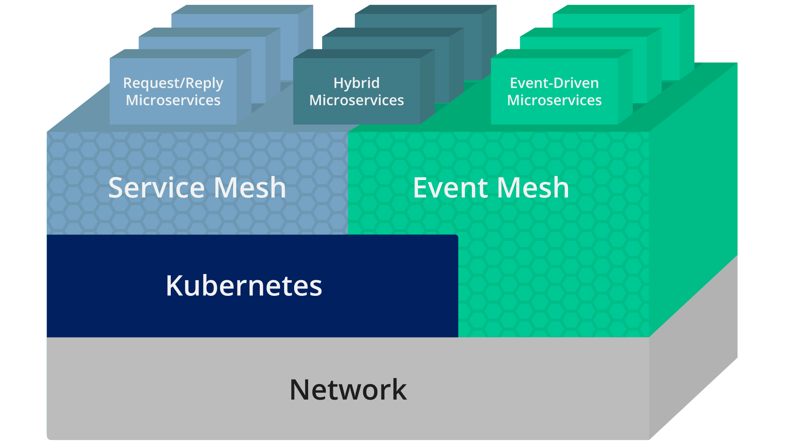

author: Giri Venkatesan
summary: SpringOne 2021 workshop for Developing Asynchronous APIs for the Event-Driven World Using Spring Cloud Stream, AsyncAPI, and an Event Mesh
id: springone-2021-asyncapi-workshop
tags:XX
categories: Spring,Java,AsyncAPI
environments: Web
status: Published
feedback link: https://github.com/SolaceDev/solace-dev-codelabs/blob/master/markdown/springone-2021-asyncapi-workshop

# Developing Asynchronous APIs for the Event-Driven World Using Spring Cloud Stream, AsyncAPI, and an Event Mesh

## Overview

Are you passionate about building modern, real-time applications? Is your organization adopting an event-driven architecture (EDA) to compete in our event-driven world? Build and expand your developer toolbox by learning how to define asynchronous APIs, implement them using Spring Cloud Stream microservices, and globally distribute them across multi-cloud and on-premises environments using an event mesh.

In this workshop, we will create API Products that helps others to consume Business capabilities of a _SmartTown_ where APIs are a way of life. We will also

- Learn how to define asynchronous APIs.
- Use the AsyncAPI Generator template for Spring Cloud Stream.
- Develop event-driven microservices using Spring Cloud Stream and Java.
- Connect your microservices to an event mesh made of PubSub+ Event Brokers and stream events across the globe

Prerequisites

- Intermediate level of knowledge coding with Java
- Computer

## Requirements

Duration: 0:08:00

🛠 This page covers the setup needed to perform this codelab. 🛠

### AsyncAPI Generator Requirements

✅ Install instructions available [here](https://github.com/asyncapi/generator#requirements)

- Node.js v12.16+ (Check version using `node -v`)
- npm v6.13.7+ (Check version using `npm -version`)

We'll install the generator itself later 👍

### Spring Cloud Stream Requirements

✅ Spring Cloud Stream just requires Java and Maven to use 🚀

- Java 1.8+ (Check version using `java -version`)
- Maven 3.3+ (Check version using `mvn -version`)
  - On mac you can `brew install maven`
  - Other install instructions [here](https://maven.apache.org/install.html)
- Your favorite Java IDE 💥

### PubSub+ Event Broker

✅ The credentials for connecting to Solace PubSub+ Event Broker will be shared by the instructor.

- SMF Host: `tcp://?????.messaging.solace.cloud:55555`
- Message VPN: `springone-2021`
- Username: `smarttown`
- Password: `smarttown`

✅ Note that the Broker, Username with appropriate permissions are already setup and ready for use during the workshop.

Positive
: If you want to sing up and explore Solace capabilities, you can sign-up for a free Solace Cloud Account using [this link](https://bit.ly/try-solace-free).
Note that no credit card is required. You will receive an email to activate the account and will then be prompted to start the free trail.

✅ Event mesh requires two or more Solace PubSub+ Brokers on different geographic locations to stream events across the globe.🚀

## Spring Cloud Stream


Spring Cloud Stream is a framework for creating highly scalable, event-driven microservices connected by pluggable messaging services. Messaging services are pluggable via Binders that we'll cover in a bit. The framework is based on Spring Boot and Spring Integration.

Spring Cloud Stream has three different types of message exchange contracts as pictures below.

1. Suppliers are sources of events
2. Sinks are consumers of events
3. Processors are both consumers and subscribers of events

### Message Exchange Contracts Map to Java Functions

As of Spring Cloud Stream v3 the preferred programming model is to use Java Functions to implement your cloud stream apps.

We just mentioned the 3 types of Cloud Stream message exchange contract are "Sources", "Sinks" and "Processors".
Those map to functions as follows:

- `java.util.function.Supplier` -> Source [Producer/Publisher of Events]
- `java.util.function.Consumer` -> Sink [Subscriber/Consumer of Events]
- `java.util.function.Function` -> Processor [ Consumes, Processes, and Produces Events ]

### Binders

Spring Cloud Stream Binders are really what make the framework useful. Binders provide an abstraction layer between your code and the messaging systems over which events are flowing. This allows you to write your code without having to worry about learning messaging APIs! When messages are sent or received from the messaging system they pass through the messaging system specific binder which knows how to communicate with that specific message broker.

As of the creation of this codelab the available Cloud Stream Binders are:

- RabbitMQ
- Apache Kafka
- Amazon Kinesis
- Google PubSub
- Solace PubSub+
- Azure Event Hubs
- Apache RocketMQ

Positive
: Today we're going to use the [Solace PubSub+ Binder](https://github.com/SolaceProducts/solace-spring-cloud/tree/master/solace-spring-cloud-starters/solace-spring-cloud-stream-starter) which supports publish subscribe and consumer groups.

### Communication Models

Instead of having to learn Messaging APIs, developers just have to understand the communication models that Spring Cloud Stream supports. There are 3 supported models, but support varies per binder.

1. Publish-subscribe: subscribers are independent from each other & receive events in order
1. Consumer groups: fan-out and load-balancing across multiple consumers
1. Stateful partitioning support: in-order processing for consistency and performance

### Valuable Resources:

- The Spring Cloud Stream [Reference Guide](https://cloud.spring.io/spring-cloud-static/spring-cloud-stream/current/reference/html/spring-cloud-stream.html#spring-cloud-stream-reference)
- Spring Sample [Github Repository](https://github.com/spring-cloud/spring-cloud-stream-samples)

## AsyncAPI


AsyncAPI has emerged as the industry standard for defining asynchronous, event-driven APIs; you can think of it as OpenAPI for the asynchronous world. It is an open source initiative that provides both a specification to describe and document your asynchronous applications in a machine-readable format, and tooling (such as code generators) to make life easier for developers tasked with implementing them.

### AsyncAPI Document

The first step is to obtain an AsyncAPI document that defines the application that you want to develop. Per the specification, this document is represented as JSON objects and must conform to the JSON standards. YAML, being a superset of JSON, can also be used. There are two main ways of going about obtaining this document: manually create the document or use an event portal.

If you decide to manually create the document after familiarizing yourself with the specification, don’t worry – you won’t be starting with a blank slate. The AsyncAPI initiative has provided a handy, interactive tool called the [AsyncAPI playground](https://playground.asyncapi.io) to make this easier. On the left side of the playground you can familiarize yourself with the specification and make changes to a real AsyncAPI document, and as you do so the right side of the screen updates to show how the document is parsed into a more human-readable format.

Alternatively you can generate this document from EDA tools such as Event Portal of Solace PubSub+ platform. Typically they are design-time tools allowing architects and developers to collaborate using a GUI to design your event-driven architecture. The team would define the applications that exist in the system, as well as the events that are exchanged and the schemas which define them. Having a catalog of well-organized channels and events for reuse will also save you both time and headaches while collaborating, instead of having to comb through a bunch of files in various locations.

### AsyncAPI Generator

AsyncAPI Generator is a tool that can generate a skeleton code from the AsyncAPI document, reducing the need to laboriously create boilerplate code saving time and effort.

The AsyncAPI Code Generator supports templates to generate code for a variety of different languages and protocols, but for this workshop we’re going to use the Spring Cloud Stream template.

The Spring Cloud Stream framework provides an easy way to get started with event-driven microservices by providing binders that allow the developer to create their microservices without having to learn messaging APIs.

```
Example:

ag ~/AsyncApiDocument.yaml https://github.com/asyncapi/java-spring-cloud-stream-template.git
```

### Coding Business Logic

The generated spring project looks like a regular Spring Boot Java project with generated classes under the javaPackage and an _application.yml_ file for configuration. Generated classes under javaPackage include Plain Old Java Objects (POJOs) defined from the schemas in the AsyncAPI document and _Application.java_ which contains the actual Spring Cloud Functions where we’ll add our business logic.

The generator will add additional functions to handle messages delivered on the channels as defined in the AsyncAPI document.

## Event Mesh


An event mesh is a configurable and dynamic infrastructure layer for distributing events among decoupled applications, cloud services and devices. It enables event communications to be governed, flexible, reliable and fast. An event mesh is created and enabled through a network of interconnected event brokers.

In other words, an event mesh is an architecture layer that allows events from one application to be dynamically routed and received by any other application no matter where these applications are deployed (no cloud, private cloud, public cloud). This layer is composed of a network of event brokers.

### How is “event mesh” different from service mesh?

Event mesh complements service mesh. It is a layer parallel to service mesh and completes the application architecture by providing the full set of inter-application communication patterns: service mesh for RESTful and general request/reply interactions; event mesh for asynchronous, event-based interactions. Refer to the layering diagram below for position of each in an application stack.

Both meshes are similar in that they enable better communication between applications by putting certain functions into a layer between the network and the application. However, there are a few important distinctions:

- Service mesh connects microservices in cloud environments – Kubernetes only today – with the promise of enabling this communication between different Kubernetes clusters and perhaps other clouds in the future.
- Event mesh connects not only microservices but also legacy applications, cloud-native services, devices, and data sources/sinks and these can operate both in cloud and non-cloud environments. An event mesh can connect any event source to any event handler.



The generic capabilities of an event mesh:

- A network of interconnected event brokers that can be deployed in any cloud, PaaS or non-cloud (so it includes all capabilities of an event broker but is distributed)
- Provides dynamic distribution of events so that event consumers can receive events from any event producer, no matter where the producer and consumer are attached to the mesh, without the need for configuration of event routing

In other words, an ‘event mesh’ is:

1. inherently ‘event-driven’
1. created by connecting event brokers
1. environment agnostic (can be deployed anywhere) and
1. dynamic

## API Products

API Products help others consume your Business capabilities.

- Bundles of related APIs that meet the needs of developers who serve different business functions
- Deliver synchronous/REST APIs for long-term value vs. one-time projects
- Produced, shared and consumed through a developer portal
- Managed by a product manager - roadmap, price, lifecycle

### What about Event-Driven APIs?

Event-Driven APIs offers a subscription “push” model rather than the request-response model of conventional RESTful APIs. Can be implemented using an event gateway for publish/subscribe distribution.


API Product implementations employs microservice architecture internally and expose the functionality through APIs, while hiding the underlying implementation. The externally exposed API Products are grouped by Domain facilitating better cataloging, documentation and governance.

In the SmartTown business case, let us create an API Product that monitors temperature and generate alerts.


### Solace PubSub+ Event Portal

PubSub+ Event Portal lets you design your event-driven applications, events, and schemas as interconnected network diagrams your team can go over in design reviews.

With the PubSub+ Event Portal, you can:

- Define and model event-driven systems
- Visualize existing relationships
- Develop consistent event-driven applications
- Discover and share events of interest
- Govern the event-driven system
- Integrate with 3rd-party systems for programmatic interactions
- Manage and audit changes to events, schemas, and applications
- Runtime event discovery
- Understand statistics about events


### Solace PubSub+ Event Portal - Designer

Designer is a tool to design and view all aspects of your event-driven architectures. It is through Designer that you can create new events and associate the payload schema to these events. It provides a graphical representation of application domains, applications, schemas, and events. Designer is also used to visualize the interaction of events between applications and to provision your architecture into the Event Portal.


## SmartTown (Internal View)

Duration: 0:04:00

SmartTown uses information and communication technology to improve operational efficiency, share information with the public and provide a better quality of government service and citizen welfare. SmartTown uses internal microservice architecture with functionality exposed through APIs and externally exposed API products while hiding the implementation details.

### Event-Driven Design


#### Topology View


Though the SmartTown EDA solution shall encompass various aspects of automation and control - we will scope only the Analytics and Operations applications for this workshop.

#### Domain View


A view that captures the relationship between Applications within the Domain based on their publish/subscribe action on the domain events.

#### Application View


A view of an application with its publish/subscribe event permissions and topic details.

#### Event View


Following events are generated and consumed by the Applications.

- **TemperatureReading** - An event generated by an Temperature Sensor (IoT Device) with temperature reading and a timestamp
- **OperationalAlert** - An event generated when the temperature is found to be out of bounds with an alert type and prioritization level.

## SmartTown (External View)

## Microservices

SmartTown EDA implementation is expected to expose the City-based Temperature Alert events for external consumption based on the TemperatureReading events published by the IoT Sensors.

This would result in two distinct microservices:

1. A Sensor Data Simulator microservice, which will publish temperature reading every second (or a fixed period). For simplicity sake, the reading of CPU temperature where the microservice is run is used.
1. A second microservice that subscribes to the temperature reading events and publish an alert event with appropriate priority set.

In the current workshop, we will be focusing on the following Applications:

- Dashboard: Application that can subscribe to both temperature reading and alert events to plot a real-time dashboard.
- Analytics: Application that can subscribe to both temperature reading and alert events to provide an offline reporting and analytics facility.

There could be more applications that can combine the temperature and alert events with their domain logic and derive business values (but not considered in the current scope):

- Transit Tracking
- Schedule Management
- Energy Management
- Maintenance Ticketing

### IoT Data Collector Microservice (Sensor Data Simulator)

In real world, this would have been a service that any device that collects temperature reading from a device (using IoT sensors) and publish an event with device context details like location, zone, device id, device class, timestamp etc.

In this workshop, we will be using a pre-built simulator microservice to publish temperature reading events. Essentially, it is a spring boot application that connects to Solace PubSub+ Broker and publishes a temperature reading event.

Positive
: We may have to update the connection credentials on necessary configuration files to connect to the Event Broker hosting the SmartTown EDA solution

### AC-City Alert Generator Microservice

A microservice that subscribes to temperature reading events and generates alerts based on the detected temperature range with appropriate priority (LOW, MEDIUM or HIGH). This alert event carries the context of city, alert type and level to facilitate a city-level temperature alert aggregation and management.

In this workshop, this application will be built from scratch by:

1. Downloading the AsyncAPI document of th Event API Product on the Solace PubSub+ platform
1. Generating Spring Cloud Stream microservice from the AsyncAPI document
1. Implementing business logic to generate alert

Positive
: We may have to update the connection credentials on necessary configuration files to connect to the Event Broker hosting the SmartTown EDA solution

we will be using a pre-built simulator microservice to publish temperature reading events. Essentially, it is a spring boot application that connects to Solace PubSub+ Broker and publishes a temperature reading event.

There could be other applications that can connect and subscribe to alert and temperature reading events as long as they have the right credentials and appropriate permissions. Thus an effective event-drive solution can be built on Publish-Subscribe architecture that can serve both internal and external applications.

Just like how REST APIs can be catalogued and discovered, Event APIs can also be published and consumed seamlessly, which was not possible before the advent of Event API Products.

## Workshop - Setup

## Workshop - Exercise

### IoT Sensor Data Simulator Microservice

Exercise steps and more...

### AC-City Alert Generator Microservice

Exercise steps and more...

## Conclusion

Description of setup, general access and overview
