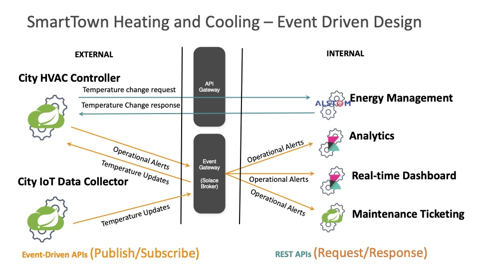
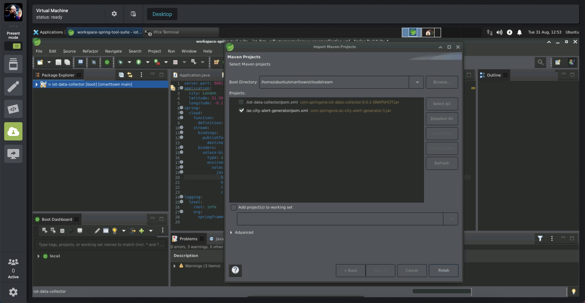

author: Giri Venkatesan
summary: SpringOne 2021 workshop for Developing Asynchronous APIs for the Event-Driven World Using Spring Cloud Stream, AsyncAPI, and an Event Mesh
id: springone-2021-asyncapi-workshop
tags: workshop,springone
categories: Spring,Java,AsyncAPI
environments: Web
status: Published
feedback link: https://github.com/SolaceDev/solace-dev-codelabs/blob/master/markdown/springone-2021-asyncapi-workshop

# Developing Asynchronous APIs for the Event-Driven World Using Spring Cloud Stream, AsyncAPI, and an Event Mesh

## Overview

Are you passionate about building modern, real-time applications? Is your organization adopting an event-driven architecture (EDA) to compete in our event-driven world? Build and expand your developer toolbox by learning how to define asynchronous APIs, implement them using Spring Cloud Stream microservices, and globally distribute them across multi-cloud and on-premises environments using an event mesh.

In this workshop, we will create API Products that helps others to consume Business capabilities of a _SmartTown_ where APIs are a way of life. We will also

- Learn how to define asynchronous APIs.
- Use the AsyncAPI Generator template for Spring Cloud Stream.
- Develop event-driven microservices using Spring Cloud Stream and Java.
- Connect your microservices to an event mesh made of PubSub+ Event Brokers and stream events across the globe

Prerequisites

- Intermediate level of knowledge coding with Java
- Computer

## Requirements

Duration: 0:08:00

🛠 This page covers the setup needed to perform this codelab. 🛠

### AsyncAPI Generator Requirements

✅ Install instructions available [here](https://github.com/asyncapi/generator#requirements)

- Node.js v12.16+ (Check version using `node -v`)
- npm v6.13.7+ (Check version using `npm -version`)

We'll install the generator itself later 👍

### Spring Cloud Stream Requirements

✅ Spring Cloud Stream just requires Java and Maven to use 🚀

- Java 1.8+ (Check version using `java -version`)
- Maven 3.3+ (Check version using `mvn -version`)
  - On mac you can `brew install maven`
  - Other install instructions [here](https://maven.apache.org/install.html)
- Your favorite Java IDE 💥

### PubSub+ Event Broker

✅ Use the following credentials for connecting to PubSub+ Broker. The SMF Host details will be shared by the instructor.


- SMF Host: `tcp://?????.messaging.solace.cloud:55555`
- Message VPN: `springone-2021`
- Username: `smarttown`
- Password: `smarttown`

✅ Note that the Broker, Username with appropriate permissions are already setup and ready for use during the workshop.

Positive
: If you want to sing up and explore Solace capabilities, you can sign-up for a free Solace Cloud Account using [this link](https://bit.ly/try-solace-free).
Note that no credit card is required. You will receive an email to activate the account and will then be prompted to start the free trail.

✅ Event mesh requires two or more Solace PubSub+ Brokers on different geographic locations to stream events across the globe.🚀

## Spring Cloud Stream


Spring Cloud Stream is a framework for creating highly scalable, event-driven microservices connected by pluggable messaging services. Messaging services are pluggable via Binders that we'll cover in a bit. The framework is based on Spring Boot and Spring Integration.

Spring Cloud Stream has three different types of message exchange contracts as pictures below.

1. Suppliers are sources of events
1. Sinks are consumers of events
1. Processors are both consumers and subscribers of events

### Message Exchange Contracts Map to Java Functions

As of Spring Cloud Stream v3 the preferred programming model is to use Java Functions to implement your cloud stream apps.

We just mentioned the 3 types of Cloud Stream message exchange contract are "Sources", "Sinks" and "Processors".
Those map to functions as follows:

- `java.util.function.Supplier` -> Source [Producer/Publisher of Events]
- `java.util.function.Consumer` -> Sink [Subscriber/Consumer of Events]
- `java.util.function.Function` -> Processor [ Consumes, Processes, and Produces Events ]

### Binders

Spring Cloud Stream Binders are really what make the framework useful. Binders provide an abstraction layer between your code and the messaging systems over which events are flowing. This allows you to write your code without having to worry about learning messaging APIs! When messages are sent or received from the messaging system they pass through the messaging system specific binder which knows how to communicate with that specific message broker.

As of the creation of this codelab the available Cloud Stream Binders are:

- RabbitMQ
- Apache Kafka
- Amazon Kinesis
- Google PubSub
- Solace PubSub+
- Azure Event Hubs
- Apache RocketMQ

Positive
: Today we're going to use the [Solace PubSub+ Binder](https://github.com/SolaceProducts/solace-spring-cloud/tree/master/solace-spring-cloud-starters/solace-spring-cloud-stream-starter) which supports publish subscribe and consumer groups.

### Communication Models

Instead of having to learn Messaging APIs, developers just have to understand the communication models that Spring Cloud Stream supports. There are 3 supported models, but support varies per binder.

1. Publish-subscribe: subscribers are independent from each other & receive events in order
1. Consumer groups: fan-out and load-balancing across multiple consumers
1. Stateful partitioning support: in-order processing for consistency and performance

### Valuable Resources:

- The Spring Cloud Stream [Reference Guide](https://cloud.spring.io/spring-cloud-static/spring-cloud-stream/current/reference/html/spring-cloud-stream.html#spring-cloud-stream-reference)
- Spring Sample [Github Repository](https://github.com/spring-cloud/spring-cloud-stream-samples)
- Solace Sample [Github Repository](https://github.com/SolaceSamples/solace-samples-spring)
- Solace Codelab - [Spring Cloud Stream - Basics](https://codelabs.solace.dev/codelabs/spring-cloud-stream-basics/)
- Solace Codelab - [Spring Cloud Stream - Beyond the Basics](https://codelabs.solace.dev/codelabs/spring-cloud-stream-beyond)

## AsyncAPI


AsyncAPI has emerged as the industry standard for defining asynchronous, event-driven APIs; you can think of it as OpenAPI for the asynchronous world.    

It is an open source initiative that provides both 
* a specification to describe and document your asynchronous applications in a machine-readable format, and 
* tooling (such as code generators) to make life easier for developers tasked with implementing them.

### AsyncAPI Document

An AsyncAPI document that defines the application that you want to develop. This document can be represented as JSON objects conforming to the JSON standards, or an YAML file. You can either manually create the document or use an event portal.

The AsyncAPI initiative provides a handy, interactive tool called the [AsyncAPI playground](https://playground.asyncapi.io) to make the document creation easier. 


Alternatively you can generate this document from EDA tools such as [Event Portal](https://solace.com/products/portal/) of Solace PubSub+ platform. Typically they are design-time tools allowing architects and developers to collaborate using a GUI to design the event-driven architecture. 

Having a catalog of well-organized channels and events for reuse will also save you both time and headaches while collaborating, instead of having to comb through a bunch of files in various locations.

### AsyncAPI Generator

AsyncAPI Generator is a tool that can generate a skeleton code from the AsyncAPI document, reducing the need to laboriously create boilerplate code saving time and effort.

The AsyncAPI Code Generator supports templates to generate code for a variety of different languages and protocols, but for this workshop we’re going to use the [Spring Cloud Stream template](https://github.com/asyncapi/java-spring-cloud-stream-template).

The Spring Cloud Stream framework provides an easy way to get started with event-driven microservices by providing binders that allow the developer to create their microservices without having to learn messaging APIs.

```
Example:

ag ~/AsyncApiDocument.yaml https://github.com/asyncapi/java-spring-cloud-stream-template.git
```

### Coding Business Logic

The generated spring project is a regular Spring Boot Java project with generated classes under the javaPackage and an _application.yml_ file for configuration. It contains:
* Generated classes under javaPackage include POJOs defined from the schemas in the AsyncAPI document and 
* _Application.java_ which contains the actual Spring Cloud Functions to handle messages delivered on the channels as defined in the AsyncAPI document where we’ll add our business logic.

### Valuable Resources:

- [AsyncAPI Code Generator](https://www.asyncapi.com/generator)
- [AsyncAPI vs OpenAPI](https://solace.com/blog/asyncapi-vs-openapi/)
- [AsyncAPI Code Generation: Microservices Using Spring Cloud Stream](https://solace.com/blog/asyncapi-codegen-microservices-using-spring-cloud-stream/)

## Event Mesh


> An Event Mesh is a configurable and dynamic infrastructure layer for distributing events among decoupled applications, cloud services and devices.
 
 It enables event communications to be governed, flexible, reliable and fast. An event mesh is created and enabled through a network of interconnected event brokers.

### How is “event mesh” different from service mesh?

[Event mesh complements service mesh](https://solace.com/blog/event-mesh-service-mesh-for-microservices/) completing the application connectivity layer to provide the full set of inter-application communication patterns enterprises need to realize their digital transformation ambitions. It is a layer parallel to service mesh and completes the application architecture by providing the full set of inter-application communication patterns.   

Service mesh for RESTful and general request/reply interactions; event mesh for asynchronous, event-based interactions.

Both meshes are similar in that they enable better communication between applications by putting certain functions into a layer between the network and the application. However, there are a few important distinctions:

- Service mesh connects microservices in cloud environments – Kubernetes only today – with the promise of enabling this communication between different Kubernetes clusters and perhaps other clouds in the future.
- Event mesh connects not only microservices but also legacy applications, cloud-native services, devices, and data sources/sinks and these can operate both in cloud and non-cloud environments. An event mesh can connect any event source to any event handler.


An event mesh is:

1. inherently ‘event-driven’
2. created by connecting event brokers
3. environment agnostic (can be deployed anywhere) and
4. dynamic

### Valuable Resources:

- [What is an Event Mesh?](https://solace.com/what-is-an-event-mesh/)
- [Event Mesh - Resources](https://solace.com/resources/event-mesh)
- [How to Build an Event Mesh with Solace PubSub+](https://www.youtube.com/watch?v=8Pln8dNSd4U)

## API Products

API products are groups of related APIs that fulfill some business functions, often in a bounded content helping others to consume your Business capabilities.

### Event-Driven APIs

Event-Driven APIs offers a subscription “push” model rather than the request-response model of conventional RESTful APIs. They are implemented using an event gateway for publish/subscribe distribution.


* API Product implementations employs microservice architecture internally and expose the functionality through APIs, while hiding the underlying implementation. 
* Exposed API Products are grouped by Domain facilitating better _cataloging_, _documentation_ and _governance_.


### Solace PubSub+ Event Portal

The Market’s First API Portal…for Events

[PubSub+ Event Portal](https://solace.com/blog/api-portal-for-events/) lets you design your event-driven applications, events, and schemas as interconnected network diagrams your team can go over in design reviews.

With the PubSub+ Event Portal, you can:

- Define and model event-driven systems
- Visualize existing relationships
- Develop consistent event-driven applications
- Discover and share events of interest
- Govern the event-driven system
- Integrate with 3rd-party systems for programmatic interactions
- Manage and audit changes to events, schemas, and applications
- Runtime event discovery
- Understand statistics about events


### Solace PubSub+ Event Portal - Designer

Designer is a tool to design and view all aspects of your event-driven architectures. It is through Designer that you can create new events and associate the payload schema to these events. It provides a graphical representation of application domains, applications, schemas, and events. Designer is also used to visualize the interaction of events between applications and to provision your architecture into the Event Portal.


### Valuable Resources:

- [PubSub+ Event Portal - Overview](https://docs.solace.com/Solace-Cloud/Event-Portal/event-portal.htm)
- [PubSub+ Event Portal - Getting started](https://solace.com/resources/pubsub-event-portal/eventportal-get-started-demo-video)
- [PubSub+ Event Portal - Resources](https://solace.com/resources/pubsub-event-portal)

## SmartTown (Internal View)

Duration: 0:04:00

SmartTown uses information and communication technology to improve operational efficiency, share information with the public and provide a better quality of government service and citizen welfare. SmartTown uses internal microservice architecture with functionality exposed through APIs and externally exposed API products while hiding the implementation details.

### Event-Driven Design



#### Application Domain View


Though the SmartTown EDA solution shall encompass various aspects of automation and control - we will scope only the Analytics and Operations applications for this workshop.

#### Application View


A view that captures the relationship between Applications within the Domain based on their publish/subscribe action on the domain events.
#### _"SmartTown - Operations"_ - Events

- **TemperatureReading** - An event generated by an Temperature Sensor (IoT Device) with temperature reading and a timestamp
- **OperationalAlert** - An event generated when the temperature is found to be out of bounds with an alert type and prioritization level.
#### Event Details View


## SmartTown (External View)

The process to creating a digital value chain around API Products involves a well defined steps as described below.


The _3. Curate_ step involves bundling of high-value, share-worthy events. The resulting bundle is released as a spec based on a commonly understood spec or standard - like AsyncAPI. 

AsyncAPI also provides tools to generate code (supports popular languages) helping consumers directly go from spec-to-code, leaving the only responsibility of updating the business logic.

* Set the Event API product name, description and server connection settings (connection url and protocol).


* Grant permission on events for Publish & Subscribe

* Save the API Product

The _4. Release_ step involves exposing the curated bundle of APIs to make them discoverable. 
* PubSub+ Event Portal hosts the curated Event API products on publicly accessible URLs.

* Exposed AsyncAPI URL


## Microservices

SmartTown EDA implementation is expected to expose the City-based Temperature Alert events for external consumption based on the TemperatureReading events published by the IoT Sensors.

This would result in two distinct microservices:

1. A Sensor Data Simulator microservice, which will publish temperature reading every second (or a fixed period). For simplicity sake, the reading of CPU temperature where the microservice is run is used.
1. A second microservice that subscribes to the temperature reading events and publish an alert event with appropriate priority set.

### IoT Data Collector Microservice (Sensor Data Simulator)

In real world, this would have been a service that any device that collects temperature reading from a device (using IoT sensors) and publish an event with device context details like location, zone, device id, device class, timestamp etc.

In this workshop, we will be using a pre-built simulator microservice to publish temperature reading events. Essentially, it is a spring boot application that connects to Solace PubSub+ Broker and publishes a temperature reading event.

Positive
: We may have to update the connection credentials on necessary configuration files to connect to the Event Broker hosting the SmartTown EDA solution

### AC-City Alert Generator Microservice

A microservice that subscribes to temperature reading events and generates alerts based on the detected temperature range with appropriate priority (LOW, MEDIUM or HIGH). This alert event carries the context of city, alert type and level to facilitate a city-level temperature alert aggregation and management.

In this workshop, this application will be built from scratch by:

1. Downloading the AsyncAPI document of th Event API Product on the Solace PubSub+ platform
1. Generating Spring Cloud Stream microservice from the AsyncAPI document
1. Implementing business logic to generate alert

Positive
: We may have to update the connection credentials on necessary configuration files to connect to the Event Broker hosting the SmartTown EDA solution

## Workshop - IoT Sensor Data Simulation

###Clone Git repository

* Launch Terminal application 
* Execute the following command 
  ```
  git clone https://github.com/Mrc0113/smarttown.GitHub
  ```
  This would create a directory by name __smarttown__ and checkout the git repository contents.
  

The directory __cloudstream/iot-data-collector__ contains a prebuilt spring cloud stream project that can readily publish temperature reading data. You just have to update the application.yml configuration with host details.

###Launch Spring Tool Suite

* Open Spring Cloud Suite tool by clicking on the icon in the desktop
* Import cloud stream projects from the smarttown folder as 'Existing maven projects' 


####TemperatureReading.java

✅ Review the TemperatureReading java file. It carries temperature reading data - a simple POJO with attributes and corresponding getters/setters.

####Application.java

✅ Review the Application.java, specifically the Supplier function.

```
@Bean
Supplier<Message<TemperatureReading>> publishTemperatureData()  {
  return () -> {
    // Collect CPU metrics 
    SystemInfo si = new SystemInfo();
    HardwareAbstractionLayer hal = si.getHardware();
    Sensors sensors = hal.getSensors();
    CentralProcessor processor = hal.getProcessor();
    double[] loadAverage = processor.getSystemLoadAverage(1);
    BigDecimal cpuLoad = new BigDecimal((loadAverage[0] < 0 ? 0 : loadAverage[0]));
    BigDecimal cpuTemp = new BigDecimal(50.0 + cpuLoad.doubleValue() * 8.0);
    // Construct the topic name with alert type and priority as per the Topic hierarchy design
    // SmartTown/Operations/temperatureReading/created/v1/{city}/{latitude}/{longitude}
    String topic = "SmartTown/Operations/temperatureReading/created/v1/" + city + "/" + latitude + "/" + longitude;	        			
    TemperatureReading data = new TemperatureReading(cpuLoad, city, latitude, longitude, cpuTemp);
    logger.info(data.toString());	

    // Set the target destination on the message with the constructed topic name
    return MessageBuilder.withPayload(data)
            .setHeader(BinderHeaders.TARGET_DESTINATION, topic)
            .build();		
  };
}	

```

✅ The Supplier function is a Cloud Stream message exchange contract that publishes an event to configured Event Broker.

✅ Notice the topic name construction:     

__SmartTown/Operations/temperatureReading/created/v1/{city}/{latitude}/{longitude}__

The values for variables _city, latitude_ and _longitude_ are read from the configuration file.

The topic name is dynamically constructed by concatenating the root topic name and dynamic values picked up from the application configuration. 

✅ The return value from the _Supplier_ function is a Spring Cloud Stream _Message_ that is set with destination as the dynamic topic, which is effectively a publish on the Event Broker.

✅ The temperature simulation is closely tied to CPU load on the machine, which can be manipulated using _stress_ system utility. The simulation logic is built to generate a temperature value as a multiple of CPU load.

Positive
: _stress_ utility is used to dynamically increase the CPU load, which in turn affects the simulation to produce higher temperature readings.
To run the stress command, type:    
```   
stress -c 4 -t 180
```   
This will simulate load on the VM and till timeout after 180 seconds.

####application.yml

Positive
: Before you proceed, make sure that you have received connection details for the Solace PubSub+ Event Broker from the instructor and keep it handy.

✅ Review the application.yml

```
server.port: 8082
application:
  city: <enter your city here>      # e.g., Bangalore
  latitude: <enter latitude>        # e.g., 13.019568
  longitude: <enter longitude>      # e.g., 77.596809
spring:
  cloud:
    function:
      definition: publishTemperatureData
    stream:
      bindings:
        publishTemperatureData-out-0:
          destination: SmartTown/Operations/temperatureReading/created/v1/*/*/*
      binders:
        solace-binder:
          type: solace
          environment:
            solace:
              java:
                host: 'tcp://xxxxx.messaging.solace.cloud:55555'
                msgVpn: springone-2021
                clientUsername: smarttown
                clientPassword: smarttown
logging:
  level:
    root: info
    org:
      springframework: info
      
```

Affect the following changes on the yaml file:
1. Goto [Latlang.net](https://www.latlong.net) and enter your city name to get latitude and longitude values
2. In the yml file
   * Update your city name
   * Update latitude
   * Update longitude
   * Update the msgVpn name (instructor to provide the host name)
3. Save the file

####Running the IoT Data Simulation

✅ Open a terminal, change directory to iot-data-collector project and run the following maven command.
```
cd ~/smarttown/cloudstream/iot-data-collector
mvn clean spring-boot:run
```
This should run the simulator microservice and publish temperature reading events to the Event Broker.

```
mvn clean spring-boot:run

[INFO] Scanning for projects...
[INFO]
[INFO] ------------------< com.springone:iot-data-collector >------------------
[INFO] Building iot-data-collector 0.0.1-SNAPSHOT
[INFO] --------------------------------[ jar ]---------------------------------
[INFO]
[INFO] --- maven-clean-plugin:3.1.0:clean (default-clean) @ iot-data-collector ---
[INFO] Deleting /Users/vengatagirivenkatesan/git/smarttown/cloudstream/iot-data-collector/target
[INFO]
[INFO] >>> spring-boot-maven-plugin:2.5.3:run (default-cli) > test-compile @ iot-data-collector >>>
[INFO]
[INFO] --- maven-resources-plugin:3.2.0:resources (default-resources) @ iot-data-collector ---
[INFO] Using 'UTF-8' encoding to copy filtered resources.
[INFO] Using 'UTF-8' encoding to copy filtered properties files.
[INFO] Copying 1 resource
[INFO] Copying 0 resource
[INFO]
[INFO] --- maven-compiler-plugin:3.8.1:compile (default-compile) @ iot-data-collector ---
[INFO] Changes detected - recompiling the module!
[INFO] Compiling 2 source files to /Users/vengatagirivenkatesan/git/smarttown/cloudstream/iot-data-collector/target/classes
[INFO]
[INFO] --- maven-resources-plugin:3.2.0:testResources (default-testResources) @ iot-data-collector ---
[INFO] Using 'UTF-8' encoding to copy filtered resources.
[INFO] Using 'UTF-8' encoding to copy filtered properties files.
[INFO] skip non existing resourceDirectory /Users/vengatagirivenkatesan/git/smarttown/cloudstream/iot-data-collector/src/test/resources
[INFO]
[INFO] --- maven-compiler-plugin:3.8.1:testCompile (default-testCompile) @ iot-data-collector ---
[INFO] No sources to compile
[INFO]
[INFO] <<< spring-boot-maven-plugin:2.5.3:run (default-cli) < test-compile @ iot-data-collector <<<
[INFO]
[INFO]
[INFO] --- spring-boot-maven-plugin:2.5.3:run (default-cli) @ iot-data-collector ---
[INFO] Attaching agents: []

  .   ____          _            __ _ _
 /\\ / ___'_ __ _ _(_)_ __  __ _ \ \ \ \
( ( )\___ | '_ | '_| | '_ \/ _` | \ \ \ \
 \\/  ___)| |_)| | | | | || (_| |  ) ) ) )
  '  |____| .__|_| |_|_| |_\__, | / / / /
 =========|_|==============|___/=/_/_/_/
 :: Spring Boot ::                (v2.5.3)

2021-08-31 17:55:10.355  INFO 23500 --- [           main] c.s.asyncapi.datacollector.Application   : Starting Application using Java 15.0.2 on pragya with PID 23500 (/Users/vengatagirivenkatesan/git/smarttown/cloudstream/iot-data-collector/target/classes started by vengatagirivenkatesan in /Users/vengatagirivenkatesan/git/smarttown/cloudstream/iot-data-collector)
2021-08-31 17:55:10.356  INFO 23500 --- [           main] c.s.asyncapi.datacollector.Application   : No active profile set, falling back to default profiles: default
2021-08-31 17:55:10.834  INFO 23500 --- [           main] faultConfiguringBeanFactoryPostProcessor : No bean named 'errorChannel' has been explicitly defined. Therefore, a default PublishSubscribeChannel will be created.
2021-08-31 17:55:10.840  INFO 23500 --- [           main] faultConfiguringBeanFactoryPostProcessor : No bean named 'integrationHeaderChannelRegistry' has been explicitly defined. Therefore, a default DefaultHeaderChannelRegistry will be created.
2021-08-31 17:55:10.877  INFO 23500 --- [           main] trationDelegate$BeanPostProcessorChecker : Bean 'org.springframework.integration.config.IntegrationManagementConfiguration' of type [org.springframework.integration.config.IntegrationManagementConfiguration] is not eligible for getting processed by all BeanPostProcessors (for example: not eligible for auto-proxying)
2021-08-31 17:55:10.885  INFO 23500 --- [           main] trationDelegate$BeanPostProcessorChecker : Bean 'integrationChannelResolver' of type [org.springframework.integration.support.channel.BeanFactoryChannelResolver] is not eligible for getting processed by all BeanPostProcessors (for example: not eligible for auto-proxying)
2021-08-31 17:55:10.886  INFO 23500 --- [           main] trationDelegate$BeanPostProcessorChecker : Bean 'integrationDisposableAutoCreatedBeans' of type [org.springframework.integration.config.annotation.Disposables] is not eligible for getting processed by all BeanPostProcessors (for example: not eligible for auto-proxying)
2021-08-31 17:55:11.056  INFO 23500 --- [           main] o.s.b.w.embedded.tomcat.TomcatWebServer  : Tomcat initialized with port(s): 8082 (http)
2021-08-31 17:55:11.069  INFO 23500 --- [           main] o.apache.catalina.core.StandardService   : Starting service [Tomcat]
2021-08-31 17:55:11.069  INFO 23500 --- [           main] org.apache.catalina.core.StandardEngine  : Starting Servlet engine: [Apache Tomcat/9.0.50]
2021-08-31 17:55:11.125  INFO 23500 --- [           main] o.a.c.c.C.[Tomcat].[localhost].[/]       : Initializing Spring embedded WebApplicationContext
2021-08-31 17:55:11.125  INFO 23500 --- [           main] w.s.c.ServletWebServerApplicationContext : Root WebApplicationContext: initialization completed in 734 ms
2021-08-31 17:55:11.618  INFO 23500 --- [           main] o.s.i.endpoint.EventDrivenConsumer       : Adding {logging-channel-adapter:_org.springframework.integration.errorLogger} as a subscriber to the 'errorChannel' channel
2021-08-31 17:55:11.619  INFO 23500 --- [           main] o.s.i.channel.PublishSubscribeChannel    : Channel 'application.errorChannel' has 1 subscriber(s).
2021-08-31 17:55:11.619  INFO 23500 --- [           main] o.s.i.endpoint.EventDrivenConsumer       : started bean '_org.springframework.integration.errorLogger'
2021-08-31 17:55:11.619  INFO 23500 --- [           main] o.s.i.endpoint.EventDrivenConsumer       : Adding {router} as a subscriber to the 'publishTemperatureData_integrationflow.channel#0' channel
2021-08-31 17:55:11.619  INFO 23500 --- [           main] o.s.integration.channel.DirectChannel    : Channel 'application.publishTemperatureData_integrationflow.channel#0' has 1 subscriber(s).
2021-08-31 17:55:11.619  INFO 23500 --- [           main] o.s.i.endpoint.EventDrivenConsumer       : started bean 'publishTemperatureData_integrationflow.org.springframework.integration.config.ConsumerEndpointFactoryBean#0'
2021-08-31 17:55:11.619  INFO 23500 --- [           main] o.s.c.s.binder.DefaultBinderFactory      : Creating binder: solace-binder
2021-08-31 17:55:14.129  INFO 23500 --- [           main] .SolaceMessageChannelBinderConfiguration : Connecting JCSMP session JCSMPSession
2021-08-31 17:55:14.164  INFO 23500 --- [           main] c.s.j.protocol.impl.TcpClientChannel     : Connecting to host 'orig=tcp://mrnsau5ltlr4o.messaging.solace.cloud:55555, scheme=tcp://, host=mrnsau5ltlr4o.messaging.solace.cloud, port=55555' (host 1 of 1, smfclient 1, attempt 1 of 1, this_host_attempt: 1 of 21)
2021-08-31 17:55:14.683  INFO 23500 --- [           main] c.s.j.protocol.impl.TcpClientChannel     : Connected to host 'orig=tcp://mrnsau5ltlr4o.messaging.solace.cloud:55555, scheme=tcp://, host=mrnsau5ltlr4o.messaging.solace.cloud, port=55555' (smfclient 1)
2021-08-31 17:55:14.956  INFO 23500 --- [           main] o.s.c.s.binder.DefaultBinderFactory      : Caching the binder: solace-binder
2021-08-31 17:55:14.956  INFO 23500 --- [           main] o.s.c.s.binder.DefaultBinderFactory      : Retrieving cached binder: solace-binder
2021-08-31 17:55:15.011  INFO 23500 --- [           main] .s.s.c.s.b.o.JCSMPOutboundMessageHandler : Creating producer to topic SmartTown/Operations/temperatureReading/created/v1/*/*/* <message handler ID: e3778ae1-24f1-41ae-9ec3-512c2172e097>
2021-08-31 17:55:15.011  INFO 23500 --- [           main] c.s.s.c.s.b.util.SharedResourceManager   : No producer exists, a new one will be created
2021-08-31 17:55:15.267  INFO 23500 --- [           main] o.s.c.s.m.DirectWithAttributesChannel    : Channel 'application.publishTemperatureData-out-0' has 1 subscriber(s).
2021-08-31 17:55:15.270  INFO 23500 --- [           main] o.s.i.e.SourcePollingChannelAdapter      : started bean 'publishTemperatureData_integrationflow.org.springframework.integration.config.SourcePollingChannelAdapterFactoryBean#0'
2021-08-31 17:55:15.280  INFO 23500 --- [           main] o.s.b.w.embedded.tomcat.TomcatWebServer  : Tomcat started on port(s): 8082 (http) with context path ''
2021-08-31 17:55:15.287  INFO 23500 --- [           main] c.s.asyncapi.datacollector.Application   : Started Application in 5.234 seconds (JVM running for 5.482)
2021-08-31 17:55:15.386  INFO 23500 --- [   scheduling-1] c.s.asyncapi.datacollector.Application   : TemperatureReading [mCpuLoad=3.673828125, mCity=Bangalore, mLatitude=13.019568, mLongitude=77.596809, mCpuTemp=67.04296875]
2021-08-31 17:55:16.425  INFO 23500 --- [   scheduling-1] c.s.asyncapi.datacollector.Application   : TemperatureReading [mCpuLoad=3.673828125, mCity=Bangalore, mLatitude=13.019568, mLongitude=77.596809, mCpuTemp=67.04296875]
2021-08-31 17:55:17.431  INFO 23500 --- [   scheduling-1] c.s.asyncapi.datacollector.Application   : TemperatureReading [mCpuLoad=3.673828125, mCity=Bangalore, mLatitude=13.019568, mLongitude=77.596809, mCpuTemp=67.04296875]
2021-08-31 17:55:18.435  INFO 23500 --- [   scheduling-1] c.s.asyncapi.datacollector.Application   : TemperatureReading [mCpuLoad=3.673828125, mCity=Bangalore, mLatitude=13.019568, mLongitude=77.596809, mCpuTemp=67.04296875]
2021-08-31 17:55:19.442  INFO 23500 --- [   scheduling-1] c.s.asyncapi.datacollector.Application   : TemperatureReading [mCpuLoad=3.85986328125, mCity=Bangalore, mLatitude=13.019568, mLongitude=77.596809, mCpuTemp=68.1591796875]
....
```

####Simulate CPU load on the machine

✅ Open a terminal and run the following command to simulate load on the machine.
```
stress -c 6 -t 180
```

As the CPU load increases, you will see the temperature reading increasing as well. This variation will help the alert generator microservice (next one) to publish temperature alerts with different priority levels.

## Workshop - Alert Generator Microservice

We will be building this microservice using AsyncAPI Generator tool from the AsyncAPI document hosted by the PubSub+ Event Portal.

###Download AsyncAPI document

✅ Open Chrome browser and go to the following url:

https://apiproducts.solace.cloud/website/jl88aq4apg5


Click on __Download YAML__ button and save the file in smarttown/cloudstream directory.

Since the downloaded file is in _Downloads_ folder, move it manually to the _smarttown/cloudstream_ folder.
```
mv ~/Downloads/asyncapi.yaml ~/smarttown/cloudstream
```
###Generate code usign AsyncAPI Code Generator

✅ Change directory to cloudstream and run the following command

```
cd ~/smarttown/cloudstream
```

Positive
: Before you proceed, make sure that you have received connection details for the Solace PubSub+ Event Broker from the instructor and keep it handy.

Run the following command to invoke AsyncAPI code generator utility.

```
ag -o ac-city-alert-generator -p binder=solace -p dynamicType=header -p artifactId=ac-city-alert-generator  -p groupId=com.springone -p javaPackage=com.springone.asyncapi.alertgenerator -p host=tcp://mrnsau5ltlr4o.messaging.solace.cloud:55555 -p username=smarttown -p password=smarttown -p msgVpn=springone-2021 asyncapi.yaml @asyncapi/java-spring-cloud-stream-template --force-write
```

This command will take some time (ninute or so) and complete with the following message.

```
Done! ✨
Check out your shiny new generated files at /home/ubuntu/smarttown/cloudstream/ac-city-alert-generator.
```
XXXX

###Open Spring Tool Suite

* Open Spring Cloud Suite tool by clicking on the icon in the desktop (if not open already)
* Import cloud stream projects from the smarttown folder as 'Existing maven projects' and choose smarttown/cloudstream folder.


####TemperatureReading.java

✅ Review the TemperatureReading java file. It carries temperature reading data - a simple POJO with attributes and corresponding getters/setters. 

It is sames as the TemperatureReading POJO present in the iot-data-collector microservice.

####OperationalAlert.java

✅ Review the OperationalAlert java file. It carries operational alert data - a simple POJO with attributes and corresponding getters/setters. 

####Application.java

Negative
: Due to a minor bug in the AsyncAPI code generator (ag utility), you have to manually 

✅ Review the Application.java, specifically the Supplier function.

```
@Bean
Supplier<Message<TemperatureReading>> publishTemperatureData()  {
  return () -> {
    // Collect CPU metrics 
    SystemInfo si = new SystemInfo();
    HardwareAbstractionLayer hal = si.getHardware();
    Sensors sensors = hal.getSensors();
    CentralProcessor processor = hal.getProcessor();
    double[] loadAverage = processor.getSystemLoadAverage(1);
    BigDecimal cpuLoad = new BigDecimal((loadAverage[0] < 0 ? 0 : loadAverage[0]));
    BigDecimal cpuTemp = new BigDecimal(50.0 + cpuLoad.doubleValue() * 8.0);
    // Construct the topic name with alert type and priority as per the Topic hierarchy design
    // SmartTown/Operations/temperatureReading/created/v1/{city}/{latitude}/{longitude}
    String topic = "SmartTown/Operations/temperatureReading/created/v1/" + city + "/" + latitude + "/" + longitude;	        			
    TemperatureReading data = new TemperatureReading(cpuLoad, city, latitude, longitude, cpuTemp);
    logger.info(data.toString());	

    // Set the target destination on the message with the constructed topic name
    return MessageBuilder.withPayload(data)
            .setHeader(BinderHeaders.TARGET_DESTINATION, topic)
            .build();		
  };
}	

```

✅ The Supplier function is a Cloud Stream message exchange contract that publishes an event to configured Event Broker.

✅ Notice the topic name construction:     

__SmartTown/Operations/temperatureReading/created/v1/{city}/{latitude}/{longitude}__

The values for variables _city, latitude_ and _longitude_ are read from the configuration file.

The topic name is dynamically constructed by concatenating the root topic name and dynamic values picked up from the application configuration. 

✅ The return value from the _Supplier_ function is a Spring Cloud Stream _Message_ that is set with destination as the dynamic topic, which is effectively a publish on the Event Broker.

✅ The temperature simulation is closely tied to CPU load on the machine, which can be manipulated using _stress_ system utility. The simulation logic is built to generate a temperature value as a multiple of CPU load.

Positive
: _stress_ utility is used to dynamically increase the CPU load, which in turn affects the simulation to produce higher temperature readings.
To run the stress command, type:    
```   
stress -c 4 -t 180
```   
This will simulate load on the VM and till timeout after 180 seconds.

####application.yml

Positive
: Before you proceed, make sure that you have received connection details for the Solace PubSub+ Event Broker from the instructor and keep it handy.

✅ Review the application.yml

```
server.port: 8082
application:
  city: <enter your city here>      # e.g., Bangalore
  latitude: <enter latitude>        # e.g., 13.019568
  longitude: <enter longitude>      # e.g., 77.596809
spring:
  cloud:
    function:
      definition: publishTemperatureData
    stream:
      bindings:
        publishTemperatureData-out-0:
          destination: SmartTown/Operations/temperatureReading/created/v1/*/*/*
      binders:
        solace-binder:
          type: solace
          environment:
            solace:
              java:
                host: 'tcp://xxxxx.messaging.solace.cloud:55555'
                msgVpn: springone-2021
                clientUsername: smarttown
                clientPassword: smarttown
logging:
  level:
    root: info
    org:
      springframework: info
      
```

Affect the following changes on the yaml file:
1. Goto [Latlang.net](https://www.latlong.net) and enter your city name to get latitude and longitude values
2. In the yml file
   * Update your city name
   * Update latitude
   * Update longitude
   * Update the msgVpn name (instructor to provide the host name)
3. Save the file

####Running the IoT Data Simulation

✅ Open a terminal, change directory to iot-data-collector project and run the following maven command.
```
cd ~/smarttown/cloudstream/iot-data-collector
mvn clean spring-boot:run
```
This should run the simulator microservice and publish temperature reading events to the Event Broker.
## Conclusion

Description of setup, general access and overview
