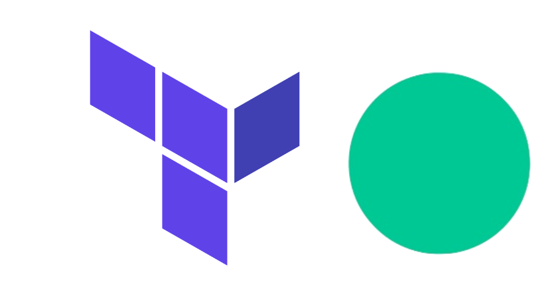

author: Tamimi
summary:
id: terraform-modules
tags: terraform
categories: terraform, solace
environments: Web
status: Published
feedback link: https://github.com/SolaceDev/solace-dev-codelabs/blob/master/markdown/terraform-modules

# Solace Terraform Modules

## Unpacking the Power of Modules
Duration: 0:10:00



[Terraform modules](https://developer.hashicorp.com/terraform/language/modules) are a way to organize and reuse code in your Terraform configurations. They allow you to encapsulate a group of resources and their configuration into a single, reusable unit. This helps in managing infrastructure as code more efficiently, promoting DRY (Don't Repeat Yourself) principles, and making your Terraform codebase more manageable and scalable.

Terraform modules are versatile tools that can be used to define reusable configurations for various aspects of infrastructure. Let's say you want to abstract a broker queue or topic endpoint or an endpoint template configuration, or a rest delivery point configuration, or even broker VPN, authentication and authorization configuration then a module would be a perfect fit for this. 

### Benefits of using Terraform Modules

Like all things DRY, Terraform Modules has a lot of benefits including: 
1. Reusability - Modules can be reused across different projects and environments, saving time and effort. For instance, if you have a standard broker setup that you use in multiple environments, you can encapsulate this configuration into a module and use it wherever needed 

1. Consistency - Using modules ensures that best practices and standards are consistently applied across your infrastructure reducing the risk of misconfigurations and enhances security

1. Manageability - Breaking down complex infrastructure into smaller, manageable pieces makes it easier to understand and maintain. Each module can be developed, tested, and debugged independently, leading to more reliable infrastructure

1. Encapsulation - By exposing only the necessary inputs and outputs, modules encapsulate the details of the underlying resources. This abstraction simplifies the use of complex resources, making the overall configuration cleaner and more user-friendly.

1. Collaboration - Teams can work on different modules independently, enabling parallel development and faster delivery

Even tho Terraform modules promote best practices, enhance collaboration, and make your infrastructure more scalable and maintainable, it is critical to keep in mind the drawbacks from the introduced complexity to manage and handle these modules. By understanding both their benefits and potential drawbacks, you can effectively leverage Terraform modules to build robust and efficient infrastructure.

## Essential Terraform Modules Concepts
Duration: 0:10:00

Before talking about the new [Solace PubSub+ Terraform Modules](https://registry.terraform.io/namespaces/SolaceProducts), lets cover some key concepts of Terraform Modules

### Module Structure

1. Root Module: This is the main module, typically the directory where terraform init is run. It serves as the entry point for defining the overall infrastructure

1. Child Modules: These are modules called by the root module or other modules. These child modules can be referenced by the root module or even by other modules, promoting a hierarchical and organized approach to managing complex infrastructure setups. This structure allows for efficient reuse, easier management, and greater modularity in your Terraform codebase

### Module Composition

1. Input Variables: Allow you to pass different values to the module, making it flexible and adaptable to various environments and use cases

1. Output Values: Allow you to expose specific values from the module facilitating the integration and reuse of these outputs in other parts of your configuration. 

1. Resources: The actual infrastructure components that the module will manage.

1. Local Values: Intermediate values used within the module for simplification and readability.

> aside positive
> This comprehensive approach to module composition ensures that your Terraform configurations are both robust and easy to maintain.

### Module Sources

Terraform module sources provide various options for sourcing modules, enhancing flexibility and collaboration in managing infrastructure. Modules can be sourced from local file paths, allowing you to use modules stored on your local machine or within your organization's internal network. Versioned repositories, such as GitHub or Bitbucket, enable you to maintain modules in a version-controlled environment, facilitating collaborative development and easy updates. The Terraform Registry offers a vast collection of publicly available modules, such as the [Solace Pubsub+ Terraform Modules](https://registry.terraform.io/namespaces/SolaceProducts), that can be readily used, promoting best practices and reducing development time.

Additionally, modules can be sourced from URLs, providing a way to directly reference modules hosted on web servers or other remote locations. These diverse sourcing options make it easy to integrate, reuse, and manage Terraform modules across different environments and teams.

## Solace PubSub+ Terraform Modules
Duration: 0:10:00

The Solace PubSub+ Software and Appliance Terraform Modules have been designed to achieve two primary objectives:

1. Facilitate effective utilization of the Solace PubSub+ Providers by ensuring the efficient use of the provider. By providing a structured and well-documented approach, the modules help streamline the deployment and management of Solace PubSub+ resources, ensuring that users can maximize the benefits of the Solace messaging platform.

1. Enable Customization and Self-Service Across Teams: The modules are crafted to support a dual-level configuration approach. Middleware teams are empowered to set enterprise-level defaults, establishing a consistent and secure baseline for the deployment of Solace resources. Concurrently, Application teams are granted the flexibility to configure specific attributes as needed, promoting a self-service model. This balance ensures that while core enterprise requirements are adhered to, individual application teams can tailor configurations to meet their unique needs without compromising on governance or security.
 
### Collaboration between the Middleware and Application teams

The Solace Terraform modules adeptly address the principle of separation of concerns, ensuring a clear and efficient delineation of responsibilities between Middleware and Application teams.

**Middleware Team Responsibilities:**
The Middleware team defines and sets global configuration. This includes establishing and enforcing security measures and resource limits by setting default parameters. For instance, they manage critical settings such as authentication to the broker and message spool limits, ensuring a secure and controlled messaging environment. By setting these enterprise-wide defaults, the Middleware team provides a consistent and robust foundation that aligns with organizational policies and standards.

**Application Team Responsibilities:**
Conversely, Application teams benefit from a simplified and streamlined process for integrating their applications with the Solace broker. Their primary focus is on connecting their applications and configuring messaging objects such as queues. These queues are essential for supporting the message producer and consumer functionalities inherent to their applications. The Solace Terraform modules facilitate this by abstracting the complexities of the underlying infrastructure, enabling Application teams to efficiently set up the necessary messaging components without delving into the intricacies of global configurations or security settings.

> aside positive
> By leveraging the Solace Terraform modules, organizations can achieve a harmonious balance between centralized control and decentralized flexibility. This separation of concerns not only enhances operational efficiency but also promotes a secure and scalable messaging infrastructure, fostering collaboration and innovation across different teams.

### Available Modules

As of July 2024, Solace has released 5 modules for the Solace PubSub+ software broker and another 5 of the same variants for the PubSub+ hardware appliance. Note that the appliance module will have the same name as the software broker module but with `solacebroker` replaced with `solacebrokerappliance`. The following modules is whats currently available:

1. `service module` - The Service module encapsulates the configuration of services at the Message VPN level. This includes defining protocols, setting up authentication and authorization parameters, and establishing resource limits. It also manages Access Control Lists (ACLs) and client profiles, making these configurations available for use across the system. The Service module ensures that the foundational service settings are properly managed and consistently applied. using this module, you can configure the following:
    - [basic-vpn](https://registry.terraform.io/modules/SolaceProducts/service/solacebroker/latest/examples/basic-vpn)
    - [client-certificate-authentication](https://registry.terraform.io/modules/SolaceProducts/service/solacebroker/latest/examples/client-certificate-authentication)
    - [customized-acl-and-client-profiles](https://registry.terraform.io/modules/SolaceProducts/service/solacebroker/latest/examples/customized-acl-and-client-profiles)
    - [oauth-authentication](https://registry.terraform.io/modules/SolaceProducts/service/solacebroker/latest/examples/oauth-authentication)
    - [services-and-listen-ports](https://registry.terraform.io/modules/SolaceProducts/service/solacebroker/latest/examples/services-and-listen-ports)


1. `client module` - The Client module is designed to represent a client user entity. This can either be a specific client username or an authorization group, essentially acting as the identity for different client users accessing the system. It plays a critical role in managing and securing user access. Examples of what could be configured on the broker using this module:
    - [acl-profile-exceptions](https://registry.terraform.io/modules/SolaceProducts/client/solacebroker/latest/examples/acl-profile-exceptions)
    - [authorization-group](https://registry.terraform.io/modules/SolaceProducts/client/solacebroker/latest/examples/authorization-group)
    - [basic-client-username](https://registry.terraform.io/modules/SolaceProducts/client/solacebroker/latest/examples/basic-client-username)
    - [client-username-attributes](https://registry.terraform.io/modules/SolaceProducts/client/solacebroker/latest/examples/client-username-attributes)

1. `jndi module` - The JNDI module serves as a wrapper for a JMS (Java Message Service) connection factory event broker object. This module simplifies the creation and management of connection factory objects within the JNDI (Java Naming and Directory Interface) store of an event broker. It allows application team members to set up these objects with minimal knowledge of the intricate Solace configuration components, needing only to provide resource-specific details. Examples include:
    - [basic](https://registry.terraform.io/modules/SolaceProducts/jndi/solacebrokerappliance/latest/examples/basic)
    - [local-transactions-support](https://registry.terraform.io/modules/SolaceProducts/jndi/solacebrokerappliance/latest/examples/local-transactions-support)
    - [xa-transactions-support](https://registry.terraform.io/modules/SolaceProducts/jndi/solacebrokerappliance/latest/examples/xa-transactions-support)

1. `queue_endpoint module` - The Queue Endpoint module streamlines the process of establishing queues and endpoints by bundling many of their dependencies into a single resource. It represents a durable event broker endpoint that can be used for publishing messages to, or consuming messages from. Additionally, it can be configured to act as an endpoint template, providing a reusable configuration for multiple endpoints. With this module, you can configure the following:
    - [exclusive-queue](https://registry.terraform.io/modules/SolaceProducts/queue-endpoint/solacebroker/latest/examples/exclusive-queue)
    - [non-exclusive-queue](https://registry.terraform.io/modules/SolaceProducts/queue-endpoint/solacebroker/latest/examples/non-exclusive-queue)
    - [partitioned-queue](https://registry.terraform.io/modules/SolaceProducts/queue-endpoint/solacebroker/latest/examples/partitioned-queue)
    - [queue-template](https://registry.terraform.io/modules/SolaceProducts/queue-endpoint/solacebroker/latest/examples/queue-template)
    - [queue-with-jndi](https://registry.terraform.io/modules/SolaceProducts/queue-endpoint/solacebroker/latest/examples/queue-with-jndi)
    - [queue-with-topic-subscriptions](https://registry.terraform.io/modules/SolaceProducts/queue-endpoint/solacebroker/latest/examples/queue-with-topic-subscriptions)
    - [topic-endpoint](https://registry.terraform.io/modules/SolaceProducts/queue-endpoint/solacebroker/latest/examples/topic-endpoint)
    - [topic-endpoint-template](https://registry.terraform.io/modules/SolaceProducts/queue-endpoint/solacebroker/latest/examples/topic-endpoint-template)
    - [topic-endpoint-with-jndi](https://registry.terraform.io/modules/SolaceProducts/queue-endpoint/solacebroker/latest/examples/topic-endpoint-with-jndi)

1. `rest_delivery module` - The REST Delivery module handles the configuration for REST delivery points (RDPs), REST consumers, and queue bindings. This module allows application team members to create an RDP that connects to a REST consumer (such as a service in a public cloud) with minimal need for detailed knowledge of the Solace system configuration. It focuses on providing the necessary resource-specific information to set up these connections effectively. You can choose one of the following RDP configurations using this module
    - [adding-headers](https://registry.terraform.io/modules/SolaceProducts/rest-delivery/solacebroker/latest/examples/adding-headers)
    - [basic](https://registry.terraform.io/modules/SolaceProducts/rest-delivery/solacebroker/latest/examples/basic)
    - [using-substitution-expressions](https://registry.terraform.io/modules/SolaceProducts/rest-delivery/solacebroker/latest/examples/using-substitution-expressions)

## Example Usage

There are multiple ways the Solace PubSub+ Terraform Modules could be used, depending on the conventions followed by your team. One potential common practice is to reference the module in your `main.tf` file.

For example, to create an `exclusive queue` with the [queue-endpoint module](https://registry.terraform.io/modules/SolaceProducts/queue-endpoint/solacebrokerappliance/latest), include the following in your `main.tf` file

```
module "exclusive_queue" {
  # update with the module location
  source = "SolaceProducts/queue-endpoint/solacebroker"

  msg_vpn_name  = "default"
  endpoint_type = "queue"
  endpoint_name = "testEQ"

  # permission "consume" enables a messaging client to connect, read and consume messages to/from the queue
  permission = "consume"

  # access_type "exclusive" is the default queue access type. While it has been specified here for clarity, it is not strictly required.
  access_type = "exclusive"

  # ingress and egress are enabled by default in the module, no need to enable here
  # ingress_enabled = true
  # egress_enabled = true
}

output "provisioned_queue" {
  value       = module.exclusive_queue.queue
  description = "The provisioned queue resource"
}

```
With the following in your `providers.tf` file 

```
terraform {
  required_providers {
    solacebroker = {
      source = "registry.terraform.io/solaceproducts/solacebroker"
    }
  }
}

# Configure the Solace provider
provider "solacebroker" {
  username = var.semp_username
  password = var.semp_password
  url      = var.solace_url
}
```

run the following:
```
terraform init
terraform apply
```

And observe a couple of things:
1. Terraform will install the `solacebroker` provider defined in the `providers.tf` file
1. Terraform will install the `exclusive_queue` module defined in the `main.tf` file and configure it based on the input variables defined
1. Terraform will apply the configuration on the target broker


> aside positive 
> For a list of Solace Modules visit this page [https://registry.terraform.io/namespaces/SolaceProducts](https://registry.terraform.io/namespaces/SolaceProducts)

## Takeaways
Duration: 0:07:00

✅ Terraform modules are helpful for code reuse and scalability   
✅ Keep an eye on the solace community and the Solace terraform registry for the latest updates on the SolaceTerraform Modules    

To participate in the discussion on the Solace Community, feel free to comment on [this discussion post](https://solace.community/discussion/3515/solace-terraform-appliance-provider-modules-declarative-semp-now-generally-available)


Thanks for participating in this codelab! Let us know what you thought in the [Solace Community Forum](https://solace.community/)! If you found any issues along the way we'd appreciate it if you'd raise them by clicking the Report a mistake button at the bottom left of this codelab.
