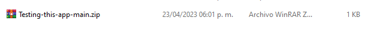
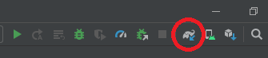
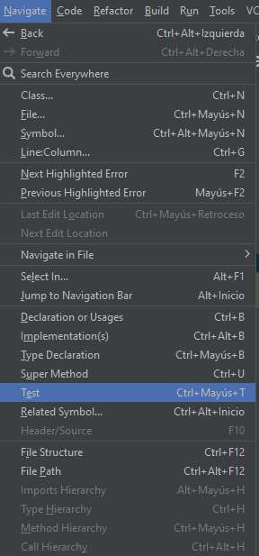
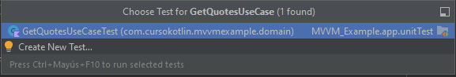
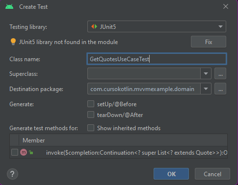
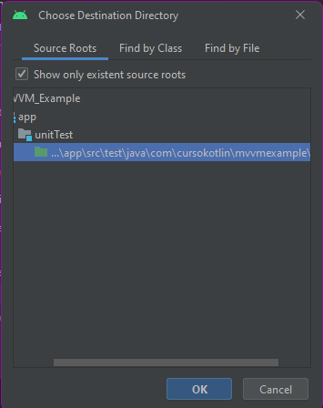
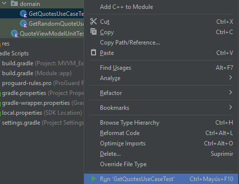
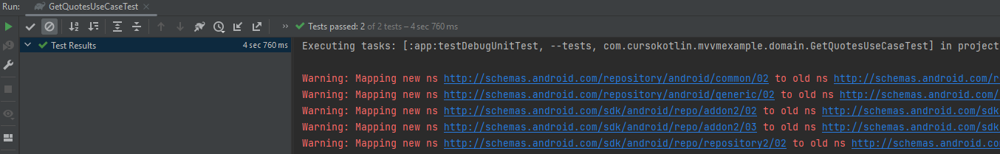

author: Trinta team
summary: Dojo codelab para testing
id: testing-dojo-codelab
tags:
categories:
environments: Web
status: Published
feedback link: https://github.com/SolaceDev/solace-dev-codelabs/blob/master/markdown/testing-dojo-codelab

# Title of codelab goes here
Testing codelab

## Preparacion de codelab de testing: descarga el proyecto

Duration: 0:05:00

[Click aqui para descargar el proyecto](https://github.com/JuanLema14/Testing-this-app/archive/refs/heads/main.zip)

Vera un archivo como este: 

Descomprimalo y abra el proyecto con Android Studio

¡Continue con los pasos para empezar el testing!

<!-- ### Info Boxes
Plain Text followed by green & yellow info boxes 

Negative
: This will appear in a yellow info box.

Positive
: This will appear in a green info box.

### Bullets
Plain Text followed by bullets
* Hello
* CodeLab
* World

### Numbered List
1. List
1. Using
1. Numbers

### Add an Image or a GIF

## What you need: Prerequisites

Duration: 0:07:00

Enter environment setup & prerequisites here

### Add a Link
Add a link!
[Example of a Link](https://www.google.com)

### Embed an iframe

 -->

## Dependencias
Duration: 0:03:00

Para iniciar este testing hay que tener en cuenta que se deben tener instaladas estas dependencias
(ingrese al archivo llamado: "build.gradle" para este paso)

    dependencies {
        // Otras dependencias
        // Dependencias para el testing
        testImplementation 'junit:junit:4.+'
        testImplementation "io.mockk:mockk:1.12.2"
    }

Para que las dependencias queden correctamente instaladas recuerde hacer click en el boton:

## Creacion de test
Duration: 0:03:00

Para hacer el test realizaremos una clase en el proyecto, siguiendo estos pasos:

1. Crear la clase desde el menu superior:

entre a la clase que va a testear ("GetQuotesUseCase") y de click en alguna parte de la ventana del codigo
luego dirijase al menu superior y vayase a:

Navigate>Test

2. Crear el test:

Al dar click en test se mostrara una ventan como esta:

de click en create new test:

En esta ventana, cree el test con la misma nomenclatura-nombre que su clase pero con la palanra "Test" al final

3. Creacion finalizada: 

Al crear la clase nos podemos dar cuenta que el nombre que necesitamos estara creado por defecto, pulsaremos ok en ambas ocasiones

## Configuracion
Duration: 0:03:00

Una vez nuestra clase esté creada tendremos que configurarlo, lo que haremos sera testear el caso de uso.
Nuestra clase GetQuotesUseCase recibe como parámetro inyectado un repositorio, el proposito es mockear este 
repositorio para poder manipular las respuestas.

Un test es similara una funcion, con la diferencia de que estos tienen una notacion en la parte superior, que 
nos permitira poner un orden a la ejecucion del mismo.

Es por ello que tenemos las etiquetas @Before y @After y gracias a ellas podemos hacer configuraciones genéricas para la clase. Por ejemplo crear una instancia de algo o reiniciar valores.

En este caso en específico necesitamos configurar nuestra librería MockK y para ello tenemos que inicializarlo antes de lanzar los tests, por lo que lo añadiremos en la función que contenga la etiqueta @Before.

    @Before
    fun onBefore() {
        MockKAnnotations.init(this)
    }

## Mockear el repositorio
Duration: 0:03:00

Cuando estamos escribiendo pruebas de software, a veces necesitamos simular objetos que aún no existen para poder probar nuestro código. A estos objetos se les llama "mocks".

Para crear un mock en Kotlin, podemos utilizar la etiqueta @MockK o @RelaxedMockK. La diferencia entre ellas es que con @RelaxedMockK no necesitamos configurar manualmente todas las respuestas que queremos obtener del mock, ya que si no lo hacemos, el sistema nos dará una respuesta por defecto. En cambio, si utilizamos @MockK sin la etiqueta "relaxed", tendremos que configurar todas las respuestas manualmente.

    @RelaxedMockK
    private lateinit var quoteRepository: QuoteRepository

Con esto, la configuración estaría completa. Después de eso, podremos usar ese repositorio como si fuera real y crear una instancia de "GetQuotesUseCase" que se iniciará dentro de la función "onBefore".

Finalmente nuestra clase se veira de la siguiente manera:

    class GetQuotesUseCaseTest {

        @RelaxedMockK
        private lateinit var quoteRepository: QuoteRepository

        lateinit var getQuotesUseCase: GetQuotesUseCase

        @Before
        fun onBefore() {
            MockKAnnotations.init(this)
            getQuotesUseCase = GetQuotesUseCase(quoteRepository)
        }
    
    }

## A testrear!
Duration: 0:03:00

Con todo preparado, podremos testear, para esto tenemos que definir que queremos testear:

Este caso de uso es bastante sencillo, lo que haremos sera llamar al repositorio, dependiendo de la respuesta,
realizara una accion u otra

Para este test comprobaremos que si la respuesta del repositorio es vacía, entonces deberá llamar a la base de datos.

Es importante en los test tener en cuenta los nombres, estos tienen que ser extremadamente descriptivos, es por ello que suelen ser largos
para nuestro primer test lo llamaremos de la siguiente manera:

    fun whenTheApiDoesntReturnAnythingThenGetValuesFromDatabase() = runBlocking{}

tambien podemos definir el nombre haciendo uso de las comillas invertidas: (`)

    fun `when the api doesnt return anything then get values from database`() = runBlocking{}

hacemos uso de runBlocking para lanzar corrutinas en nuestro test

## Given When Then
Duration: 0:03:00

Given-when-then es un estilo semi estructurado para representar los tests, esto nos ayudará a entender los test y sobre todo a dar ese primer paso para escribirlos. Si lo extrapolamos a nuestro primer test tendríamos algo así.

- Given: A nuestro mock (el repositorio) le tenemos que dar la respuesta que queremos que devuelva, en este caso una lista vacía.
- When: Llamamos a nuestro caso de uso.
- Then: Tenemos que verificar que la función correcta del repositorio ha sido llamada.

Crearemos el siguiente test:

    @Test
        fun `when the api doesnt return anything then get values from database`() = runBlocking {
            //Given
            coEvery { quoteRepository.getAllQuotesFromApi() } returns emptyList()
            //When
            getQuotesUseCase()
            //Then
            coVerify(exactly = 1) { quoteRepository.getAllQuotesFromDatabase() }
        }

El objetivo es simular una respuesta para una función específica, lo cual se logra utilizando las funciones coEvery (si la función es una corrutina) o every.

Primero, llamamos a coEvery o every, y dentro de estas funciones añadimos la función que queremos que sea llamada. Luego, utilizamos la palabra clave "returns" seguida de la respuesta que queremos que la función devuelva.

A continuación, llamamos a nuestro caso de uso real, es decir, la función que queremos probar para asegurarnos de que se está ejecutando como esperamos.

Finalmente, utilizamos coVerify o verify (dependiendo si es una corrutina o no) para verificar si la función interna ha sido llamada. El parámetro "exactly = 1" que hemos añadido en coVerify asegura que la función haya sido llamada exactamente una vez

## Ejecucion del test
Duration: 0:03:00

Para ejecutar el test solo debemos dar click derecho en el nobre de nuestro test

si todo ha salido bien, se abrirá la terminal y nos enseñara el resultado del test, si ha fallado, nos motrara el error en cuestion

<!-- ## Takeaways

Duration: 0:07:00

✅ < Fill IN TAKEAWAY 1>   
✅ < Fill IN TAKEAWAY 2>   
✅ < Fill IN TAKEAWAY 3>   

 -->

Thanks for participating in this codelab! Let us know what you thought in the [Solace Community Forum](https://solace.community/)! If you found any issues along the way we'd appreciate it if you'd raise them by clicking the Report a mistake button at the bottom
