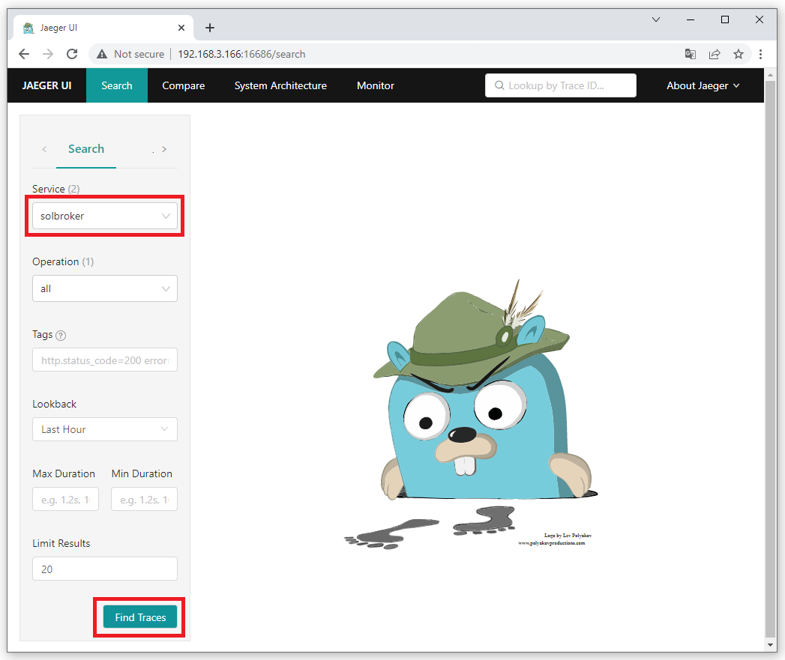
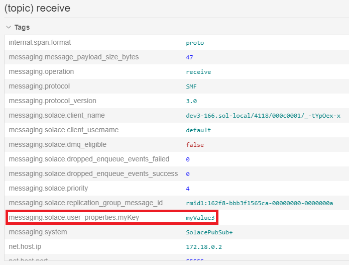
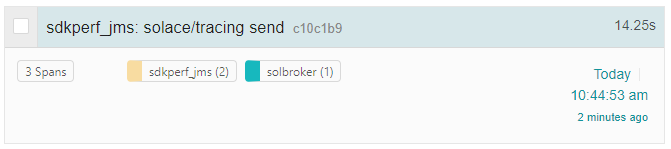
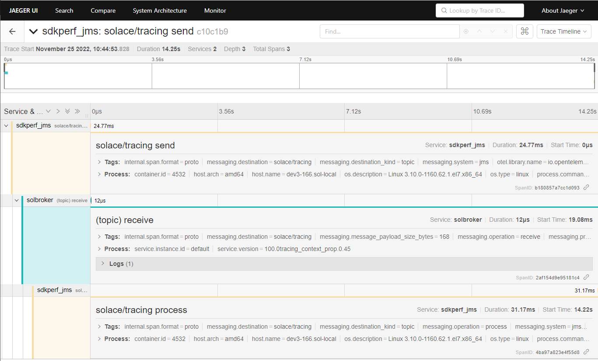

author: pl89
summary:
id: tracing-ea
tags:
categories: Solace, Opentelemetry
environments: Web
status: Hidden
feedback link: https://github.com/SolaceDev/solace-dev-codelabs/blob/master/markdown/tracing-ea

# Distributed Tracing EA

## What you'll learn: Overview

This CodeLabs will take you through the basics of the new distributed tracing feature.
Following these steps will take you through:
* Launching and configuring a PubSub+ Event Broker: Software
* Launching the OpenTelemetry Collector configured to use Solace modules
* Launching Jaeger which offers a user interface to view traced events
* Publishing messages to your broker to generate trace events
* Launching an application that will generate spans that are sent directly to the collector

Upon successful completion of this Code Labs, we encourage you to experiment with distributed tracing and the environment provided to see how it fits with your use case(s).
This can include other message sources, Open Telemetry receivers, and telemetry analysis tools.
Please note that as an EA release there are some restrictions.

### Limitations and caveats

For this release, trace events will only be generated for published messages (guaranteed and promoted direct) upon broker receipt and when the message is enqueued by the broker and does not support context propagation to bind telemetry for the same message from multiple sources.
This being an EA, many scenarios have yet to be developed and/or verified and there is therefore a possibility that bugs are encountered.
The areas or feature interactions to avoid include but are not limited to:
* Direct Messaging
* HA (High Availability) / Redundancy
* XA Transactions
* Replication
* DMR (Dynamic Message Routing)
* Upgrades to/from this EA version of the broker - the broker must be removed upon completion of your EA testing
* Appliances are not supported at this time


This package MUST NOT be used in production.
Any parts of the products used are subject to change before being made Generally Available in the future.
Additionally, for a better experience, one should avoid publishing a large number of messages to the broker as part of this demo.

Please contact your SE for support for this EA. Please provide your feedback to your CSA.

###


## What you need: Prerequisites

### Docker

This CodeLabs relies on the use of Docker. If you do not already have Docker installed, you will first need to do that.
At least 4 GiB and 2 cores should be made available for Docker. If more physical resources are available, providing more may improve your experience (e.g. 8 GiB and 4 cores).

### Downloading the tracing-ea package

The tracing-ea package contains the following items:
* Docker image of the PubSub+ Event Broker: Software
* Docker image of the OpenTelemetry Collector packaged with Solace modules and Jaeger
* docker-compose.yaml
* otel-collector-config.yaml
* solace_config_keys.env
* .env
* sdkperf-jcsmp-100.0jms_context_propagation.0.43
* sdkperf-jms-100.0jms_context_propagation.0.43
* sol-jcsmp-10.16.1-jms_context_propagation.42811.zip
* sol-jms-10.16.1-jms_context_propagation.42811.zip
* solace-opentelemetry-jcsmp-integration-1.0-main-3d931b527f5137dc343e91681833df14c148ca09.jar
* solace-opentelemetry-jms-integration-1.0-main-b731385d5a8c542766f390c5c29eb58ef5588456.jar

To gain access to the needed package you will need to contact your Solace CSA, who has valuable information about Distributed Tracing and can help guide your request.
Once you have received an invitation to participate in the EA from your SE, you will be able to download the following package from the Solace product download site: [tracing-ea.tar.gz](https://filedrop.solace.com/support/bucket/Distributed_Tracing_EA/)


```console
[pl89@dev ~]$ tar -xf tracing-ea.tar.gz
[pl89@dev ~]$ cd tracing-ea
```

###  Loading the downloaded Docker images

```console
[pl89@dev tracing-ea] $ docker load --input solace-pubsub-standard-100.0tracing_context_prop.0.45-docker.tar.gz
b90f5dd3a865: Loading layer [==================================================>]  95.24MB/95.24MB
2ff571c5cd34: Loading layer [==================================================>]  431.7MB/431.7MB
5f70bf18a086: Loading layer [==================================================>]  1.024kB/1.024kB
e93fa96a256d: Loading layer [==================================================>]  681.4MB/681.4MB
Loaded image: solace-pubsub-standard:100.0tracing_context_prop.0.45
```

```console
[pl89@dev tracing-ea] $ docker load --input opentelemetry-collector-contrib-docker.tar.gz
215ca07895b4: Loading layer [==================================================>]  217.6kB/217.6kB
3670080ba8c8: Loading layer [==================================================>]  262.7MB/262.7MB
Loaded image: otelcontribcol:latest
```

### Creating and launching the containers

The following command will launch all containers necessary for the EA.

```console
[pl89@dev tracing-ea]$ docker compose up -d
[+] Running 6/6
 ⠿ jaeger-all-in-one Pulled                                                                                                                                                       3.2s
   ⠿ 8663204ce13b Pull complete                                                                                                                                                   0.5s
   ⠿ b86734d97f6d Pull complete                                                                                                                                                   0.6s
   ⠿ 0d263244379d Pull complete                                                                                                                                                   0.6s
   ⠿ e57f20e53339 Pull complete                                                                                                                                                   2.5s
   ⠿ f4969b810177 Pull complete                                                                                                                                                   2.5s
[+] Running 4/4
 ⠿ Network tracing-ea_default                Created                                                                                                                              0.0s
 ⠿ Container tracing-ea-jaeger-all-in-one-1  Started                                                                                                                              0.6s
 ⠿ Container tracing-ea-solbroker-1          Started                                                                                                                              0.7s
 ⠿ Container tracing-ea-otel-collector-1     Started                                                                                                                              1.6s
```

Positive: Please be attentive to the previous command as to not confuse it with docker-compose and also make sure to use a recent version. Both `docker compose` and `docker-compose` may be available on your system and could differ in version.

## Configuring the PubSub+ Event Broker: Software

To improve the user's exposure to the distributed tracing feature, the broker comes with minimal configuration. Here are the step-by-step instructions to configure your broker.
Please note that for simplicity's sake these steps will not go through configuring any TLS settings and as a result, most data will be exchanged in a non-secure manner.

### Accessing CLI

First you must access your container; do so by typing the following command.

```console
[pl89@dev tracing-ea]$ docker exec -it tracing-ea-solbroker-1 /bin/bash

This Solace product is proprietary software of
Solace Corporation. By accessing this Solace product
you are agreeing to the license terms and conditions
located at http://www.solace.com/license-software
```

Once inside the container, simply type `cli`. 
Note: If you are flying through the steps too quickly, you may need to give the broker a few seconds to fully initialize itself after running the `docker compose` command from the previous section before being able to access `cli` successfully.

```console
[appuser@solbroker sw]$ cli

Solace PubSub+ Standard Version 100.0tracing_context_prop.0.45

This Solace product is proprietary software of
Solace Corporation. By accessing this Solace product
you are agreeing to the license terms and conditions
located at http://www.solace.com/license-software

Copyright 2004-2022 Solace Corporation. All rights reserved.

To purchase product support, please contact Solace at:
https://solace.com/contact-us/

Operating Mode: Message Routing Node

solbroker>
```

### Configuring the Message VPN

Minimal configuration is necessary on the Message VPN. The following commands will suffice.
```console
solbroker> enable
solbroker# configure
solbroker(configure)# message-vpn default
solbroker(configure/message-vpn)# authentication basic auth-type internal
solbroker(configure/message-vpn)# end
```

### Configuring the default Client Username

This Client Username will be used later for publishing messages to the broker.
```console
solbroker# configure
solbroker(configure)# client-username default message-vpn default
solbroker(configure/client-username)# password default
solbroker(configure/client-username)# end
```

### Configuring the default Client Profile

This Client Profile is used by the Client Username configured above.
```console
solbroker# configure
solbroker(configure)# client-profile default message-vpn default
solbroker(configure/client-profile)# message-spool reject-msg-to-sender-on-no-subscription-match
solbroker(configure/client-profile)# end
```

### Configuring the Telemetry Profile

The Telemetry Profile defines which published messages should be traced as well as who should be allowed to consume those trace messages.

First, start by creating the Telemetry Profile.
```console
solbroker# configure
solbroker(configure)# message-vpn default
solbroker(configure/message-vpn)# create telemetry-profile trace
```

Next, open up and enable the receiver.
```console
solbroker(configure/message-vpn/telemetry-profile)# receiver acl connect default-action allow
solbroker(configure/message-vpn/telemetry-profile)# no receiver shutdown
```

Finally, let's create a filter that will attract all topic messages (using the `>` subscription).
```console
solbroker(configure/message-vpn/telemetry-profile)# trace
solbroker(...e/message-vpn/telemetry-profile/trace)# no shutdown
solbroker(configure/message-vpn/telemetry-profile)# create filter default
solbroker(...ge-vpn/telemetry-profile/trace/filter)# no shutdown
solbroker(...ge-vpn/telemetry-profile/trace/filter)# create subscription ">"
solbroker(...try-profile/trace/filter/subscription)# end
```

When creating a Telemetry Profile, a Telemetry Queue is created. In this example, the queue name would be `#telemetry-trace` because we used `trace` as the profile name when creating the Telemetry Profile. When generated, trace messages will be added to this queue for consumption.

Also worth mentioning, creating a Telemetry Profile will also cause the broker to create a Client Profile as well as an ACL Profile. Just like the Telemetry Queue, the names of these profiles will take on the format of `#telemetry-<telemetry-profile-name>`.
These profiles must be used by the Client Username or else the Client will not be able to bind to the Telemetry Queue to consume trace messages.

Create the Client Username used by the OpenTelemetry Collector.
```console
solbroker# configure
solbroker(configure)# create client-username trace message-vpn default
solbroker(configure/client-username)# password trace
solbroker(configure/client-username)# client-profile #telemetry-trace
solbroker(configure/client-username)# acl-profile #telemetry-trace
solbroker(configure/client-username)# no shutdown
solbroker(configure/client-username)# end
```

We need to create a new Client Username for binding to the Telemetry Queue because a Client Username can only be used to bind to a Telemetry Queue if it uses both the Telemetry Client Profile and Telemetry ACL Profile. Additionally, the Telemetry Client Profile does not allow the Client to publish persistent messages.


Create a queue for attracting messages published to topic `solace/tracing`.
```console
solbroker# configure
solbroker(configure)# message-spool message-vpn default
solbroker(configure/message-spool)# create queue q
solbroker(configure/message-spool/queue)# permission all delete
solbroker(configure/message-spool/queue)# subscription topic solace/tracing
solbroker(configure/message-spool/queue)# no shutdown
```

## Verifying your broker configuration

### Verifying your telemetry queue

As previously mentioned, a special Telemetry Queue should have been created when the Telemetry Profile was created.
Now that all configuration has been applied to the broker, you should see a Bind Count of "1" on your Telemetry Queue.
The client bound to the Telemetry Queue is the Solace Receiver Module, part of the OpenTelemetry Collector application that was launched in an earlier step.

```console
solbroker# show queue #telemetry-trace

Flags Legend:
I - Ingress Admin State (U=Up, D=Down)
E - Egress  Admin State (U=Up, D=Down)
A - Access-Type         (E=Exclusive, N=Non-Exclusive)
S - Selector            (Y=Yes, N=No)
R - Redundancy          (P=Primary, B=Backup)
D - Durability          (D=Durable, N=Non-Durable)
P - Priority            (Y=Yes, N=No)

Queue Name                   Messages      Spool             Bind Status
Message VPN                   Spooled  Usage(MB)   HWM (MB) Count I E A S R D P
------------------------- ----------- ---------- ---------- ----- -------------
#telemetry-trace
default                             0       0.00       0.00     1 D U N N P D N
```


## Accessing Jaeger and producing trace messages

### Publishing messages using sdkperf

To start things off, run the following sdkperf command to publish a message to your broker. Don't forget to replace the IP address in the command to your system's IP address.

If Docker is running on the same system from which you are launching sdkperf, you can use the following `-cip` value: `-cip=0.0.0.0:55557`.
If Docker is running on another system in your network, simply replace `0.0.0.0` to the system's IP, e.g. `-cip=192.168.123.45:55557`.

```console
[pl89@dev tracing-ea]$ cd sdkperf-jcsmp-100.0jms_context_propagation.0.43/
[pl89@dev sdkperf-jcsmp-100.0jms_context_propagation.0.43]$ ./sdkperf_java.sh -cip=192.168.3.166:55557 -cu=default -cp=default -ptl=solace/tracing -mt=persistent -mn=1
```

### Jaeger UI

As part of an earlier step, the Jaeger UI was launched. It can be accessed using your favourite browser.

If Docker is running on the same system your browser is running on, you can access the Jaeger UI using the following URI: [http://0.0.0.0:16686/](http://0.0.0.0:16686/).
If Docker is running on another system in your network, simply replace `0.0.0.0` to the system's IP, e.g. `http://192.168.3.166:16686/`.


### Verify the impact of publishing a message on the Jaeger UI

After the OpenTelemetry Collector has received a message, you should be able to select the `solbroker` service. Once the right service has been selected, press the "Find Traces" button.


You should now see a trace for the message published using sdkperf from the previous step.


To view more details about this trace, click on it. You can then expand various boxes so that more information is displayed.


## Jaeger UI - Searching for traces

### Publishing more interesting messages

Let's publish three messages with user properties so that we can search for them on Jaeger. The messages will contain the following {key,value} pairs.

1. {myKey,myValue1}
2. {myKey,myValue2}
3. {myKey,myValue3} 

```console
[pl89@dev sdkperf-jcsmp-100.0jms_context_propagation.0.43]$ ./sdkperf_java.sh -cip=192.168.3.166:55557 -cu=default -cp=default -ptl=solace/tracing -mt=persistent -mn=1 -ped=0 -cpl=String,myKey,myValue1
[pl89@dev sdkperf-jcsmp-100.0jms_context_propagation.0.43]$ ./sdkperf_java.sh -cip=192.168.3.166:55557 -cu=default -cp=default -ptl=solace/tracing -mt=persistent -mn=1 -ped=0 -cpl=String,myKey,myValue2
[pl89@dev sdkperf-jcsmp-100.0jms_context_propagation.0.43]$ ./sdkperf_java.sh -cip=192.168.3.166:55557 -cu=default -cp=default -ptl=solace/tracing -mt=persistent -mn=1 -ped=0 -cpl=String,myKey,myValue3
```


### Verifying the impact on the Jaeger UI

If you look at the details for the third message published, notice how it has a tag with the user property provided by the publisher.


That value can be used for searching traces. On the Search page, search for the following tag: `messaging.solace.user_properties.myKey=myValue3`
This request should find the third message published.


### Using Jaeger to debug problems

In an earlier section, we created a queue which had a subscription to topic `solace/tracing`. Let's try publishing a message to the topic `solace/tracing2`, a topic for which no client or endpoint is subscribed.

```console
[pl89@dev sdkperf-jcsmp-100.0jms_context_propagation.0.43]$ ./sdkperf_java.sh -cip=192.168.3.166:55557 -cu=default -cp=default -ptl=solace/tracing2 -mt=persistent -mn=1 -ped=0
```

Notice the message from sdkperf `No Subscription Match - Topic 'solace/tracing2'`. The message is considered as errored because it was discarded by the broker.

From the Jaeger UI, search for the following tag `error=true`


If you select the message and expand its detailed view, you will see that the message published had `No Subscription Match`.


This information can be used to perform any corrective actions, e.g.:
* Fix the publisher and have it publish to the intended topic
* Update the broker configuration and have your queue also subscribe to topic `solace/tracing2`


## Adding context to messages published (automatic instrumentation)

### Clean-up from previous sections

If there are messages on your queue from previous sections, let's take a moment to delete them.
```console
solbroker(admin)# message-spool message-vpn default
solbroker(admin/message-spool)# delete-messages queue q
This will delete all spooled messages in q
Do you want to continue (y/n)? y
```


### Using sdkperf-jms with context auto-instrumentation


This command will launch sdkperf-jms and publish a message as well as push additional context information to the collector.
Be sure to update this argument's IP to point to your collector:`-Dotel.exporter.otlp.endpoint=http://192.168.3.166:4317`

```console
[pl89@dev3-166 tracing-ea]$ cd sdkperf-jms-100.0jms_context_propagation.0.43/
[pl89@dev3-166 sdkperf-jms-100.0jms_context_propagation.0.43]$ export SOLACE_VM_ARGS="-javaagent:`pwd`/lib/opentelemetry-javaagent-all.jar -Dotel.javaagent.extensions=`pwd`/lib/solace-opentelemetry-jms-integration-1.0-SNAPSHOT.jar -Dotel.traces.exporter=otlp -Dotel.metrics.exporter=none -Dotel.instrumentation.jms.enabled=true -Dotel.javaagent.debug=false -Dotel.propagators=solace_jms_tracecontext -Dotel.resource.attributes=service.name=sdkperf_jms -Dotel.exporter.otlp.endpoint=http://192.168.3.166:4317 -Dotel.bsp.schedule.delay=500 -Dotel.bsp.max.queue.size=1000 -Dotel.bsp.max.export.batch.size=5 -Dotel.bsp.export.timeout=10000"; sdkperf_jms_jms_context_propagation -cip=192.168.3.166:55557 -ptl=solace/tracing -mn=1 -msa=100 -mt=persistent -cu=default -cp=default
```
This command will launch sdkperf-jms to consume the message that was just published as well as provide additional context information directly to the collector about this message being consumed.
```console
[pl89@dev3-166 tracing-ea]$ cd sdkperf-jms-100.0jms_context_propagation.0.43/
[pl89@dev3-166 sdkperf-jms-100.0jms_context_propagation.0.43]$ export SOLACE_VM_ARGS="-javaagent:`pwd`/lib/opentelemetry-javaagent-all.jar -Dotel.javaagent.extensions=`pwd`/lib/solace-opentelemetry-jms-integration-1.0-SNAPSHOT.jar -Dotel.traces.exporter=otlp -Dotel.metrics.exporter=none -Dotel.instrumentation.jms.enabled=true -Dotel.javaagent.debug=false -Dotel.propagators=solace_jms_tracecontext -Dotel.resource.attributes=service.name=sdkperf_jms -Dotel.exporter.otlp.endpoint=http://192.168.3.166:4317 -Dotel.bsp.schedule.delay=500 -Dotel.bsp.max.queue.size=1000 -Dotel.bsp.max.export.batch.size=5 -Dotel.bsp.export.timeout=10000"; sdkperf_jms_jms_context_propagation -cip=192.168.3.166:55557 -sql=q -md -cu=default -cp=default
```
To have sdkperf-jms exit, simply send the ctrl+c command.

### Verify trace generated in Jaeger

A new trace should have been generated, notice how it has 3 spans.


Opening up the newly generated trace will allow you to easily follow the sequence of events.


The first span was generated by the publisher when the message was published.
The second span was generated by the PubSub+ Broker when the message was received.
The third span was generated by the consumer when the message was received.

### Clean-up
To avoid any problems when using sdkperf in the future, unset the environment variable set in the previous step.
```console
[pl89@dev3-166 tracing-ea]$ unset SOLACE_VM_ARGS
```


## Clean-up

### Removing created Docker containers

To tear down Docker containers created in an earlier step, run the following command:
```console
[pl89@dev ~] $ cd tracing-ea
[pl89@dev tracing-ea] $ docker compose down
```

To remove Docker images created:
```console
[pl89@dev tracing-ea] $ docker image rm <image id>
```

To view the list of Docker images, you can run the following command:
```console
[pl89@dev tracing-ea]$ docker image ls
```

Thanks for participating in this Code Labs! If you have found any issues along the way we'd appreciate it if you'd raise them by clicking the Report a mistake button found at the bottom left.
